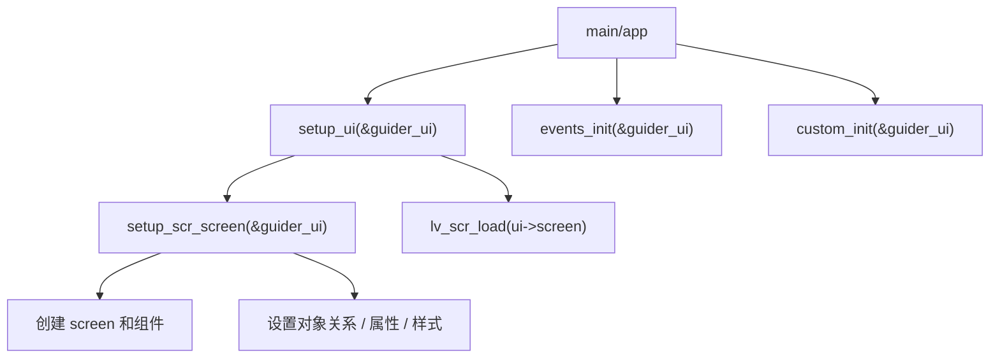

> 来源：Deep-In-Embedded / [中间件/LVGL/02-GUI Guider生成代码结构解析.md](https://github.com/shuai-yemao/Deep-In-Embedded/blob/5fcab575fc20cf681f3e79e163337211097c898a/%E4%B8%AD%E9%97%B4%E4%BB%B6/LVGL/02-GUI%20Guider%E7%94%9F%E6%88%90%E4%BB%A3%E7%A0%81%E7%BB%93%E6%9E%84%E8%A7%A3%E6%9E%90.md)

# 📖 引言

> 这篇笔记说明 GUI Guider 生成代码的常见文件结构，以及读代码时的优先顺序。

---

# 📝 GUI Guider 生成代码结构解析

> GUI Guider 生成代码通常分成页面搭建、页面入口、事件绑定和自定义扩展四部分。

## 实际意义

- 快速找到页面真正的启动入口。
- 快速看懂 screen、组件关系、样式初始化和事件绑定。
- 避免把手写逻辑直接混进 generated 文件，减少重新生成后的丢失风险。

## 应用场景

- 阅读 GUI Guider 自动生成工程。
- 把 GUI Guider 代码接入自己的 LVGL 工程。
- 排查“页面能创建但逻辑不对”“事件不响应”“重新生成后手写代码丢失”等问题。

## 核心逻辑/原理

1. `setup_ui` 负责页面启动和加载入口，常见形式是先调用 `setup_scr_screen(ui)`，再 `lv_scr_load(ui->screen)`。
2. `setup_scr_screen` 负责创建 screen 和各组件，设置对象关系、位置尺寸、文本和样式。
3. `events_init` 负责把对象和事件回调绑定起来，`custom_init` 负责承载手写扩展逻辑。



```c
void setup_ui(lv_ui *ui) {
    setup_scr_screen(ui);
    lv_scr_load(ui->screen);
}
```

## 关键公式/结论

1. `setup_ui` 解决“页面怎么启动并加载”。
2. `setup_scr_screen` 解决“页面对象树怎么搭出来”。
3. `events_init` 解决“对象在什么交互下触发什么逻辑”，`custom_init` 解决“用户自定义逻辑放哪里”。

## 实际操作步骤

> 动手阅读一个 GUI Guider 页面时，建议固定阅读顺序。

### 第一步

先看 `gui_guider.c` 里的 `setup_ui`，确认页面初始化入口和 `lv_scr_load` 调用位置。

### 第二步

再看 `setup_scr_screen.c`，确认：

- screen 是怎么创建的；
- 各组件的父子对象关系；
- 各组件的位置、尺寸、文本和样式初始化。

### 第三步

最后看 `events_init.c` 和 `custom.c`：

- `events_init` 看事件绑定；
- `custom` 看手写业务扩展。

## 常见问题

> 现象 → 根因 → 修复。

### 发现的问题

只看 `setup_scr_screen`，结果能看懂页面长什么样，但看不懂为什么能响应交互。

### 根因分析

`setup_scr_screen` 主要负责对象树和样式，不负责完整业务链路。真正的事件绑定通常在 `events_init`，手写扩展通常在 `custom_init`。

### 改进方法

按固定顺序读：`setup_ui -> setup_scr_screen -> events_init -> custom_init`。

---

# 💬 Q&A

> 自问自答，检验理解深度。按难度递进排列。

## 🟢 基础

> 最基本的概念和用法，入门必知。

### Q1

为什么 `setup_scr_screen` 常被当作第一阅读入口？

A1：因为它最集中体现页面对象树、组件关系、位置尺寸和样式初始化。

### Q2

`setup_ui` 和 `setup_scr_screen` 的区别是什么？

A2：`setup_ui` 负责页面启动和加载入口，`setup_scr_screen` 负责具体搭建页面对象树。

## 🟡 进阶

> 容易踩的坑和常见误区。

### Q3

为什么不应该直接把业务逻辑改进 generated 文件？

A3：因为 GUI Guider 重新生成代码后，generated 文件很可能被覆盖，手写逻辑容易丢失。

## 🔴 困难

> 结合实战的深层原理和设计权衡。

### Q4

`events_init` 和 `custom_init` 的边界应该怎么理解？

A4：`events_init` 负责“把交互接起来”，`custom_init` 负责“把用户自定义逻辑接进去”。前者偏自动生成交互绑定，后者偏人工扩展。

---

# 📋 总结

> 3-5 句话回顾核心要点，用自己的话复述。

GUI Guider 生成代码最适合按入口、页面搭建、事件绑定、自定义扩展四部分理解。`setup_ui` 决定页面从哪里开始，`setup_scr_screen` 决定页面对象树怎么搭出来。`events_init` 负责交互接线，`custom_init` 负责保留手写扩展逻辑。读页面代码时，如果只看 screen 搭建而不看入口和事件，很容易只看见界面结构，看不懂实际行为。

---

# 📎 参考资料

> 学习过程中用到的外部资源汇总。

## 🎥 视频链接

- 未记录

## 🔗 博客/文档链接

- [GUI Guider demos](https://github.com/nxp-mcuxpresso/gui-guider-demos) — 官方示例工程，可用于核对生成文件结构。
- [LPC55S69 GuiGuider sample](https://github.com/gertvb/LPC55S69_GuiGuider) — 含 `generated/gui_guider.c`、`setup_scr_screen.c`、`events_init.c` 的公开样例。

## 💻 仓库链接

- [nxp-mcuxpresso/gui-guider-demos](https://github.com/nxp-mcuxpresso/gui-guider-demos) — NXP GUI Guider 示例仓库。
- [gertvb/LPC55S69_GuiGuider](https://github.com/gertvb/LPC55S69_GuiGuider) — GUI Guider 公开样例工程。

## 📄 代码/附件

- [[LVGL开发指南-ESP32S3 LVGL移植教程.pdf]]
- [[LVGL开发指南_V1.5.pdf]]
