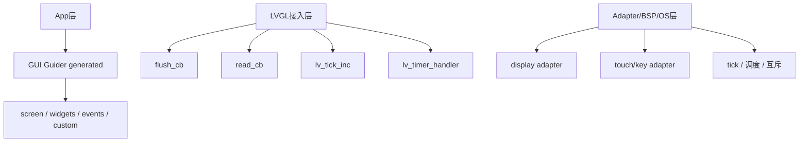

> 来源：Deep-In-Embedded / [中间件/LVGL/03-LVGL工程分层与Adapter解耦.md](https://github.com/shuai-yemao/Deep-In-Embedded/blob/5fcab575fc20cf681f3e79e163337211097c898a/%E4%B8%AD%E9%97%B4%E4%BB%B6/LVGL/03-LVGL%E5%B7%A5%E7%A8%8B%E5%88%86%E5%B1%82%E4%B8%8EAdapter%E8%A7%A3%E8%80%A6.md)

# 📖 引言

> 这篇笔记说明 GUI Guider 生成代码、LVGL 接入层和 Adapter/BSP 层在工程中的边界。

---

# 📝 LVGL 工程分层与 Adapter 解耦

> GUI Guider 生成代码最适合放在 App 层，而 `lvgl_port`、`flush_cb`、`read_cb` 等接口应放在 LVGL 接入层或 Adapter 层。

## 实际意义

- 保持 generated 页面代码和底层接入代码解耦。
- 让 GUI 页面逻辑不依赖具体 MCU、屏幕、触摸和 OS。
- 降低重新生成 GUI 代码、迁移硬件平台或更换 OS 时的维护成本。

## 应用场景

- GUI Guider 代码接入已有嵌入式分层工程。
- 同一套页面代码迁移到不同显示设备或不同调度环境。
- 排查 generated 文件和手写 port/adapter 文件边界混乱的问题。

## 核心逻辑/原理

1. GUI Guider 生成代码属于 App 层，因为它是在 LVGL 组件能力之上组织页面、组件和界面交互。
2. `lvgl_port`、`flush_cb`、`read_cb`、`lv_tick_inc`、`lv_timer_handler` 属于 LVGL 接入层，不属于页面应用层。
3. 显示、触摸、时基和任务调度应继续向下通过 Adapter/BSP/OS Wrapper 接入，而不是混进 generated 页面文件。



```c
setup_ui(&guider_ui);      /* App 层页面初始化 */
events_init(&guider_ui);   /* App 层事件绑定 */
custom_init(&guider_ui);   /* App 层自定义扩展 */
```

## 关键公式/结论

1. generated 代码负责“页面怎么搭、控件怎么摆、事件怎么接”。
2. LVGL 接入层负责“LVGL 怎么接到显示、输入、时基和调度环境”。
3. Adapter/BSP 层负责“具体硬件和系统接口怎么实现”。

## 实际操作步骤

> 接工程时先划边界，再放代码。

### 第一步

把 GUI Guider 导出的 `generated`、`events_init`、`custom` 归到 App/UI 层。

### 第二步

把 `flush_cb`、`read_cb`、`lv_tick_inc`、`lv_timer_handler` 收敛到 LVGL port 层。

### 第三步

把显示设备、触摸设备、tick、互斥和任务调度再向下接到 Adapter/BSP/OS Wrapper。

## 常见问题

> 现象 → 根因 → 修复。

### 发现的问题

把 `lvgl_port`、`flush_cb` 或底层显示逻辑直接写进 GUI Guider 生成文件。

### 根因分析

把 App 层页面逻辑和中间件接入逻辑混在一起，破坏分层边界，重新生成代码后还可能丢失手写接入逻辑。

### 改进方法

保持 `generated/custom` 与 `port/adapter` 分离，generated 只负责页面和交互组织，port 和 adapter 负责环境接入。

---

# 💬 Q&A

> 自问自答，检验理解深度。按难度递进排列。

## 🟢 基础

### Q1

GUI Guider 生成代码最适合放在哪一层？

A1：最适合放在 App 层，因为它是在 LVGL 基础上组织页面和界面交互。

### Q2

为什么 `lvgl_port` 代码不能和 GUI Guider 页面代码混在一起？

A2：因为前者负责 LVGL 和环境对接，后者负责页面组织和业务界面，两者职责不同。

## 🟡 进阶

### Q3

把底层接入逻辑混进 generated 文件会有什么风险？

A3：会破坏分层、降低可移植性，并且在重新生成代码后丢失手写逻辑。

## 🔴 困难

### Q4

为什么这套边界设计对硬件和 OS 未确定的项目尤其重要？

A4：因为页面逻辑应尽量稳定，而显示、输入、调度实现可能随着平台变化而变化。分层后可以只替换 port/adapter，而保留页面代码。

---

# 📋 总结

GUI Guider 生成代码应该归属于 App 层，而不是 LVGL 接入层或底层驱动层。页面代码负责描述 screen、组件和事件，`lvgl_port` 负责把 LVGL 接到显示、输入、时间和调度环境上。再往下的 Adapter/BSP/OS Wrapper 负责具体平台实现。只有把这三层分清，GUI 代码才能既便于重生成，又便于跨平台移植。

---

# 📎 参考资料

## 🎥 视频链接

- 未记录

## 🔗 博客/文档链接

- [GUI Guider demos](https://github.com/nxp-mcuxpresso/gui-guider-demos) — 用于核对 GUI Guider generated 文件边界。
- [LVGL Button docs](https://docs.lvgl.io/master/details/widgets/button.html) — 可作为理解 App 层组件语义和中间件边界的参考。

## 💻 仓库链接

- [nxp-mcuxpresso/gui-guider-demos](https://github.com/nxp-mcuxpresso/gui-guider-demos)
- [lvgl/lvgl](https://github.com/lvgl/lvgl)

## 📄 代码/附件

- [[LVGL开发指南-ESP32S3 LVGL移植教程.pdf]]
- [[LVGL开发指南_V1.5.pdf]]
