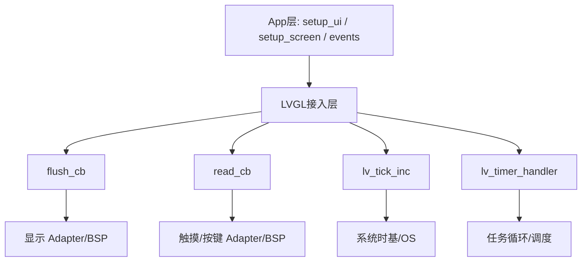

> 来源：Deep-In-Embedded / [中间件/LVGL/04-LVGL最小运行闭环.md](https://github.com/shuai-yemao/Deep-In-Embedded/blob/5fcab575fc20cf681f3e79e163337211097c898a/%E4%B8%AD%E9%97%B4%E4%BB%B6/LVGL/04-LVGL%E6%9C%80%E5%B0%8F%E8%BF%90%E8%A1%8C%E9%97%AD%E7%8E%AF.md)

# 📖 引言

> 这篇笔记说明一个 LVGL 界面从“能显示”到“能交互”最少需要打通哪些环节。

---

# 📝 LVGL 最小运行闭环

> LVGL 真正跑起来，必须让 App 层、LVGL 接入层、调度层和显示/输入适配层形成闭环。

## 实际意义

- 避免把“屏幕亮了”误判成“LVGL 已经跑起来”。
- 为黑屏、不刷新、触摸无响应这类问题建立最小排障框架。
- 为 GUI Guider 页面接入嵌入式工程提供运行链路视角。

## 应用场景

- 首次移植 LVGL 到板级工程。
- 接入 GUI Guider 页面后检查界面为何不工作。
- 分析“能显示但不刷新”“能显示但不能触摸”这类问题。

## 核心逻辑/原理

1. App 层负责创建页面、组件、样式和事件。
2. LVGL 接入层负责 `flush_cb`、`read_cb`、`lv_tick_inc`、`lv_timer_handler`。
3. Adapter/BSP/OS 层负责显示输出、输入采集、时基和任务调度。



```c
lv_tick_inc(1);          /* 提供时间基准 */
lv_timer_handler();      /* 驱动内部任务 */
/* flush_cb/read_cb 由 LVGL 在运行中回调 */
```

## 关键公式/结论

1. `flush_cb` 解决显示输出问题。
2. `read_cb` 解决输入采集问题。
3. `lv_tick_inc` 提供时间基准，`lv_timer_handler` 驱动 LVGL 内部任务运行。

## 实际操作步骤

### 第一步

先确认显示链路可用：显示驱动能通信，`flush_cb` 能真正把数据刷到屏幕。

### 第二步

再确认运行链路可用：`lv_tick_inc` 正常推进，`lv_timer_handler` 被稳定调度。

### 第三步

最后确认输入链路可用：`read_cb` 能持续读到触摸/按键数据，并能传入 LVGL。

## 常见问题

> 现象 → 根因 → 修复。

### 发现的问题

屏幕亮了，但界面不刷新。

### 根因分析

高频原因通常是：

- GUI 任务或主循环没有调度到 `lv_timer_handler`；
- `lv_tick_inc` 没有正常推进；
- `flush_cb` 没有真正完成刷屏输出。

### 改进方法

优先检查调度链、时间基准和刷屏链路，而不是只看页面对象有没有创建成功。

---

# 💬 Q&A

## 🟢 基础

### Q1

一个 LVGL 界面“能显示并能响应触摸/按键”，最少需要哪几层是通的？

A1：App 层页面代码、LVGL 接入层、OS/调度层、显示/输入适配层都必须打通。

### Q2

`read_cb` 是读取什么的？

A2：读取触摸、按键、编码器等输入设备状态，不是读取屏幕。

## 🟡 进阶

### Q3

如果屏幕点亮但界面不刷新，最先怀疑什么？

A3：优先怀疑 GUI 调度链、`lv_timer_handler` 是否执行、`lv_tick_inc` 是否推进，以及 `flush_cb` 是否真正刷屏。

## 🔴 困难

### Q4

如果界面能显示但完全不能交互，说明了什么？

A4：通常说明显示输出链路是通的，而输入接入链路或输入调度链路存在问题。

---

# 📋 总结

LVGL 界面真正跑起来，不是单靠页面代码生成成功，而是多个层次共同形成最小运行闭环。App 层负责页面，LVGL 接入层负责时间、刷新和输入，Adapter/BSP/OS 层负责真实硬件与调度环境。如果只看某一层，很容易误判问题位置。移植和排障时，按“显示、调度、时间、输入”这条链检查，比盯单个控件更有效。

---

# 📎 参考资料

## 🎥 视频链接

- 未记录

## 🔗 博客/文档链接

- [LVGL docs](https://docs.lvgl.io/master/) — 官方文档，包含显示、输入和任务运行机制。

## 💻 仓库链接

- [lvgl/lvgl](https://github.com/lvgl/lvgl)

## 📄 代码/附件

- [[LVGL开发指南-ESP32S3 LVGL移植教程.pdf]]
- [[LVGL开发指南_V1.5.pdf]]
