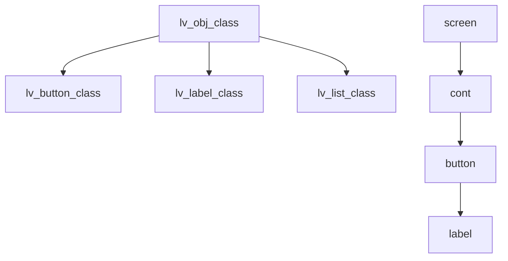

> 来源：Deep-In-Embedded / [中间件/LVGL/05-lv_obj对象与容器基础.md](https://github.com/shuai-yemao/Deep-In-Embedded/blob/5fcab575fc20cf681f3e79e163337211097c898a/%E4%B8%AD%E9%97%B4%E4%BB%B6/LVGL/05-lv_obj%E5%AF%B9%E8%B1%A1%E4%B8%8E%E5%AE%B9%E5%99%A8%E5%9F%BA%E7%A1%80.md)

# 📖 引言

> 这篇笔记说明 `lv_obj` 在 LVGL 中的基础角色，以及它为什么是 GUI Guider 页面结构的核心基础。

---

# 📝 lv_obj对象与容器基础

> `lv_obj` 是 LVGL 的基础对象类，负责提供对象树、样式、坐标、状态等通用能力。

## 实际意义

- 让 screen、button、label、list 等对象共享统一对象模型。
- 避免每类组件都重复定义位置、样式、状态和父子关系机制。
- GUI Guider 生成代码时，大量组件都是在 `lv_obj` 基础上继续特化。

## 应用场景

- 作为 screen 或普通容器的基础对象。
- 作为页面结构节点承载子对象。
- 作为 button、label、list 等组件的共同基础能力来源。

## 核心逻辑/原理

1. `lv_obj` 通过 class 机制支持不同组件继续特化。
2. `parent/children` 形成对象树，决定页面层级和生命周期关系。
3. `styles`、`coords`、`state`、`flags` 提供通用界面属性和行为控制。



```c
lv_obj_t * screen = lv_obj_create(NULL);
lv_obj_t * cont   = lv_obj_create(screen);
lv_obj_t * btn    = lv_button_create(cont);
lv_obj_t * label  = lv_label_create(btn);
```

## 关键公式/结论

1. 类关系回答“它是什么类型扩展来的”。
2. 对象关系回答“它挂在哪个对象下面”。
3. 删除父对象时，LVGL 会递归删除子对象，但应用层保存的旧指针会失效。

## 实际操作步骤

### 第一步

先区分 `lv_obj` 是基础对象类，不是单一页面里的某个具体控件。

### 第二步

读页面代码时先看 parent 参数，确认对象树关系。

### 第三步

遇到删除页面或容器时，先想到递归删除和悬空指针风险。

## 常见问题

> 现象 → 根因 → 修复。

### 发现的问题

把“父类/基类”和“父对象”混为一谈。

### 根因分析

`lv_obj` 与 `lv_button`、`lv_label`、`lv_list` 之间是类继承关系；`screen`、`cont`、`button`、`label` 之间是对象树父子关系。

### 改进方法

固定区分：

- 类关系：`lv_obj -> lv_button / lv_label / lv_list`
- 对象关系：`screen -> cont -> btn -> label`

---

# 💬 Q&A

## 🟢 基础

### Q1

`lv_obj_t` 是什么？

A1：它是 LVGL 所有对象的基础实例结构体，保存 class、父子关系、样式、坐标区域、状态和标志位等基础信息。

### Q2

为什么容器、按钮、列表等组件都和 `lv_obj` 有关系？

A2：因为它们都建立在 `lv_obj` 的通用对象能力之上，只是在 class 和专有行为上继续特化。

## 🟡 进阶

### Q3

删除 `screen` 时，`cont`、`btn`、`label` 会怎样？

A3：LVGL 会递归删除它们，但应用层若仍保留这些对象指针，就会变成悬空指针。

## 🔴 困难

### Q4

为什么 button 里常再创建一个 `label`？

A4：因为 button 负责交互语义，label 负责文本显示。两者职责分离，便于修改文本和样式。

---

# 📋 总结

`lv_obj` 是 LVGL 对象体系的基础，不只是一个普通容器。它统一了对象树、样式、坐标、状态和标志位这些通用机制，因此很多组件都在它的基础上扩展。阅读 GUI Guider 页面时，只要先看 parent 参数和 class 角色，页面层级就会清晰很多。后续学任何组件，几乎都离不开 `lv_obj` 的这套基础认知。

---

# 📎 参考资料

## 🎥 视频链接

- 未记录

## 🔗 博客/文档链接

- [LVGL base widget docs](https://docs.lvgl.io/master/details/widgets/base_widget.html) — 基础对象与通用 widget 特性说明。

## 💻 仓库链接

- [lvgl/lvgl](https://github.com/lvgl/lvgl)

## 📄 代码/附件

- [[LVGL开发指南-ESP32S3 LVGL移植教程.pdf]]
- [[LVGL开发指南_V1.5.pdf]]
