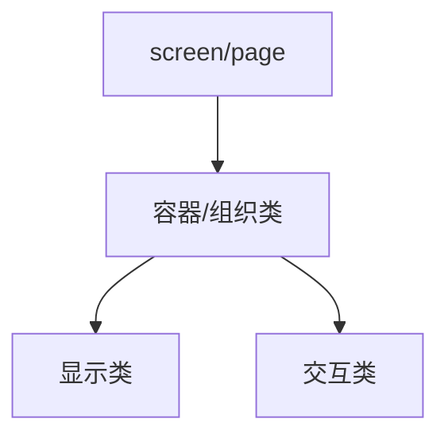

> 来源：Deep-In-Embedded / [中间件/LVGL/06-LVGL基础组件总览.md](https://github.com/shuai-yemao/Deep-In-Embedded/blob/5fcab575fc20cf681f3e79e163337211097c898a/%E4%B8%AD%E9%97%B4%E4%BB%B6/LVGL/06-LVGL%E5%9F%BA%E7%A1%80%E7%BB%84%E4%BB%B6%E6%80%BB%E8%A7%88.md)

# 📖 引言

> 这篇笔记从 GUI Guider 使用视角，总览 LVGL 基础组件的角色分工和页面搭建顺序。

---

# 📝 LVGL 基础组件总览

> LVGL 组件更适合按“结构职责”理解，而不是只按业务名字理解。

## 实际意义

- 先搭页面骨架，再放具体控件，更符合对象树和 GUI Guider 的工作方式。
- 更方便统一布局、统一样式和后续维护。

## 应用场景

- 容器/组织类：`lv_obj`、`lv_list`、`lv_menu`、`lv_tabview`
- 显示类：`lv_label`、`lv_image`、`lv_chart`
- 交互输入类：`lv_button`、`lv_slider`、`lv_dropdown`、`lv_textarea`
- 复合场景类：`lv_msgbox`、`lv_keyboard`、`lv_calendar`

## 核心逻辑/原理

1. 页面设计通常先放页面结构。
2. 再放容器或组织类组件。
3. 最后在容器中填入显示类和交互类组件。



```c
lv_obj_t * screen = lv_obj_create(NULL);
lv_obj_t * cont   = lv_obj_create(screen);
lv_obj_t * btn    = lv_button_create(cont);
lv_obj_t * label  = lv_label_create(btn);
```

## 关键公式/结论

1. `lv_obj` 偏向通用结构节点和基础容器。
2. `lv_list` 偏向列表场景的组织和交互。
3. `lv_button` 偏向可点击操作入口。

## 实际操作步骤

### 第一步

先创建 screen 或页面结构对象。

### 第二步

根据页面区域需要，先放容器、list、tabview 这类组织组件。

### 第三步

再把 label、button、slider、dropdown 等显示和交互组件放进容器内部。

## 常见问题

> 现象 → 根因 → 修复。

### 发现的问题

一开始就把 button、label、slider 直接零散丢到 screen 上。

### 根因分析

页面结构会变乱，不方便统一管理，也不利于区域级样式统一和后续扩展。

### 改进方法

先搭页面结构，再放容器，再放显示和交互组件。

---

# 💬 Q&A

## 🟢 基础

### Q1

为什么 GUI Guider 搭页面时通常先放页面结构，再放容器和组件？

A1：因为这样更符合对象树结构，也更方便统一调整布局和样式。

### Q2

为什么设置页常优先考虑 `lv_list`？

A2：因为它更适合承载菜单、设置项这类重复条目场景，方便滚动显示和后续维护。

## 🟡 进阶

### Q3

为什么不建议把所有控件直接零散放到 screen 上？

A3：会导致结构不清晰、样式难统一、区域删除或隐藏时管理麻烦。

## 🔴 困难

### Q4

为什么基础组件更适合按结构职责分类，而不是按业务语义分类？

A4：因为源码和 GUI Guider 首先关心的是对象在页面中承担的显示、组织还是交互角色，而不是业务名称。

---

# 📋 总结

理解 LVGL 组件时，先看“它在页面结构里承担什么职责”，比只看业务用途更稳。GUI Guider 页面通常遵循“页面结构 -> 组织容器 -> 显示和交互组件”的搭建顺序。`lv_obj`、`lv_list`、`lv_button` 这类基础组件的差异，本质上来自它们在对象树中的角色不同。把这条思路建立起来，后面学单个组件会容易很多。

---

# 📎 参考资料

## 🎥 视频链接

- 未记录

## 🔗 博客/文档链接

- [LVGL widgets docs](https://docs.lvgl.io/master/details/widgets/index.html) — LVGL 各类组件目录。

## 💻 仓库链接

- [lvgl/lvgl](https://github.com/lvgl/lvgl)

## 📄 代码/附件

- [[LVGL开发指南-ESP32S3 LVGL移植教程.pdf]]
- [[LVGL开发指南_V1.5.pdf]]
