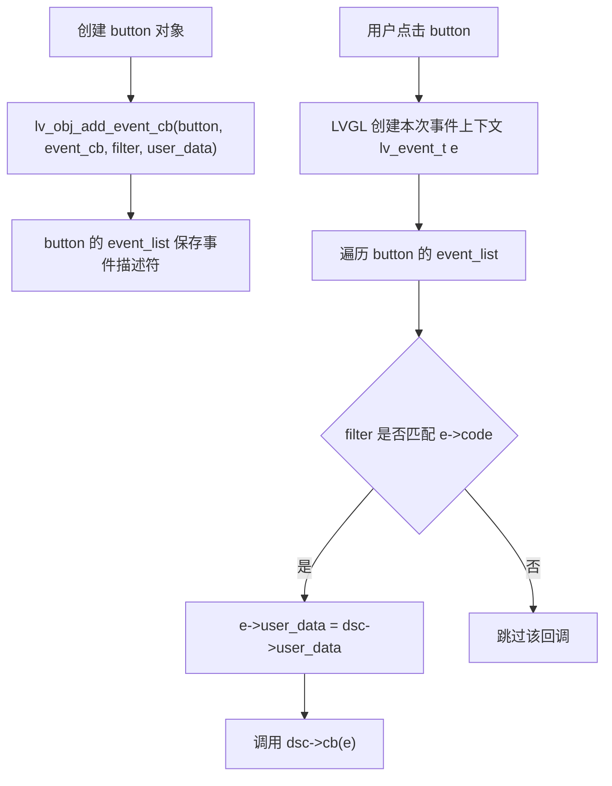

> 来源：Deep-In-Embedded / [中间件/LVGL/07-LVGL事件回调机制.md](https://github.com/shuai-yemao/Deep-In-Embedded/blob/5fcab575fc20cf681f3e79e163337211097c898a/%E4%B8%AD%E9%97%B4%E4%BB%B6/LVGL/07-LVGL%E4%BA%8B%E4%BB%B6%E5%9B%9E%E8%B0%83%E6%9C%BA%E5%88%B6.md)

# 📖 引言

> 这篇笔记要讲什么？用一句话概括核心主题。

我学习 LVGL 事件回调机制，是因为我需要在内存资源有限的 MCU 上实现轻量、成熟、操作简单且灵活的人机交互界面；而事件回调正是让界面从静态显示变成可交互系统的核心机制。

---

# 📝 LVGL 事件回调机制

> LVGL 事件回调机制的本质是：对象保存一组事件描述符，事件发生时 LVGL 用事件类型匹配 `filter`，匹配成功后调用对应的 `cb(e)` 回调函数。

## 实际意义

事件回调是 LVGL 实现用户交互和组件联动的核心机制。它让按钮、label、slider、timer 等对象不只是被创建出来，而是能根据用户操作或系统事件执行自定义逻辑。

对新手来说，学懂事件回调后，可以更容易看懂 GUI 代码里混在一起的基础对象 API、组件 API 和样式 API。

## 应用场景

1. 点击按钮后修改对象属性、样式或启动动画。
2. 点击按钮后修改 label、slider、arc 等其他对象，实现对象联动。
3. 点击按钮后启动或暂停 timer，影响后续周期性刷新。
4. 输入框、开关、列表等组件状态变化后更新业务数据。

## 核心逻辑/原理

LVGL 的事件回调不是“事件发生时临时找函数”，而是提前把回调信息注册到对象自己的事件列表里。

1. 创建对象，例如 `button`。
2. 调用 `lv_obj_add_event_cb`，把事件描述符保存到对象的 `event_list`。
3. 事件发生时，LVGL 创建/填充 `lv_event_t e` 作为本次事件上下文。
4. LVGL 遍历对象的事件列表，判断 `filter == LV_EVENT_ALL || filter == e->code`。
5. 匹配成功后，把 `user_data` 放入 `e`，再调用 `cb(e)`。



源码证据：

```c
// include/lvgl/core/lv_event.h:30
typedef void (*lv_event_cb_t)(lv_event_t * e);
```

```c
// src/misc/lv_event_private.h:27
struct _lv_event_dsc_t {
    lv_event_cb_t cb;
    void * user_data;
    uint32_t filter;
};
```

```c
// src/misc/lv_event_private.h:36
struct _lv_event_t {
    void * current_target;
    void * original_target;
    lv_event_code_t code;
    void * user_data;
    void * param;
};
```

```c
// src/core/lv_obj_event.c:106
lv_event_dsc_t * lv_obj_add_event_cb(lv_obj_t * obj,
                                      lv_event_cb_t event_cb,
                                      lv_event_code_t filter,
                                      void * user_data)
{
    return lv_event_add(&obj->spec_attr->event_list, event_cb, filter, user_data);
}
```

```c
// src/misc/lv_event.c:127
if(filter == LV_EVENT_ALL || filter == e->code) {
    e->user_data = dsc->user_data;
    dsc->cb(e);
}
```

## 关键公式/结论

1. 事件描述符 = `cb + filter + user_data`。
2. `lv_event_t * e` 是“本次事件上下文”，不是事件描述符。
3. `target` 来自本次事件，表示触发事件的对象。
4. `user_data` 来自注册回调时的第四个参数，用来把额外对象或变量带进回调。
5. `LV_EVENT_CLICKED` 是事件类型，适合作为回调过滤条件。
6. `LV_STATE_PRESSED` 是对象状态，适合用于样式 selector，不适合作为事件过滤条件。

## 实际操作步骤

### 第一步：创建对象

```c
lv_obj_t * button = lv_button_create(lv_screen_active());
lv_obj_t * label = lv_label_create(lv_screen_active());
```

`lv_button_create` 是按钮组件 API。  
`lv_label_create` 是 label 组件 API。  
`lv_screen_active()` 返回当前活动屏幕，作为父对象。

### 第二步：编写回调函数

点击按钮后，如果 `user_data` 中传入了 label，就修改 label 文字：

```c
static void event_cb(lv_event_t * e)
{
    lv_event_code_t code = lv_event_get_code(e);

    if(code != LV_EVENT_CLICKED) {
        return;
    }

    lv_obj_t * label = lv_event_get_user_data(e);

    if(label == NULL) {
        return;
    }

    lv_label_set_text(label, "Clicked");
}
```

### 第三步：注册回调

```c
lv_obj_add_event_cb(button, event_cb, LV_EVENT_CLICKED, label);
```

这句代码的含义是：把 `event_cb` 注册到 `button` 上，只响应 `LV_EVENT_CLICKED`，并且回调执行时把 `label` 作为 `user_data` 带进去。

### 第四步：区分 target 和 user_data

如果要修改触发事件的按钮本身，用 `target`：

```c
static void event_cb(lv_event_t * e)
{
    lv_event_code_t code = lv_event_get_code(e);

    if(code == LV_EVENT_CLICKED) {
        lv_obj_t * button = lv_event_get_target(e);
        lv_obj_set_style_bg_color(button, lv_color_hex(0x00FF00), 0);
    }
}
```

如果要修改另一个对象，例如旁边的 label，用 `user_data`：

```c
lv_obj_t * label = lv_event_get_user_data(e);
lv_label_set_text(label, "Clicked");
```

## 常见问题

### 发现的问题

1. 不清楚 `NULL` 是什么意思。
2. 容易把 `target` 和 `user_data` 混淆。
3. 容易把 `LV_EVENT_CLICKED` 和 `LV_STATE_PRESSED` 混淆。
4. 容易把事件描述符和 `lv_event_t * e` 混淆。
5. 容易写错类型，例如把 `lv_event_code_t` 写成 `lv_event_t`。

### 根因分析

`lv_obj_add_event_cb(button, event_cb, LV_EVENT_CLICKED, NULL);`

这里的 `NULL` 表示没有额外传入 `user_data`。如果回调里调用 `lv_event_get_user_data(e)`，拿到的就是空指针。

`target` 是本次事件的目标对象，来自 `lv_event_t e`。  
`user_data` 是注册回调时第四个参数，来自事件描述符。

`LV_EVENT_CLICKED` 是事件类型，表示发生了点击。  
`LV_STATE_PRESSED` 是对象状态，表示对象当前处于按下状态。

### 改进方法

1. 回调函数固定先写 `static void event_cb(lv_event_t * e)`。
2. 判断事件类型使用 `lv_event_get_code(e)`。
3. 修改触发对象时使用 `lv_event_get_target(e)`。
4. 修改额外对象或变量时使用 `lv_event_get_user_data(e)`。
5. 使用 `user_data` 前先判断是否为 `NULL`。

---

# 💬 Q&A

> 自问自答，检验理解深度。按难度递进排列。

## 🟢 基础

### Q1

`lv_obj_add_event_cb(button, event_cb, LV_EVENT_CLICKED, NULL);` 中四个参数分别是什么意思？

A1：

`button` 是被注册事件回调的对象。  
`event_cb` 是回调函数地址。  
`LV_EVENT_CLICKED` 是事件过滤条件。  
`NULL` 表示没有额外传入 `user_data`。

### Q2

`lv_event_get_target(e)` 和 `lv_event_get_user_data(e)` 有什么区别？

A2：

`lv_event_get_target(e)` 拿到的是本次触发事件的对象，例如 button。  
`lv_event_get_user_data(e)` 拿到的是注册回调时第四个参数传入的数据，例如 label、count 地址或 NULL。

## 🟡 进阶

### Q3

为什么 `count++` 和 `(*count)++` 不一样？

A3：

如果 `count` 是 `uint32_t *` 指针，`count++` 修改的是指针保存的地址，让它指向下一个 `uint32_t` 位置。  
`(*count)++` 才是修改这个地址里保存的整数值。

### Q4

为什么 `LV_EVENT_CLICKED` 可以作为 `lv_obj_add_event_cb` 的第三个参数，而 `LV_STATE_PRESSED` 不适合？

A4：

`LV_EVENT_CLICKED` 是事件类型，表示发生了一次点击事件，适合作为事件过滤条件。  
`LV_STATE_PRESSED` 是对象状态，表示对象当前处于按下状态，适合用于样式 selector。

## 🔴 困难

### Q5

一个 button 能不能注册多个事件回调？为什么？

A5：

可以。一个对象内部有自己的事件列表，可以保存多个事件描述符。每个事件描述符都有自己的 `cb`、`filter`、`user_data`。事件发生时，LVGL 会遍历这个列表，谁的 `filter` 匹配当前事件类型，就调用谁的回调。

### Q6

如果一个按钮同时注册 `LV_EVENT_PRESSED` 和 `LV_EVENT_CLICKED`，一次正常点击为什么两个回调都有可能被调用？

A6：

一次正常点击过程中，按钮会先经历按下事件 `LV_EVENT_PRESSED`，后面释放且没有被滑动取消时，又会产生 `LV_EVENT_CLICKED`。LVGL 每次发送事件时都会遍历对象的事件列表，并调用 `filter` 匹配的回调。

---

# 📋 总结

LVGL 事件回调的核心不是“按钮自己会执行逻辑”，而是对象先保存事件描述符。事件描述符里保存 `cb`、`filter` 和 `user_data`。事件发生时，LVGL 创建本次事件上下文 `lv_event_t e`，并根据事件类型匹配回调。写回调时，修改触发对象用 `target`，修改额外对象或变量用 `user_data`。掌握这条链路后，就能把按钮、label、slider、timer 等对象组合成真正可交互的界面。

---

# 📎 参考资料

## 🎥 视频链接

- 未记录

## 🔗 博客/文档链接

- 未记录

## 💻 仓库链接

- LVGL 本地源码仓库 — 当前学习基于本地 `D:/zhuomian/lvgl` 源码扫描

## 📄 代码/附件

- `include/lvgl/core/lv_event.h:30` — `lv_event_cb_t` 回调函数指针定义
- `include/lvgl/core/lv_event.h:36` — `LV_EVENT_ALL`
- `include/lvgl/core/lv_event.h:48` — `LV_EVENT_CLICKED`
- `src/misc/lv_event_private.h:27` — 事件描述符结构体
- `src/misc/lv_event_private.h:36` — 事件上下文结构体
- `src/core/lv_obj_event.c:106` — `lv_obj_add_event_cb`
- `src/misc/lv_event.c:127` — `filter` 匹配后调用回调
- `examples/widgets/button/lv_example_button_event.c:31` — button 事件回调示例
