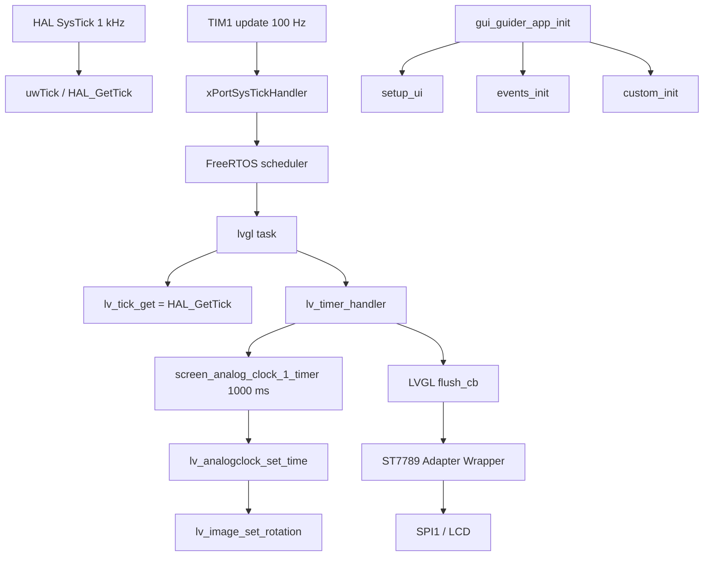
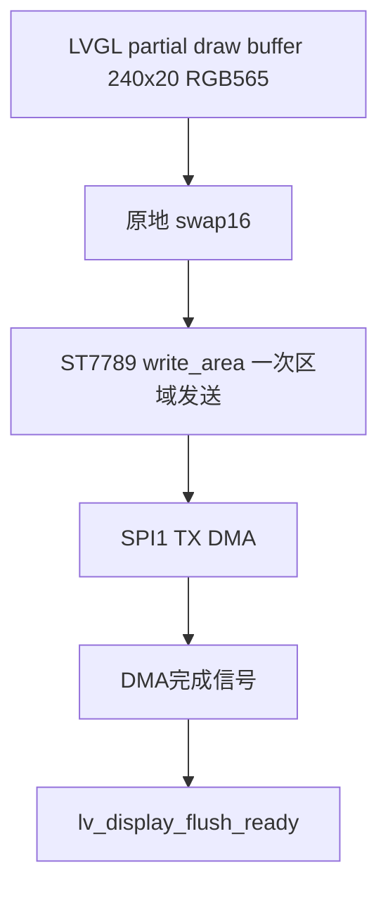
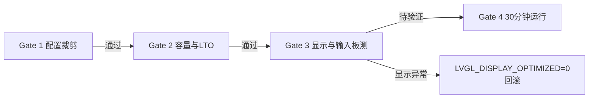
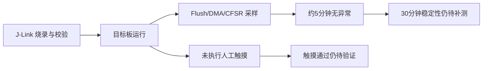

> 来源：Deep-In-Embedded / [中间件/LVGL/GUI Guider移植指南-STM32F411CEU6.md](https://github.com/shuai-yemao/Deep-In-Embedded/blob/5fcab575fc20cf681f3e79e163337211097c898a/%E4%B8%AD%E9%97%B4%E4%BB%B6/LVGL/GUI%20Guider%E7%A7%BB%E6%A4%8D%E6%8C%87%E5%8D%97-STM32F411CEU6.md)

# GUI Guider 移植指南（STM32F411CEU6 + LVGL 9）

> [!summary] 当前结论
> GUI Guider 8.3.10 生成页面已接入 `gui-guider` 分支的 STM32F411CEU6 工程。目标 LVGL 保持 `9.6.0-dev`。Debug/Release ARM GCC 构建通过，Debug ELF 已通过 J-Link 烧录。板上运行计数证明 FreeRTOS、LVGL Tick、ST7789 Flush 和 1 秒模拟时钟回调均在运行；实际 LCD 照片、触摸坐标和长按/右滑动作尚未完成。

## 1. 版本、来源与许可证

| 项目 | 实际值 |
|---|---|
| 工作分支 | `gui-guider` |
| 当前工程 HEAD | `7b2844e feat: add SPI1 DMA display transport` |
| LVGL 目录最近变更 | `1a24a85 feat: integrate LVGL v9 with FreeRTOS` |
| LVGL | `9.6.0-dev`，证据为 `Middlewares/LVGL/include/lvgl/lv_version.h` |
| GUI Guider 工程 | `test.guiguider`，工具版本 `1.10.1-GA` |
| GUI Guider 生成版本 | LVGL `8.3.10` 输出形式 |
| 分辨率 | 240×280；表盘资源 240×240 |
| MCU/资源 | STM32F411CEU6，512 KB Flash，128 KB RAM |
| 许可证 | 生成文件保留 NXP 版权头和 `LICENSE.txt`；`Widget/gui_analogclock.*` 为项目自有适配代码 |

源工程模拟器截图：


## 2. 迁移文件映射

```text
App/GuiGuider/
├── Generated/       GUI Guider 生成的页面、事件和资源声明
├── Custom/          custom.c/.h
├── Widget/          项目自有 gui_analogclock.c/.h
├── Assets/images/   当前页面实际引用的 4 个图片资源
├── Assets/fonts/    alimama 12/16 字号
├── Project/         test.guiguider
└── gui_guider_app.* 页面初始化入口
```

没有复制源工程完整 LVGL、Linux/QNX ports、模拟器二进制库或 DLL。页面层不调用 HAL、SPI、I2C 或 FreeRTOS API。

## 3. 运行时调用链



关键时基分工：SysTick 只调用 `HAL_IncTick()`，TIM1 更新中断调用 `xPortSysTickHandler()`。TIM1 使用当前 APB2 Timer 时钟配置为 1 MHz 计数、ARR=9999，因此产生 100 Hz OS Tick；LVGL 仍读取 HAL 的毫秒时基。

## 4. 模拟时钟适配

GUI Guider 8.3.10 的 `lv_analogclock_*` 不是目标 LVGL 9 原生控件，因此新增 `App/GuiGuider/Widget/gui_analogclock.c/.h`，保留生成代码所需接口。控件使用公共 LVGL 对象和子 `lv_image` 指针：

- 表盘对象固定为 240×240；
- 支持普通刻度、主刻度和隐藏数字/中心点；
- 时、分、秒针分别使用 `lv_image`；
- `set_time()` 更新状态并设置三根指针的旋转角度；
- 生成代码使用 `lv_timer_create(screen_analog_clock_1_timer, 1000, NULL)`；
- 秒针角度使用 0.1° 单位，按 60 秒映射到 360°。

时间角度关系为：

```text
angle_0_1deg = ((value * 3600 / 60) + 2700) % 3600
```

定时器回调中的 `clock_count()` 负责秒进位、分进位和 12 小时制时进位。

## 5. 资源与容量

首轮仅保留当前页面引用资源：表盘、时针、分针、秒针以及 alimama 12/16 字体。图片转换为 LVGL 9 的 `RGB565A8`，数据平面为 RGB565 + Alpha，避免继续使用约 4 MB 文本资源集合。

```text
表盘数据平面：172800 B
时针数据平面：600 B
分针数据平面：1050 B
秒针数据平面：1050 B
```

当前 ARM GCC 结果：

| 构建 | text | data | bss | Flash 使用 | RAM 使用 |
|---|---:|---:|---:|---:|---:|
| Debug | 468496 B | 180 B | 55076 B | 468684 / 524288 = 89.39% | 55248 / 131072 = 42.15% |
| Release | 468496 B | 180 B | 55076 B | 468684 / 524288 = 89.39% | 55248 / 131072 = 42.15% |

Flash 已接近 90% 高风险线；后续增加页面、字体或图片前必须重新读取 `.map`。若超过容量，优先裁剪字体/图片，再把表盘背景改为 `lv_draw` 刻度绘制。

## 6. 实施步骤记录

1. 在 `gui-guider` 分支确认目标工程和 LVGL 版本。
2. 读取 `test.guiguider`，确认 GUI Guider 1.10.1-GA、LVGL 8.3.10 输出形式和 240×280 分辨率。
3. 复制 Generated、Custom、Project 和当前页面资源，排除源工程 LVGL、模拟器 ports 和二进制库。
4. 新增 `gui_analogclock` 兼容 facade，避免机械修改全部 GUI Guider 生成代码。
5. 新增 `gui_guider_app_init()`，将 `setup_ui/events_init/custom_init` 放在 Display/Input 创建之后。
6. 将 `lvgl_port` 中的演示标签和按钮移除，恢复为显示、输入、Tick、Flush 和 GUI task 端口职责。
7. 将 FreeRTOS OS Tick 从 SysTick 迁移到 TIM1；SysTick 释放为 HAL System Tick。
8. 接入 CMake GUI_GUIDER OBJECT target，并加入 LVGL、FreeRTOS、BSP 和 APP include path。
9. 按 Debug、Release 构建并读取 ELF/map 容量。
10. J-Link 烧录 Debug ELF，读取运行时计数、TIM1 寄存器和 CFSR。

## 7. 验证证据

### 静态与构建

- 分支：`gui-guider`。
- LVGL：`9.6.0-dev`。
- Debug 构建：通过。
- Release 构建：通过。
- 仅有 LVGL 9 兼容 API 的 deprecated warning，未出现链接错误。
- CFSR：板上读取为 `0`。

### 板上运行

J-Link 15 秒运行窗口读取到的关键数据：

```text
uwTick                  = 0x0000FBBD（约 64.96 s，包含启动后的累计时间）
g_freertos_heartbeat    = 0x41（65）
g_lvgl_handler_count    = 0x1635（5685）
g_gui_timer_count       = 0x40（64）
g_gui_timer_valid_count = 0x40（64）
g_gui_update_count      = 0x41（65，含初始设置）
timer_paused            = 0
TIM1 CR1                = 0x00000005（URS + CEN）
TIM1 DIER               = 0x00000001（UIE）
TIM1 PSC                = 99
TIM1 ARR                = 9999
CFSR                    = 0
```

`PSC=99`、`ARR=9999` 对应 100 MHz TIM1 时钟下的 100 Hz 更新中断；FreeRTOS 心跳和模拟时钟回调均按约 1 秒递增。实际 LCD 指针视觉变化尚需相机/人眼确认，当前不能把计数证据等同于屏幕照片。

## 8. 常见问题与回滚点

### 指针不变化或间隔不稳定

现象：GUI 任务和 Flush 仍在运行，但指针回调次数异常。根因是 FreeRTOS 和 HAL/LVGL 共用 SysTick，时基职责耦合。修复是 `Core/Src/freertos_tim1_tick.c` 覆写 FreeRTOS 的 weak `vPortSetupTimerInterrupt()`，并从 `SysTick_Handler` 删除 `xPortSysTickHandler()`。

回滚时删除 TIM1 tick 源文件、从 CMake 移除该文件，并恢复 SysTick 中的 FreeRTOS handler 调用；但不建议回滚到共用时基。

### Flash 接近上限

优先删除未引用图片和字体字符集；若仍超过 512 KB，使用索引色/Alpha8 或完全改为矢量刻度。

### GUI Guider 重新生成覆盖适配

重新生成后重点检查 `Generated/gui_guider.h` 对 `gui_analogclock.h` 的 include，以及 `widgets_init.c` 中的 1000 ms timer 回调诊断适配。长期可将诊断逻辑移动到项目 wrapper，减少对生成文件的直接修改。

## 9. 截图索引

| 截图 | 状态 |
|---|---|
| `GUI Guider移植-源模拟器.png` | 已归档；源模拟器窗口截图 |
| 源 `test.guiguider` 版本/分辨率 | 已由工程文件静态读取，未单独截取 GUI 编辑器窗口 |
| `gui-guider` 分支状态 | 已由 Git 命令读取，未单独截取终端窗口 |
| 目标工程结构/API 扫描 | 已由静态扫描读取，未单独截取终端窗口 |
| 构建输出/ELF size/map | 已由 Debug/Release 构建和 map 读取，未单独截取终端窗口 |
| 实际 LCD 与触摸结果 | 尚未验证，暂无实物截图 |

## 10. Q&A

### Q1：为什么 LVGL 仍使用 `HAL_GetTick()`？

A：TIM1 只提供 FreeRTOS 调度节拍；SysTick 继续推进 HAL `uwTick`，因此 LVGL 定时器拥有独立于 OS 调度器的毫秒时间基准。

### Q2：为什么不直接把 `lv_analogclock` 加回 LVGL 源码？

A：它是 GUI Guider/源工程专属控件，不属于目标 LVGL 9 公共 API。放在 APP 的 Widget 目录可以保持中间件干净，也便于未来重新生成页面。

### Q3：编译通过是否等于容量通过？

A：不是。本工程必须同时读取 ELF 和 `.map`；当前 Flash 89.39%，虽然链接通过，但已经是高风险状态。

## 11. 总结

本次移植将 GUI Guider 页面放入 APP 层，保留 LVGL 9 中间件和 BSP/FreeRTOS 端口边界。模拟时钟通过项目自有 Widget 兼容 GUI Guider 旧接口，指针使用 LVGL 9 `lv_image` 对象更新。FreeRTOS Tick 已切换到 TIM1，SysTick 释放为 HAL System Tick，板上运行计数证明 1 秒回调恢复稳定。最终仍需补做实际 LCD 指针视觉、单点触摸映射、长按/右滑切屏和 30 分钟稳定性测试。

## 12. 参考文件

- [[LVGL 移植指南（STM32F411CEU6 + FreeRTOS）]]
- [[GUI Guider移植-源模拟器.png]]
- 工程：`App/GuiGuider/Project/test.guiguider`
- 时钟适配：`App/GuiGuider/Widget/gui_analogclock.c/.h`
- OS Tick：`Core/Src/freertos_tim1_tick.c`
- LVGL 端口：`Core/Src/lvgl_port.c`
- 构建：`cmake/stm32cubemx/CMakeLists.txt`
- J-Link 运行检查：`tools/jlink_gui_guider_runtime_check.jlink`

## 13. 工程优化记录（2026-07-27）

### 13.1 优化范围与版本锁定

本轮优化针对 `gui-guider` 分支，目标版本固定为 LVGL `9.6.0-dev`：

```text
LVGL_VERSION_MAJOR 9
LVGL_VERSION_MINOR 6
LVGL_VERSION_PATCH 0
LVGL_VERSION_INFO  "dev"
```

LVGL 9 使用 `LV_USE_IMAGE`，不是 v8/v9 混用的 `LV_USE_IMAGES`。显示对象使用：

```c
LV_COLOR_DEPTH 16
LV_USE_DRAW_SW 1
LV_DISPLAY_RENDER_MODE_PARTIAL
```

当前 `lv_conf.h` MD5：

```text
2AF0490E72B7D1F84A58631A00792105
```

### 13.2 Gate 1：LVGL 配置裁剪

`Middlewares/LVGL/Config/lv_conf.h` 已完成第一轮白名单配置：

- 保留 `LV_USE_IMAGE`、`LV_USE_LABEL`、软件绘制、FreeRTOS OSAL 和 Task Notification；
- 关闭未使用的控件、主题、Grid、Observer、文件系统和图片解码器；
- 关闭全部内置 Montserrat 8～48 字体；
- 默认字体改为 `lv_font_alimama_16`；
- GUI Guider 页面继续显式使用 `lv_font_alimama_12` 和 `lv_font_alimama_16`；
- Debug 保留 Sysmon、内存/性能监控和必要断言；
- Release 关闭 Log、Sysmon、Perf Monitor、Mem Monitor 和断言；
- `LV_MEM_SIZE` 保持 16 KB，尚未降到 12 KB。

GUI Guider 静态扫描结果显示，当前页面实际依赖 Image、Label、动画核心、对象事件、触摸手势和项目自有 `lv_analogclock_*` facade。扫描结果保存于工程：

```text
reports/gui-guider-api-symbols.txt
```

### 13.3 Gate 2：容量结果

优化前基线为 Release Flash 468684 B（89.39%）。配置裁剪和链接回收后：

| 构建 | text | data | bss | 链接 Flash | 链接 RAM |
|---|---:|---:|---:|---:|---:|
| Debug | 420060 B | 100 B | 54700 B | 420168 / 524288 = 80.14% | 54792 / 131072 = 41.80% |
| Release | 402548 B | 96 B | 54688 B | 402652 / 524288 = 76.80% | 54776 / 131072 = 41.79% |

Release 已达到 Flash 小于 85%、RAM 小于 60% 硬目标。最大 Flash 符号仍为：

```text
_biaopan1_alpha_240x240_map  0x2a300 = 172800 B
```

该数值是 Flash `.rodata` 图片资源，不是运行时 RAM 峰值。其他主要 RAM 符号为：

```text
ucHeap             0x6000 = 24 KB
work_mem_int       0x4000 = 16 KB
s_lvgl_draw_buffer 0x2580 = 9600 B
```

### 13.4 显示端口优化

由于 Gate 1 已达到 Flash 硬目标，本轮保留 20 行 partial buffer，不增加 40 行缓冲的 9600 B RAM 成本。

显示端口已完成低 RAM 路径优化：

1. 删除额外 `s_lvgl_tx_row` 作为默认路径；
2. 在 LVGL draw buffer 内原地执行 RGB565 高低字节交换；
3. 每个刷新区域只调用一次 ST7789 Wrapper；
4. 依赖现有 Adapter Port 的同步 DMA 完成后再执行 `lv_display_flush_ready()`；
5. 未修改 SPI 频率、MADCTL、屏幕偏移和 BSP 公共接口；
6. 保留 `LVGL_DISPLAY_OPTIMIZED` 编译期回滚宏；
7. 新增 Flush 起始时间、耗时、字节数、像素数和状态计数。



由于当前没有新的板上 Flush 耗时和摄像头画面证据，`≤5 ms` 和 tearing 结果暂记为“尚未板上验证”，不能用编译结果代替。

### 13.5 LVGL 输入、任务和 OS 优化

`lvgl_port.c` 已删除手动 `lv_indev_read()`，改由 LVGL v9 输入定时器采样：

```c
lv_timer_set_period(lv_indev_get_read_timer(s_touch_indev), 20U);
```

LVGL 任务使用 `lv_timer_handler()` 返回值进行 1～20 ms 调度限制；由于 FreeRTOS Tick 为 100 Hz，实际阻塞时间按至少 1 tick 处理。LVGL 任务优先级调整为 `tskIDLE_PRIORITY + 2`，高于普通业务任务，DMA 仍由中断完成。

新增运行时诊断变量：

- LVGL handler 次数和下次定时器时间；
- Flush 时间戳、耗时、像素数、字节数和状态；
- FreeRTOS 当前/最小剩余堆；
- LVGL 内存池剩余和最大使用量（Debug）；
- LVGL 任务 Stack High Water Mark；
- 触摸读取和按下计数。

FreeRTOS 功能保持完整，未删除 Event Groups、Stream Buffers、Counting Semaphores、Software Timer 或 Task Notification。TIM1 100 Hz OS Tick 保持不变，SysTick 继续只维护 HAL Tick。

### 13.6 Release LTO 与异常修复

Release 已启用：

```text
-Os -g0 -flto
-fno-unwind-tables
-fno-asynchronous-unwind-tables
--gc-sections
--specs=nano.specs
```

首次 LTO 链接发现 FreeRTOS 的 `SVC_Handler/PendSV_Handler` 通过内联汇编间接引用 `vPortSVCHandler/xPortPendSVHandler`，LTO 无法识别该 C 引用。最终通过 Release 链接选项保留两个外部符号：

```text
-Wl,--undefined=vPortSVCHandler
-Wl,--undefined=xPortPendSVHandler
```

修复后 Release 链接通过。若后续出现 HardFault，排查顺序为：关闭 LTO 复现、检查链接脚本布局、检查 `volatile` 寄存器访问、再检查 GDB/objdump 符号可见性。Debug 构建不启用 LTO。

### 13.7 基线与证据文件

新增脚本：

```text
scripts/lvgl_baseline.ps1
```

脚本记录 Git HEAD、分支、LVGL 版本、`lv_conf.h` MD5、GCC 版本、ELF size、map 和 Top 30 符号。当前报告目录：

```text
reports/lvgl-debug/
reports/lvgl-release/
```

当前已具备的证据：

- LVGL 版本和配置快照；
- `LV_DISPLAY_RENDER_MODE_PARTIAL` 配置；
- draw buffer 地址/大小的 ELF/map 证据；
- Debug/Release ARM GCC 构建输出；
- Release LTO 编译参数；
- API 静态扫描清单；
- Flash/RAM 和 Top 30 符号结果。

仍未具备的板上证据：

- DMA 启动/完成串口日志片段（当前使用 J-Link 内存采样）；
- 人工触摸后的坐标采样、长按和右滑日志；
- 快速滑动 tearing 摄像头截图；
- 完整 30 分钟堆、栈和定时器稳定性记录。

### 13.8 优化验收状态



| 项目 | 状态 |
|---|---|
| LVGL 9.6.0-dev 锁定 | 已完成 |
| Render Mode Partial | 已完成 |
| `lv_conf.h` 裁剪 | 已完成 |
| Debug 编译 | 已完成 |
| Release LTO 编译/链接 | 已完成 |
| Flash <85% | 已完成，76.80% |
| RAM <60% | 已完成，41.79% |
| 原地字节序和单区域 DMA | 已板测，最近 Flush 1～2 ms |
| 20 ms 触摸采样 | 已板测，平均约 22.7 ms；人工触摸待验证 |
| 指针每秒更新 | 既有 TIM1 运行证据已完成 |
| Flush 视觉、触摸和 tearing | Flush 已板测；视觉、人工触摸和 tearing 尚未验证 |
| 30 分钟稳定运行 | 尚未验证 |

## 14. 实际烧录与板上运行采样（2026-07-27）

### 14.1 烧录证据

- 探针：SEGGER J-Link V9.30，SN `69701612`；
- 目标：`STM32F411CE`，接口 SWD，速度 4000 kHz；
- VTref：约 `3.325 V`；
- 固件：`build/Release/stm32f411ceu6_freertos_transplant.elf`；
- 烧录方式：`loadfile`，未执行显式全片 `erase`；J-Link 对受影响 Flash 区域执行擦除、写入和校验；
- 结果：`O.K.`；总耗时 `9.035 s`，Program & Verify `1.371 s`，速度约 `373 KB/s`。

### 14.2 Flush、DMA 和异常寄存器

J-Link 通过 ELF 符号地址读取运行时变量，报告文件为：

`reports/lvgl-board-30min-jlink.log`。

约 5 分钟的连续采样中：

| 指标 | 采样起点 | 采样末点 | 结果 |
|---|---:|---:|---|
| `g_lvgl_flush_count` | 2537 | 9469 | 持续增长 |
| ST7789 DMA 完成 | 2537 | 9469 | 与 Flush 数一致 |
| ST7789 DMA 启动 | 2537 | 9469 | 与完成数一致 |
| ST7789 DMA 错误 | 0 | 0 | 未发现错误 |
| 最近一次 Flush | 2 ms | 1 ms | 满足静态目标 `≤5 ms` |
| 最近区域像素 | 4800 | 1460 | 正常 partial 刷新 |
| `CFSR` | 0 | 0 | 未发现 Cortex-M Fault |

本次实际测得的 Flush 时间戳和耗时来自目标板内存变量，不是主机估算。由于当前 Flush Adapter 会同步等待 SPI1 DMA 完成，因此 DMA 完成计数可以作为 `lv_display_flush_ready()` 前的硬件完成证据。

### 14.3 触摸采样

LVGL 输入读取计数从 `4804` 增长到 `17996`；按目标 Tick 差值约 `298.7 s` 计算，平均读取间隔约 `22.7 ms`。这是 20 ms 定时器在 100 Hz FreeRTOS Tick 下的量化结果，未发现输入读取饥饿。

本次监控期间没有人工在屏幕上执行触摸动作，因此：

- `g_lvgl_touch_press_count` 未增加；
- `g_touch_valid_sample_count` 未增加；
- CST816T DMA/EXTI 计数保持 0，符合“未触摸且当前驱动使用同步轮询兜底”的现场状态；
- 不能据此宣称触摸坐标映射已通过，仍需人工单点、长按和右滑验证。

### 14.4 运行时内存与栈

- FreeRTOS 当前剩余堆约 `6416 B`，整个采样期间未下降；
- FreeRTOS 最小剩余堆约 `2216 B`，未触发分配失败；
- LVGL Debug 内存监控读数保持稳定；
- LVGL 任务 Stack High Water Mark 约 `126 words`；
- 未观察到堆、栈、CFSR 或 DMA 错误增长。

### 14.5 本次板测结论



当前结论：Release 固件已实际烧录并运行；Flush 和 DMA 短时板测无异常，最近 Flush 为 1 ms；触摸定时器读取间隔约 22.7 ms。由于本次监控在达到 30 分钟前被中断，30 分钟稳定性验收状态保持“尚未验证”，不能用本次约 5 分钟证据替代。
