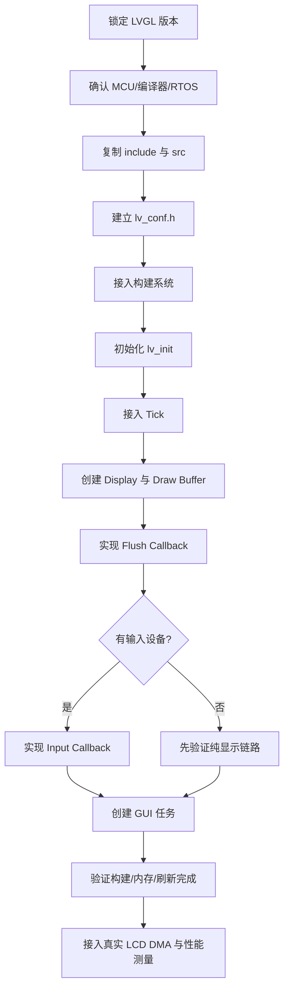
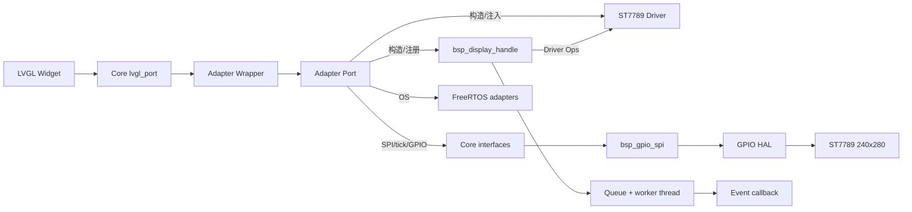
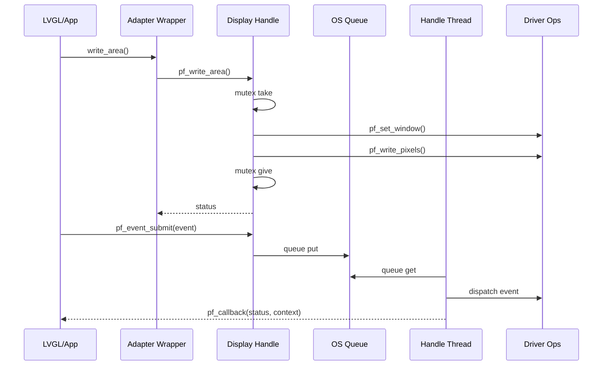

> 来源：Deep-In-Embedded / [中间件/LVGL/lvgl移植指南.md](https://github.com/shuai-yemao/Deep-In-Embedded/blob/5fcab575fc20cf681f3e79e163337211097c898a/%E4%B8%AD%E9%97%B4%E4%BB%B6/LVGL/lvgl%E7%A7%BB%E6%A4%8D%E6%8C%87%E5%8D%97.md)

# LVGL 移植指南（STM32F411CEU6 + FreeRTOS）

> [!summary] 本次结论
> 已在 `lvgl` 分支将本地 LVGL v9.6.0-dev 接入 STM32F411CEU6 + FreeRTOS，并按实际 ST7789 接线完成 GPIO-SPI、Driver、Display Handle、Adapter Port、Adapter Wrapper、LVGL Flush 和启动 Demo。Driver/Handle 已按“构造函数 + 实例函数指针 + 依赖注入”重构。
>
> J-Link 板级证据：固件下载与校验通过；运行 15 s 后 `g_freertos_heartbeat=18`、`g_lvgl_flush_count=6`、`g_lvgl_last_flush_pixels=4800`、`g_lvgl_last_flush_status=0`、CFSR=0。说明 FreeRTOS/LED 任务和 LVGL→ST7789 刷新链路均已运行。最终画面需以屏幕实物为准。

## 1. 版本与工程基线

| 项目 | 本次值 |
|---|---|
| LVGL 来源 | `D:\zhuomian\lvgl` |
| LVGL 版本证据 | `include/lvgl/lv_version.h`：`9.6.0-dev` |
| LVGL 源 commit | `02c8fbfeb` |
| MCU | STM32F411CEU6，Cortex-M4F |
| OS | FreeRTOS Kernel 11.1.0，GCC ARM_CM4F |
| 工程分支 | `freertos` 基线 → `lvgl` 集成 |
| 颜色格式 | RGB565，16 bpp |
| 当前显示 profile | ST7789 240×280，RGB565，partial render，20 行 buffer，Y offset 20 |
| SPI | 复用 W25Qxx 的 `bsp_gpio_spi`，PA5=SCK，PA7=MOSI，Mode 0 |
| FreeRTOS heap | 24 KB；LVGL task stack 1024 words；LVGL task priority 1 |


## 2. 通用移植步骤

下面的流程适用于大多数“MCU + RTOS + LVGL + 外部 LCD”工程。硬件相关内容必须替换为实际 BSP，不要把示例分辨率和引脚直接当成产品配置。



### 2.1 锁定版本

先读取 `lv_version.h`，确认使用 v8 还是 v9。v9 使用 `lv_display_t`、`lv_display_create`、`lv_display_set_flush_cb`；v8 的 `lv_disp_drv_t`、`lv_disp_draw_buf_t` 不能混用。

### 2.2 复制源码

本工程将 LVGL 公共头文件和源码放在：

```text
Middlewares/LVGL/
├── Config/lv_conf.h
├── include/lvgl/       # 公共 API
├── src/                # LVGL C 源码
└── lvgl.h              # 源码相对 include 所需的兼容头
```

只复制 `include` 和 `src` 即可作为中间件集成；`examples`、`demos` 和 `env_support` 不进入 MCU 固件目标。

### 2.3 配置 `lv_conf.h`

位置：`Middlewares/LVGL/Config/lv_conf.h`

本次关键配置：

```c
#define LV_USE_STDLIB_MALLOC LV_STDLIB_BUILTIN
#define LV_MEM_SIZE (16U * 1024U)
#define LV_USE_OS LV_OS_FREERTOS
#define LV_USE_FREERTOS_TASK_NOTIFY 1
#define LV_COLOR_DEPTH 16
#define LV_USE_DRAW_SW 1
```

通用原则：

1. `LV_USE_OS` 必须与实际 OS 适配层一致。
2. `LV_COLOR_DEPTH` 必须与 LCD 传输格式和 Flush 数据解释一致。
3. `LV_MEM_SIZE`、绘制缓冲和任务栈要一起估算 RAM。
4. 不使用的图片解码器、输入设备和复杂 Widget 应显式关闭，产品版再按需求打开。

### 2.4 接入 CMake

位置：`cmake/stm32cubemx/CMakeLists.txt`

核心边界是：

```cmake
file(GLOB_RECURSE LVGL_Src CONFIGURE_DEPENDS
    ${CMAKE_CURRENT_SOURCE_DIR}/../../Middlewares/LVGL/src/*.c
)
add_library(LVGL OBJECT ${LVGL_Src})
target_include_directories(LVGL PRIVATE ${LVGL_Inc_Dirs})
target_compile_definitions(LVGL PRIVATE LV_CONF_INCLUDE_SIMPLE STM32F411xE)
```

应用目标还要继承 `Config`、`include/lvgl`、FreeRTOS 和 CMSIS 目录，否则 `lvgl_port.c` 与 `lv_freertos.c` 会出现头文件缺失。

### 2.5 接入 Tick、Display 和 Flush

位置：`Core/Src/lvgl_port.c`

初始化顺序（由显示初始化任务在调度器启动后执行）：

```c
lv_init();
lv_tick_set_cb(HAL_GetTick);
s_lvgl_display = lv_display_create(240U, 280U);
lv_display_set_color_format(s_lvgl_display, LV_COLOR_FORMAT_RGB565);
lv_display_set_flush_cb(s_lvgl_display, lvgl_flush_cb);
lv_display_set_buffers(s_lvgl_display, s_lvgl_draw_buffer, NULL,
                       sizeof(s_lvgl_draw_buffer),
                       LV_DISPLAY_RENDER_MODE_PARTIAL);
```

Flush Callback 的职责是把 `area` 对应的像素送到 LCD，并且在同步复制或 DMA 完成后调用：

```c
lv_display_flush_ready(display);
```

当前实现把 LVGL 小端 RGB565 转成 ST7789 要求的高字节在先格式，并按行调用 Adapter Wrapper。LVGL 不直接访问 HAL、GPIO-SPI 或 Driver。

```c
status = bsp_st7789_adapter_wrapper_write_area(
    s_st7789_display,
    (uint16_t)area->x1,
    (uint16_t)y,
    (uint16_t)area->x2,
    (uint16_t)y,
    s_lvgl_tx_row,
    row_bytes);
lv_display_flush_ready(display);
```

### 2.6 创建 GUI 任务

位置：`Core/Src/lvgl_port.c` 的 `lvgl_task`，由 `Core/Src/freertos_app.c` 的 `freertos_app_init` 启动。

```c
static void lvgl_task(void *argument)
{
    for (;;) {
        lv_timer_handler();
        vTaskDelay(pdMS_TO_TICKS(10U)); /* 100 Hz tick 下至少 1 tick */
    }
}
```

任务节拍不应与 Flush DMA 完成信号混为一谈：CPU 绘制完成后，Flush 可以同步完成，也可以等待 DMA 中断后再调用 `lv_display_flush_ready`。


## 3. 本工程关键文件

| 文件 | 职责 |
|---|---|
| `Middlewares/LVGL/Config/lv_conf.h` | LVGL v9 配置、FreeRTOS OSAL、RGB565 和内存预算 |
| `Middlewares/LVGL/include/lvgl/` | LVGL 公共头文件 |
| `Middlewares/LVGL/src/` | LVGL 内核、绘制、Widget、FreeRTOS OSAL 源码 |
| `Middlewares/LVGL/lvgl.h` | 源码相对路径兼容头 |
| `Core/Inc/lvgl_port.h` | 当前显示 profile 与刷新计数器声明 |
| `Core/Src/lvgl_port.c` | `lv_init`、Tick、Display、Buffer、Flush、GUI task |
| `Core/Src/freertos_app.c` | FreeRTOS LED task 与 `lvgl_port_init` 启动顺序 |
| `cmake/stm32cubemx/CMakeLists.txt` | LVGL OBJECT target、头文件路径和目标链接 |
| `BSP/ST7789/Config/bsp_st7789_config.h` | 分辨率、偏移和 ST7789 命令/寄存器定义 |
| `BSP/ST7789/Driver/` | ST7789 具体外设协议、窗口、像素和面板初始化 |
| `BSP/ST7789/Adapter/Port/` | `bsp_gpio_spi` 实例、Core/tick/OS 注入、Driver Ops 注册 |
| `BSP/ST7789/Adapter/Wrapper/` | 仅依赖 Port 的 OS、Middleware、App 显示接口 |
| `BSP/ST7789/Handler/` | `bsp_display_handle` 生命周期、互斥、队列、线程和事件回调 |
| `BSP/ST7789/Demo/` | 红/绿/蓝/白小色块 Driver Demo |
| `BSP/ST7789/Adapter/Port/Src/bsp_gpio_spi.c` | 复用 W25Qxx 的 GPIO 模拟 SPI |
| `Core/Src/gpio.c` | PA1/PA4/PA5/PA6/PA7、PB10 及 LED GPIO |

## 4. 构建与验证

```powershell
cmake --preset Debug
cmake --build --preset Debug -j 4

cmake --preset Release
cmake --build --preset Release -j 4
```

本次结果：

| 构建 | RAM | Flash | 状态 |
|---|---:|---:|---|
| Debug `-O0 -g3` | 57,696 B / 128 KB | 473,072 B / 512 KB | 通过 |
| Release `-Os` | 57,616 B / 128 KB | 242,828 B / 512 KB | 通过 |


代码中保留了两个调试观测量：

```c
volatile uint32_t g_lvgl_flush_count;
volatile uint32_t g_lvgl_last_flush_pixels;
```

本次 Debug ELF 已使用 J-Link V9 下载到 STM32F411CEU6。运行 15 s 后读取到：

`g_freertos_heartbeat=18`、`g_freertos_scheduler_started=1`、

`g_lvgl_flush_count=6`、`g_lvgl_last_flush_pixels=4800`、

`g_lvgl_last_flush_status=0`、FreeRTOS 调度器运行、CFSR=0。

这些数值证明 LED 任务、LVGL 任务和 Flush Callback 已运行；最终文字和色块仍需以屏幕实物观察确认。

## 5. ST7789 实际硬件接入

硬件连接以用户提供的实际接线图为准：

| LCD 信号 | MCU 引脚 | 工程位置 |
|---|---|---|
| LCD_RST | PB10 | `BSP/ST7789/Adapter/Port/Src/bsp_st7789_adapter_port.c` |
| LCD_BLCAK | PA1 | 同上；当前高电平点亮 |
| LCD_CS | PA4 | 同上；由 `bsp_gpio_spi` 实例管理 |
| LCD_CLK | PA5 | `bsp_gpio_spi` 的 SCK |
| LCD_DC | PA6 | Adapter Port |
| LCD_MOSI | PA7 | `bsp_gpio_spi` 的 MOSI |
| TP_INT | PB2 | 已记录，未实现 |
| TP_RST | PA15 | 已记录，未实现 |
| TP_SCL | PA8 | 已记录，未实现 |
| TP_SDA | PB4 | 已记录，未实现 |

ST7789 参数来自原工程 `st7789.h` 的 `USING_240X280` profile：240×280、rotation 0、Y offset 20。当前工程在 Adapter Port 中实例化参考工程的 `bsp_gpio_spi`，将 PA4/PA5/PA7 注入 CS/SCK/MOSI；触摸控制器型号/协议在提供的资料中未确认，因此只保留映射，不伪造触摸驱动。

### 5.1 Driver、Handle、Adapter Port、Adapter Wrapper 契约

本工程按参考工程的“依赖注入 + 实例注册”思路收敛为以下边界：

| 模块 | 只负责什么 | 不应依赖什么 |
|---|---|---|
| `bsp_st7789_driver` | ST7789 命令、寄存器、窗口和像素协议；只对外提供构造函数 | HAL、FreeRTOS、LVGL |
| `bsp_display_handle` | Driver 注册、状态、互斥、队列、工作线程和事件回调 | 具体 HAL、FreeRTOS 头文件 |
| `Adapter Port` | 创建 `bsp_gpio_spi`、SPI/tick/GPIO Core、OS 表和 Driver Ops 并注入 | LVGL/App 业务 |
| `Adapter Wrapper` | 只依赖 Port，为 OS、Middleware、App 提供稳定显示 API | 直接暴露底层 SPI 细节 |

本次设计参考了以下实际工程：

- `30_stm32f411ceu6_bsp_flash_platform/Bsp/W25Qxx/spi`：复用
  `bsp_gpio_spi` 的 `spi_gpio_ops_t`、`spi_bus_t` 和发送接口。
- `STM32F411CEU6_AHT21/BSP/AHT21/driver`：Driver 通过操作表接收底层
  依赖。
- `STM32F411CEU6_AHT21/BSP/AHT21/handler` 与
  `28_STM32F411CEU6_Mpu6050/BSP/MPU6050/handler`：Handler/Handle
  持有实例、状态和 OS 资源，避免把平台实现写进协议层。



### 5.2 Driver 北向与南向接口

Driver 头文件 `BSP/ST7789/Driver/Inc/bsp_st7789_driver.h` 的公共函数只有：

```c
bsp_st7789_status_t bsp_st7789_driver_inst(
    bsp_st7789_driver_t *p_self,
    bsp_st7789_core_ops_t *p_core_ops);
```

构造函数绑定 `pf_init`、`pf_deinit`、`pf_set_window`、`pf_write_pixels`、

`pf_fill` 和 `pf_set_backlight`。这些操作的实现均为 Driver 源文件中的

`static` 函数，调用方通过 `bsp_st7789_driver_t` 实例函数指针访问。

实例中的 `is_inited` 在初始化成功后才置为 `BSP_ST7789_INITED`，所有窗口、

像素和方向操作都会先检查该状态。

南向 Core 分为三类：

- `bsp_st7789_spi_interface_t`：SPI 初始化、发送、CS 和 DC。
- `bsp_st7789_timebase_interface_t`：`pf_get_tick_ms` 和毫秒延时。
- `bsp_st7789_gpio_interface_t`：LCD_RST 和背光控制。

Port 中的 `port_spi_write` 使用 W25Qxx 参考工程的 `bsp_gpio_spi`，因此

Driver 不关心当前 SPI 是硬件外设还是 GPIO 模拟实现。

### 5.3 Handle 南向服务与事件模型

`BSP/ST7789/Handler/Inc/bsp_display_handle.h` 只提供构造函数和

`bsp_display_handle_register_driver`。Handle 实例保存以下内部函数指针：

```c
p_self->pf_write_area;
p_self->pf_fill;
p_self->pf_set_backlight;
p_self->pf_event_submit;
```

`bsp_display_handle_driver_ops_t` 是 Handle 面向具体 Driver 的抽象表，

作用类似参考工程的 `sensor_ops`。Adapter Port 将 ST7789 Driver 的实例

函数指针包装为该表；Handle 不包含 ST7789 协议实现。

构造时由 OS Ops 创建互斥锁、8 个元素的事件队列和 `display_handle` 工作

线程。事件包括区域写入、整屏填色、背光控制和停止事件。工作线程取出

事件后调用内部同步操作，最后执行 `pf_callback(status, context)`。

区域写入事件只复制像素指针，不复制像素数据，回调完成前必须保证缓冲区有效。



启动测试顺序：

1. FreeRTOS 启动后创建 `display_init` 任务。
2. Adapter Wrapper 通过 Port 注入 Core/OS，初始化 `bsp_display_handle` 和 ST7789，执行红/绿/蓝/白小色块 Demo。
3. 初始化 LVGL Display、20 行 RGB565 Draw Buffer 和 GUI 任务。
4. LVGL Flush 通过 Adapter Wrapper → Display Handle → Driver → GPIO-SPI 写入 ST7789；Flush 每行让出 1 tick，LED 任务每 1 s 翻转 PC13。


## 6. 常见问题

### 找不到 `lvgl.h`

现象：应用端或 LVGL 源码找不到头文件。根因通常是 `include/lvgl` 没加入应用目标，或者缺少源码根目录下的兼容 `lvgl.h`。本工程在 `LVGL_Inc_Dirs` 和 `Middlewares/LVGL/lvgl.h` 中分别处理。

### `lv_display_flush_ready` 没有调用

现象：首帧后任务不再刷新或显示状态卡住。根因是 Flush Callback 没有在同步复制完成或 DMA 完成中断中报告完成。修复：所有正常和异常路径都要保证一次 `lv_display_flush_ready`。

### 把 Debug 体积当成产品体积

Debug 使用 `-O0`，LVGL 大量绘制代码会显著膨胀。本工程 Debug 为 463 KB，Release `-Os` 为 237 KB；产品空间评估应以 Release、实际字体和实际 Widget 配置为准。

### 屏幕常亮红色、LED 不闪

排查顺序：

1. 用 J-Link 读取 `g_lvgl_flush_count`、`g_lvgl_last_flush_status` 和 `g_freertos_heartbeat`。
2. 若停在 HardFault，先读 CFSR 和异常栈；本次曾因启动前 SysTick 进入 FreeRTOS tick 修复。
3. 若 `g_freertos_heartbeat=0` 且 CFSR=0，检查任务是否栈溢出或高优先级任务是否没有阻塞。本次 `pdMS_TO_TICKS(5)` 在 100 Hz 下为 0，已改为 10 ms。
4. 不要在调度器启动前调用 `xSemaphoreCreateMutex`；本次 Display Handle 初始化已移动到 `display_init` 任务。

### 触摸暂未实现

图片给出了 TP_INT/TP_RST/TP_SCL/TP_SDA 引脚，但没有触摸 IC 型号、寄存器协议和时序说明。后续应在 `BSP/Touch/Driver`、Adapter Port/Wrapper 和 LVGL `read_cb` 中按真实控制器补齐。

### 移植配置与运行闭环常见误区

> 本节记录 LVGL 移植学习过程中暴露出的易错点。结论基于 LVGL v9.6.0-dev 源码与本地移植指南，尚未新增板上实测。

#### 1. `flush_cb` 的意义

`flush_cb` 不是 LCD 驱动本身，而是 LVGL 与具体显示硬件之间的适配点。LVGL 只负责把某个区域渲染成像素数据，移植层负责把 `area + px_map` 送到真实屏幕。

- 现象：误以为 LVGL 应该直接操作 LCD。
- 根因：没有区分图形库职责和 BSP/Driver 职责。
- 修复：让 `flush_cb` 调用 Adapter Wrapper/BSP，不让 LVGL 直接依赖 HAL、SPI、LCD Driver。
- 验证：确认 `flush_cb` 被调用，且能把指定区域写入屏幕。

代码证据：`examples/porting/lv_port_disp_template.c:63`、`examples/porting/lv_port_disp_template.c:124`

#### 2. `lv_display_flush_ready()` 的意义

`lv_display_flush_ready()` 不是启动 DMA，也不是通知 OS 可以刷新。它的意义是通知 LVGL：本次 flush 对应的像素区域已经传输完成，绘制缓冲区可以继续被 LVGL 使用。

- 现象：首帧后界面卡住、动画不动、后续局部刷新不再发生。
- 根因：DMA 完成后没有调用 `lv_display_flush_ready()`，LVGL 仍认为上一轮 flush 没结束。
- 修复：同步传输完成后立即调用；异步 DMA 则在 DMA complete 中断或对应任务上下文中调用。
- 验证：统计 flush 次数持续增长，页面切换或动画能继续刷新。

代码证据：`examples/porting/lv_port_disp_template.c:140`、`src/display/lv_display.c:672`

#### 3. 颜色深度和颜色格式配置错误

`LV_COLOR_DEPTH` 决定 LVGL 内部像素数据编码，必须和 LCD 接收格式、`lv_display_set_color_format()`、Flush 中的数据解释一致。

- 现象：颜色不对、红蓝反、花屏、画面偏移、刷新数据长度异常。
- 根因：LCD 实际 RGB565，但 LVGL 颜色深度或 color format 配置不匹配。
- 修复：确认 LCD 像素格式、每像素字节数、大小端顺序、stride 和 flush 转换逻辑。
- 验证：显示红、绿、蓝、白纯色块，观察颜色和区域是否正确。

代码证据：`lv_conf_template.h:131`

#### 4. `LV_DEF_REFR_PERIOD` 不是 LCD 硬件刷新率

`LV_DEF_REFR_PERIOD` 控制 LVGL 刷新定时器周期，即多久检查一次 invalid area 并触发渲染/flush。LCD 的扫描刷新、SPI/DMA 传输速度、TE 信号属于硬件和驱动层。

- 现象：误把 LVGL 刷新周期当成屏幕硬件刷新率。
- 根因：没有区分 LVGL 调度周期与 LCD 面板刷新机制。
- 修复：用 `LV_DEF_REFR_PERIOD` 控制 LVGL 任务节奏，用硬件驱动参数控制真实屏幕传输。
- 验证：观察 `lv_timer_handler()` 周期、flush 调用周期和实际 SPI/DMA 耗时。

代码证据：`lv_conf_template.h:142`、`src/display/lv_display.c:115`

#### 5. `lv_timer_handler()` 与 `lv_tick_inc()` 的关系

`lv_tick_inc(ms)` 提供时间基准，`lv_timer_handler()` 根据时间基准执行到期任务，包括刷新、输入扫描、动画、timer callback 和异步任务。

- 现象：界面不刷新、触摸无响应、动画不动、timer callback 不执行。
- 根因：只创建 UI，没有周期调用 `lv_timer_handler()`；或没有稳定 tick 来源。
- 修复：定时中断/系统 tick 调用 `lv_tick_inc(1)`，主循环或 GUI 任务周期调用 `lv_timer_handler()`。
- 验证：确认 tick 单调递增，`lv_timer_handler()` 周期运行，`flush_cb` 能被触发。

代码证据：`lv_conf_template.h:2336`、`lv_conf_template.h:2341`

#### 6. 输入 `read_cb` 的边界

`read_cb` 只负责把硬件输入状态转换成 LVGL 输入数据，例如 pressed/released、坐标、按键值或编码器增量。它不应直接写 APP 业务逻辑。

- 现象：触摸驱动里直接切页面或修改业务状态。
- 根因：APP 与 Middleware 边界混乱，输入移植层反向依赖业务。
- 修复：`read_cb` 只填 `lv_indev_data_t`；页面切换和业务状态修改放到事件回调或 APP 状态机。
- 验证：更换触摸 IC 或输入来源时，不需要修改 APP 页面逻辑。

代码证据：`examples/porting/lv_port_indev_template.c:91`

#### 7. RTOS 配置不等于任意任务可调用 LVGL

`LV_USE_OS` 需要和实际 OS 匹配，用于 LVGL 的锁、线程、等待、同步等 OS 协作。但它不等于所有任务都能随意调用 LVGL API。

- 现象：多个任务直接操作对象树，偶发卡死、断言、显示异常。
- 根因：LVGL 对象树和刷新状态不是默认任意并发安全。
- 修复：明确 GUI 主任务；其他任务通过队列/事件投递到 GUI 任务，或在规定范围内使用 LVGL lock。
- 验证：压力测试页面切换、输入事件、后台任务消息和长时间刷新。

代码证据：`lv_conf_template.h:102`

#### 8. 屏幕完全不刷新时的排查顺序

优先确认 LVGL 运行闭环，再确认显示移植细节：

1. `lv_timer_handler()` 是否周期执行。
2. `lv_tick_inc()` 或 tick callback 是否稳定提供时间。
3. `flush_cb` 是否被调用。
4. `lv_display_flush_ready()` 是否在传输完成后调用。
5. buffer、颜色格式、分辨率、offset、stride 是否匹配。

一句话总结：先确认 LVGL 在跑，再确认它有画，再确认 port 层送完，最后查像素格式和硬件参数。

## 7. 总结

LVGL 移植的核心不是把源码复制进工程，而是建立版本、配置、OS、Tick、Display、Buffer、Flush 和 Input 的边界。本工程已在 `lvgl` 分支完成 LVGL v9.6.0-dev + FreeRTOS + ST7789 240×280 的真实 SPI 刷屏闭环，并用 J-Link 证明任务和 Flush 状态正常。下一步是按触摸 IC 资料补齐 TP 输入层，再评估 SPI DMA。

## 8. 参考资料

- [LVGL 源码仓库](https://github.com/lvgl/lvgl) — 本工程使用本地 checkout `02c8fbfeb`。
- [项目 GitHub · lvgl 分支](https://github.com/shuai-yemao/stm32f411ceu6_freertos_transplant/tree/lvgl) — 当前移植分支。
- [项目 GitHub · freertos 分支](https://github.com/shuai-yemao/stm32f411ceu6_freertos_transplant/tree/freertos) — FreeRTOS 基线分支。
