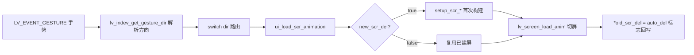
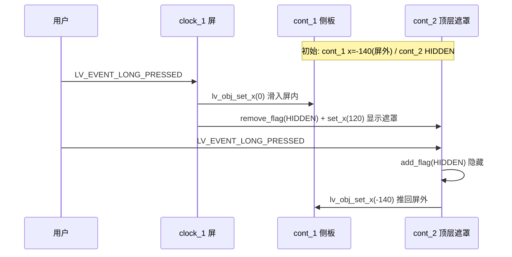
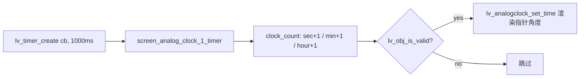

> 来源：Deep-In-Embedded / [中间件/LVGL/智能手表LVGL表盘与UI导航设计思路.md](https://github.com/shuai-yemao/Deep-In-Embedded/blob/5fcab575fc20cf681f3e79e163337211097c898a/%E4%B8%AD%E9%97%B4%E4%BB%B6/LVGL/%E6%99%BA%E8%83%BD%E6%89%8B%E8%A1%A8LVGL%E8%A1%A8%E7%9B%98%E4%B8%8EUI%E5%AF%BC%E8%88%AA%E8%AE%BE%E8%AE%A1%E6%80%9D%E8%B7%AF.md)

# 📖 引言

本笔记以两个 NXP GUI Guider 生成的 LVGL 智能手表工程为研究对象，梳理「表盘设计」与「整个 UI 导航设计思路」两类机制。主体工程为 `D:\zhuomian\lvgl-gui-test\smart`（简称 **D 工程**，含 3 款表盘 + 四方向导航 + List 菜单 + 抽屉浮层），对照工程为 `G:\BaiduNetdiskDownload\嵌入式\立芯嵌入式资料\test`（简称 **G 工程**，含指针式模拟时钟，结构更简单但走时机制完整）。两个工程共享 `gui_guider.h/.c` 框架但屏幕集合完全不同，学习时须严格区分。

# 📝 智能手表 LVGL 表盘与 UI 导航的设计思路

> 一句话定义：它是基于 LVGL `lv_obj_create(NULL)` 屏对象 + 子组件 + 事件回调机制，把多张表盘/状态栏/快捷栏/菜单/功能页组织成一个可手势导航的界面系统；只负责界面显示与跳转路由，不承担硬件采集与下层业务。

## 实际意义

- 没有这套 UI 框架，项目无法在 MCU 有限资源上呈现「多屏 + 手势 + 动画」的穿戴交互；用户将退化到串口命令或单屏死板界面。
- 没有 `lv_timer` 走时机制（G 工程证据），表盘退化为静态取景图案——指针停在初始值 3:20:50，只剩外壳没动态。
- 没有事件回调路由，所有屏对象孤立存在，无法构成「导航骨架」，用户进入任一子屏即卡死（G 工程 `screen_2` 即为典型死屏缺陷）。

## 应用场景

> 以 D 工程证据为准（`events_init.c:117-1035`），有 6 条可定位路径：

| # | 路径分类 | 触发对象 | 手势/事件 | 目标屏 | 合格? |
|---|---|---|---|---|---|
| A | 表盘间横向轮换（环形） | `clock_1/2/3` | 右滑 `LV_DIR_RIGHT` | `clock_2/3/1` | ✓ |
| B | 纵向表盘↔状态栏 | `clock_1/2/3` | **下滑** `LV_DIR_BOTTOM` | `top_lap` | ✓ |
| C | 纵向表盘↔快捷栏 | `clock_1/2/3` | **上滑** `LV_DIR_TOP` | `under_up` | ✓ |
| D | 横向表盘→菜单 | `clock_1/2/3` | 左滑 `LV_DIR_LEFT` | `List_1` | ✓ |
| E | 局部浮层（同屏抽屉） | `clock_1/2/3` | 长按 `LV_EVENT_LONG_PRESSED` | `cont_2/cont_4` | ✓ |
| F | 菜单→功能页 | `List_1_cont_1..9` | 短按 `LV_EVENT_SHORT_CLICKED` | Heart/Map/NFC/QRcode/Systemupdate/Setting | ✓ |

⚠️ **方向直觉反**：上滑出 `under_up`（快捷栏从上出）、下滑出 `top_lap`（状态栏从下出）——与「面板出现方向」命名，非自然方向直觉。这是常见混淆点，见「常见问题」栏。

## 核心逻辑/原理

### 机制 1：手势路由 + 懒加载切屏



证据：`generated/gui_guider.c:23-42`、`generated/events_init.c:117-165`

### 机制 2：抽屉式局部层（同屏位移，不切屏）



证据：`events_init.c:117-127`、`:209-223`；初始位置 `setup_scr_clock_1.c:544-547`

### 机制 3：模拟时钟走时（G 工程）



证据：`G/generated/setup_scr_screen.c:62`、`G/generated/widgets_init.c:56-91`

### 机制 3'：D 工程表盘时间显示（对照）

D 工程无 `lv_timer`、无 `lv_analogclock`；时间数字全部为 `lv_label_set_text` 静态硬编码字符串：

- `clock_1_label_2 = "09"`（`setup_scr_clock_1.c:118`）
- `clock_1_label_9 = "07\n28"`（`:525`）
- `clock_1_label_8 = "AM"`（`:502`）

加载即固定，不走时。要走时需补 `lv_timer_create` + 文本刷新回调（即 G 工程做法）。

## 关键公式/结论

### 切屏参数公式

```c
ui_load_scr_animation(ui, &new_scr, new_scr_del, &old_scr_del,
                     setup_scr, anim_type, time, delay, is_clean, auto_del);
```

| 参数 | 含义 | 改动影响 |
|---|---|---|
| `anim_type` | 切屏动画类型（`OVER_LEFT/TOP/BOTTOM/RIGHT`、`MOVE_*`、`FADE_ON`、`NONE`） | 决定视觉过渡方向 |
| `time` | 动画时长 ms（D 工程常用 200） | 影响流畅度与等待感 |
| `auto_del` | 旧屏动画后是否销毁 | **内存策略开关**：true=用完销毁省内存；false=常驻复用省重建开销 |

证据：`gui_guider.c:35-42`

### 设计取舍结论

- 表盘间互切（clock_1/2/3）用 `auto_del=false`：高频 + UI 复杂 → 常驻换流畅。
- 功能菜单进功能页（List→Heart/Map/...）用 `auto_del=true`：低频 + UI 简单 → 销毁省内存。
- 选择策略 = 「频度 × 复杂度 vs 内存预算」。

### 抽屉 vs 切屏分水岭

| 维度 | 抽屉（cont_1/cont_2） | 切屏（clock_1→clock_2） |
|---|---|---|
| 对象归属 | 同屏子对象 | 平级屏（`lv_obj_create(NULL)`） |
| 走 `lv_scr_load_anim` | 否，只 `lv_obj_set_x`/`HIDDEN` | 是，换活动屏 |
| 生命周期 | 随父屏 | 独立 `*_del` 标志 |

## 实际操作步骤

以验证 D 工程 `clock_1` 四方向导航能力为例：

1. **初始化**：调 `setup_ui(&guider_ui)`（`gui_guider.c:96-103`）
   - `init_scr_del_flag` 把所有 `*_del` 标志置 true
   - `setup_scr_clock_1` 创建并填充 `clock_1` 屏（含 arc/label/img/cont 子对象）
   - `lv_scr_load(ui->clock_1)` 设 `clock_1` 为活动屏（启动屏）
   - `events_init_clock_1` 注册手势/长按/按钮回调

2. **四手势可观察现象**：

```c
/* 来源：generated/events_init.c:128-160 */
case LV_DIR_RIGHT:  ui_load_scr_animation(... clock_2 ... OVER_RIGHT ...);  // 右滑→切换表盘 clock_2
case LV_DIR_TOP:    ui_load_scr_animation(... under_up ... OVER_TOP ...);   // 上滑→快捷栏 under_up
case LV_DIR_BOTTOM: ui_load_scr_animation(... top_lap  ... OVER_BOTTOM ...); // 下滑→状态栏 top_lap
case LV_DIR_LEFT:   ui_load_scr_animation(... List_1  ... OVER_LEFT ...);   // 左滑→功能菜单 List_1
```

3. **长按浮层**（同屏抽屉，非切屏）：
   - 长按 `clock_1`：`cont_1` 从 x=-140 滑到 0，`cont_2` 显示并移到 x=120
   - 再长按 `cont_2`：两者收回原位

4. **失败处理**：若目标屏 `setup_scr_*` 未声明或 `*_del` 标志错乱，切过去是空屏；若目标屏无事件注册（G 工程 `screen_2`），进入即死屏。

## 常见问题

### 问题 1：死屏（有向跳转链断裂）

- **现象**：从 `screen_1` 右滑到 `screen_2` 后无法返回。
- **根因**：`screen_2` 没有任何 `lv_obj_add_event_cb` 注册（G 工程证据 `setup_scr_screen_2.c` 全文 + `events_init.c:92-95` 无 `events_init_screen_2`）。导航图形成 `screen→screen_1→screen_2` 单向无回边。
- **修复**：在 `events_init.c` 补 `events_init_screen_2`，给 `screen_2` 加 `LV_EVENT_GESTURE` + `LV_DIR_LEFT` 分支，调 `ui_load_scr_animation(... &guider_ui.screen_1 ... LV_SCR_LOAD_ANIM_OVER_LEFT ...)` 返回上一屏。
- **验证**：进入 `screen_2` 后左滑能回到 `screen_1`，再能回 `screen`，闭环成立。

### 问题 2：成员名拼写不一致（编译失败）

- **现象**：编译报 `'lv_ui' has no member named 'Systeamupdate'`。
- **根因**：`events_init.c:1082` 调用 `guider_ui.Systeamupdate` 与 `setup_scr_Systeamupdate`，但 `gui_guider.h:188` 结构体成员实为 `Systemupdate`（多了一个 `a`）。Guider 可视化改名后只更新头文件结构体，未回填已生成的 `events_init.c` 老调用点。
- **修复**：用 IDE「重命名符号」全局重构，或手动把 `events_init.c:1082` 两处 `Systeamupdate` 改回 `Systemupdate`。
- **验证**：`npm run validate:plugin` 或 `grep -r "Systeamupdate"` 无残留；编译通过。
- **避免**：改名后跑结构体成员 vs 调用点一致性扫描脚本。

### 问题 3：空回调按钮（功能静默失效）

- **现象**：`clock_1_btn_1/btn_2/btn_3` 按下无任何响应，但 UI 仍可继续操作。
- **根因**：`events_init.c:167-207` 三个按钮回调 `case LV_EVENT_CLICKED: { }` 空实现。
- **为何不如死屏明显**：空回调不破坏主路径，缺陷被正常导航掩盖；用户可能误以为按钮未启用或没按准。
- **修复**：补全回调体内业务逻辑；或在按钮未启用阶段移除 `LV_OBJ_FLAG_CLICKABLE` 使其不响应、不出误导性按压反馈。
- **验证**：按钮按下有预期响应或无误导性按压视觉反馈。

### 问题 4：上下滑方向与直觉相反

- **现象**：用户上滑却出现「下方快捷栏 `under_up`」，下滑出现「上方状态栏 `top_lap`」，与自然方向直觉冲突。
- **根因**：命名按「面板出现方向」而非「手势物理方向」——Guider 工程按穿戴式方屏「下拉出顶栏、上拉出底栏」的物理方向命名回调，与自然语言直觉逆。
- **修复/缓解**：在 README 或注释中显式标注方向语义；或重命名屏对象使方向语义与直觉一致（成本较高）。
- **验证**：用户测试时不再混淆上下滑对应的面板。

## 💬 Q&A

### 🟢 基础

#### Q1：`ui_load_scr_animation` 的输入、输出和最小使用条件是什么？

**答：**

- 输入：`ui`（全局 UI 句柄）、`new_scr`（目标屏指针的指针）、`new_scr_del`（首次构建标志）、`old_scr_del`（旧屏删除标志回写）、`setup_scr`（构建回调）、`anim_type/time/delay`（动画三参数）、`is_clean`、`auto_del`（旧屏是否销毁）。
- 输出（副作用）：触发新屏懒构建（若 `new_scr_del=true` 则调 `setup_scr`）、调 `lv_screen_load_anim` 切屏、回写 `*old_scr_del=auto_del`。
- 最小使用条件：目标屏的 `setup_scr_*` 构建函数必须已声明且可首次填充 `lv_ui` 成员；否则切过去是空屏。

**证据：** `generated/gui_guider.c:23-42`

#### Q2：D 工程 `clock_1` 与 G 工程 `screen` 两种表盘时间展示机制的根本区别？

**答：** D 用 `lv_label` 静态字符串（如 `"09"`/`"07\n28"`），不走时，加载即固定；G 用 `lv_analogclock` + `lv_timer_create(cb,1000,...)` + `clock_count()` 每秒自增并调 `lv_analogclock_set_time`，指针随时间走动。根本区别是「静态文案 vs 定时器驱动动态渲染」。D 工程要变走时数字钟，需补 `lv_timer_create` + 文本刷新回调（即 G 工程做法）。

**证据：** `D/generated/setup_scr_clock_1.c:118/525`、`G/generated/setup_scr_screen.c:62`、`G/generated/widgets_init.c:56-91`

### 🟡 进阶

#### Q3：抽屉（`cont_1/cont_2`）与切屏（`clock_1→clock_2`）的根本区别？

**答：**

- 对象归属：抽屉是同屏子对象（`cont_1/cont_2 ∈ clock_1`），切屏是平级屏（`lv_obj_create(NULL)` 挂空）。
- 是否走 `lv_scr_load_anim`：抽屉**不走**，只 `lv_obj_set_x`/`add_flag(HIDDEN)`，活动屏不变；切屏**必须走** `ui_load_scr_animation→lv_scr_load_anim` 才换活动屏。这是最根本机制分水岭。
- 内存与生命周期：抽屉随父屏创建/销毁；切屏独立 `*_del` 标志位管理懒加载与 `auto_del` 销毁。

**证据：** `events_init.c:117-127/209-223`、`gui_guider.c:23-42`

#### Q4：把表盘间 `auto_del` 从 `false` 改成 `true` 会发生什么？为何设计者选 `false`？

**答：** 旧屏动画结束后被销毁，下次切回要重新调 `setup_scr_*` 重建所有子对象/样式/字体，内存抖动、掉帧、GC 压力上升。设计者选 `false`：三款表盘高频互切且 UI 复杂（clock_1 有几十个 arc/label/img），常驻内存换切换流畅度；功能页 UI 简单低频用 `true` 省内存。策略 = 「频度×复杂度 vs 内存预算」。

**证据：** `gui_guider.c:35-42`、`setup_scr_clock_1.c`（可见 clock_1 复杂度）

### 🔴 困难

#### Q5：把「表盘四方向手势路由」迁移到矩形长屏（手机竖屏），哪些机制可保留，哪些必须重新设计？

**答：**

- 手势四方向：左右滑换界面在长屏仍成立；但「上滑快捷栏/下滑状态栏」在穿戴方屏是垂直翻转语义，与长屏下拉通知中心交互冲突，需重新设计方向语义，不能照搬。
- `screen_index` 记忆回屏：与屏幕形状无关，是纯状态变量，可**原样保留**，迁移成本最低。
- `auto_del` 策略：长屏内存通常更充裕（非手表受限 RAM），可重新评估是否全用 `false` 常驻省重建开销。
- 长按浮层抽屉：长屏不再塞 240×280 小屏侧抽屉，可能改底部抽屉或浮动卡片，位移机制需随尺寸重设。

**关键点：** 迁移机制分层判断——手势交互受屏幕形状强约束需重设计；状态记忆与内存策略与形状无关可保留。

**证据：** `events_init.c:117-165`、`gui_guider.c:23-42`

## 📋 总结

这套智能手表 LVGL UI 是基于 `lv_obj_create(NULL)` 屏对象 + 子组件 + 事件回调机制，把多张表盘/状态栏/快捷栏/菜单/功能页组织成一个可手势导航的界面系统。它解决在 MCU 有限资源上实现多屏 + 手势 + 动画的穿戴交互问题。核心通过三种机制工作：(1) 手势路由 + 懒加载切屏（`ui_load_scr_animation` + `*_del` 标志）；(2) 同屏抽屉式局部层（`lv_obj_set_x`+`LV_OBJ_FLAG_HIDDEN`，不切屏）；(3) 静态文案（D 工程）或定时器驱动动态渲染（G 工程 `lv_timer`+`analogclock`）。主要取舍：表盘互切用 `auto_del=false` 常驻换流畅，功能页用 `true` 省内存；抽屉与切屏分水岭是是否走 `lv_scr_load_anim`；D 工程表盘是静态取景 UI，要走时需补 G 工程那套 `lv_timer`+ 回调机制。

## 📎 参考资料

### 💻 仓库链接

- D 工程主体：`D:\zhuomian\lvgl-gui-test\smart`（NXP GUI Guider 生成，LVGL 智能手表）
- G 工程对照：`G:\BaiduNetdiskDownload\嵌入式\立芯嵌入式资料\test`（含指针式模拟时钟）

### 📄 代码/附件

| 结论 | 支持证据 |
|---|---|
| 切屏懒加载机制 | `generated/gui_guider.c:23-42` |
| 启动屏初始化 | `generated/gui_guider.c:96-103` |
| clock_1 四方向手势路由 | `generated/events_init.c:117-165` |
| clock_1 长按浮层抽屉 | `generated/events_init.c:117-127, 209-223` |
| clock_1 初始屏外 cont_1 | `generated/setup_scr_clock_1.c:544-547` |
| clock_1 静态时间标签 | `generated/setup_scr_clock_1.c:118, 502, 525` |
| clock_1 按钮空回调缺陷 | `generated/events_init.c:167-207` |
| 拼写不一致缺陷 | `generated/events_init.c:1082` vs `generated/gui_guider.h:188` |
| top_lap/under_up 返回路由 | `generated/events_init.c:391-498` |
| List_1 滑动删除/恢复动画 | `generated/events_init.c:500-1035` |
| G 工程指针时钟走时机制 | `G/generated/setup_scr_screen.c:62`、`G/generated/widgets_init.c:56-91` |
| G 工程死屏缺陷 | `G/generated/setup_scr_screen_2.c`、`G/generated/events_init.c:92-95` |

### 🔗 相关笔记

- [[LVGL屏幕对象与生命周期]]
- [[LVGL事件系统]]
- [[LVGL定时器与动画]]
