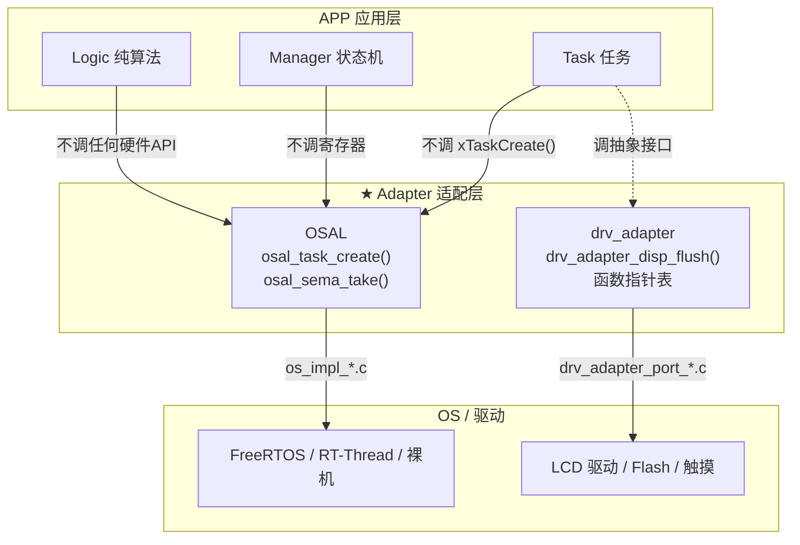

> 来源：Deep-In-Embedded / [开发板/ARM架构/STM32F411CEU6/01_嵌入式项目集成：概念与架构总览.md](https://github.com/shuai-yemao/Deep-In-Embedded/blob/5fcab575fc20cf681f3e79e163337211097c898a/%E5%BC%80%E5%8F%91%E6%9D%BF/ARM%E6%9E%B6%E6%9E%84/STM32F411CEU6/01_%E5%B5%8C%E5%85%A5%E5%BC%8F%E9%A1%B9%E7%9B%AE%E9%9B%86%E6%88%90%EF%BC%9A%E6%A6%82%E5%BF%B5%E4%B8%8E%E6%9E%B6%E6%9E%84%E6%80%BB%E8%A7%88.md)

# 📖 引言

> 项目集成是将独立开发的软硬件模块——MCU 启动代码、外设驱动、RTOS、中间件、应用逻辑——按分层架构组合为完整嵌入式系统的工程过程。

**核心观点**：一个好的集成设计，不是把代码按目录分类，而是让 " 什么会变 " 和 " 什么不变 " 正交分离——换芯片改 BSP 层，换 RTOS 改 OSAL 实现，换业务改 APP 层，互不干扰。

本文是系列笔记的第一篇，建立嵌入式项目集成的整体认知框架。后续三篇分别深入 [[02_嵌入式项目集成：OS层与OSAL设计|OS层]]、[[03_嵌入式项目集成：BSP层与三段式Adapter|BSP层]]、[[04_嵌入式项目集成：APP层与启动流程|APP层]] 的集成设计，并通过 **Adapter 适配层** 串联各层关系。

---

# 📝 嵌入式项目集成：概念与架构总览

## 实际意义

> 没有分层设计，各层会高度耦合。移植到其他平台、使用其他外设或切换 RTOS 时，上下层都需要修改——" 牵一发而动全身 "。分层 + Adapter 把 " 什么会变 " 和 " 什么不变 " 分开，让变更波及面从 " 全工程 " 降为 " 一个文件 "。

| 场景 | 无分层 + Adapter | 有分层 + Adapter |
|------|-----------------|-----------------|
| 换 MCU（STM32F4 → STM32H7） | 全局改写驱动 + 应用代码 | 只改 Platform 层 + Driver 层 |
| 换 RTOS（FreeRTOS → RT-Thread） | 全局替换 RTOS API 调用 | OSAL Impl 目录（1 个目录） |
| 换外设芯片（LCD ST77916 → RM69330） | 改 LVGL Port + UI + 状态管理 | Adapter Porting（1 个文件） |
| 换业务需求 | 波及底层初始化代码 | APP 层（1 个目录） |

---

## 核心逻辑/原理

### 1. 通用五层模型

任何嵌入式项目都可以抽象为以下五层，每层只依赖其下层：

```
┌──────────────────────────────────────────┐
│            APP 应用层                      │  ← 业务逻辑、状态机、UI、任务
│  main / Manager / Task / Logic / UI       │
├──────────────────────────────────────────┤
│        Adapter 适配层（★ 关键解耦层）       │  ← 串联各层的"胶水"
│  OSAL（OS抽象）/ drv_adapter（设备抽象）     │
├──────────────────────────────────────────┤
│         Middleware 中间件                  │
│  LVGL / BLE 协议栈 / FATFS / MQTT 等       │
├──────────────────────────────────────────┤
│         Driver 外设驱动层                   │
│  GPIO / I2C / SPI / UART / QSPI / LCD     │
├──────────────────────────────────────────┤
│         Platform 芯片平台层                │
│  startup.S / 系统时钟 / PLL / 中断向量     │
└──────────────────────────────────────────┘
```

### 2. Adapter 层：连接各层的 " 胶水 "



**Adapter 的核心机制**：上层代码永远只调 Adapter 定义的抽象接口，不直接调底层实现。换底层时，只改 Adapter 的绑定代码，上层完全不动。

详细设计见：

- OS 抽象 → [[02_嵌入式项目集成：OS层与OSAL设计]]
- 设备抽象（三段式 Adapter）→ [[03_嵌入式项目集成：BSP层与三段式Adapter]]

### 3. 依赖规则（铁律）

| 规则 | 含义 | 违反后果 |
|------|------|---------|
| **单向依赖** | 上层可以调下层，下层不能调上层 | 循环依赖 → 编译错误 / 耦合死结 |
| **横向隔离** | 同层模块之间通过接口通信，不直接耦合 | 改一个模块牵连同层其他模块 |
| **跨层禁止** | APP 不能跳过 Adapter 直接调 Driver 或 OS | 换 RTOS/芯片时大面积改动 |
| **配置只读** | 所有层读 `custom_config.h`，但它不读任何层 | 配置回路 → 修改时连锁反应 |

### 4. 变更影响范围

| 变更场景 | 不改的层 | 只改的层/文件 |
|---------|---------|-------------|
| 换 MCU（STM32F4 → STM32H7） | APP、OS、Middleware | Platform + Driver |
| 换 RTOS（FreeRTOS → RT-Thread） | APP、BSP、Middleware | OSAL Impl（1 个目录） |
| 换外设芯片（ST77916 → RM69330） | APP、OS、Middleware | Adapter Porting（1 个文件） |
| 换业务需求 | Platform、OS、Driver | APP（1 个目录） |

---

## 关键结论

### 集成设计中影响最大的参数

| 参数 | 默认值 | 来源 | 设错的后果 | 难排查等级 |
|------|--------|------|-----------|-----------|
| `SYSTEM_CLOCK` | 最高主频 | 芯片 Datasheet | 全局时序错乱（UART 乱码/断连） | 🟡 容易 |
| `CFG_MAX_CONNECTIONS` | 与 RAM 相关 | 协议栈规格 | 超限被拒绝（有错误码返回） | 🟡 容易 |
| `DRV_TIMEOUT` | 20000ms | 外设规格 | 超时提前触发（有回调错误码） | 🟡 容易 |
| `NVDS_SIZE / NVM_SIZE` | 与绑定数相关 | 存储规划 | 配对/配置信息静默覆盖（无错误码） | 🔴 最难 |

> **最难排查的 bug**：非易失存储（NVM/NVDS）空间设太小 → 绑定信息被覆盖 → 功能静默失败。协议栈不会报 " 存储满了 "，只会报 " 加密失败 " 或 " 配置丢失 "。

### 集成顺序的选择

嵌入式与纯软件工程最大的区别：**硬件依赖导致 " 先集成跑通，后做单元测试 " 是务实选择**。

```
集成优先策略（嵌入式常见）：
① 系统集成跑通高负载路径（多外设并发、中断嵌套）
   ↓
② 回头补单元测试覆盖边界场景（超时、错误注入、临界条件）
   ↓
③ 交叉验证（修了单元测试的bug，回系统重测）

TDD 规范策略（纯软件/有模拟器时）：
① 单元测试 → ② 集成测试 → ③ 系统测试
```

**注意**：复杂环境（系统集成）通过，**不代表**简单环境（单元测试）也一定通过。反之亦然。实际项目应**两轮都做**，交叉验证。

---

## 配置中心模式

### custom_config.h —— 整个项目的控制面板

```
所有层的 .c/.h 文件
    ↓ #include "custom_config.h"
custom_config.h （属于项目，不 #include 任何 SDK 文件）
    ↑ 被单向读取，不依赖任何其他模块
```

```c
// config/custom_config.h
#ifndef __CUSTOM_CONFIG_H__
#define __CUSTOM_CONFIG_H__

#define SOC_GR5526                      // 芯片型号
#define APP_LOG_ENABLE          1       // 日志开关
#define SYSTEM_CLOCK            0       // 时钟频率选项
#define SYSTEM_STACK_SIZE       0x3000  // 系统栈
#define DISP_HOR_RES            360     // 屏幕宽度
#define ENV_USE_FREERTOS        1       // 0=裸机 1=FreeRTOS 2=RT-Thread

#endif
```

### SDK 中的默认值兜底

```c
// SDK 驱动文件中
#include "custom_config.h"
#ifndef DISP_HOR_RES
#define DISP_HOR_RES   240     // 项目没设就用保守默认值
#endif
```

| 方面 | 好处 | 代价 |
|------|------|------|
| 移植性 | 新项目只改 `custom_config.h` 一个文件 | 各层被 " 污染 " 同一个头文件（宏命名冲突风险） |
| 编译期安全 | `#ifndef` 兜底确保编译不中断 | 忘记配置时静默用默认值，排查困难 |

---

## 控制反转（`__weak` 函数覆盖）

ARM Compiler 和 GCC 都支持 `__weak`：**如果一个符号同时有弱定义和强定义，链接器选择强定义**。

```c
// SDK 层（不修改）
__weak void app_key_evt_handler(uint8_t key_id, type_t type) { /* 空 */ }

// 项目层（覆盖，注入行为）
void app_key_evt_handler(uint8_t key_id, type_t type) {
    if (key_id == 0 && type == SINGLE_CLICK)
        notify_gui_refresh();
}
```

| 特性 | `__weak` 覆盖 | 函数指针注册 |
|------|-------------|-------------|
| 绑定时机 | 编译/链接期 | 运行期 |
| 运行时开销 | 0 | 多一次指针解引用 |
| 多实例 | ❌ | ✅ |
| 适用场景 | 系统回调（按键、中断） | 多实例外设（多块屏幕） |

---

# 💬 Q&A

## 🟢 基础

### Q1: 为什么需要五层而不是三层（BSP/HAL/APP）？

**A**: 三层模型把 " 硬件相关的所有代码 " 混在 BSP 里——RTOS、中间件 Port、外设驱动、板级初始化都在一层。换 RTOS 就不得不动 BSP。五层模型把正交变化维度分开：换 RTOS → OS 层、换外设 → Adapter Porting、换业务 → APP。

### Q2: Adapter 层到底是什么？为什么要单独一层？

**A**: Adapter 是一组**抽象接口 + 绑定代码**，让上层不依赖下层具体实现。APP 层看到的永远是 `drv_adapter_disp_flush()`，底下是 ST77916 还是 RM69330——APP 不关心。

## 🟡 进阶

### Q3: " 先系统集成跑通，后做单元测试 " 是嵌入式常见顺序，和 TDD 矛盾吗？

**A**: 不矛盾。根本原因是硬件依赖性——硬件到手晚、原理图可能有 bug、项目需要先验证可行性。折中方案：先跑通系统验证硬件可行，回头补单元测试覆盖边界，两轮交叉验证。

## 🔴 困难

### Q4: Adapter 层增加了一层间接调用，值得吗？

**A**: 以显示驱动为例——Adapter ~210 行代码，换 LCD 时只改 1 个文件。无 Adapter 时换 LCD 要改 5-10 个文件。每个函数调用多 2-3 个 CPU 周期。**10 倍的项目灵活性，代价是 3 个 CPU 周期**。

---

# 📋 总结

**是什么** — 嵌入式项目集成是将 Platform → Driver → Adapter → Middleware → APP 五层通过编译期多态、函数指针注册和回调覆盖组合为完整系统的工程过程。

**为什么** — 让变更的影响范围从 " 全工程 " 缩小到 " 一个文件/一个目录 "。

**怎么做** — [[02_嵌入式项目集成：OS层与OSAL设计|OSAL]] 隔离 RTOS、[[03_嵌入式项目集成：BSP层与三段式Adapter|三段式 Adapter]] 隔离外设、`custom_config.h` 集中配置、`__weak` 控制反转。

---

# 📎 参考资料

## 🔗 系列笔记

- [[02_嵌入式项目集成：OS层与OSAL设计]] — OS 抽象层的设计与实现
- [[03_嵌入式项目集成：BSP层与三段式Adapter]] — BSP 层与设备解耦模式
- [[04_嵌入式项目集成：APP层与启动流程]] — APP 层架构与启动链路
- [[项目代码的单元测试、集成测试以及系统测试]] — 配套测试策略

## 🔗 外部文档

- [嵌入式项目集成介绍](https://twd6onxsxva.feishu.cn/docx/TnHTdK917o7jknxuEskcV2JlnVg)
- [嵌入式项目集成_集成顺序](https://twd6onxsxva.feishu.cn/docx/Kcvydeb9MoVJxhxQkRFcbPWSn52)
