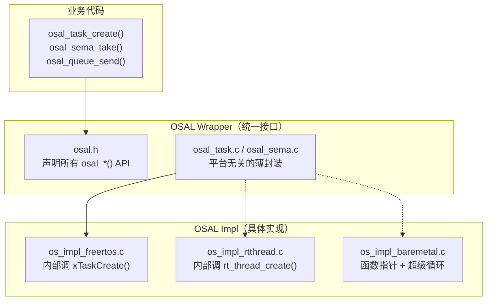

> 来源：Deep-In-Embedded / [开发板/ARM架构/STM32F411CEU6/02_嵌入式项目集成：OS层与OSAL设计.md](https://github.com/shuai-yemao/Deep-In-Embedded/blob/5fcab575fc20cf681f3e79e163337211097c898a/%E5%BC%80%E5%8F%91%E6%9D%BF/ARM%E6%9E%B6%E6%9E%84/STM32F411CEU6/02_%E5%B5%8C%E5%85%A5%E5%BC%8F%E9%A1%B9%E7%9B%AE%E9%9B%86%E6%88%90%EF%BC%9AOS%E5%B1%82%E4%B8%8EOSAL%E8%AE%BE%E8%AE%A1.md)

# 📖 引言

> OS 层负责提供多任务调度、信号量同步、队列通信等能力，但业务代码不应该知道底层用的是 FreeRTOS 还是 RT-Thread。

**核心问题**：APP 层的业务代码如果直接调 `xTaskCreate()`、`xSemaphoreTake()`，当需要切换到 RT-Thread 或裸机时，**所有涉及 RTOS 调用的文件都要改**。

**解决方案**：OSAL（Operating System Abstraction Layer）——定义一套统一的 API，业务代码只调这套 API。底层换 RTOS 时，只换 OSAL 的具体实现（Impl），业务代码一行不动。

前置阅读：[[01_嵌入式项目集成：概念与架构总览|概念与架构总览]]。

---

# 📝 OS 层的集成设计

## 实际意义

### 不设计 OSAL 的代价

```c
// ❌ 业务代码直接调 FreeRTOS API
void sensor_task(void *arg) {
    while (1) {
        xSemaphoreTake(s_sem, portMAX_DELAY);    // ← FreeRTOS 专用
        read_sensor();
        xQueueSend(s_queue, &data, 0);           // ← FreeRTOS 专用
        vTaskDelay(pdMS_TO_TICKS(1000));          // ← FreeRTOS 专用
    }
}
```

切换到 RT-Thread 或裸机时，上面每一行都要改。在 20+ 任务的复杂项目中，这意味着**数百个文件**的修改。

### OSAL 的意义

```c
// ✅ 业务代码调 OSAL 抽象接口
void sensor_task(void *arg) {
    while (1) {
        osal_sema_take(s_sem, OSAL_MAX_DELAY);   // ← 平台无关
        read_sensor();
        osal_queue_send(s_queue, &data, 0);       // ← 平台无关
        osal_task_delay(1000);                    // ← 平台无关
    }
}
```

切换到 RT-Thread 时：把 `os_impl_freertos.c` 换成 `os_impl_rtthread.c`。**业务代码一行不动**。

---

## 核心逻辑/原理

### 1. OSAL 的两种实现方式

#### 方式 A：编译期多态（推荐，无运行时开销）



**工程结构**：

```
os_adapter/
├── inc/
│   └── osal.h                  ← 对外头文件（业务 include 这个）
├── shared/src/                 ← 平台无关的 wrapper 实现
│   ├── osal_task.c             ← osal_task_create() / delete() / start()
│   ├── osal_sema.c             ← osal_sema_binary_create() / take() / give()
│   ├── osal_mutex.c            ← osal_mutex_create() / lock() / unlock()
│   ├── osal_queue.c            ← osal_queue_create() / send() / receive()
│   ├── osal_timer.c            ← osal_timer_create() / start() / stop()
│   └── osal_heap.c             ← osal_heap_malloc() / free()
└── FreeRTOS/src/               ← ★ 具体 RTOS 的实现（换 RTOS 换这个目录）
    ├── os_impl_task.c          ← 内部调 xTaskCreate() / vTaskDelete()
    ├── os_impl_sema.c          ← 内部调 xSemaphoreCreateBinary() / xSemaphoreTake()
    ├── os_impl_mutex.c         ← 内部调 xSemaphoreCreateMutex()
    ├── os_impl_queue.c         ← 内部调 xQueueCreate() / xQueueSend()
    └── os_impl_heap.c          ← 内部调 pvPortMalloc() / vPortFree()
```

#### 方式 B：函数指针表（运行期多态）

```c
typedef struct {
    void (*task_create)(task_func_t, const char*, uint32_t, void*, uint32_t);
    void (*sema_take)(sem_handle_t, uint32_t);
    void (*sema_give)(sem_handle_t);
} osal_ops_t;

static const osal_ops_t osal_freertos = { xTaskCreate, xSemaphoreTake, ... };
static const osal_ops_t osal_baremetal = { bm_task_create, bm_sema_take, ... };
```

**选择建议**：一般项目用**编译期多态**就够了。仅需运行期动态切换 RTOS 后端时才用函数指针表。

### 2. OSAL 的最小 API 集

不需要抽象所有 RTOS 功能，只抽象业务代码真正用的 15 个 API：

| API | 用途 | 对应 FreeRTOS |
|-----|------|--------------|
| `osal_task_create()` | 创建任务 | `xTaskCreate()` |
| `osal_task_delete()` | 删除任务 | `vTaskDelete()` |
| `osal_task_delay()` | 延迟 | `vTaskDelay()` |
| `osal_task_start()` | 启动调度器 | `vTaskStartScheduler()` |
| `osal_sema_binary_create()` | 创建二值信号量 | `xSemaphoreCreateBinary()` |
| `osal_sema_take()` | 等待信号量 | `xSemaphoreTake()` |
| `osal_sema_give()` | 释放信号量 | `xSemaphoreGive()` |
| `osal_mutex_create()` | 创建互斥量 | `xSemaphoreCreateMutex()` |
| `osal_mutex_lock()` | 加锁 | `xSemaphoreTake()` |
| `osal_mutex_unlock()` | 解锁 | `xSemaphoreGive()` |
| `osal_queue_create()` | 创建队列 | `xQueueCreate()` |
| `osal_queue_send()` | 发送消息 | `xQueueSend()` |
| `osal_queue_receive()` | 接收消息 | `xQueueReceive()` |
| `osal_heap_malloc()` | 动态分配 | `pvPortMalloc()` |
| `osal_heap_free()` | 释放 | `vPortFree()` |

### 3. 裸机（无 RTOS）的 OSAL 实现

裸机也要写 OSAL——为后续迁移到 RTOS 预留接口：

```c
// os_impl_baremetal.c —— 裸机实现
// 信号量 → 全局标志位
static int g_sema[MAX_SEMAS];

void osal_sema_binary_create(sem_handle_t *sem) {
    *sem = sema_alloc();
    g_sema[*sem] = 1;  // 初始可用
}

void osal_sema_take(sem_handle_t sem, uint32_t timeout) {
    while (g_sema[sem] == 0) {
        // 简单轮询（实际项目应加超时和看门狗喂狗）
    }
    g_sema[sem] = 0;
}

void osal_sema_give(sem_handle_t sem) {
    g_sema[sem] = 1;
}

// 任务 → 函数指针 + 超级循环调度
static task_func_t task_table[MAX_TASKS];
static uint32_t task_count = 0;

void osal_task_create(const char *name, task_func_t func,
                      uint32_t stack, void *param, uint32_t prio) {
    task_table[task_count++] = func;  // 注册到任务表
}

void osal_task_start(void) {
    while (1) {
        for (uint32_t i = 0; i < task_count; i++)
            task_table[i](NULL);  // 轮询调度
    }
}
```

**成果**：从裸机迁移到 RTOS 时，业务代码一行不改。

---

## Adapter 连接关系

```
                    ┌─────────────────────┐
                    │    APP 层 (task/)    │  ← [[04_嵌入式项目集成：APP层与启动流程]]
                    │  只调 osal_*() API   │
                    └──────────┬──────────┘
                               │ 抽象接口
                    ┌──────────▼──────────┐
                    │     OSAL Wrapper     │  ← 本文：OS层设计
                    │  osal.h + shared/    │
                    └──────────┬──────────┘
                               │ 编译期绑定
              ┌────────────────┼────────────────┐
              │                │                │
    ┌─────────▼──────┐ ┌──────▼──────┐ ┌───────▼────────┐
    │ os_impl_       │ │ os_impl_    │ │ os_impl_       │
    │ freertos.c     │ │ rtthread.c  │ │ baremetal.c    │
    └────────┬───────┘ └──────┬──────┘ └───────┬────────┘
             │                │                │
    ┌────────▼──────┐ ┌──────▼──────┐ ┌───────▼────────┐
    │ FreeRTOS      │ │ RT-Thread   │ │ 裸机超级循环    │
    └───────────────┘ └─────────────┘ └────────────────┘
```

**OSAL 是 APP 层和 RTOS 之间的 Adapter**：向上提供统一的 `osal_*()` 接口给 [[04_嵌入式项目集成：APP层与启动流程|APP 层]] 的任务代码使用，向下通过 `os_impl_*.c` 编译期绑定到具体 RTOS。

---

## 关键结论

### OSAL 实现最佳实践

1. **不要抽象所有 RTOS 功能**——只抽象业务真正用的约 15 个 API
2. **用编译期多态**——除非需要运行期切换
3. **裸机也要写 OSAL**——为后续搬 RTOS 留接口
4. **不要暴露 RTOS 原生类型**——用 `typedef void * sem_handle_t`

---

## 实际操作步骤

### 集成 OSAL 和 RTOS（验证 OS 抽象层）

```
① 创建 os_adapter/ 目录
② 编写 osal.h（声明需要的 API）
③ 编写 shared/src/ 下的 wrapper 文件
④ 编写 FreeRTOS/src/ 下的 impl 文件
⑤ main.c 中创建任务、启动调度器
```

```c
// main.c —— 集成 RTOS
#include "osal.h"
#include "board_init.h"

static void led_task(void *arg) {
    while (1) {
        GPIO_Toggle(LED_PIN);
        osal_task_delay(500);           // ← 不调 vTaskDelay()
    }
}

int main(void) {
    board_init();
    osal_task_create("led", led_task, 256, NULL, 1);
    osal_task_start();                  // ← 不调 vTaskStartScheduler()
    for (;;);
}
```

**验证标准**：LED 以 1Hz 闪烁（通过 RTOS 任务），UART 输出 "Starting RTOS..."。

---

## 常见问题

### Q1：裸机也要写 OSAL 吗？

建议写。裸机实现很轻量（约 200 行），但意味着后续搬 FreeRTOS 时业务代码不动。而且裸机 OSAL 让任务代码从一开始就采用 " 任务 + 信号量 + 队列 " 的结构。

### Q2：OSAL 之外还需要调 RTOS 特有功能怎么办？

三种策略（按优先级）：

1. 先用现有 OSAL API 组合实现
2. 给 OSAL 加新 API
3. 直接调原生 API（加注释标记为技术债）

---

## 案例：GR5526 的 OSAL 实现

GR5526 SDK 的 OSAL 位于 `components/graphics/lvgl_port/os_adapter/`：

```
os_adapter/
├── inc/                          ← 对外头文件路径
├── shared/src/                   ← Wrapper 实现
│   ├── osal_task.c               ← osal_task_create() / start() / delete()
│   ├── osal_sema.c               ← osal_sema_binary_create() / take() / give()
│   └── osal_queue.c              ← osal_queue_create() / send() / receive()
└── FreeRTOS/src/                 ← Impl（换 RTOS 换这个目录）
    ├── os_impl_task.c            ← 内部: xTaskCreate() / vTaskDelete()
    ├── os_impl_sema.c            ← 内部: xSemaphoreCreateBinary() / take() / give()
    └── os_impl_queue.c           ← 内部: xQueueCreate() / send() / receive()
```

业务代码示例（来自 `lv_user_task.c`）：

```c
// 创建任务
osal_task_create("task_gui", app_gui_render_task, STACK_SIZE, PRIO, &handle);

// 信号量——事件驱动渲染
osal_sema_take(s_gui_refresh_sem, delayTime);  // 阻塞等待刷新
osal_sema_give(s_sleep_mgnt_sem);              // 唤醒睡眠管理

// 消息队列——按键事件
osal_queue_send(s_gui_evt_queue, &evt, OSAL_MAX_DELAY);
osal_queue_receive(s_gui_evt_queue, &evt, OSAL_MAX_DELAY);
```

---

# 💬 Q&A

## 🟢 基础

### Q1: Wrapper 和 Impl 之间如何通信？

**A**: Wrapper 负责参数校验和日志，然后转发给 Impl。Impl 调 RTOS 原生 API。绑定是**编译期**的——通过源文件级别的选择（链接时决定用哪个 `os_impl_*.c`）。

## 🟡 进阶

### Q2: 裸机 OSAL 的信号量实现用 `while` 轮询——不会卡死吗？

**A**: 会。裸机 OSAL 的 `osal_sema_take()` 是阻塞轮询——CPU 死在这个 while 里。这是裸机超级循环的局限。迁移到 RTOS 后，`osal_sema_take()` 变成真正的阻塞——CPU 可以跑其他任务。

## 🔴 困难

### Q3: 如果项目同时需要 FreeRTOS 和裸机两个版本（如 Bootloader 用裸机，App 用 FreeRTOS），怎么组织？

**A**: 两个 `os_impl` 目录：`os_adapter/baremetal/src/` 和 `os_adapter/FreeRTOS/src/`。两个工程分别 include 不同的 `os_impl` 源文件。OSAL Wrapper 的 `osal.h` 和 `shared/src/` 共用不修改。

---

# 📋 总结

**是什么** — OSAL 是一套编译期多态的 OS 抽象层：Wrapper 定义统一 API（`osal_*()`），Impl 绑定具体 RTOS（`os_impl_*.c`）。

**为什么** — 让业务代码不依赖任何 RTOS 原生 API。换 RTOS 时改 Impl 目录，业务代码不动。

**怎么做** — `osal.h` 声明 15 个核心 API → `shared/src/` 做薄封装 → `FreeRTOS/src/` 调原生 API。裸机也写 OSAL（标志位 + 超级循环）。

---

# 📎 参考资料

## 🔗 系列笔记

- [[01_嵌入式项目集成：概念与架构总览]] — 前置：整体框架认知
- [[03_嵌入式项目集成：BSP层与三段式Adapter]] — BSP 层与设备解耦
- [[04_嵌入式项目集成：APP层与启动流程]] — APP 层如何使用 OSAL

## 📄 代码参考（GR5526 SDK）

| 文件 | 路径 |
|------|------|
| osal.h | `components/graphics/lvgl_port/os_adapter/inc/` |
| osal_task/sema/queue.c | `components/graphics/lvgl_port/os_adapter/shared/src/` |
| os_impl_task/sema/queue.c | `components/graphics/lvgl_port/os_adapter/FreeRTOS/src/` |
