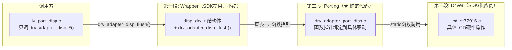

> 来源：Deep-In-Embedded / [开发板/ARM架构/STM32F411CEU6/03_嵌入式项目集成：BSP层与三段式Adapter.md](https://github.com/shuai-yemao/Deep-In-Embedded/blob/5fcab575fc20cf681f3e79e163337211097c898a/%E5%BC%80%E5%8F%91%E6%9D%BF/ARM%E6%9E%B6%E6%9E%84/STM32F411CEU6/03_%E5%B5%8C%E5%85%A5%E5%BC%8F%E9%A1%B9%E7%9B%AE%E9%9B%86%E6%88%90%EF%BC%9ABSP%E5%B1%82%E4%B8%8E%E4%B8%89%E6%AE%B5%E5%BC%8FAdapter.md)

# 📖 引言

> BSP（Board Support Package）层是**芯片平台和项目之间的桥梁**——它决定了 " 这块板子上的硬件怎么初始化 " 和 " 上层代码如何访问硬件 "。

**核心问题**：如果每个外设（LCD、Flash、触摸、传感器）都直接用芯片厂商的 HAL API 操作，换一个外设芯片就要改所有调用它的代码。更糟的是——换 MCU 时，所有 HAL API 的函数名都变了。

**解决方案**：BSP 层用**三段式 Adapter** 模式——把 " 接口定义 "、" 项目绑定 "、" 具体驱动 " 分到三个独立的段，每一段只做一件事。换外设时只改中间那段（Porting），其他代码完全不动。

前置阅读：[[01_嵌入式项目集成：概念与架构总览|概念与架构总览]]、[[02_嵌入式项目集成：OS层与OSAL设计|OS层与OSAL设计]]。

---

# 📝 BSP 层的集成设计

## 实际意义

### 没有三段式 Adapter 的工程

```c
// ❌ lv_port_disp.c —— LVGL 和 LCD 直接耦合
#include "lcd_st77916.h"

void disp_flush(lv_disp_drv_t *drv, const lv_area_t *area, lv_color_t *color) {
    lcd_st77916_set_window(area->x1, area->y1, area->x2, area->y2);  // ← 写死 ST77916
    lcd_st77916_push(color, w * h * 2);                                // ← 写死 ST77916
    lv_disp_flush_ready(drv);
}
```

换 LCD IC 时，**`lv_port_disp.c`、UI 渲染模块、状态管理代码**都要改——每个地方都可能直接调了 `lcd_st77916_*`。

### 有三段式 Adapter 的工程

```c
// ✅ lv_port_disp.c —— 只调抽象接口
void disp_flush(lv_disp_drv_t *drv, const lv_area_t *area, lv_color_t *color) {
    drv_adapter_disp_set_show_area(area->x1, area->y1, area->x2, area->y2);
    drv_adapter_disp_flush(color, format, w, h);
    lv_disp_flush_ready(drv);
}
```

换 LCD IC 时，**只改 `drv_adapter_port_disp.c` 一个文件**。

---

## 核心逻辑/原理

### 1. BSP 层的文件结构

```
platform/                     ← 板级支持
├── board_init.c/h            ← 板级初始化（芯片厂商提供）
└── user_periph_setup.c/h     ← ★ 项目的外设初始化编排

driver/                       ← 外设驱动 + Adapter 端口绑定
├── drv_adapter_port_disp.c    ← [Porting] 屏幕绑定
├── drv_adapter_port_flash.c   ← [Porting] Flash绑定
├── drv_adapter_port_touch.c   ← [Porting] 触摸绑定
├── lcd_driver.c/h             ← [Driver] 具体 LCD 驱动
└── sensor_driver.c/h          ← [Driver] 具体传感器驱动

config/
└── custom_config.h            ← 配置中心
```

### 2. 板级初始化

```c
void board_init(void) {
    SystemClock_Config();                // 时钟 + PLL
    GPIO_PinMux(GPIOA, 0, GPIO_MODE_AF_PP);   // 引脚复用
    __HAL_RCC_USART1_CLK_ENABLE();       // 外设时钟使能
    NVIC_SetPriorityGrouping(4);         // 中断优先级
}
```

### 3. 项目外设初始化编排（user_periph_setup.c）

**BSP 层的入口文件**——不写具体驱动代码，只编排初始化顺序：

```c
#include "board_init.h"
#include "drv_adapter_port.h"

void app_periph_init(void) {
    board_init();                        // ① 板级基础初始化
    drv_adapter_disp_register();        // ② 注册屏幕Adapter
    drv_adapter_norflash_register();    // ③ 注册Flash Adapter
    drv_adapter_touchpad_register();    // ④ 注册触摸Adapter
    pwr_mgmt_mode_set(SLEEP_MODE);      // ⑤ 最后设低功耗
}
```

> **为什么低功耗放最后？** 先设省电再初始化外设 → 寄存器的值写入了，但时钟已关闭 → " 静默故障 "。

### 4. 核心设计模式：三段式 Adapter 解耦



#### 第一段：Wrapper（抽象接口定义）

```c
// drv_adapter_display.h —— Wrapper，SDK 维护
typedef struct _disp_drv_t {
    void (* init)(struct _disp_drv_t *dev);
    void (* flush)(struct _disp_drv_t *dev, void *buf, uint32_t fmt, uint16_t w, uint16_t h);
    void (* display_on)(struct _disp_drv_t *dev, bool on);
    void (* sleep)(struct _disp_drv_t *dev);
    void (* wakeup)(struct _disp_drv_t *dev);
} disp_drv_t;

// 统一调用接口（内部查表 → 调函数指针）
bool drv_adapter_disp_register(uint32_t idx, disp_drv_t *dev);
void drv_adapter_disp_flush(void *buf, uint32_t format, uint16_t w, uint16_t h);
```

#### 第二段：Porting（★ 你的代码——位于项目目录下）

```c
// Src/driver/drv_adapter_port_disp.c
#include "drv_adapter_display.h"
#include "lcd_st77916.h"

static void _init(disp_drv_t *dev) {
    lcd_st77916_init(360, 360);      // ← ★ 换 LCD 只改这里
}
static void _flush(disp_drv_t *dev, void *buf, uint32_t fmt, uint16_t w, uint16_t h) {
    lcd_st77916_flush(buf, fmt, w, h);
}

void drv_adapter_disp_register(void) {
    disp_drv_t dev = { .init = _init, .flush = _flush };
    drv_adapter_disp_reg(0, &dev);   // 注册到全局设备表
}
```

#### 第三段：Driver（具体硬件驱动）

```c
// lcd_st77916.c —— 具体 LCD 寄存器操作
void lcd_st77916_init(uint16_t w, uint16_t h) { /* 写初始化序列 */ }
void lcd_st77916_flush(void *buf, uint32_t fmt, uint16_t w, uint16_t h) { /* QSPI DMA */ }
```

### 5. 三段式在不同外设上的复用

| 外设 | Wrapper | Porting | Driver |
|------|---------|---------|--------|
| 屏幕 | `disp_drv_t` | `drv_adapter_port_disp.c` | `lcd_st77916.c` |
| Flash | `norf_drv_t` | `drv_adapter_port_norflash.c` | `qspi_norflash.c` |
| 触摸 | `touchpad_drv_t` | `drv_adapter_port_touchpad.c` | `tp_cst816d.c` |
| 传感器 | `sensor_drv_t` | `drv_adapter_port_sensor.c` | `aht21_driver.c` |

---

## Adapter 连接关系

```
                    ┌──────────────────────────┐
                    │  Middleware / APP 层       │  ← [[04_嵌入式项目集成：APP层与启动流程]]
                    │  只调 drv_adapter_disp_*() │
                    └──────────┬───────────────┘
                               │ 抽象接口
                    ┌──────────▼───────────────┐
                    │   Adapter Wrapper         │  ← SDK 提供，不动
                    │   disp_drv_t 函数指针表    │
                    └──────────┬───────────────┘
                               │ 函数指针注册
                    ┌──────────▼───────────────┐
                    │   Adapter Porting         │  ← ★ 你的代码
                    │   drv_adapter_port_disp.c │     换外设只改这个
                    └──────────┬───────────────┘
                               │ static 函数调用
                    ┌──────────▼───────────────┐
                    │   Driver                  │  ← SDK/供应商提供
                    │   lcd_st77916.c           │
                    └──────────────────────────┘
```

**BSP 的 Adapter 是中间件/APP 层和外设驱动之间的 " 双向胶水 "**：向上给 [[04_嵌入式项目集成：APP层与启动流程|APP 层]] 和 LVGL Port 提供抽象接口，向下通过函数指针绑定到具体驱动。

---

## 实际操作步骤

### 集成外设驱动（以 I2C 传感器为例）

```
① 编写具体驱动：sensor_aht21.c（第三段）
② 定义抽象接口：sensor_drv_t 结构体（第一段）
③ 创建 Adapter 绑定：drv_adapter_port_sensor.c（第二段）
④ 在 user_periph_setup.c 中调注册
```

```c
// driver/aht21_driver.c —— 第三段
bool aht21_init(void) {
    return i2c_write(AHT21_ADDR, init_cmd, sizeof(init_cmd)) == OK;
}
bool aht21_read(float *temp, float *humi) {
    uint8_t raw[7];
    if (i2c_read(AHT21_ADDR, raw, 7) != OK) return false;
    *temp = ((raw[3] << 12) | (raw[4] << 4) | (raw[5] >> 4)) * 200.0 / 1048576 - 50;
    *humi = ((raw[1] << 12) | (raw[2] << 4) | (raw[3] >> 4)) * 100.0 / 1048576;
    return true;
}

// driver/drv_adapter_port_sensor.c —— 第二段
#include "drv_adapter_sensor.h"
#include "aht21_driver.h"

static bool _init(void)    { return aht21_init(); }
static bool _read(void *d) { return aht21_read(&d->temp, &d->humi); }

void drv_adapter_sensor_register(void) {
    sensor_drv_t drv = { .init = _init, .read = _read };
    drv_adapter_sensor_reg(0, &drv);
}
```

**验证标准**：UART 日志输出温湿度值。

---

## 常见问题

### Q1：三段式 Adapter 代码量增加了，值得吗？

```
Wrapper：~100 行，SDK 维护，项目不碰
Porting：~110 行，项目维护，首次写一次
Driver：~500 行，SDK/供应商维护
```

换 LCD：只改 1 个文件（Porting）vs 无 Adapter 时要改 5-10 个文件。

### Q2：SDK 不提供 Wrapper——怎么办？

**自己写 Wrapper**。~100 行代码，写一次所有项目复用。

### Q3：我的项目只有一块屏幕，还要用函数指针表吗？

用。即使单实例，函数指针表仍然提供**编译期变更隔离**——换驱动时不需要改调用方代码。

---

## 案例：GR5526 的 BSP 层

```c
// Src/platform/user_periph_setup.c —— 9 行核心逻辑
void app_periph_init(void) {
    board_init();                        // SDK板级（GPIO/时钟）
    drv_adapter_disp_register();        // 注册屏幕(ST77916)
    drv_adapter_norflash_register();    // 注册Flash(XTX)
    drv_adapter_touchpad_register();    // 注册触摸(CST816D)
    pwr_mgmt_mode_set(PMR_MGMT_SLEEP_MODE);
}
```

Keil Group 对应三段式：

| Keil Group | 段 | 文件 |
|------------|----|------|
| `drv_adapter.wrapper` | 第一段 | `drv_adapter_display.h` + `norf` + `touchpad` |
| `drv_adapter.porting` | 第二段 | `Src/driver/drv_adapter_port_*.c` |
| `drv_adapter.driver` | 第三段 | `graphics_dc_st77916_*.c` 等 |

调用链：`LVGL → drv_adapter_disp_flush() → (查表) → lcd_st77916_flush() → QSPI DMA → LCD`

---

# 💬 Q&A

## 🟢 基础

### Q1: 三段式 Adapter 和传统单层 HAL 封装有什么区别？

**A**: 传统 HAL：`APP → HAL_I2C_Init() → 寄存器`，换芯片时函数签名变了 → APP 要改。三段式 Adapter 中间有**函数指针表**把接口和实现彻底分开。

## 🟡 进阶

### Q2: 为什么 `user_periph_setup.c` 不写具体代码，只 " 编排 "？

**A**: 初始化顺序是 BSP 层最核心的集成决策。把实现封在下面各层，`app_periph_init()` 只决定 " 谁先谁后 "。

---

# 📋 总结

**是什么** — BSP 层是硬件和上层代码的桥梁：`board_init()` 配硬件，`user_periph_setup.c` 编排初始化，三段式 Adapter 解耦设备驱动。

**为什么** — 换外设只改 1 个文件（Porting），其他代码完全不动。

**怎么做** — 抽象接口（不碰硬件）→ 函数指针绑定（只改这里）→ 具体驱动操作。

---

# 📎 参考资料

## 🔗 系列笔记

- [[01_嵌入式项目集成：概念与架构总览]]
- [[02_嵌入式项目集成：OS层与OSAL设计]]
- [[04_嵌入式项目集成：APP层与启动流程]]

## 📄 代码参考

| 文件 | GR5526 SDK 路径 |
|------|----------------|
| user_periph_setup.c | `.../Src/platform/user_periph_setup.c` |
| drv_adapter_port_disp.c | `.../Src/driver/drv_adapter_port_disp.c` |
| drv_adapter_display.h | `components/graphics/lvgl_port/drv_adapter/` |
| lv_port_disp.c | `components/graphics/lvgl_port/lv_port_disp/` |
