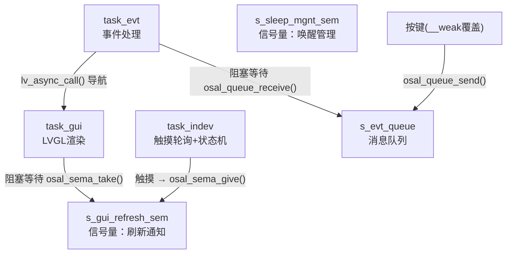

> 来源：Deep-In-Embedded / [开发板/ARM架构/STM32F411CEU6/04_嵌入式项目集成：APP层与启动流程.md](https://github.com/shuai-yemao/Deep-In-Embedded/blob/5fcab575fc20cf681f3e79e163337211097c898a/%E5%BC%80%E5%8F%91%E6%9D%BF/ARM%E6%9E%B6%E6%9E%84/STM32F411CEU6/04_%E5%B5%8C%E5%85%A5%E5%BC%8F%E9%A1%B9%E7%9B%AE%E9%9B%86%E6%88%90%EF%BC%9AAPP%E5%B1%82%E4%B8%8E%E5%90%AF%E5%8A%A8%E6%B5%81%E7%A8%8B.md)

# 📖 引言

> APP 层是最终用户代码所在的地方——业务逻辑、状态机、RTOS 任务、UI 界面都在这一层。但 " 放业务代码 " 不等于 " 随便写 "——APP 层内部也需要分层设计。

**核心观点**：一个好的 APP 层，`main()` 不超过 50 行（只做编排）、Manager 不碰硬件（可在 PC 上单测）、Task 之间用信号量 + 队列通信（不直接调对方函数）、Logic 不调任何 OS/HAL API。

前置阅读：[[01_嵌入式项目集成：概念与架构总览|概念与架构总览]]、[[02_嵌入式项目集成：OS层与OSAL设计|OS层与OSAL设计]]、[[03_嵌入式项目集成：BSP层与三段式Adapter|BSP层与三段式Adapter]]。

---

# 📝 APP 层的集成设计

## 实际意义

### 没有 APP 内部分层的工程

```c
// ❌ main.c —— 300 行，什么都做
int main(void) {
    board_init();
    lcd_init();                    // ← 直接调硬件
    touch_init();
    xTaskCreate(sensor_task, ...); // ← 直接调 FreeRTOS
    vTaskStartScheduler();
}

void sensor_task(void *arg) {
    while (1) {
        aht21_read(&temp, &humi);  // ← 直接调传感器驱动
        lv_label_set_text(label, buf);  // ← 直接操作UI
        vTaskDelay(1000);          // ← 直接调 FreeRTOS
    }
}
```

换 RTOS 时改 `xTaskCreate`、换传感器时改 `aht21_read`、改 UI 时改 `lv_label_set_text`——**所有变化都波及这个文件**。

### 有 APP 内部分层的工程

```
main() < 50 行           → 只调 bsp_init() + osal_task_create() + osal_task_start()
manager/                  → 纯 C 状态机（不碰硬件）
task/                     → 只调 osal_*() + manager + logic
logic/                    → 纯标准 C（可在 PC 上单元测试）
ui_layout/                → 只调 LVGL API
```

---

## 核心逻辑/原理

### 1. APP 层的内部子层

```
app/
├── main.c                         ← 启动入口（只编排初始化顺序）
├── manager/                       ← 状态机（纯 C 逻辑）
│   ├── app_sys_manager.c/h        ← 系统状态机
│   ├── app_ui_manager.c/h         ← UI 导航状态
│   └── app_power_manager.c/h      ← 电源策略
├── task/                          ← RTOS 任务（生产者-消费者）
│   ├── sensor_task.c              ← 传感器采集
│   ├── gui_render_task.c          ← GUI 渲染
│   └── event_task.c               ← 事件处理
├── logic/                         ← 业务逻辑（纯算法，PC可测）
│   ├── data_calculator.c/h        ← 数据计算
│   └── data_mock.c/h              ← 模拟数据（开发阶段）
├── profiles/                      ← BLE 服务
└── ui_layout/                     ← UI 布局
    ├── layout_router.c/h          ← 页面路由
    └── layout_main/
```

### 2. 各子层的职责边界

| 子层 | 可调用的 | 禁止调用的 |
|------|---------|-----------|
| `main.c` | `app_periph_init()`, `osal_*()`, `ble_stack_init()` | 具体外设、原生 RTOS API |
| `manager/` | 标准 C + `custom_config.h` 宏 | HAL、OS API、LVGL API |
| `task/` | `osal_*()`, `manager`, `logic`, `ui_layout` | 具体驱动（如 `lcd_st77916_*`） |
| `logic/` | 标准 C 库（math.h, string.h...） | 任何硬件/OS/中间件头文件 |
| `ui_layout/` | 中间件 API（如 `lvgl.h`） | 驱动、HAL、OS API |

### 3. main.c：启动编排（不做具体操作）

```c
#include "osal.h"                    // ← [[02_嵌入式项目集成：OS层与OSAL设计]]
#include "user_periph_setup.h"       // ← [[03_嵌入式项目集成：BSP层与三段式Adapter]]

void app_tasks_create(void);

static void start_tasks(void *arg) {
    app_tasks_create();              // 创建所有业务任务
    osal_task_delete(NULL);          // 自毁，释放栈空间
}

int main(void) {
    platform_early_init();           // ① 平台特定初始化
    app_periph_init();               // ② BSP板级初始化
    ble_stack_init(ble_evt_handler); // ③ 中间件初始化
    osal_task_create("start", start_tasks, 1024, 0, NULL); // ④ 创建启动任务
    osal_task_start();               // ⑤ 启动调度器
    for (;;);
}
```

**启动链路追踪**：

```
main()
  ├─ app_periph_init()            BSP层 → [[03_嵌入式项目集成：BSP层与三段式Adapter]]
  │   ├─ board_init()             板级（GPIO/时钟）
  │   ├─ drv_adapter_disp_register() 注册屏幕Adapter
  │   └─ pwr_mgmt_mode_set()      低功耗
  ├─ ble_stack_init()             Middleware层
  ├─ osal_task_create()           OSAL → [[02_嵌入式项目集成：OS层与OSAL设计]]
  └─ osal_task_start()            FreeRTOS 调度器启动
        └─ start_tasks()
            ├─ task_indev (触摸+状态机)
            ├─ task_gui (LVGL渲染)
            └─ task_evt (事件处理)
```

### 4. Manager 层：纯 C 状态机

```c
// app_sys_manager.h —— 不调任何 OS/HAL 头文件
typedef enum {
    SYS_STATE_INIT = 0,
    SYS_STATE_ACTIVE,
    SYS_STATE_IDLE,
    SYS_STATE_SLEEP,
} sys_state_t;

void sys_state_set(sys_state_t state);
sys_state_t sys_state_get(void);

// app_sys_manager.c —— 可在 PC 上 gcc 编译测试！
static sys_state_t g_state = SYS_STATE_INIT;
void sys_state_set(sys_state_t state) { g_state = state; }
sys_state_t sys_state_get(void) { return g_state; }
```

**GR5526 工程的状态迁移**（从 `lv_user_task.c` 还原）：

```
UNSET ──(LVGL就绪)──→ ACTIVE ──(无触摸超时+GPU空闲)──→ SCREEN_OFF
                       ↑                                      │
                       │                           (超时)        │
                       └────────(触摸唤醒)────────── SLEEP ◄───┘
```

### 5. Task 层：生产者 - 消费者模式



```c
// task/sensor_task.c —— 生产者
void sensor_task(void *arg) {
    while (1) {
        sensor_data_t data;
        if (sensor_read(&data) == OK) {
            process_data(&data);          // logic/ 层处理
            osal_sema_give(s_render_sem); // 通知 GUI
        }
        osal_task_delay(1000);
    }
}

// task/gui_render_task.c —— 消费者
void gui_render_task(void *arg) {
    lv_port_disp_init();
    while (1) {
        osal_sema_take(s_render_sem, 5000);  // 等待刷新信号
        uint32_t delay = lv_task_handler();
        osal_task_delay(delay);
    }
}
```

用信号量而不是直接调函数的关键差异——**异步解耦**：sensor_task 通知完就继续采集，gui_task 自己决定何时渲染。

### 6. Logic 层：纯算法（PC 可测）

```c
// logic/data_calculator.c —— 不 include 任何 OS/HAL 头文件
#include <math.h>
#include "data_calculator.h"

float calc_average(const float *data, uint32_t count) {
    float sum = 0;
    for (uint32_t i = 0; i < count; i++) sum += data[i];
    return sum / count;
}

bool is_alert_threshold(float value, float threshold) {
    return value > threshold;
}
```

---

## Adapter 连接关系

```
                    ┌──────────────────────────────┐
                    │        APP 层（本文）          │
                    │  main() / manager / task      │
                    └──────┬───────────┬───────────┘
                           │           │
              osal_*() API │           │ drv_adapter_*() API
                           │           │
            ┌──────────────▼──┐  ┌─────▼──────────────────┐
            │  OSAL Wrapper   │  │  drv_adapter Wrapper   │
            │  [[02_OS层]]    │  │  [[03_BSP层]]          │
            └────────┬────────┘  └────────┬───────────────┘
                     │                    │
            ┌────────▼────────┐  ┌───────▼────────────────┐
            │  FreeRTOS/裸机   │  │  LCD / Flash / 触摸    │
            └─────────────────┘  └────────────────────────┘
```

**APP 层绝不越层**：不调 `xTaskCreate()`（通过 OSAL），不调 `lcd_st77916_flush()`（通过 drv_adapter），不写寄存器。

---

## 实际操作步骤

### 从零搭建 APP 层

#### 第一步：写 main.c（10 分钟）

```c
#include "osal.h"
#include "user_periph_setup.h"

void app_tasks_create(void);

static void start_tasks(void *arg) {
    app_tasks_create();
    osal_task_delete(NULL);          // 自毁
}

int main(void) {
    app_periph_init();
    osal_task_create("start", start_tasks, 1024, 0, NULL);
    osal_task_start();
    for (;;);
}
```

#### 第二步：写 Manager（30 分钟）

定义状态枚举 → 实现切换函数 → 在 task 中驱动迁移。

#### 第三步：写 Task（1 小时）

创建 2-3 个核心任务，信号量 + 队列通信。

#### 第四步：写 Logic + UI Layout

Logic 纯算法（PC 单测），UI Layout 界面布局。

---

## 集成进度清单

| 步骤 | 验证标准 | 通过 |
|------|---------|------|
| ① LED 闪烁 | MCU 最小系统工作 | ☐ |
| ② UART 日志 | 串口助手看到日志 | ☐ |
| ③ OSAL + RTOS | 任务调度正常 | ☐ |
| ④ 外设驱动 | 传感器/LCD 正常 | ☐ |
| ⑤ 中间件 | LVGL/BLE 工作 | ☐ |
| ⑥ APP 业务 | 状态机/任务/UI 完整 | ☐ |
| ⑦ 低功耗 | 待机电流符合目标 | ☐ |
| ⑧ 24h 老化 | 无崩溃、无内存泄漏 | ☐ |

---

## 常见问题

### Q1：为什么 main.c 要创建 " 用完就自杀 " 的启动任务？

启动任务的栈空间在初始化后浪费了 RAM——自毁是内存优化的技巧。

### Q2：Task 之间用信号量通信和直接调函数有什么区别？

直接调是**同步**的（sensor 等 UI 画完才能继续），信号量是**异步**的（通知完就继续，各走各的节奏）。

### Q3：Logic 层和 Manager 层有什么区别？

- **Logic**：数据计算（" 温度是否超阈值？"）→ 无状态
- **Manager**：系统决策（" 当前 SLEEP 状态，超阈值要不要唤醒？"）→ 有状态

---

## 案例：GR5526 APP 层速览

```
Src/app/
├── main.c                  ← 49 行（只做编排）
├── manager/
│   ├── app_sys_manager     ← 状态机(UNSET→ACTIVE→SCREEN_OFF→SLEEP)
│   ├── app_ui_manager      ← UI导航
│   └── app_power_manager   ← 电源策略
├── task/
│   ├── lv_user_task.c      ← task_indev + task_gui（核心）
│   └── lv_event_task.c     ← task_evt（事件处理）
├── ux_logic/
│   ├── lv_clock_hands_draw ← 指针渲染算法
│   ├── mock_data            ← 模拟数据生成
│   └── notification_center  ← 通知中心
└── profiles/
    └── ble_app              ← BLE服务
```

三个任务的实际协作：

```
task_indev (100Hz 轮询触摸+状态机)
    ├─ 触摸事件 → osal_sema_give(s_gui_refresh_sem) → 即时刷新
    ├─ 无触摸超时 → GPU idle检测 → SLEEP
    └─ 触摸/按键IRQ → osal_sema_give(s_sleep_mgnt_sem) → 唤醒

task_gui (LVGL渲染)
    └─ osal_sema_take(s_gui_refresh_sem, delayTime)

task_evt (按键事件)
    └─ 覆盖 __weak app_key_evt_handler → lv_async_call(导航)
```

---

# 💬 Q&A

## 🟢 基础

### Q1: 为什么 APP 层内部还要分 4 个子层？

两个原因：

1. **测试**——状态机在 PC 上单测需要不碰硬件
2. **变更隔离**——换 UI 框架时，如果 UI 和业务混在一起，改动面巨大

## 🟡 进阶

### Q2: GR5526 的 `lv_user_task.c` 把状态迁移嵌在 task 里而不是 Manager 中——为什么？

实际工程的折中。状态迁移涉及硬件操作（查 GPU 是否 idle、关屏幕电源），如果全放 Manager（不能碰硬件），Task 和 Manager 之间需要频繁 " 决策请求 - 响应 "，RTOS 成本很高。

**实用建议**：硬件强相关的状态迁移放 Task，纯逻辑判断放 Manager。

---

# 📋 总结

**是什么** — APP 层内部按职责分为 main（编排）、manager（状态机）、task（任务）、logic（算法）、ui_layout（界面）。

**为什么** — 各层独立变更、可独立测试、依赖边界清晰。

**怎么做** — main < 50 行、Task 间异步通信、Manager 纯 C、Logic PC 可测。全部底层依赖通过 [[02_嵌入式项目集成：OS层与OSAL设计|OSAL]] 和 [[03_嵌入式项目集成：BSP层与三段式Adapter|drv_adapter]] 注入。

---

# 📎 参考资料

## 🔗 系列笔记

- [[01_嵌入式项目集成：概念与架构总览]] — 前置：整体框架
- [[02_嵌入式项目集成：OS层与OSAL设计]] — APP 任务如何调 OS
- [[03_嵌入式项目集成：BSP层与三段式Adapter]] — APP 如何访问硬件
- [[项目代码的单元测试、集成测试以及系统测试]] — 配套测试策略

## 📄 代码参考

| 文件 | GR5526 SDK 路径 |
|------|----------------|
| main.c | `.../Src/app/main.c` |
| app_sys_manager.c | `.../Src/app/manager/app_sys_manager.c` |
| lv_event_task.c | `.../Src/app/task/lv_event_task.c` |
| lv_user_task.c | `.../Src/app/task/lv_user_task.c` |
