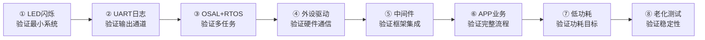

> 来源：Deep-In-Embedded / [开发板/ARM架构/STM32F411CEU6/05_嵌入式项目集成顺序与实操步骤指南.md](https://github.com/shuai-yemao/Deep-In-Embedded/blob/5fcab575fc20cf681f3e79e163337211097c898a/%E5%BC%80%E5%8F%91%E6%9D%BF/ARM%E6%9E%B6%E6%9E%84/STM32F411CEU6/05_%E5%B5%8C%E5%85%A5%E5%BC%8F%E9%A1%B9%E7%9B%AE%E9%9B%86%E6%88%90%E9%A1%BA%E5%BA%8F%E4%B8%8E%E5%AE%9E%E6%93%8D%E6%AD%A5%E9%AA%A4%E6%8C%87%E5%8D%97.md)

# 📖 引言

> 本文是嵌入式的**集成顺序与实操步骤指南**——按时间线逐步搭建一个完整的嵌入式项目。每一步都给出 " 做什么 "、" 代码怎么写 "、" 怎么验证 "、" 遇到问题查哪篇笔记 "。

**前置要求**：建议先阅读 [[01_嵌入式项目集成：概念与架构总览|概念与架构总览]]，了解五层模型和 Adapter 的定位，再回到本文按步骤操作。

本文面向**任何 MCU 平台**（STM32、GR5526、ESP32、NXP 等），以 GR5526 SDK 的 `graphics_lvgl_831_gpu_demo_360p` 工程为具体案例参考。

---

# 📝 集成顺序：从裸板到完整系统

## 集成总览图



## 项目文件结构（最终目标）

开始前，先看一眼完整目录树。按这个结构创建空文件夹，逐步填充：

```
my_project/
│
├── Keil_5/                              ← Keil/IAR/CMake 工程
│
├── Src/
│   ├── config/
│   │   ├── custom_config.h              ← [第①步创建] 配置中心
│   │   └── FreeRTOSConfig.h             ← [第③步创建] RTOS参数
│   │
│   ├── platform/
│   │   └── user_periph_setup.c/h        ← [第④步创建] ★ 外设初始化编排
│   │
│   ├── driver/                          ← [第④步创建] 外设驱动Adapter
│   │   ├── drv_adapter_port_disp.c      ← 屏幕Adapter绑定（第二段Porting）
│   │   ├── drv_adapter_port_touch.c     ← 触摸Adapter绑定
│   │   └── xxx_driver.c/h               ← [第④步创建] 具体外设驱动（第三段Driver）
│   │
│   ├── app/
│   │   ├── main.c                       ← [第①步创建] 启动入口（<50行）
│   │   ├── manager/                     ← [第⑥步创建] 状态机
│   │   │   ├── app_sys_manager.c/h
│   │   │   └── app_ui_manager.c/h
│   │   ├── task/                        ← [第③步创建] RTOS任务
│   │   │   ├── sensor_task.c
│   │   │   ├── gui_render_task.c
│   │   │   └── event_task.c
│   │   └── logic/                       ← [第⑥步创建] 纯算法
│   │       └── data_calculator.c/h
│   │
│   └── ui_layout/                       ← [第⑤步创建] UI界面
│       ├── layout_router.c/h
│       └── layout_main/
│
└── tests/                               ← [可选] 单元测试
```

---

## 准备阶段：硬件检查与工程创建（1 小时）

### 做什么

| # | 任务 | 产出 |
|---|------|------|
| P1 | 确认芯片型号，获取 SDK 和 Datasheet | SDK 包 + 参考手册 |
| P2 | 创建 Keil/IAR/CMake 空工程 | 编译 0 error, 0 warning |
| P3 | 添加启动文件 + 链接脚本 | 固件能烧录 |
| P4 | 创建项目目录结构 | `config/` `platform/` `driver/` `app/` 空目录 |
| P5 | 确认调试工具连接（J-Link/DAP/串口） | 能烧录、能收串口数据 |

### 关键检查

- 芯片能被调试器识别？（J-Link Commander → `connect`）
- SDK 的 example 工程能编译 + 烧录 + 运行？
- 串口电平匹配？（TTL 3.3V vs RS232 ±12V）

> 准备阶段最容易踩坑的是**调试器连接**和**串口电平**——花 30 分钟排查，比后续每一步都怀疑硬件坏要高效。

---

## 第①步：让 LED 闪烁（验证最小系统，30 分钟）

### 目标

证明 MCU 能**启动**、**GPIO 能工作**、**延时函数正常**。

### 做什么

1. 创建 `config/custom_config.h`（先只写芯片型号和主频）
2. 创建 `app/main.c`（最简 LED 闪烁）
3. 编译 → 烧录 → 观察 LED

### custom_config.h（初始版本——后续逐步扩充）

```c
#ifndef __CUSTOM_CONFIG_H__
#define __CUSTOM_CONFIG_H__

#define SOC_GR5526                  // 芯片型号（换成你的）
#define SYSTEM_CLOCK        0       // 0=96MHz（按 Datasheet 设）

#endif
```

### main.c（最小版本）

```c
#include "board_init.h"

#define LED_PIN    13               // 换成你板子上的 LED 引脚

int main(void) {
    board_init();                   // 时钟 + GPIO 初始化
    GPIO_SetDir(LED_PIN, OUTPUT);

    while (1) {
        GPIO_Toggle(LED_PIN);
        delay_ms(500);              // 简单延时
    }
}
```

### 验证标准

- [ ] 编译 0 error, 0 warning
- [ ] 烧录成功
- [ ] LED 以 1Hz 闪烁

### 排查

| 现象 | 可能原因 |
|------|---------|
| LED 不亮 | 引脚号写错——查板子原理图 |
| LED 常亮/灭 | 延时函数不工作——用示波器测波形 |
| 编译报错 | `board_init` 函数名不同——查 SDK 文档 |
| 烧录失败 | 调试器连接问题——检查连线和驱动 |

**如果 LED 闪烁正常 → MCU 启动、GPIO、延时三大基础全部验证通过。**

---

## 第②步：集成 UART 日志（验证输出通道，30 分钟）

### 目标

芯片能通过串口发送调试信息——后续每步都依赖日志输出验证。

### 做什么

1. 配置 UART 引脚和波特率
2. 重定向 `printf` 到 UART
3. 定义日志宏

### UART 初始化 + printf 重定向

```c
// board_init() 中添加 UART 初始化
GPIO_PinMux(GPIOA, 9, GPIO_MODE_AF_PP);    // UART1_TX（按你的板子改）
GPIO_PinMux(GPIOA, 10, GPIO_MODE_AF_PP);   // UART1_RX
__HAL_RCC_USART1_CLK_ENABLE();
UART_Init(USART1, 115200);

// printf 重定向（ARM Keil 环境）
int fputc(int ch, FILE *f) {
    UART_SendChar(USART1, (uint8_t)ch);
    return ch;
}
```

### 日志宏

```c
#define log_info(tag, fmt, ...)  printf("[I][%s] " fmt "\r\n", tag, ##__VA_ARGS__)
#define log_error(tag, fmt, ...) printf("[E][%s] " fmt "\r\n", tag, ##__VA_ARGS__)
#define log_warn(tag, fmt, ...)  printf("[W][%s] " fmt "\r\n", tag, ##__VA_ARGS__)
```

### 验证标准

- [ ] 串口助手（115200-8-N-1）看到 `[I][MAIN] System boot, clock=96 MHz`

---

## 第③步：集成 OSAL 和 RTOS（验证多任务调度，1 小时）

### 目标

启动 FreeRTOS，创建 2 个任务，验证信号量通信。

**设计原理参考**：[[02_嵌入式项目集成：OS层与OSAL设计]]

### 做什么

1. 将 FreeRTOS 源码加入工程 + 创建 `FreeRTOSConfig.h`
2. 创建 `os_adapter/`：`osal.h`（API 声明）+ `os_impl_freertos.c`（实现）
3. 修改 `main.c` 创建任务

### OSAL 最小 API

先声明 6 个核心 API：

```c
// os_adapter/inc/osal.h
typedef void *  sem_handle_t;
typedef void *  task_handle_t;
typedef void (* task_func_t)(void *arg);

#define OSAL_MAX_DELAY  0xFFFFFFFF

task_handle_t osal_task_create(const char *name, task_func_t func,
                                uint32_t stack, uint32_t prio, void *param);
void osal_task_delay(uint32_t ms);
void osal_task_start(void);

bool osal_sema_binary_create(sem_handle_t *sem);
bool osal_sema_take(sem_handle_t sem, uint32_t timeout_ms);
bool osal_sema_give(sem_handle_t sem);
```

再写 FreeRTOS Impl：

```c
// os_adapter/FreeRTOS/src/os_impl.c
#include "FreeRTOS.h"
#include "task.h"
#include "semphr.h"
#include "osal.h"

task_handle_t osal_task_create(const char *name, task_func_t func,
                                uint32_t stack, uint32_t prio, void *param) {
    TaskHandle_t h = NULL;
    xTaskCreate((TaskFunction_t)func, name, stack, param, prio, &h);
    return (task_handle_t)h;
}
void osal_task_delay(uint32_t ms)        { vTaskDelay(pdMS_TO_TICKS(ms)); }
void osal_task_start(void)               { vTaskStartScheduler(); }

bool osal_sema_binary_create(sem_handle_t *s) {
    SemaphoreHandle_t h = xSemaphoreCreateBinary();
    *s = (sem_handle_t)h; return (h != NULL);
}
bool osal_sema_take(sem_handle_t s, uint32_t t) {
    return xSemaphoreTake((SemaphoreHandle_t)s, pdMS_TO_TICKS(t)) == pdTRUE;
}
bool osal_sema_give(sem_handle_t s) {
    return xSemaphoreGive((SemaphoreHandle_t)s) == pdTRUE;
}
```

### main.c（RTOS 版本）

```c
#include "osal.h"
#include "board_init.h"

static sem_handle_t s_print_sem;

static void led_task(void *arg) {
    GPIO_SetDir(LED_PIN, OUTPUT);
    while (1) {
        GPIO_Toggle(LED_PIN);
        osal_sema_give(s_print_sem);    // 通知日志任务
        osal_task_delay(500);
    }
}

static void log_task(void *arg) {
    uint32_t count = 0;
    while (1) {
        osal_sema_take(s_print_sem, OSAL_MAX_DELAY);
        count++;
        log_info("TASK", "LED toggled %d times", count);
    }
}

int main(void) {
    board_init();
    log_info("MAIN", "Starting RTOS...");
    osal_sema_binary_create(&s_print_sem);
    osal_task_create("led", led_task, 256, 1, NULL);
    osal_task_create("log", log_task, 512, 2, NULL);
    osal_task_start();
    for (;;);
}
```

### FreeRTOSConfig.h 最小配置

```c
#define configUSE_PREEMPTION            1
#define configCPU_CLOCK_HZ              (96000000)
#define configTICK_RATE_HZ              (1000)
#define configMAX_PRIORITIES            (5)
#define configMINIMAL_STACK_SIZE        (128)
#define configTOTAL_HEAP_SIZE           (16 * 1024)
#define configMAX_TASK_NAME_LEN         (16)
#define configUSE_16_BIT_TICKS          0
#define configUSE_MUTEXES               0
#define configUSE_TIMERS                0
#define INCLUDE_vTaskDelay              1
```

### 验证标准

- [ ] 串口看到 `[I][MAIN] Starting RTOS...`
- [ ] LED 以 1Hz 闪烁 + 串口同步计数
- [ ] 24h 无崩溃

---

## 第④步：集成外设驱动（验证硬件通信，每外设 1-2 小时）

### 目标

以 I2C 传感器为例，编写具体驱动 + Adapter 绑定。

**设计原理参考**：[[03_嵌入式项目集成：BSP层与三段式Adapter]]

### 做什么

1. 编写具体驱动（第三段 Driver）
2. 定义抽象接口（第一段 Wrapper）
3. 创建 Adapter 绑定（第二段 Porting）
4. 在 `user_periph_setup.c` 中编排初始化

### 第三段：具体传感器驱动

```c
// driver/aht21_driver.c
#define AHT21_I2C_ADDR   0x38

bool aht21_init(uint8_t i2c_bus) {
    uint8_t cmd[] = {0xBE, 0x08, 0x00};
    return i2c_write(i2c_bus, AHT21_I2C_ADDR, cmd, 3) == 0;
}

bool aht21_read(uint8_t i2c_bus, float *temp, float *humi) {
    uint8_t cmd = 0xAC;
    if (i2c_write(i2c_bus, AHT21_I2C_ADDR, &cmd, 1) != 0) return false;
    delay_ms(80);                       // Datasheet: max 75ms

    uint8_t raw[7];
    if (i2c_read(i2c_bus, AHT21_I2C_ADDR, raw, 7) != 0) return false;
    if (!sensor_crc_check(raw, 7)) return false;

    uint32_t rt = ((uint32_t)raw[3] << 12) | ((uint32_t)raw[4] << 4) | (raw[5] >> 4);
    uint32_t rh = ((uint32_t)raw[1] << 12) | ((uint32_t)raw[2] << 4) | (raw[3] >> 4);
    *temp = rt * 200.0f / 1048576.0f - 50.0f;
    *humi = rh * 100.0f / 1048576.0f;
    return true;
}
```

### 第一段 + 第二段：Wrapper + Porting

```c
// driver/drv_adapter_sensor.h —— Wrapper（SDK没有就自己写，~50行）
typedef struct {
    bool (*init)(uint8_t bus);
    bool (*read)(uint8_t bus, float *temp, float *humi);
} sensor_drv_t;

bool drv_adapter_sensor_register(uint8_t idx, const sensor_drv_t *drv);
bool drv_adapter_sensor_read(uint8_t idx, float *temp, float *humi);

// driver/drv_adapter_port_sensor.c —— Porting（★ 你的代码）
#include "drv_adapter_sensor.h"
#include "aht21_driver.h"

static bool _init(uint8_t b)  { return aht21_init(b); }
static bool _read(uint8_t b, float *t, float *h) { return aht21_read(b, t, h); }

void drv_adapter_sensor_register_all(void) {
    sensor_drv_t drv = { .init = _init, .read = _read };
    drv_adapter_sensor_register(0, &drv);
}
```

### user_periph_setup.c（★ 外设初始化编排）

```c
// platform/user_periph_setup.c
#include "board_init.h"

extern void drv_adapter_sensor_register_all(void);

void app_periph_init(void) {
    board_init();                            // ① 板级基础
    i2c_init(I2C1, 100000);                  // ② I2C 总线
    drv_adapter_sensor_register_all();       // ③ 注册传感器 Adapter
    pwr_mgmt_mode_set(SLEEP_MODE);           // ④ 最后设低功耗！
}
```

### 验证标准

- [ ] 串口日志输出温湿度值
- [ ] 手握住传感器——温度上升
- [ ] 无通信错误

### 调试技巧

读不到数据时的排查顺序：

1. 逻辑分析仪抓 I2C 波形 → 看有没有 SCL/SDA 信号
2. 先读 WHO_AM_I / ID 寄存器 → 验证 I2C 通信正常
3. 检查传感器是否未上电或处于休眠状态

---

## 第⑤步：集成中间件（以 LVGL 为例，2-3 小时）

### 目标

显示第一个 LVGL 界面。

### 做什么

1. LVGL 源码加入工程 + 配置 `lv_conf.h`
2. 编写 `lv_port_disp.c`（通过 `drv_adapter` 调 LCD）
3. 创建 GUI 渲染任务

### lv_port_disp.c（通过 Adapter 调 LCD）

```c
#include "lvgl.h"
#include "drv_adapter_display.h"       // ← 通过 Adapter，不调具体驱动

void lv_port_disp_init(void) {
    drv_adapter_disp_init();           // Adapter 统一接口

    static lv_disp_draw_buf_t draw_buf;
    lv_color_t *buf1 = malloc(DISP_HOR_RES * DISP_VER_RES * sizeof(lv_color_t));
    lv_color_t *buf2 = malloc(DISP_HOR_RES * DISP_VER_RES * sizeof(lv_color_t));
    lv_disp_draw_buf_init(&draw_buf, buf1, buf2, DISP_HOR_RES * DISP_VER_RES);

    static lv_disp_drv_t disp_drv;
    lv_disp_drv_init(&disp_drv);
    disp_drv.hor_res  = DISP_HOR_RES;
    disp_drv.ver_res  = DISP_VER_RES;
    disp_drv.flush_cb = disp_flush;
    disp_drv.draw_buf = &draw_buf;
    lv_disp_drv_register(&disp_drv);
}

static void disp_flush(lv_disp_drv_t *drv, const lv_area_t *area,
                        lv_color_t *color_p) {
    uint16_t w = area->x2 - area->x1 + 1;
    uint16_t h = area->y2 - area->y1 + 1;
    drv_adapter_disp_set_show_area(area->x1, area->y1, area->x2, area->y2);
    drv_adapter_disp_wait_te();
    drv_adapter_disp_flush((void *)color_p, DISP_PIXEL_FORMAT, w, h);
    lv_disp_flush_ready(drv);
}
```

### GUI 渲染任务

```c
void gui_render_task(void *arg) {
    lv_init();
    lv_port_disp_init();

    lv_obj_t *label = lv_label_create(lv_scr_act());
    lv_label_set_text(label, "Hello LVGL!");
    lv_obj_center(label);

    while (1) {
        uint32_t delay = lv_task_handler();
        osal_task_delay(delay);
    }
}
```

### 调用链

```
LVGL → disp_flush() → drv_adapter_disp_flush()
  → 查表 → 函数指针 → _disp_drv_flush() (Porting)
  → lcd_st77916_flush() (Driver) → QSPI DMA → LCD 屏幕
```

### 验证标准

- [ ] 屏幕点亮，显示 "Hello LVGL!"
- [ ] 无花屏、无撕裂

---

## 第⑥步：搭建 APP 层业务逻辑（2-4 小时）

### 目标

组织为 Manager（状态机）+ Task（生产者消费者）+ Logic（纯算法）。

**设计原理参考**：[[04_嵌入式项目集成：APP层与启动流程]]

### Manager 状态机

```c
// app/manager/app_sys_manager.h
typedef enum {
    SYS_STATE_INIT = 0,
    SYS_STATE_ACTIVE,
    SYS_STATE_IDLE,
    SYS_STATE_SLEEP,
} sys_state_t;

void sys_state_set(sys_state_t state);
sys_state_t sys_state_get(void);

// app/manager/app_sys_manager.c —— 可在 PC 上 gcc 编译测试
static sys_state_t g_state = SYS_STATE_INIT;
void sys_state_set(sys_state_t state) { g_state = state; }
sys_state_t sys_state_get(void)      { return g_state; }
```

### 生产者 - 消费者任务

```c
// task/sensor_task.c —— 生产者
static sem_handle_t s_render_sem;

void sensor_task(void *arg) {
    float temp, humi;
    while (1) {
        if (drv_adapter_sensor_read(0, &temp, &humi)) {
            update_data_cache(temp, humi);     // logic/ 层处理
            osal_sema_give(s_render_sem);      // ★ 通知 GUI，不直接调 UI
        }
        osal_task_delay(5000);
    }
}

// task/gui_render_task.c —— 消费者
void gui_render_task(void *arg) {
    lv_port_disp_init();
    while (1) {
        osal_sema_take(s_render_sem, 5000);    // ★ 等待传感器通知
        update_ui_from_cache();                // 从缓存取数据渲染
        uint32_t delay = lv_task_handler();
        osal_task_delay(delay);
    }
}
```

### 状态迁移（在 indev 任务中驱动）

```c
void indev_task(void *arg) {
    uint32_t last_touch = 0;
    while (1) {
        bool touched = touchpad_read();
        if (touched) {
            last_touch = osal_task_get_tick();
            if (sys_state_get() == SYS_STATE_IDLE) {
                sys_state_set(SYS_STATE_ACTIVE);   // 唤醒
                drv_adapter_disp_on(true);
            }
            osal_sema_give(s_render_sem);
        }
        if (sys_state_get() == SYS_STATE_ACTIVE &&
            osal_task_get_tick() - last_touch > 30000) {
            sys_state_set(SYS_STATE_IDLE);         // 30s无操作→熄屏
            drv_adapter_disp_on(false);
        }
        osal_task_delay(50);
    }
}
```

### 验证标准

- [ ] 传感器数据自动刷新到 UI
- [ ] 30s 无操作自动熄屏
- [ ] 触摸/按键唤醒

---

## 第⑦步：低功耗配置（30 分钟）

### 做什么

1. 确认 `pwr_mgmt_mode_set()` 在 `app_periph_init()` **最后一行**
2. 用万用表/功耗分析仪测量待机电流
3. 验证唤醒功能正常

### 检查清单

- [ ] 低功耗在外设初始化之后（不是之前！）
- [ ] 空闲时未使用外设时钟被关闭
- [ ] 待机电流符合 Datasheet 目标
- [ ] 触摸/按键/RTC 能正常唤醒
- [ ] 唤醒后外设恢复工作

---

## 第⑧步：24 小时老化（1 天）

### 目标

验证长期稳定性。

### 检查清单

- [ ] 24h 无崩溃、无重启
- [ ] 无内存泄漏（每小时 `xPortGetFreeHeapSize()` 记录堆大小）
- [ ] 传感器无丢帧、UI 无卡顿
- [ ] 日志无错误

```c
// 堆监控任务（低优先级，每小时执行）
void heap_monitor_task(void *arg) {
    while (1) {
        log_info("MEM", "Free heap: %d B", xPortGetFreeHeapSize());
        osal_task_delay(3600000);
    }
}
```

如果堆持续下降 → 有内存泄漏 → 查 `malloc`/`free` 配对。

---

# 📋 集成进度清单

| 步骤 | 验证标准 | 通过 | 参考笔记 |
|------|---------|------|---------|
| 准备 | 工程编译通过、调试器连接正常 | ☐ | — |
| ① LED | LED 以 1Hz 闪烁 | ☐ | [[01_嵌入式项目集成：概念与架构总览]] |
| ② UART | 串口助手看到日志 | ☐ | — |
| ③ RTOS | 两个任务正常运行、信号量通信正常 | ☐ | [[02_嵌入式项目集成：OS层与OSAL设计]] |
| ④ 外设 | 传感器读数正确 | ☐ | [[03_嵌入式项目集成：BSP层与三段式Adapter]] |
| ⑤ 中间件 | LVGL demo 正常显示 | ☐ | [[03_嵌入式项目集成：BSP层与三段式Adapter]] |
| ⑥ APP | 状态机 + 任务 + UI 完整流程 | ☐ | [[04_嵌入式项目集成：APP层与启动流程]] |
| ⑦ 低功耗 | 待机电流符合目标 | ☐ | — |
| ⑧ 老化 | 24h 无崩溃、无内存泄漏 | ☐ | — |

---

# 常见问题

### Q1：每一步必须严格按这个顺序吗？

建议按这个顺序——每一步验证了下一步的基础。但步骤 ④⑤⑥ 可根据项目情况调整。没有屏幕就跳过 LVGL、没有传感器就只验证 UART/SPI。

### Q2：芯片 SDK 没有 OSAL 和 Adapter 怎么办？

自己写。OSAL Wrapper ~200 行、Adapter Porting ~110 行/外设。**写一次，所有项目复用**。

参考 [[02_嵌入式项目集成：OS层与OSAL设计]] 和 [[03_嵌入式项目集成：BSP层与三段式Adapter]]。

### Q3：为什么不先写单元测试？

嵌入式硬件依赖强——传感器没调通之前，Mock 传感器的单元测试验证的是假数据。

**先跑通系统 → 再补单元测试覆盖边界 → 交叉验证**。

详见 [[项目代码的单元测试、集成测试以及系统测试]]。

### Q4：低功耗为什么必须放外设初始化之后？

先省电再初始化 → 外设时钟被关 → 寄存器写了但没时钟 → 初始化 " 成功 " 但外设不工作。这是最难查的 bug。

---

# 📎 参考资料

## 🔗 系列笔记

- [[01_嵌入式项目集成：概念与架构总览]] — 五层模型和设计原则
- [[02_嵌入式项目集成：OS层与OSAL设计]] — OSAL 详细设计
- [[03_嵌入式项目集成：BSP层与三段式Adapter]] — 设备解耦模式
- [[04_嵌入式项目集成：APP层与启动流程]] — APP 层架构
- [[项目代码的单元测试、集成测试以及系统测试]] — 配套测试策略

## 🔗 外部文档

- [嵌入式项目集成介绍](https://twd6onxsxva.feishu.cn/docx/TnHTdK917o7jknxuEskcV2JlnVg)
- [嵌入式项目集成_集成顺序](https://twd6onxsxva.feishu.cn/docx/Kcvydeb9MoVJxhxQkRFcbPWSn52)
