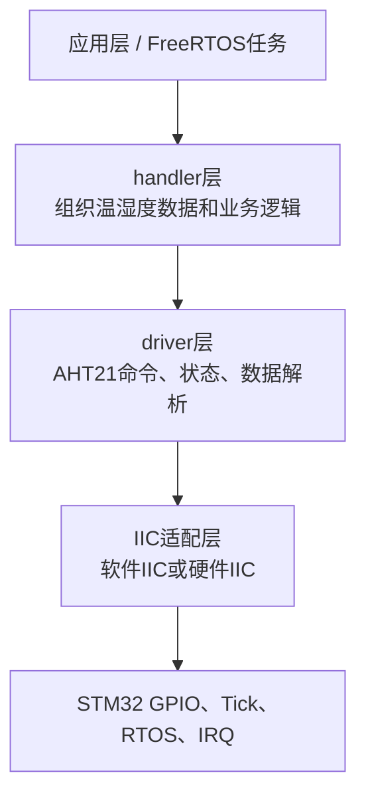
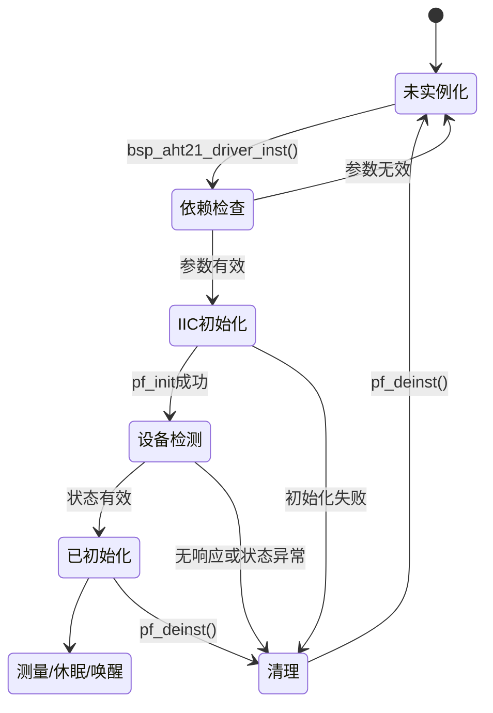
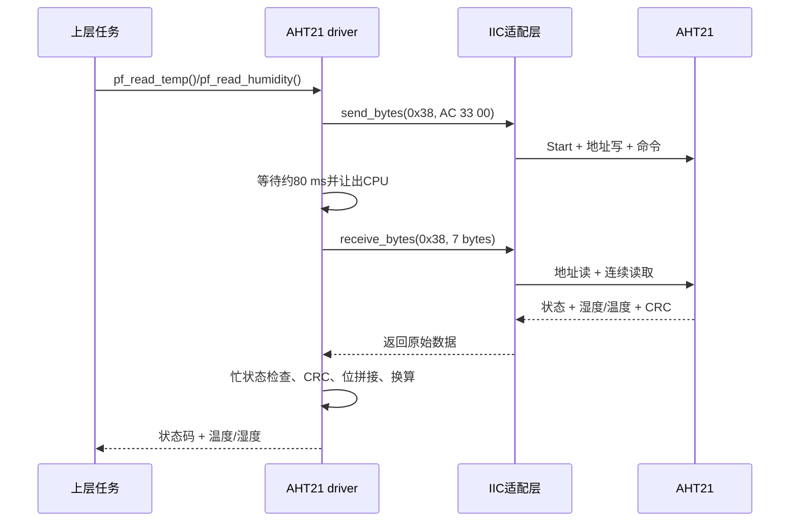
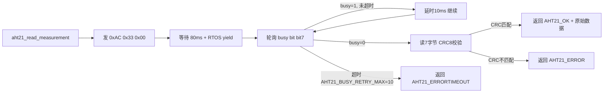

> 来源：Deep-In-Embedded / [开发板/ARM架构/STM32F411CEU6/AHT21的driver文件架构设计思路.md](https://github.com/shuai-yemao/Deep-In-Embedded/blob/5fcab575fc20cf681f3e79e163337211097c898a/%E5%BC%80%E5%8F%91%E6%9D%BF/ARM%E6%9E%B6%E6%9E%84/STM32F411CEU6/AHT21%E7%9A%84driver%E6%96%87%E4%BB%B6%E6%9E%B6%E6%9E%84%E8%AE%BE%E8%AE%A1%E6%80%9D%E8%B7%AF.md)

# 📖 引言

> 这篇笔记要讲什么？用一句话概括核心主题。

将 aht 21 外设的实现逻辑抽象，将其从 core 层的绑定中脱离出来，成为可复用的代码

---

# 📝 driver 层的设计思路

> 用一句话说清楚这个知识点是什么。

按一定的流程来编写 bsp_xx_driver.h 和.c 文件

## 实际意义

> 为什么会有该知识点？

1. **把设备协议从工程业务中分离出来**：AHT21 的初始化、状态检测、测量命令、CRC 校验和温湿度换算集中在 `BSP/AHT21/driver`，`Core` 和 `handler` 不需要了解传感器寄存器细节。
2. **解决真实的平台差异**：当前工程可以通过 `HARDWARE_IIC` 选择硬件 IIC 或软件 IIC，driver 只调用 `iic_driver_interface_t`，不用因为 IIC 实现变化而修改温湿度读取逻辑。
3. **让错误有明确归属**：IIC 无 ACK 属于通信层，AHT21 忙超时或 CRC 错误属于设备层，初始化资源为空属于驱动装配层；统一的 `aht21_status_t` 让上层能够区分这些问题。
4. **降低调试成本**：本工程曾遇到日志 tag 错位、状态读取事务不匹配、初始化时序错误和枚举值误比较等问题。将资源、协议和设备逻辑分层后，可以分别抓 RTT 日志、IIC 波形和驱动返回值定位根因。
5. **支持后续测试和替换**：通过函数指针注入 IIC、Tick、RTOS 和 IRQ 接口，可以用 mock 测试命令和数据解析，也可以在不改 AHT21 核心代码的情况下替换底层实现。

## 应用场景

> 在实际中主要被用来做什么？

1. 在 STM32F411CEU6 + FreeRTOS 工程中，为 `system_init_resources()` 提供 AHT21 设备实例。
2. 通过 `pf_read_temp()` 和 `pf_read_humidity()` 向 `handler` 层提供已经完成校验和换算的工程数据。
3. 在软件 IIC（PB13=SDA、PB14=SCL）和硬件 IIC 之间切换，验证同一套 AHT21 设备协议。
4. 在 RTT/EasyLogger 中输出初始化、设备检测、测量失败、CRC 错误和超时信息。
5. 使用 Unity 或 mock IIC 验证命令序列、状态码、CRC 和温湿度数据拼接，不必每个测试都依赖真实传感器。
6. 为休眠/唤醒、电池供电和周期性采集场景提供 `pf_sleep()`、`pf_wakeup()` 等设备级接口。

## 核心逻辑/原理

> 它是如何工作的？拆解背后的机制。

1. 分析 bsp 外设在架构中的需要接收的资源和对外提供的 API
2. 利用结构体 + 函数指针来实现多态，先根据需要接收的资源和 API 来编写 driver.h 文件
3. Driver.c 文件根据.h 文件来编写对外接口函数，其余函数皆为内部静态函数，让上层调用不用在乎内部实现

### 驱动层的边界

本工程把 AHT21 驱动拆成四层，职责从下到上逐渐接近业务：



- `BSP/AHT21/driver` 只负责 AHT21 的设备协议和数据含义。
- `BSP/AHT21/iic` 负责 Start、Stop、ACK、字节收发等总线事务。
- `System/Adapter` 或其他平台代码负责把 GPIO、时间基准、互斥锁和中断操作接入驱动。
- `handler` 不应该直接操作 SDA/SCL，而应该调用 driver 暴露的函数指针。

这样做的结果是：更换软件 IIC、硬件 IIC 或 MCU 平台时，主要替换南向适配接口，不必重写 AHT21 的测量换算逻辑。

### `.h` 文件应该先设计什么

按照“先定义资源，再定义对外行为”的顺序编写头文件：

1. **配置项**：`AHT21_I2C_ADDR`、命令字节、忙状态掩码、测量等待时间、数据长度和 CRC 长度放在 `bsp_aht21_config.h`。
2. **状态枚举**：`aht21_status_t` 统一表达成功、普通错误、超时、资源错误、参数错误、内存错误和中断上下文错误。
3. **南向接口**：`iic_driver_interface_t`、`timebase_interface_t`、`yield_interface_t`、`irq_interface_t` 描述驱动需要平台提供什么。
4. **驱动实例**：`bsp_aht21_driver_t` 保存初始化状态、依赖接口和北向操作函数指针。
5. **公共入口**：只保留 `bsp_aht21_driver_inst()` 作为实例化入口，实例化成功后通过 `pf_init`、`pf_read_temp` 等函数指针调用功能。

### 南向接口：驱动需要什么资源

| 接口 | 驱动使用目的 | 当前工程中的具体内容 |
| --- | --- | --- |
| IIC | 与 AHT21 收发命令和数据 | 初始化、反初始化、发送/接收字节、ACK、读状态 |
| 时间基准 | 测量等待、忙轮询、唤醒等待 | `pf_get_tick_count()`、`pf_delay_ms()` |
| RTOS | 等待期间让出 CPU | `pf_rtos_yield()` |
| IRQ/锁 | 保护 IIC 临界区和共享资源 | `pf_lock()`、`pf_unlock()`、开关中断 |

```c
typedef struct {
    iic_driver_interface_t *p_iic_driver_instance;
    timebase_interface_t *p_timebase_instance;
    yield_interface_t *p_yield_instance;
    irq_interface_t *p_irq_instance;
} aht21_ops_t;
```

这里的关键不是“把所有函数都放进结构体”，而是明确：**driver 不直接依赖 HAL、FreeRTOS 或具体 GPIO，只依赖这些抽象接口**。

### 北向接口：driver 对外提供什么

`bsp_aht21_driver_t` 中的函数指针就是北向接口：

| 函数 | 作用 | 调用前提 |
| --- | --- | --- |
| `pf_init` | 初始化 IIC 并等待传感器稳定 | 实例已绑定依赖 |
| `pf_read_id` | 通过状态命令检查 AHT21 响应 | IIC 可用 |
| `pf_read_temp` | 触发测量、等待、校验并换算温度 | 已初始化 |
| `pf_read_humidity` | 触发测量、等待、校验并换算湿度 | 已初始化 |
| `pf_sleep` | 发送休眠命令 | 已初始化 |
| `pf_wakeup` | 发送唤醒命令并等待约 10 ms | 已初始化 |
| `pf_deinit` | 关闭底层 IIC | 已初始化 |
| `pf_deinst` | 清空函数指针和依赖，恢复未实例化状态 | 任意错误清理路径 |

### 关键代码：实例化和生命周期

```c
aht21_status_t bsp_aht21_driver_inst(
    bsp_aht21_driver_t *self,
    aht21_ops_t *const ops_instance);

/* 上层使用方式 */
bsp_aht21_driver_t aht21;
aht21_ops_t ops = {
    .p_iic_driver_instance = &iic_ops,
    .p_timebase_instance = &time_ops,
    .p_yield_instance = &yield_ops,
    .p_irq_instance = &irq_ops,
};

if (bsp_aht21_driver_inst(&aht21, &ops) == AHT21_OK) {
    float temperature;
    aht21.pf_read_temp(&aht21, &temperature);
}
```

实例化函数的内部顺序是：检查 `self` 和所有依赖 → 防止重复实例化 → 保存 `ops` → 绑定各个内部函数 → 调用 `pf_init` → 读取状态验证设备 → 成功后保持 `AHT21_INIT`。任意一步失败，都应该调用 `pf_deinst` 清理已经绑定的资源。



### 温湿度读取的内部逻辑

`aht21_read_temp()` 和 `aht21_read_humidity()` 不应该各自重复写一套 IIC 流程。当前工程通过 `aht21_read_measurement()` 统一完成：

1. 检查驱动实例、IIC 接口、时间基准和输出缓存。
2. 发送 `0xAC 0x33 0x00` 触发测量。
3. 等待 `AHT21_MEASURE_DELAY_MS`，再轮询状态字节 bit7。
4. 忙状态达到最大重试次数后返回 `AHT21_ERRORTIMEOUT`。
5. 对前 6 字节执行 CRC-8，并与第 7 字节比较。
6. 温度函数提取 `data[3]` 低 4 位、`data[4]`、`data[5]`；湿度函数提取 `data[1]`、`data[2]` 和 `data[3]` 高 4 位。
7. 只有测量和 CRC 都成功后，才把结果写入上层输出变量。



### V1.2 新增：统一测量帧读取 `aht21_read_measurement()`

V1.2 把温度和湿度读取中重复的 I2C 流程抽取为单一函数，避免代码重复：



温度和湿度各自从这个 6 字节帧中提取不同的位段：

- **温度**：`data[3]低4位 | data[4] | data[5]` → 20 位 → `(raw / 2^20) * 200 - 50`
- **湿度**：`data[1] | data[2] | data[3]高4位` → 20 位 → `(raw / 2^20) * 100`

### 统一等待函数 `aht21_wait_ms()`

不使用 `pf_delay_ms()` 阻塞延时，而是用 `pf_get_tick_count()` 轮询时间差：

- **Tick 回绕安全**：使用 `(current - start) < delay_ms` 无符号减法自动处理回绕
- **RTOS 友好**：每次轮询调用 `pf_rtos_yield()` 让出 CPU，不破坏系统实时性
- **精度更高**：Tick 精度（通常 1ms）优于 RTOS delay 的调度抖动

### CRC8 校验

使用多项式 **0x31**，初值 **0xFF**，对前 6 字节计算，与第 7 字节比较。CRC 失败直接返回 `AHT21_ERROR`，不把损坏数据传给上层换算。

### 初始化校准状态掩码 `AHT21_STATUS_VALID_MASK`

定义为 `0x18`（bit3 + bit4），对应数据手册中 AHT21 的校准标志位。`aht21_init()` 流程：

1. 读状态字 → 与 `0x18` 相与
2. 不等 → 依次写 `0x1B/0x00/0x00`、`0x1C/0x00/0x00`、`0x1E/0x00/0x00` 三个校准寄存器
3. 等待 10ms → 再次读状态校验

这替代了旧版单命令 `0xBE` 的初始化方式，符合数据手册规定的完整校准序列。

### 错误处理和日志设计

驱动函数返回 `aht21_status_t`，不要只返回一个布尔值。上层可以根据状态区分“参数错误”“资源未初始化”“IIC 超时”和“CRC 错误”。`DEBUG_AHT21` 控制日志宏，统一使用 `AHT21` 标签，便于 RTT/EasyLogger 过滤。

典型错误路径如下：

```c
if (self == NULL || temp == NULL ||
    self->p_ops_instance == NULL) {
    DEBUG_AHT21_OUT(e, "read temperature: invalid resource");
    return AHT21_ERRORRESOURCE;
}

if (self->is_inited != AHT21_INIT) {
    DEBUG_AHT21_OUT(e, "read temperature: driver not initialized");
    return AHT21_ERRORRESOURCE;
}
```

错误日志应说明“哪个阶段失败”和“返回状态码”，但不要在 driver 内部吞掉错误或把无效测量值继续向上层传递。

## 关键公式/结论

> 最终结论和公式。

1. 北向接口：由下层向上层提供的接口
2. 南向接口：由上层向下层提供的接口
3. Driver 文件与 config.h 文件构成 bsp 层的 HAL（硬件抽象层）
4. `driver.h` 先确定南向资源和北向 API，`driver.c` 再实现内部流程。
5. AHT21 的测量、CRC 和数据换算属于设备驱动层；IIC 的电平时序属于 IIC 适配层。
6. 驱动实例化成功不等于一次测量成功；每次测量仍需检查忙状态、通信状态和 CRC。

## 实际操作步骤

> 动手验证/配置的具体操作。

### 第 0 步：分析原理图和数据手册

确认 AHT21 的供电、SDA/SCL、7 位地址 `0x38`、命令格式、测量等待时间、数据位布局和 CRC 规则。先画出“触发测量 → 等待 → 读取 7 字节 → 校验 → 换算”的数据流，再设计函数接口。

### 第一步：编写 `bsp_aht21_config.h` 和 `bsp_aht21_driver.h`

先放置地址、命令、状态掩码和延时等稳定配置，再定义状态枚举、南向接口、驱动实例和北向函数指针。接口参数要明确所有权、输出缓存大小、错误返回和调用前提。

### 第二步：编写 `bsp_aht21_driver.c`

按照“参数检查 → 状态检查 → 调用南向接口 → 等待/轮询 → 数据校验 → 数据换算 → 返回状态”的顺序实现。对重复的测量流程抽取 `aht21_read_measurement()`，对等待抽取 `aht21_wait_ms()`，其余内部函数使用 `static` 限制作用域。

### 第三步：绑定工程适配层

把 `BSP/AHT21/iic`、系统 Tick、FreeRTOS `yield`、互斥锁和中断保护函数填入 `aht21_ops_t`。driver 不直接包含 GPIO、HAL 或任务句柄，实现平台替换时只修改适配层。

### 第四步：单元测试和目标板验证

先用 mock 验证命令字节、错误码、CRC 和温湿度公式，再用 RTT/逻辑分析仪验证真实 IIC 波形。测试至少覆盖：空指针、重复实例化、IIC 无响应、忙超时、CRC 错误、正常温度、正常湿度、休眠和唤醒。

### 第五步：提交前检查

确认 `.h` 中的接口与 `.c` 中的函数指针完全一致，确认生成的 Keil 输出文件没有加入提交，运行正常固件和测试固件两种构建，并记录实际 RTT 日志。

## 常见问题

> 现象 → 根因 → 修复。

### 发现的问题

| 现象                                           | 工程中的根因                                                                           | 修复方向                                                        |
| -------------------------------------------- | -------------------------------------------------------------------------------- | ----------------------------------------------------------- |
| RTT 中 tag 显示为 `NO_TAG`，`AHT21` 跑到消息内容中       | `log_e("AHT21", msg)` 又被宏自动拼接 `LOG_TAG`，参数位置错位                                   | 多模块共享文件使用 `elog_e("AHT21", msg)`；单模块使用 `log_e(msg)`         |
| `aht21_read_id` 返回成功，但实例化仍提示 invalid chip id | 返回值是 `aht21_status_t`，成功值是 `AHT21_OK=0`，却拿它和设备地址 `0x38` 比较                       | 使用 `AHT21_OK != aht21_read_id(self)`，不要把状态码和地址混用            |
| AHT21 状态字读取失败                                | 状态命令要求“写 `0x71` → Stop → Start → 读 1 字节”，通用 `pf_receive_bytes` 使用 repeated start | 增加专用 `pf_read_status()`，按数据手册实现独立两段事务                       |
| 上电后初始化失败或校准位无效                               | 原流程只等待 40 ms 便读状态（数据手册规定不少于 100 ms），且缺少校准序列                          | 上电等待至少 100 ms；若状态字 bit3/bit4 无效，依次写 0x1B/0x1C/0x1E 三个校准寄存器，等待约 10 ms 后再检查状态位 |
| 温湿度读取偶发卡住                                    | ACK 等待或忙状态轮询没有有效超时/重试边界                                                          | 保留 IIC ACK 超时、`AHT21_BUSY_RETRY_MAX` 和 `AHT21_ERRORTIMEOUT` |
| 读到了数值但温湿度不可信                                 | 未校验 CRC，或把 20 位原始数据的跨字节位段拼错                                                      | 先校验前 6 字节 CRC，再分别按位提取温度和湿度                                  |
| 测试固件出现 `main multiply defined`               | Unity 测试入口泄漏到正常固件目标                                                              | 让测试入口只在测试宏下编译，保持 firmware `main()` 与 `unity_test_run()` 分离  |
| Keil 构建出现大量 `.d: Permission denied`          | 输出目录处于只读或共享输出状态，不是 driver C 逻辑错误                                                 | 清理目标输出目录属性后重新构建，避免把生成文件加入版本库                                |

### 根因分析

这些问题说明 driver 设计不能只关注“能不能读到一个温度”，还要同时检查四个边界：

1. **接口边界**：函数返回什么类型，调用者比较的到底是状态码、地址还是数据。
2. **协议边界**：普通寄存器读、AHT21 状态读取和测量数据读取的 Start/Stop 组合不一定相同，不能用一个过度通用的接口覆盖所有事务。
3. **时间边界**：上电等待、初始化等待、测量等待和忙轮询都必须以数据手册为依据，并设置最大等待时间。
4. **工程边界**：日志宏、测试入口、Keil 输出目录和 RTOS 任务栈也会影响驱动是否能被正确验证。

### 改进方法

1. 在 `.h` 中使用命名明确的枚举和宏，禁止用 `0x38`、`0` 等魔数表达驱动状态。
2. 给特殊协议增加专用接口，例如 `pf_read_status()`，不要强行复用不匹配的 repeated-start 接口。
3. 在每个公共函数入口检查实例、依赖接口、输出指针和初始化状态，并在失败路径记录阶段和状态码。
4. 把数据手册时序写成初始化和测量状态机，使用 `AHT21_MEASURE_DELAY_MS`、`AHT21_WAKEUP_DELAY_MS` 等配置宏集中管理。
5. 建立“mock 命令序列测试 + 真实板 RTT 日志 + 逻辑分析仪波形”三级验证闭环。
6. 将本次问题记录链接到笔记，后续出现相同现象时按“现象 → 根因 → 实验 → 修复”复盘，而不是直接修改驱动代码。

相关记录：[[AHT21驱动调试-Bug记录]]

---

# 💬 Q&A

> 自问自答，检验理解深度。按难度递进排列。

## 🟢 基础

> 最基本的概念和用法，入门必知。

### Q1：什么是面向对象？什么是面向过程？

A1：

1. 面向对象：解决问题时，关注点是解决问题中的涉及的对象
2. 面向过程：解决问题时，关注点是解决问题的具体步骤
3. 举例：洗澡在面向过程中，关注点在脱衣服，涂抹洗发水沐浴露，打开 浴霸，冲洗，毛巾擦拭，穿衣服；而洗澡在面向对象中，关注点在衣服的材质和脱衣服和穿衣服的不同穿法，洗发水沐浴露的香味、清洁性以及如何使用，浴霸的水量、使用方法，毛巾的材质、吸水性、如何擦拭

### Q2：IIC 为什么要上拉电阻？

A2：

1. IIC 的 SDA 和 SCL 使用开漏输出，使用上拉电阻来让时钟线与数据线在空闲状态下保持高电平状态，当总线上有人拉低电平时，总线总体都会被拉低，不会出现推挽输出一个输出高电平一个输出低电平导致短路损坏总线，这样就实现了线与；而线与是从机应答的基础，空闲状态下总线为高电平，而主机发送信息后，从机拉低 SDA 总线表示接收成功；同时线与也是多主机仲裁的基础，谁先拉低谁作为从机接收数据

### Q3：Const 关键词的作用是什么？是在编译阶段产生作用，还是运行时阶段？

A3：

1. Const 的作用是告诉编译器该变量的值固定，不能让其他操作修改
2. 在编译阶段就产生作用了（编译器在编译期检查赋值操作，拒绝非法写入）

## 🟡 进阶

> 容易踩的坑和常见误区。

### Q4：请考虑如何在接口中加入 Const 来指示输入和输出参数，在指针符号前加入 const 和指针符号后加入 const 的区别是什么？

A4：

1. 在函数定义的形参接口添加 const 来防止函数内部修改传入参数，输出参数如果为指针，则在 `*` 添加 const 修饰指针指向的内容
2. 从右向左读：`const int *p`（const 在 `*` 左边）→ p 是指向 " 常量 int" 的指针，**指向的内容不可变，地址可变**；`int *const p`（const 在 `*` 右边）→ p 是 " 常量指针 " 指向 int，**地址不可变，指向的内容可变**；`const int *const p` → 地址和内容都锁死
3. 在 driver 中的应用：`bsp_aht21_driver_inst(bsp_aht21_driver_t *self, aht21_ops_t *const ops_instance)` 中的 `*const` 确保函数不会把 `ops_instance` 指向其他地址，但可以通过它读取 ops 内部的函数指针

## 🔴 困难

> 结合实战的深层原理和设计权衡。

### Q5：`bsp_aht21_driver_inst()` 初始化失败时为什么要调用完整的 `pf_deinst()` 而不能只把 `is_inited` 设为 0？

A5：

`pf_deinst()` 的清理由外向内依次释放：

1. **I2C 接口**：置空 8 个函数指针（pf_init/pf_start/pf_stop/pf_send_bytes 等），再置空 `p_iic_driver_instance`
2. **时基接口**：置空 `pf_get_tick_count`、`pf_delay_ms`，再置空 `p_timebase_instance`
3. **RTOS 让出接口**：置空 `pf_rtos_yield`，再置空 `p_yield_instance`
4. **中断接口**：置空 `pf_lock/unlock/disable_irq/enable_irq`，再置空 `p_irq_instance`
5. **驱动函数指针**：置空 7 个北向接口（pf_init/pf_read_temp/pf_read_humidity/pf_sleep 等）
6. **最后**：`is_inited = AHT21_NO_INIT`

如果只清 `is_inited = 0`，残留的函数指针仍指向已失效的 static 函数。下一次误调用（如野指针触发 `pf_read_temp`）→ 访问已释放的 I2C/时基依赖 → 栈溢出或 HardFault。完整调用 `pf_deinst()` 保证任何时候都可以安全地重新调用 `bsp_aht21_driver_inst()` 进行二次装配。

---

# 📋 总结

> 3-5 句话回顾核心要点，用自己的话复述。

本工程的 AHT21 driver 通过“设备协议层 + IIC 适配层 + 系统资源接口”实现了解耦，driver 不直接依赖 GPIO、HAL 或 FreeRTOS。编写驱动时，应先根据数据手册和原理图确定命令、时序、等待时间、状态位和数据格式，再在 `.h` 中定义配置、状态码、南向依赖和北向 API，最后在 `.c` 中实现内部流程。`bsp_aht21_driver_inst()` 负责资源检查、接口绑定、初始化和设备检测；温湿度读取还必须经过忙状态检查、CRC 校验和 20 位原始数据换算。开发过程中遇到的 `NO_TAG`、状态读取协议不匹配、初始化等待不足和枚举值误比较说明，驱动验证必须同时覆盖接口类型、协议事务、时间约束和工程集成环境。最终应使用 mock/Unity、RTT 日志和逻辑分析仪波形进行分层验证，并保留错误码和问题记录以支持后续维护。

---

# 📎 参考资料

> 学习过程中用到的外部资源汇总。

## 🎥 视频链接

> B 站 / YouTube 教程，优先选项目实战类和原理动画类。

- 暂无固定视频资源；本笔记以工程源码、AHT21 数据手册和实际 RTT/波形验证为主要依据。

## 🔗 博客/文档链接

> 分析最透彻的博客、官方文档、社区帖子。

- [I2C-bus specification and user manual, UM10204](https://www.nxp.com/docs/en/user-guide/UM10204.pdf) — 用于核对 Start/Stop、数据有效窗口、ACK/NACK 和总线电气规则。
- [EasyLogger documentation](https://github.com/armink/EasyLogger) — 用于核对 `log_e`、`elog_e`、`LOG_TAG` 和日志 tag 传递方式。
- [[AHT21驱动调试-Bug记录]] — 本工程真实问题、根因实验和修复方案。
- [[根据数据手册编写AHT21的模拟IIC]] — AHT21 地址、模拟 IIC 时序、命令事务和数据解析基础。

## 💻 仓库链接

> GitHub / Gitee 源码仓库，含 Demo 工程和工具链。

- 当前笔记对应本地工程：`STM32F411CEU6_AHT21`，不额外绑定外部 Demo 仓库。
- [STM32F411CEU6_AHT21](https://gitee.com/TNSH/shuai/tree/aht21/) -gitee 仓库

## 📄 代码/附件

> 本地 PDF、代码包、工具链文件。

- `BSP/AHT21/driver/Inc/bsp_aht21_driver.h` — 驱动状态码、南向接口、实例结构体和北向函数指针。
- `BSP/AHT21/driver/Inc/bsp_aht21_config.h` — AHT21 地址、命令、状态掩码、延时和数据长度配置。
- `BSP/AHT21/driver/Src/bsp_aht21_driver.c` — 实例化、初始化、设备检测、测量、CRC、休眠和唤醒实现。
- `BSP/AHT21/iic/Inc/bsp_aht21_iic.h` — IIC 总线和 GPIO 操作接口定义。
- `BSP/AHT21/iic/Src/bsp_aht21_iic.c` — 软件 IIC Start/Stop、字节收发、ACK 和读写事务实现。
- [[模拟SPI的设计思路]] — 对比：IIC 用 4 个南向接口，SPI 只用 2 个（ISP 原则的体现）
- [[W25Qxx的driver文件架构设计思路]] — 对比：IIC vs SPI Driver 的接口差异和设计权衡
- `System/Adapter/Src/system_adapter.c` — 将 IIC、时间基准、RTOS 和中断接口绑定到 driver 的工程适配。
- `Middlewares/Third_Party/Unity/` — Unity 测试框架源码，用于驱动接口和协议逻辑测试。
- [[AHT21的handler文件架构设计思路]] — driver 上层 handler 的数据组织和业务调用关系。
- [[AHT21的单元测试文件架构设计思路]] — Driver 和 Handler 的 Mock 注入单元测试设计与覆盖分析。
