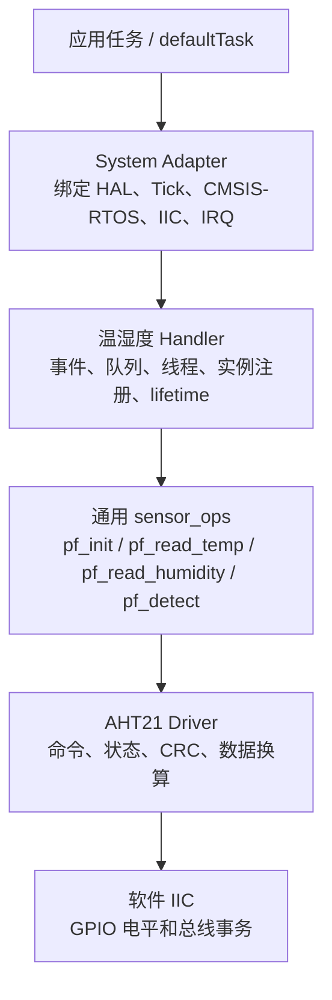
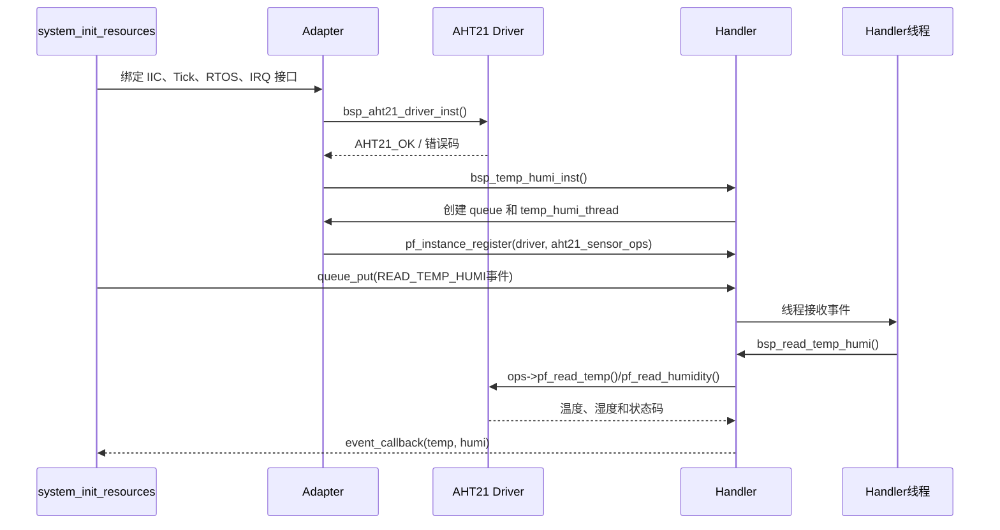
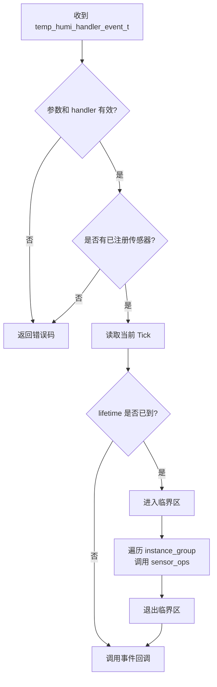
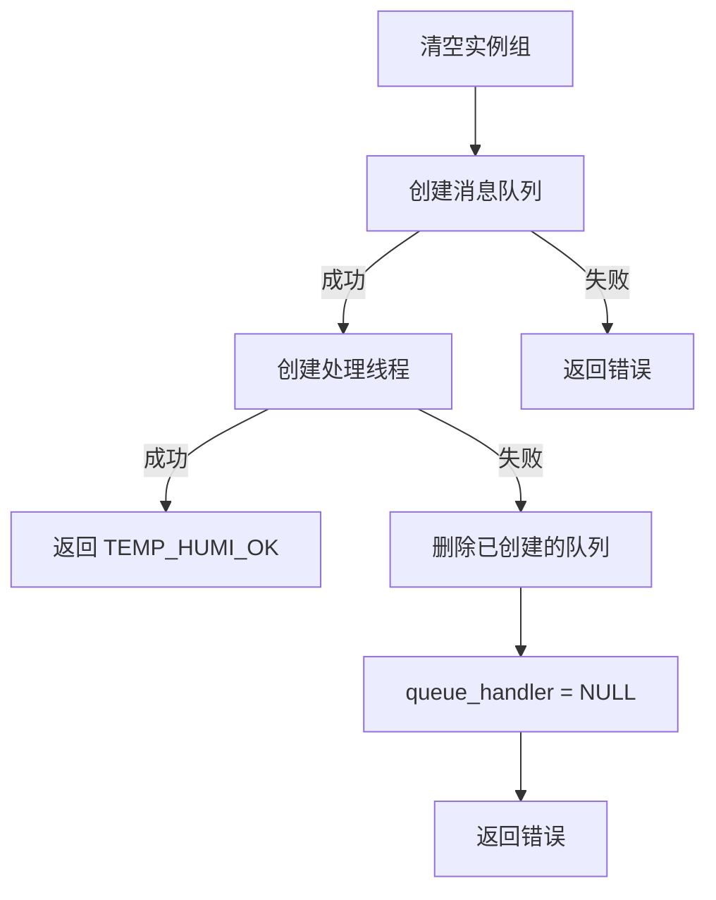

> 来源：Deep-In-Embedded / [开发板/ARM架构/STM32F411CEU6/AHT21的handler文件架构设计思路.md](https://github.com/shuai-yemao/Deep-In-Embedded/blob/5fcab575fc20cf681f3e79e163337211097c898a/%E5%BC%80%E5%8F%91%E6%9D%BF/ARM%E6%9E%B6%E6%9E%84/STM32F411CEU6/AHT21%E7%9A%84handler%E6%96%87%E4%BB%B6%E6%9E%B6%E6%9E%84%E8%AE%BE%E8%AE%A1%E6%80%9D%E8%B7%AF.md)

# 📖 引言

> 这篇笔记要讲什么？用一句话概括核心主题。

将同一类 bsp 外设的共同实现逻辑抽象出来，作为一个可复用的 handler 与具体外设解耦

---

# 📝 handler 文件的设计思路

> 用一句话说清楚这个知识点是什么。

## 实际意义

> 为什么会有该知识点？

1. **把“单个设备驱动”提升为“传感器管理服务”**：`bsp_aht21_driver` 只负责一个 AHT21 的初始化、测量和休眠；`bsp_temp_humi_handler` 负责统一管理传感器实例，不让上层直接依赖 AHT21 类型。
2. **隔离具体驱动差异**：handler 只依赖 `temp_humi_handler_sensor_ops_t`，通过 `void *instance + ops` 调用传感器功能，因此后续可以注册其他温湿度驱动，而不修改 `bsp_read_temp_humi()`。
3. **把同步读取包装成事件驱动**：上层提交 `temp_humi_handler_event_t` 到队列，handler 线程负责读取、限频和回调，应用任务不需要直接等待传感器测量。
4. **统一管理系统资源**：队列、线程、时基、延时和临界区都通过 adapter 注入，handler 不直接调用 `osMessageQueue*`、`osThread*` 或 `HAL_GetTick()`。
5. **让故障边界更清楚**：参数错误、未初始化、实例容量已满、OS 资源创建失败和传感器读取失败分别由 handler 或 driver 返回，便于 RTT 日志定位。

## 应用场景

> 在实际中主要被用来做什么？

1. 为 OS/app 层提供统一的温湿度读取入口，无需关注底层是 AHT21、软件 IIC 还是硬件 IIC。
2. 在 `STM32F411CEU6 + FreeRTOS` 工程中，通过消息队列发送读取事件，由 `temp_humi_thread` 异步处理。
3. 使用 `lifetime` 控制最小读取间隔，避免上层高频调用导致 AHT21 被重复触发或 IIC 总线被占满。
4. 同时管理多个传感器实例；当前 `TEMP_HUMI_NUM_MAX` 为 3，每个实例由 `instance` 和对应的 `ops` 组成。
5. 将 HAL、CMSIS-RTOS、GPIO、Tick、互斥锁和临界区适配集中在 `System/Adapter/Src/system_adapter.c`，便于更换平台或 RTOS。

## 核心逻辑/原理

> 它是如何工作的？拆解背后的机制。

分析项目架构设计，了解需要的南向接口和北向接口

根据南向接口和北向接口，分别设计 handle 结构体以及内部实现函数和向外提供接口函数

默认的北向接口有 handle 构造，handle 注册，以及外设操作函数

默认的南向接口有 OS 层的队列，线程，延时以及临近区操作函数，core 层有系统 tick

### Handler 的分层边界



Handler 的核心原则是：**它知道“要读取哪类数据、何时读取、结果通知谁”，但不知道 AHT21 的命令字节和 IIC 波形**。Adapter 则负责把工程实际资源接入这些抽象接口。

### Handler 的核心数据结构

#### 1. 传感器操作表

`temp_humi_handler_sensor_ops_t` 是 handler 与具体 driver 之间的适配协议。AHT21 的 `aht21_sensor_read_temp()` 等包装函数把 `aht21_status_t` 转换为 `temp_humi_handler_status_t`。

```c
typedef struct {
    temp_humi_handler_status_t (*pf_init)(void *self);
    temp_humi_handler_status_t (*pf_deinit)(void *self);
    temp_humi_handler_status_t (*pf_read_temp)(void *self, float *temp);
    temp_humi_handler_status_t (*pf_read_humidity)(void *self, float *humi);
    temp_humi_handler_status_t (*pf_detect)(void *self);
} temp_humi_handler_sensor_ops_t;
```

#### 2. 实例节点和实例组

```c
typedef struct {
    void *instance;
    temp_humi_handler_sensor_ops_t *ops;
} temp_humi_sensor_node_t;

typedef struct {
    uint32_t instance_num;
    temp_humi_sensor_node_t instance_group[TEMP_HUMI_NUM_MAX];
} temp_humi_handler_instance_t;
```

`instance` 指向具体的 `bsp_aht21_driver_t`，`ops` 指向 AHT21 的通用操作表。handler 遍历实例组时只调用 `ops`，因此不需要强制转换成 AHT21 类型。

#### 3. 读取事件

```c
typedef struct {
    float *temp;
    float *humi;
    uint32_t lifetime;
    temp_humi_handler_event_status_t read_status;
    void (*pf_event_callback)(float *, float *);
} temp_humi_handler_event_t;
```

事件同时携带输出地址、读取类型、最小读取间隔和完成回调。它是队列中传递的最小业务消息，而不是直接传递 AHT21 命令。

### 初始化、注册和读取流程



当前工程中的启动顺序是：先初始化 AHT21 driver，再初始化 handler 的队列和线程，最后把 AHT21 实例注册到 handler，最后投递一次 `READ_TEMP_HUMI` 启动自检事件。不能在 handler 尚未初始化或 driver 尚未成功实例化时注册传感器。

### `bsp_read_temp_humi()` 的具体逻辑

1. 检查 `self` 和 `msg`，再检查 handler 初始化状态和已注册实例数量。
2. 通过 `p_get_timebase->pf_get_time_ms()` 获取当前 Tick。
3. 根据 `READ_TEMP`、`READ_HUMI`、`READ_TEMP_HUMI` 选择 `last_read_time` 索引。
4. 若 `current_time - last_read_time < lifetime`，跳过本次硬件读取并返回成功。
5. 进入临界区，遍历 `instance_group`，调用已注册传感器的操作函数。
6. 退出临界区，调用 `pf_event_callback` 通知上层。



### Adapter 层的职责

`system_adapter.c` 是工程绑定层，不负责定义 handler 业务规则，而是把真实平台资源填入接口表：

| Adapter 内容                      | 绑定对象                     | 用途                     |
| ------------------------------- | ------------------------ | ---------------------- |
| `stm32_gpio_init/write/read`    | STM32 GPIO、PB13/PB14     | 软件 IIC 的 SDA/SCL 操作    |
| `stm32_delay_us`                | 微秒延时                     | IIC 位级时序               |
| `adapter_get_time_ms`           | `HAL_GetTick()`          | handler 的 lifetime 和超时 |
| `adapter_handler_os_delay_ms`   | `osDelay()`              | handler 线程让出 CPU       |
| `adapter_handler_os_queue_*`    | CMSIS-RTOS Message Queue | 事件异步传递                 |
| `adapter_handler_os_thread_*`   | CMSIS-RTOS Thread        | 创建和删除 handler 线程       |
| `adapter_handler_os_critical_*` | `osKernelLock/Unlock`    | 保护实例注册和读取              |
| `adapter_lock/unlock`           | AHT21 互斥锁                | 保护底层传感器通信              |

Adapter 还负责把 `osStatus_t` 映射为 `TEMP_HUMI_*` 状态码，避免 handler 直接依赖 CMSIS-RTOS 的错误枚举。

### lifetime 分类型限频机制

`bsp_read_temp_humi()` 使用静态数组 `last_read_time[3]` 而非单一全局时间戳：

```c
static uint32_t last_read_time[3] = {0};
// [0]: READ_TEMP    温度独立计时
// [1]: READ_HUMI    湿度独立计时
// [2]: READ_TEMP_HUMI 温湿度组合独立计时
```

三种读取类型各自有独立的 `lifetime`，互不干扰。例如：温度 lifetime=500ms、湿度 lifetime=2000ms——读温度不会重置湿度的限频计时器。

`lifetime = 0` 的语义是 " 无限频限制 "（`elapsed_time < 0` 永远为 false），每次调用都直通传感器。但高频读取会导致 I2C 总线被占满和传感器过热，实际项目中应设置合理的最小间隔。

### 初始化的资源回滚

`bsp_temp_humi_init()` 按顺序创建队列和线程，**创建失败必须逆序回滚**：



线程创建失败时不删除队列 → 队列句柄泄漏。去初始化 `bsp_temp_humi_deinit()` 按相反顺序释放：先删线程 → 再删队列 → 再清实例组 → 最后清标志位。

### 反实例化 `bsp_temp_humi_deinst()` 的清零流程

与 driver 层 `pf_deinst()` 设计一致，handler 反实例化由外向内逐层清零：

1. 检查 handler 不能处于 `TEMP_HUMI_INITED` 状态（必须先调 pf_deinit）
2. 临界区内：清空 `instance_group` 数组、`instance_num = 0`
3. 退出临界区：置空 `p_temp_humi_os`、`queue_handler`、`thread_handler`
4. 置空所有函数指针（pf_deinst/pf_init/pf_deinit/pf_instance_register）
5. `is_inited = TEMP_HUMI_NOT_INITED`

**设计意图**：`pf_deinit()` 负责释放 OS 资源（线程/队列），`pf_deinst()` 负责解绑指针和函数映射。两者不能混淆——必须先释放 OS 资源才能安全解绑指针。

## 关键公式/结论

> 最终结论和公式。

1. Handler 管理的是“事件和传感器实例”，driver 管理的是“设备协议和一次测量”。
2. `instance_num` 表示已经注册的有效节点数量，不能超过 `TEMP_HUMI_NUM_MAX`。
3. `lifetime` 的作用是限频，不是传感器测量超时；底层 driver 仍必须自己处理 AHT21 忙状态和 IIC 超时。
4. 队列消息传递的是 `temp_humi_handler_event_t`，其中的指针必须在事件处理完成前保持有效。
5. 注册、读取和去初始化都可能与 handler 线程并发访问实例组，必须使用临界区或等效同步机制。
6. Adapter 只做平台映射和状态转换，不应把 AHT21 命令、业务限频或回调逻辑塞进适配函数。

## 实际操作步骤

> 动手验证/配置的具体操作。

### 第一步：先定义 Handler 的通用模型

根据上层需要确定 `temp_humi_handler_event_t`、读取类型、回调方式和 `lifetime` 语义；再根据多实例需求确定 `instance_group` 和 `TEMP_HUMI_NUM_MAX`。

### 第二步：定义 driver 与 Handler 的桥接接口

实现 `temp_humi_handler_sensor_ops_t`，将 AHT21 driver 的 `pf_init`、`pf_read_temp`、`pf_read_humidity` 和 `pf_read_id` 包装为 handler 状态码。桥接函数必须检查 `self`、输出指针和底层函数指针。

### 第三步：实现 Handler 生命周期

在 `bsp_temp_humi_inst()` 中检查依赖并绑定函数指针；在 `bsp_temp_humi_init()` 中清空实例组、创建容量为 10 的消息队列和 `temp_humi_thread`；创建线程失败时删除已经创建的队列并回滚。

### 第四步：实现事件读取和限频

在 `bsp_read_temp_humi()` 中完成参数检查、Tick 获取、读取类型选择、`lifetime` 判断、临界区保护、遍历实例、回调通知和错误日志。

### 第五步：在 Adapter 中绑定平台资源

在 `system_adapter.c` 中依次绑定 AHT21 IIC 接口、handler 时基接口、CMSIS-RTOS 队列/线程/延时接口和临界区接口；然后调用 `system_init_resources()` 完成 driver 实例化、handler 实例化、传感器注册和启动自检事件投递。

### 第六步：分层验证

先验证 AHT21 driver 单独读数，再验证 `aht21_sensor_ops` 包装，再验证 handler 同步读取，最后验证队列、线程和回调链路。测试应覆盖空指针、未初始化、队列创建失败、线程创建失败、实例数量满、`lifetime` 未到期和传感器读取失败。

## 常见问题

> 现象 → 根因 → 修复。

### 发现的问题

1. Handler 直接依赖 AHT21 类型会导致无法复用其他温湿度传感器。
2. 事件中的 `temp`、`humi` 是外部指针，若指向临时变量或已离开作用域的内存，异步线程读取时会产生悬空指针。
3. handler 线程创建失败时，如果不删除已经创建的队列，会造成资源泄漏。
4. `lifetime` 只控制 handler 是否发起读取，不能替代 driver 内部的测量等待和通信超时。
5. 读取和注册同时访问 `instance_group` 时未进入临界区，会产生实例数量或函数指针读取不一致。

### 根因分析

这些问题都来自“异步事件”和“多实例接口”带来的生命周期复杂度：handler 保存的是通用指针和函数指针，真正对象的有效期由 Adapter/系统初始化流程保证；队列只复制事件结构体，不会自动复制 `temp`、`humi` 指向的数据。与此同时，handler 的队列、线程和实例数组属于共享资源，初始化失败和并发访问都必须有明确的回滚和保护策略。

### 改进方法

1. 用 `temp_humi_handler_sensor_ops_t` 隔离具体 driver，handler 不包含 AHT21 专用命令。
2. 明确事件内存规则：异步投递的事件和输出缓存必须在回调完成前保持有效，优先使用静态或任务生命周期内的对象。
3. 初始化按“创建资源 → 后续资源失败则回滚”的顺序实现，去初始化按相反顺序释放。
4. 用独立状态码区分 handler 错误和 driver 错误，必要时在 Adapter 中做统一映射。
5. 对注册、读取和清理使用临界区或互斥锁，确保实例数组和队列句柄不会被并发修改。
6. 在启动阶段保留一次 `READ_TEMP_HUMI` 自检事件，通过 RTT 日志确认 Adapter → Handler → Driver → IIC 链路完整。

---

# 💬 Q&A

> 自问自答，检验理解深度。按难度递进排列。

## 🟢 基础

> 最基本的概念和用法，入门必知。

### Q 1：什么是高内聚低耦合?

A 1：

1. 高内聚：文件内各函数的实现依赖于文件内部
2. 低耦合：函数的实现不依赖于外部函数

### Q 2：函数指针定义的接口相较于包含头文件它的优势在哪里?

A 2：

1. 从内存方面来说，包含头文件是编译器在预处理阶段将头文件内容复制在当前文件中，而函数指针定义的接口根据芯片平台如 stm 32，指针字节为 4 字节
2. 从架构设计方面来说，函数指针相比于包含头文件能实现解耦与多态，包含头文件本身就是依赖于外部文件接口了

## 🟡 进阶

> 容易踩的坑和常见误区。

### Q3：Handler 通过 `void *instance + sensor_ops` 调用传感器。如果换成 SHT30 芯片，Handler 代码需要改什么？

A3：

Handler 代码**零改动**。它只依赖 `temp_humi_handler_sensor_ops_t` 抽象接口和 `void *instance` 通用指针，不包含任何 AHT21 专用命令或数据解析。新增 SHT30 只需：

1. 为 SHT30 实现一套 `temp_humi_handler_sensor_ops_t` 包装函数（pf_init/pf_read_temp/pf_read_humidity/pf_deinit/pf_detect）
2. 在 Adapter 层调用 `handler.pf_instance_register(&handler, &sht30_driver, &sht30_sensor_ops)` 注册即可

这就是函数指针表 + void* 泛型在多传感器管理中的核心价值——通过统一接口实现对具体驱动的解耦。

## 🔴 困难

> 结合实战的深层原理和设计权衡。

### Q4：Handler 有临界区（`pf_os_critical_enter/exit`），Driver 有互斥锁（`pf_lock/unlock`）。为什么不合并成一个锁？两层保护的职责边界在哪？

A4：

两层锁不可合并，因为**保护对象和时间尺度完全不同**：

| 维度 | Handler 临界区 | Driver 互斥锁 |
|------|---------------|--------------|
| **保护对象** | 软件数据结构（`instance_group` 数组、`instance_num`） | 硬件资源（I2C 总线、AHT21 传感器） |
| **持锁时长** | 微秒级（数组操作） | 可能 80ms+（等测量完成） |
| **并发场景** | 注册传感器 vs 遍历读取 | 多线程同时发起 I2C 通信 |
| **失败后果** | 实例数不一致、野指针 | I2C 总线冲突、数据损坏 |

如果合并：在 handler 遍历实例组时持锁等待 80ms 测量 → 注册传感器被阻塞 → 整个 handler 不可用。分层锁让 handler 的 " 管理 " 动作（微秒级）和 driver 的 " 通信 " 动作（毫秒级）互不干扰。

---

# 📋 总结

> 3-5 句话回顾核心要点，用自己的话复述。

本工程的 handler 位于 AHT21 driver 之上，负责管理传感器实例、统一读取接口、事件队列、处理线程和读取频率，而不直接处理 AHT21 命令或 IIC 时序。通过 `temp_humi_handler_sensor_ops_t`，AHT21 driver 被包装成通用温湿度传感器接口，handler 可以用同一套逻辑管理不同传感器。`system_adapter.c` 将 STM32 GPIO、`HAL_GetTick()`、CMSIS-RTOS 队列/线程、延时和临界区操作注入 handler，实现平台解耦。一次完整的数据链路是：Adapter 绑定资源 → 实例化 driver → 初始化 handler → 注册传感器 → 投递事件 → handler 线程读取 → 回调返回数据。设计时必须特别注意事件中输出指针的生命周期、实例数组的并发保护、队列和线程创建失败时的资源回滚，以及 `lifetime` 限频与 driver 内部测量超时之间的区别。

---

# 📎 参考资料

> 学习过程中用到的外部资源汇总。

## 🎥 视频链接

> B 站 / YouTube 教程，优先选项目实战类和原理动画类。

- 暂无固定视频资源；本笔记主要依据工程源码、接口注释、RTOS 运行链路和实际调试结果。

## 🔗 博客/文档链接

> 分析最透彻的博客、官方文档、社区帖子。

- [CMSIS-RTOS2 API Reference](https://arm-software.github.io/CMSIS_6/latest/RTOS2/index.html) — 用于核对消息队列、线程、延时和内核锁等接口语义。
- [FreeRTOS Documentation](https://www.freertos.org/Documentation/02-Kernel/04-API-references) — 用于理解任务、队列、临界区和调度相关概念。
- [[AHT21的driver文件架构设计思路]] — 说明单个 AHT21 driver 的初始化、测量、CRC 和状态码设计。
- [[AHT21驱动调试-Bug记录]] — 记录 AHT21 驱动和 adapter 联调过程中遇到的问题、实验和修复方案。
- [[根据数据手册编写AHT21的模拟IIC]] — 说明 AHT21 数据手册、模拟 IIC 时序和底层通信流程。
- [[AHT21的单元测试文件架构设计思路]] — Driver 和 Handler 的 Mock 注入单元测试设计与覆盖分析。
- [[W25Qxx的handler文件架构设计思路]] — 对比：事件 + 限频（AHT21）vs 块存储缓冲（W25Qxx）两种 Handler 设计模式

## 💻 仓库链接

> GitHub / Gitee 源码仓库，含 Demo 工程和工具链。

- 当前笔记对应本地工程：`STM32F411CEU6_AHT21`，包含 driver、handler、IIC 和 System Adapter 实现。
- 当前工程使用的 Unity 源码位于 `Middlewares/Third_Party/Unity/`，用于验证传感器接口和适配层逻辑。

## 📄 代码/附件

> 本地 PDF、代码包、工具链文件。

- `BSP/AHT21/handler/Inc/bsp_temp_humi_handler.h` — handler 状态码、事件、传感器操作表、OS 接口和实例结构体。
- `BSP/AHT21/handler/Src/bsp_temp_humi_handler.c` — 实例化、队列/线程创建、传感器注册、lifetime 限频和事件读取实现。
- `System/Adapter/Inc/system_adapter.h` — 系统适配层的公开声明和工程状态接口。
- `System/Adapter/Src/system_adapter.c` — GPIO、软件 IIC、Tick、CMSIS-RTOS、互斥锁和 handler 资源绑定。
- `BSP/AHT21/driver/Inc/bsp_aht21_driver.h` — AHT21 driver 的北向操作接口和状态码。
- `BSP/AHT21/driver/Src/bsp_aht21_driver.c` — AHT21 设备级初始化、测量、休眠、唤醒和 CRC 校验。
- `System/Adapter/Test/system_adapter_iic_unity_test.c` — IIC/Adapter 测试入口和测试集成参考。
- [[AHT21的driver文件架构设计思路]]
