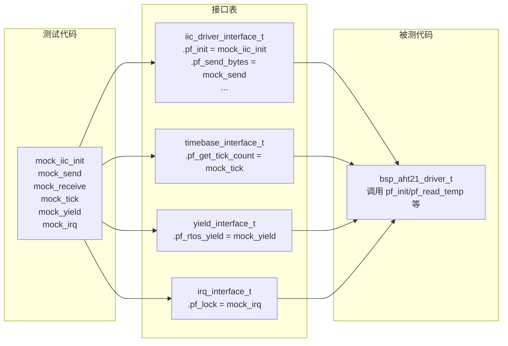
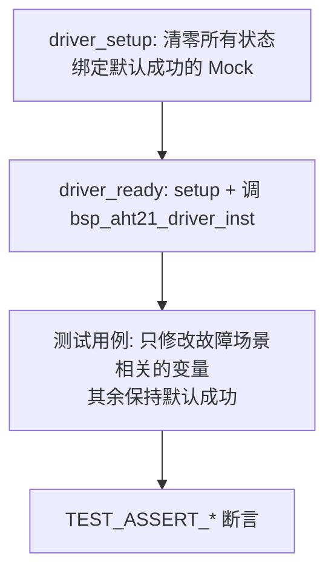
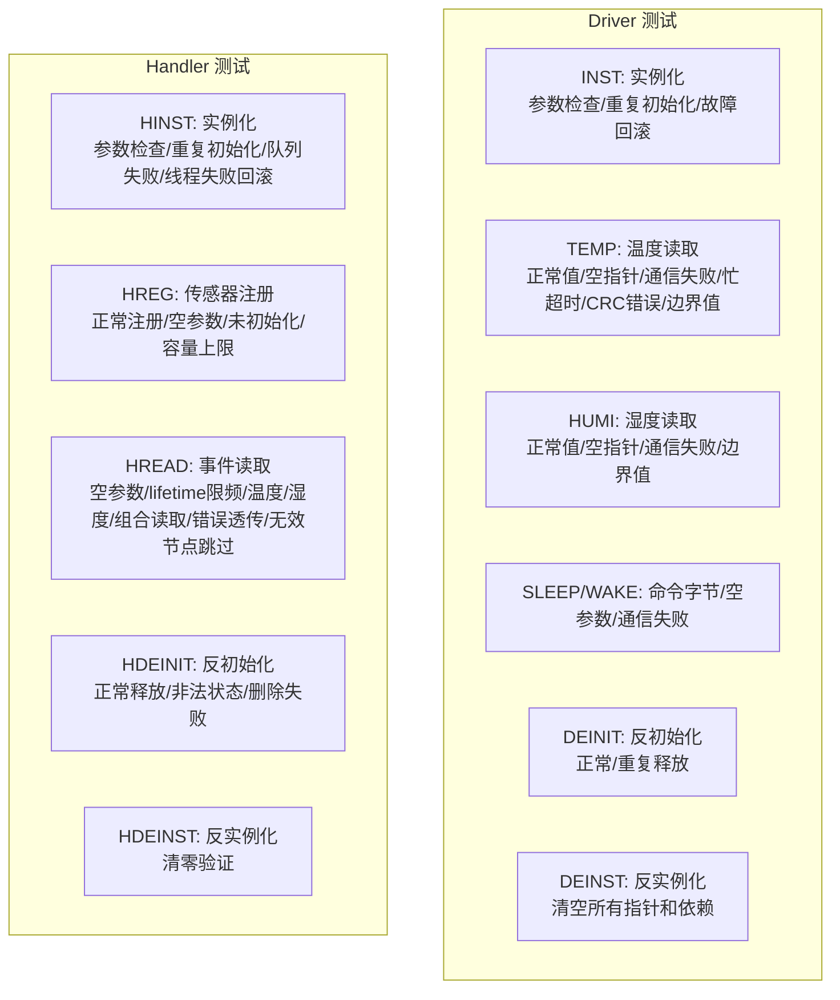

> 来源：Deep-In-Embedded / [开发板/ARM架构/STM32F411CEU6/AHT21的单元测试文件架构设计思路.md](https://github.com/shuai-yemao/Deep-In-Embedded/blob/5fcab575fc20cf681f3e79e163337211097c898a/%E5%BC%80%E5%8F%91%E6%9D%BF/ARM%E6%9E%B6%E6%9E%84/STM32F411CEU6/AHT21%E7%9A%84%E5%8D%95%E5%85%83%E6%B5%8B%E8%AF%95%E6%96%87%E4%BB%B6%E6%9E%B6%E6%9E%84%E8%AE%BE%E8%AE%A1%E6%80%9D%E8%B7%AF.md)

# 📖 引言

> AHT21 单元测试通过 Mock 函数指针注入绕过硬件依赖，在宿主机上对 Driver 和 Handler 的协议逻辑、错误路径和边界条件进行确定性验证，确保代码在脱离 STM32 硬件后仍可快速回归。

---

# 📝 单元测试的设计思路

> 通过 Mock 注入绕过硬件依赖，在宿主机上对 AHT21 Driver 和 Handler 的协议逻辑、错误路径和边界条件进行确定性单元测试。

## 实际意义

> 为什么会有该知识点？解决了什么实际问题？

1. **脱离硬件环境验证代码**：测试只需 `gcc` 编译运行，不用烧固件、接传感器、连逻辑分析仪。代码移植到其他平台后第一时间就能跑通测试确认可行性。
2. **错误路径确定性覆盖**：在真实硬件上很难稳定复现"I2C 忙超时""CRC 校验失败""线程创建失败回滚"等异常场景，Mock 可以精确注入任何返回值和状态。
3. **测试隔离避免污染**：每个测试用例通过 `setup()` 函数从干净状态开始，不依赖执行顺序，前一个用例的脏状态不会导致后续用例误报。
4. **快速回归**：修改 Driver 或 Handler 后，几秒内跑完全部 40+ 测试用例，比"编译→烧录→接传感器→等读数"快 100 倍以上。

## 应用场景

> 在实际中主要被用来做什么？

1. **代码移植后快速验证**：从 STM32 移植到 ESP32 或其他 MCU 时，先跑通单元测试确认协议逻辑不受平台影响。
2. **功能正确性验证**：温湿度换算公式、CRC8 校验、命令字节序列、lifetime 限频逻辑——全部有对应的断言。
3. **错误路径测试**：I2C 发送失败、接收失败、忙超时、CRC 不匹配、队列创建失败、线程创建失败——所有错误分支都有覆盖。
4. **资源生命周期验证**：实例化→初始化→注册→读取→反初始化→反实例化的完整生命周期，以及失败回滚路径（如线程创建失败后队列是否被正确删除）。

## 核心逻辑/原理

> 它是如何工作的？拆解背后的机制。

### 1. Mock 注入机制

测试文件不依赖 Unity 框架的 Mock 功能，而是直接利用 **C 语言函数指针替换**：



**注入流程**：
1. 测试定义 Mock 函数（如 `mock_iic_init`、`mock_send`、`mock_receive`）
2. 在接口表中绑定：`iic.pf_init = mock_iic_init`
3. 通过 `bsp_aht21_driver_inst(&driver, &ops)` 注入 driver
4. Driver 调用 `pf_init()` 时，实际执行的是 Mock 代码

### 2. 可配置的 Mock 返回值

Mock 函数的行为通过静态变量控制，不修改 Mock 逻辑本身：

```c
/* Mock 返回值变量 —— 测试用例通过修改它们注入不同故障 */
static aht21_status_t iic_init_result;   /* I2C 初始化返回值 */
static aht21_status_t iic_send_result;   /* I2C 发送返回值 */
static aht21_status_t iic_receive_result; /* I2C 接收返回值 */
static uint8_t status_value;             /* AHT21 状态字模拟值 */
static uint8_t busy_remaining;           /* 忙状态持续次数 */

/* Mock 函数 —— 代码永远不变，行为由上面变量控制 */
static aht21_status_t mock_iic_init(void) {
    init_count++;           /* 记录调用次数 */
    return iic_init_result; /* 返回测试用例设定的值 */
}
```

**为什么不用 if/else？** 如果 Mock 函数里写死 `if (某些条件) return ERROR`，每加一个错误场景就要改 Mock 逻辑。用返回值注入后，用例只需一行：`iic_send_result = AHT21_ERROR;`

### 3. 测试夹具（Fixture）



- **`driver_setup()`**：memset 清零 driver/ops/iic/timebase 等全部结构体，绑定默认成功的 Mock 函数，重置所有计数器和返回值变量。每个测试用例只能调用一次。
- **`driver_ready()`**：`driver_setup() + bsp_aht21_driver_inst(&driver, &ops)`，返回已就绪的驱动实例。
- **Handler 同理**：`handler_setup()` → `handler_ready()`。

### 4. 调用计数器验证

Mock 函数内部维护调用计数器，用于验证调用次数和调用顺序：

| 计数器 | 验证内容 |
|--------|---------|
| `init_count` / `deinit_count` | I2C 初始化/反初始化是否被调用 |
| `send_count` / `receive_count` | 发送/接收次数，验证轮询重试次数 |
| `status_count` | 状态读取次数（初始化时至少 3 次） |
| `yield_count` | RTOS 让出次数（验证 80ms 等待期间不忙等） |
| `queue_create_count` / `queue_delete_count` | 队列创建/删除是否成对 |
| `thread_create_count` / `thread_delete_count` | 线程创建/删除是否成对 |
| `critical_enter_count` / `critical_exit_count` | 临界区进入/退出是否平衡 |
| `temp_read_count` / `humi_read_count` | 传感器读取调用次数 |
| `callback_count` | 回调函数是否被触发 |

### 5. 测试分类体系



测试分组前缀约定：
- **Driver**：`INST`（实例化生命周期）、`TEMP`（温度读取）、`HUMI`（湿度读取）、`SLEEP`/`WAKE`（电源状态）、`DEINIT`/`DEINST`（资源释放）
- **Handler**：前缀加 `H`——`HINST`（Handler 实例化）、`HREG`（注册）、`HREAD`（读取）、`HDEINIT`/`HDEINST`（释放）

### 6. 忙状态轮询模拟

```c
static uint8_t busy_remaining; /* 忙状态需要持续的接收次数 */

static aht21_status_t mock_receive(...) {
    if (busy_remaining > 0U) {
        data[0] |= AHT21_STATUS_BUSY_MASK; /* 置位 busy bit */
        busy_remaining--;                  /* 递减，模拟轮询多次后变空闲 */
    }
    ...
}
```

- `busy_remaining = 1` → 一次忙后成功（验证驱动正确重试）
- `busy_remaining = 20`（大于 `AHT21_BUSY_RETRY_MAX = 10`）→ 超时（验证超时错误码）

### 7. CRC 校验测试

```c
/* 测试代码内置相同多项式，先算出正确 CRC，再构造测量帧 */
static uint8_t test_crc8(const uint8_t *data, uint8_t length) {
    uint8_t crc = 0xFFU;
    /* ... 多项式 0x31 运算 ... */
}

/* 篡改 CRC 字节进行异常注入 */
measurement[6] ^= 0xFFU; /* 翻转整个 CRC 字节 */
TEST_ASSERT_EQUAL(AHT21_ERROR, driver.pf_read_temp(&driver, &temperature));
```

### 8. Lifetime 限频测试

```c
/* 验证 lifetime 未到期时跳过传感器读取 */
event = make_event(READ_TEMP, &temperature, NULL, 1000U); /* lifetime=1000ms */
event.pf_event_callback = mock_callback;
TEST_ASSERT_EQUAL(TEMP_HUMI_OK, bsp_read_temp_humi(&handler, &event));
TEST_ASSERT_EQUAL_UINT32(0U, temp_read_count);   /* 传感器未被调用 */
TEST_ASSERT_EQUAL_UINT32(0U, callback_count);     /* 回调未被触发 */
```

`current_time = 100`，`last_read_time[0] = 0`，`elapsed_time = 100 < 1000` → 跳过。

### 9. 表驱动测试

对参数组合多但逻辑相同的场景，用一个循环 + switch 覆盖多个用例，避免重复函数：

```c
void test_handler_HINST_002_to_004_invalid_dependencies_table(void) {
    static const char *const case_names[] = {
        "NULL handler instance", "NULL timebase", "NULL OS interface"
    };
    for (i = 0U; i < (sizeof(case_names) / sizeof(case_names[0])); i++) {
        handler_setup();
        switch (i) {
        case 0U: /* NULL handler */  break;
        case 1U: /* NULL timebase */ break;
        default: /* NULL OS */       break;
        }
    }
}
```

### 10. 编译隔离

```c
#if defined(UNITY_SMOKE_TEST)
/* 所有测试函数和 Mock 在此范围内 */
void aht21_unity_test_run(void) {
    aht21_driver_tests_run();
    temp_humi_handler_tests_run();
}
#endif
```

测试仅在生产构建不定义 `UNITY_SMOKE_TEST` 时被排除，避免 ROM 浪费和 `main()` 重复定义。

## 关键公式/结论

> 最终结论和公式。

1. **Mock = 函数指针替换**，不是 Unity 框架特性——任何能编译 C 的平台都能用这套方案。
2. **测试隔离的黄金法则**：每个用例从 `setup()` 开始，不依赖其他用例的副作用。
3. **返回值注入 > 条件分支**：Mock 代码写一次不变，行为变化通过变量控制。
4. **调用计数器让隐性行为可见**：初始化次数、轮询次数、临界区成对性——这些在真实硬件上难以观测的信息，计数器直接断言。
5. **表驱动测试适合参数组合**：同类逻辑不同参数用一个循环覆盖，函数少但覆盖全。
6. **编译隔离防止测试入侵生产固件**：`#if defined(UNITY_SMOKE_TEST)` 确保测试代码不出现在正常固件中。

## 实际操作步骤

> 动手验证/配置的具体操作。

### 第一步：搭建 Mock 函数

为每个依赖接口（I2C、时基、RTOS yield、IRQ）编写 Mock 函数。Mock 函数只做三件事：记录调用次数、保存参数、返回预设值。

```c
/* 记录 I2C 初始化调用，并返回当前测试配置的结果 */
static aht21_status_t mock_iic_init(void) {
    init_count++;
    return iic_init_result;
}

/* 保存驱动发出的命令帧，便于测试检查协议内容 */
static aht21_status_t mock_send(uint8_t address, uint8_t *data, uint8_t size) {
    memcpy(last_command, data, size < 3 ? size : 3);
    last_address = address;
    last_size = size;
    send_count++;
    return iic_send_result;
}
```

### 第二步：编写 Setup 夹具

在 `setup()` 中：memset 清零所有结构体 → 绑定 Mock 函数 → 重置计数器和返回值变量为默认成功状态。

### 第三步：编写 Ready 夹具

`ready()` = `setup()` + 调用实例化函数，返回已初始化的被测对象。大部分测试用例从 `ready()` 开始，只修改故障场景相关变量。

### 第四步：编写测试用例

按 AAA（Arrange-Act-Assert）模式：
1. **Arrange**：调 `driver_ready()` / `handler_ready()`，设置故障注入变量
2. **Act**：调用被测函数
3. **Assert**：用 `TEST_ASSERT_EQUAL` / `TEST_ASSERT_FLOAT_WITHIN` / `TEST_ASSERT_NULL` 验证

### 第五步：注册测试并运行

```c
static void aht21_driver_tests_run(void) {
    RUN_TEST(test_driver_INST_001_normal_instance);
    RUN_TEST(test_driver_INST_002_to_007_invalid_parameters_table);
    RUN_TEST(test_driver_TEMP_001_011_normal_value_and_command);
    // ... 全部 40+ 用例
}

void aht21_unity_test_run(void) {
    aht21_driver_tests_run();
    temp_humi_handler_tests_run();
}
```

## 常见问题

> 现象 → 根因 → 修复。均来自实际调试经历。

### 问题 1：测试固件出现 `main multiply defined`

**现象**：测试固件编译报 `multiple definition of main` 链接错误。

**根因**：Unity 测试入口泄漏到正常固件目标。正常固件的 `main()` 和 Unity 的 `main()` 同时存在。

**修复**：所有测试代码包裹在 `#if defined(UNITY_SMOKE_TEST)` 内，只在测试宏定义时编译。

### 问题 2：相邻测试用例相互干扰

**现象**：单独跑用例 B 通过，但 B 跑在 A 之后却失败。

**根因**：用例 A 修改了共享静态变量（如 `iic_send_result = AHT21_ERROR`），用例 B 未重置就使用脏状态。

**修复**：每个测试用例开头必须调用 `setup()` / `ready()`，禁止直接复用上一用例的变量状态。

### 问题 3：临界区不配对导致后续用例误报

**现象**：`critical_exit_count` 比 `critical_enter_count` 多 1。

**根因**：被测代码在某种错误路径下进入了临界区但未退出。

**修复**：在异常路径测试中显式清零 `critical_enter_count = critical_exit_count = 0`，然后断言两者相等。

---

# 💬 Q&A

> 自问自答，检验理解深度。按难度递进排列。

## 🟢 基础

> 最基本的概念和用法，入门必知。

### Q1：Mock 注入的本质是什么？

A1：Mock 注入的本质是 **C 语言函数指针替换**——不是 Unity 框架的特殊功能。测试文件定义自己的函数（如 `mock_iic_init()`），把函数地址赋给接口表的函数指针（`iic.pf_init = mock_iic_init`），然后通过 `aht21_ops_t` 注入 driver。Driver 调用 `pf_init()` 时实际执行的是 Mock 代码，实现了硬件依赖的完全替换。

### Q2：为什么每个测试用例都要先调 `driver_setup()`？

A2：为了**测试隔离**。静态全局变量（如计数器、Mock 返回值）在整个测试运行期间持续存在。如果用例 A 修改了 `send_count` 或用例 B 设置了 `iic_init_result = AHT21_ERROR`，不通过 `setup()` 重置的话，用例 C 会被前一个用例的脏状态污染——可能得到错误的 pass 或 false fail。

## 🟡 进阶

> 容易踩的坑和常见误区。

### Q3：Mock 返回值注入用静态变量，不用 if/else 分支，为什么？

A3：如果 Mock 函数里写 `if(某些条件) return ERROR; else return OK;`，每增加一个测试场景就要修改 Mock 函数内部逻辑，Mock 代码会越来越复杂。用 `static aht21_status_t iic_send_result` 控制返回值后，Mock 函数保持 `return iic_send_result` 永不改变，测试用例只需一行 `iic_send_result = AHT21_ERROR` 即可注入任意故障——Mock 和测试解耦。

### Q4：为什么 Handler 测试需要同时验证 `critical_enter_count == critical_exit_count`？

A4：临界区不配对是**并发 Bug 的前兆**。如果 `pf_os_critical_enter()` 被调用但 `pf_os_critical_exit()` 在某个错误路径被跳过，后续所有需要临界区保护的操作都会死锁。在单元测试中验证配对数，可以提前发现真实的资源泄漏和死锁问题，而这些问题在真实硬件上极难复现。

## 🔴 困难

> 结合实战的深层原理和设计权衡。

### Q5：测试代码的 `test_crc8()` 和被测代码的 `aht21_crc8()` 是独立实现。为什么不直接复用被测代码的 CRC 函数？

A5：**测试不应该依赖于被测代码的内部实现细节**。如果两个函数是同一个实现，它们会同时犯同样的 bug——比如多项式用成了 `0x31` 的变体。独立实现的 `test_crc8()` 是对数据手册公式的二次验证：如果两边的结果一致，说明实现和数据手册定义都正确；如果不一致，至少有一个是错的。这种"测试独立实现"模式在加密、校验和协议解析中特别重要。

### Q6：`busy_remaining = 20`（大于 `AHT21_BUSY_RETRY_MAX = 10`）模拟忙超时。为什么不直接设 `busy_remaining = 255` 更极端？

A6：因为驱动代码有**硬退出**——`for (retry = 0; retry < AHT21_BUSY_RETRY_MAX; retry++)` ——循环到第 10 次就会退出。设 `busy_remaining = 20` 或 `255` 都不影响断言结果（最终都会超时），但 `20` 更贴近真实场景（传感器偶尔忙 1-2 次后恢复），而 `255` 只验证了超时路径的一个特化分支。测试设计的原则是：**覆盖所有代码路径，但场景值尽量接近真实行为**。

---

# 📋 总结

> 3-5 句话回顾核心要点，用自己的话复述。

AHT21 单元测试的核心思路是：通过 C 语言的函数指针替换——而非框架特殊功能——将所有硬件依赖（I2C、时基、RTOS、中断）替换为可控制返回值和记录调用次数的 Mock 函数。每个测试用例通过 `setup()` 夹具从干净状态开始，只修改与当前场景相关的几个变量，就能精确覆盖正常流程、错误路径、边界条件和资源回滚。测试按被测模块和功能阶段分类（INST/TEMP/HUMI/HINST/HREG/HREAD 等），通过调用计数器、Mock 返回值注入和独立 CRC 实现等模式，在脱离硬件的条件下实现确定性验证。关键权衡：Mock 保持简单（不写复杂条件分支），测试代码保持独立（不复用被测代码内部实现），用例之间保持隔离（每次 setup 清零）。

---

# 📎 参考资料

> 学习过程中用到的外部资源汇总。

## 🎥 视频链接

> B站/YouTube 教程。

- 暂无固定视频资源；本笔记以工程源码、Unity 官方文档和实际测试运行为主要依据。

## 🔗 博客/文档链接

> 分析最透彻的博客、官方文档、社区帖子。

- [Unity Test Framework - GitHub](https://github.com/ThrowTheSwitch/Unity) — Unity 测试框架官方仓库，包含 API 参考和使用指南。
- [ThrowTheSwitch - Unity Assertions Reference](http://www.throwtheswitch.org/unity) — Unity 断言宏完整参考。
- [[AHT21的driver文件架构设计思路]] — 被测 Driver 层的完整设计文档。
- [[AHT21的handler文件架构设计思路]] — 被测 Handler 层的完整设计文档。

## 💻 仓库链接

> GitHub/Gitee 源码仓库。

- 当前笔记对应本地工程：`STM32F411CEU6_AHT21`，测试文件位于 `BSP/AHT21/Test/aht21_unity_test.c`。

## 📄 代码/附件

> 本地代码文件。

- `BSP/AHT21/Test/aht21_unity_test.c` — 统一测试入口，包含 Driver 和 Handler 的全部 40+ 测试用例。
- `BSP/AHT21/driver/Src/bsp_aht21_driver.c` — 被测 Driver 实现。
- `BSP/AHT21/handler/Src/bsp_temp_humi_handler.c` — 被测 Handler 实现。
- `Middlewares/Third_Party/Unity/Inc/unity.h` — Unity 测试框架头文件。
- `Middlewares/Third_Party/Unity/Src/unity.c` — Unity 测试框架实现。
- `Middlewares/Third_Party/Unity/Inc/unity_config.h` — Unity 平台适配配置。
- `Middlewares/Third_Party/Unity/Src/unity_port.c` — Unity 平台移植（RTT 输出）。
