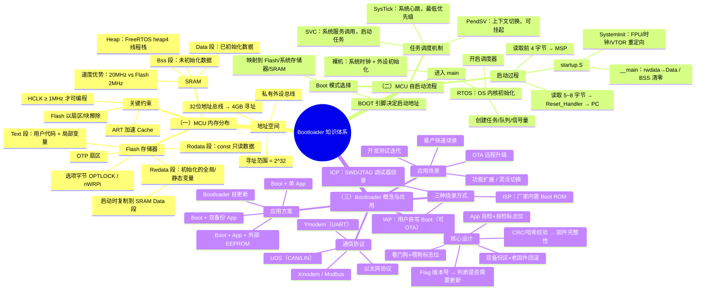

> 来源：Deep-In-Embedded / [开发板/ARM架构/STM32F411CEU6/Bootloader的概念及其应用.md](https://github.com/shuai-yemao/Deep-In-Embedded/blob/5fcab575fc20cf681f3e79e163337211097c898a/%E5%BC%80%E5%8F%91%E6%9D%BF/ARM%E6%9E%B6%E6%9E%84/STM32F411CEU6/Bootloader%E7%9A%84%E6%A6%82%E5%BF%B5%E5%8F%8A%E5%85%B6%E5%BA%94%E7%94%A8.md)

日期：2026.4.4

文章标签： #bootloader

## 1. 学习内容

### 知识点总览

| 序号  | 知识点           |
| --- | ------------- |
| 1   | MCU 的内存分布     |
| 2   | MCU 自启动流程     |
| 3   | Bootloader 概念 |

### 知识点关联思维导图



---

**关联说明：**

> `内存分布` 为启动流程提供物理基础（Flash/SRAM/地址映射）；`自启动流程` 描述从复位到 main 执行的完整路径，其中 VTOR 重定向和 Flash 分区是 Bootloader 的实现前提；`Bootloader` 在 Flash 分区基础上管理固件更新，利用通信协议和容错机制保障可靠升级。**三者构成 " 硬件基础→启动链路→应用方案 " 的递进关系。**

## 2. 逐点精讲

### 知识点 1：MCU 的内存分布

#### 辅助图示

1. 存储器映射 
2. CPU 内部总线和内核组件以及系统外设 
3. 存储器缺省访问许可 
4. Flash 内容构成 
5. 选项字节 
6. 读保护访问限制表 
7. SRAM 与线程堆栈的关系 

#### 通俗人话解释

MCU 的内存可以理解为一栋大楼，有 40 亿个（地址从 0x00000000 到 0xFFFFFFFF）门牌号的大楼，这 40 亿个门牌号就是 MCU 的逻辑空间，而内存映射就是将 MCU 的硬件分配门牌号

#### 核心逻辑/原理

CPU 通过 32 位地址总线来访问 4 G 地址空间，根据指令寄存器中的地址码 AR 来找到对应的内存地址，再根据指令 PC 来执行写或读操作放入 DR 寄存器中

#### 关键公式/结论

1. 地址总线位宽：CPU 用来发送地址信息的物理线路（总线）的根数。它直接决定了 MCU 的寻址能力。
2. ==寻址范围=2^（地址总线位宽）这意味着它的理论寻址范围是 2^32=4,294,967,296 个地址，也就是 4GB 的地址空间。==
3. ==执行任何 Flash 编程操作 (擦除或编程) 时,CPU 时钟频率 (HCLK) 不能低于 1 MHz。==如果在 Flash 操作期间发生器件复位,无法保证 Flash 中的内容。
4. Flash 擦除操作可针对扇区或整个 Flash(批量擦除) 执行。执行批量擦除时,不会影响 OTP 扇区或配置扇区。
5. 当 FLASH_OPTCR 或 FLASH_OPTCR1 寄存器中的低有效写保护位 nWRPi (0 <= i <= 1) 为低电平时,无法对相应的扇区执行擦除或编程操作
6. ==要针对选项字节执行任何操作,Flash 选项控制寄存器 (FLASH_OPTCR) 中的选项锁定位 (OPTLOCK) 必须清零==。
7. Private peripheral bus - Internal 和 External(0 xE000 0000 ~ 0 xE010 0000) 包括了系统级组件,内部私有外设总线 s,外部私有外设总线 s,以及由提供者定义的系统外设。
8. Flash 分为. Text 段、. Rodata 段、. Rwdata 段和空闲空间；text 段存放着用户代码和局部变量；rodata 存放着只读的数据，const 类型；==rwdata 存放着已经初始化的全局变量和静态变量在 MCU 启动后会将此段复制到 SRAM 的 data 段中==
9. 在 os 中使用 heap 4 类型调用 ucheap 函数分配线程栈 ，因为未初始化数据分配至 SRAM 的 bss 段中，每个任务的栈帧中存放着任务的 TCB 和 PSP

### 知识点 2：MCU 自启动流程

#### 辅助图示

1. 自举配置 
2. 自举模式与存储器映射 
3. 存储器映射 
4. startup. S 文件中复位中断 
5. 系统初始化函数 
6. 主函数程序 
7. 任务上下文切换过程 
8. SVC 判断异常来源 
9. ART

#### 通俗人话解释

闹钟响了，你开始起床（上电复位），你不知道今天要干什么？先看一眼手机判断今天要干嘛（boot 模式选择），今天要上班（从 flash 开始），开始洗漱收拾（startup. S 文件执行），到达公司开始工作（main 主程序开始运行）

#### 核心逻辑/原理

1. 系统上电复位，根据 boot 引脚来确定 MCU 启动地址（通俗一点，将其他地址的门牌号作为启动地址的门牌号）
2. 确定启动地址后，开始访问 MCU 启动地址的第 1~4 个字节将其作为 MSP 的栈顶地址
3. 然后访问==第 5~8 个字节这里一般为中断向量表，在 cortex_m 系列的 m 3 和 m 4 为 Reset 异常中断函数的地址==（这里访问异常中断是通过函数指针来间接访问 ）该地址加载到 PC 寄存器中
4. CPU 跳转到启动文件（startup. S）中的复位中断函数，LDR R 0，= SystemInit 将 SystemInit 函数地址加载到 R 0 寄存器中，BX R 0 表示 CPU 跳转到 R 0 指向的地址
5. ==CPU 访问到 SystemInit 函数，选择是否开启 FPU，配置外部存储器，重定向中断向量表地址==
6. LDR R 0，= __ main 将 main 函数地址加载到 R 0 寄存器中，CPU 运行 main 函数，从 flash 中读取 rwdata 复制到 SRAM 中的 data 中，将 SRAM 的 bss 清零
7. ==裸机环境下只需要对系统时钟初始化和所需外设初始化以及自定义代码初始化，使用 HAL 库会先 hal 初始化再进行时钟初始化==
8. 在操作系统环境下会在自定义代码后进行操作系统初始化，首先检测中断环境和内核状态判断，选择是否启用跟踪调试功能和进行线程内存管理，最后激活内核返回主函数
9. 开始创建线程任务，队列，事件，信号量等等
10. 操作系统初始化结束，检测运行环境是否安全，判断系统内核是否激活，设置 svc 优先级防止死锁或者硬件异常，最后开启调度器在各个任务中间来回切换

#### 关键公式/结论

1. ==系统时钟初始化步骤为，开启电源时钟，设置系统时钟源以及配置 PLL 对其时钟源时钟信号分频和倍频，最后将其系统主频分配给不同总线==
2. SVC(系统服务调用,亦简称系统调用) 用于任务启动,有些操作系统不允许应用程序直接访问硬件,而是通过提供一些系统服务函数,==用户程序使用 SVC 发出对系统服务函数的呼叫请求,以这种方法调用它们来间接访问硬件,它就会产生一个 SVC 异常==，异常中做的事就是将正在运行或即将运行的任务的 psp（R 0） 和栈内内容加载到 CPU 寄存器 pc，xPSR， PC，R14，R12，R3，R2，R1，R0 中
3. pxCurrentTCB 指向的任务控制块到 r0,任务控制块的第一个  成员就是栈顶指针,所以此时 r0 等于栈顶指针
4. PendSV(可挂起系统调用) 用于完成任务切换,它是可以像普通的中断一样被挂起的,  ==它的最大特性是如果当前有优先级比它高的中断在运行,PendSV 会延迟执行,直到高优先级中断执行完毕==,这样子产生的 PendSV 中断就不会打断其他中断的运行。
5. ==portYIELD 的实现很简单,实际就是将 PendSV 的悬起位置 1,当没有其它中断运行的时候响应 PendSV [[中断]]==
6. 当进入 PendSVC Handler 时,上一个任务运行的环境即: xPSR,PC(任务入口地址),R14,R12,R3,R2,R1,R0(任务的形参) 这些 CPU 寄存器的值会自动存储到任务的栈中,剩下的 r4~r11 需要手动保存；同时将下一个任务运行的环境加载到 CPU 寄存器中
7. PendSV 和 SysTick 异常优先级设置为最低,这样任务切换不会打断某个中断服务程序,中断服务程序也不会被延迟,这样简化了设计,有利于系统稳定
8. HAL 初始化会开启 ART 可以理解为为 flash 分配了高速 cache 和指令缓冲区，其次设置中断优先级分组，然后初始化 systick 定时器，最后调用标准库硬件时钟和 NVIC 初始化

### 知识点 3：bootloader 的概念和应用

#### 实际意义

电脑启动需要运行程序，但运行程序又需要操作系统已经启动。工程师设计了一段极小的、不需要外界帮助就能运行的代码，它负责把巨大的操作系统从硬盘“拽”进内存，这段小代码也就是 bootloader（引导加载程序，源于 To pull oneself up by one's bootstraps）

#### 应用场景

1. 产品远程升级：当设备部署在现场后，如果需要对程序进行改进或修复漏洞，可以通过 Bootloader 远程更新程序，避免召回设备的成本和不便。
2. 功能扩展或切换：可以根据不同需求，动态加载不同版本的应用程序，实现功能的灵活切换。
3. 量产阶段：在生产过程中，方便快速地将不同的应用程序烧录到单片机中。
4. 快速开发与测试：开发人员可以快速地更换和测试不同的应用程序代码，提高开发效率。

#### 辅助图示

1. Bootloader 的原理 
2. 系统存储器中的 bootloader 模式 
3. 存储器类型 

#### 核心逻辑/原理

1. Flash 只能一次性刷新一个扇区或者块，无法边擦边写，这就有了 bootloader
2. 而进行 app 更新，bootloader 无法知道 app 在更新反复刷入，这时候就有了 flag 版本号，将 app 中和 bootloader 的版本号对比即可知道是否需要更新
3. App 通过网络接口下载固件到外部存储器，上电复位后，bootloader 通过通信从外部存储器中获取固件
4. 如何网络或者内部通信出问题导致固件不完整，继而导致产品无法启动了如何解决？
5. 从网络下载后对数据进行 CRC 校验或者哈希校验，上电跳转前对外部 flash 内容进行校验
6. 这个时候本地测试没有问题了，但是远端因为各种环境因素影响导致无法正常使用
7. 我们需要将外部存储器分为下载区和备份区，将老固件备份到备份区中
8. 现在 bootloader 将固件刷入 app 中，我如何知道新固件可以正常使用？
9. 刷入前开启看门狗，看程序是否喂狗，设置一个喂狗标志位；同时在 app 中添加自检程序，设置自检标志位
10. 两个标志位都没有问题表示新固件没有问题，将新固件放入备份区
11. 反之，新固件有问题，回滚老固件，从备份区取出老固件重新刷入

#### 关键公式/结论

1. 厂家内置的 bootloader 也叫（ISP）这是出厂就已经决定好的，用户无法修改和擦除
2. 用户自写的 bootloader 也叫（IAP），用于实现 OTA 和 U 盘更新程序，自己编写并烧录的代码，一般位于 flash 的起始地址即 0 x 0800 0000
3. 通过 SWD/JTAG 调试接口直接烧录的方式叫 ICP，用于下载器调试和烧录程序
4. ==ISP、ICP、IAP 的区别是不同对象来控制 flash 的擦写==
5. ==IAP 是由 MCU 的存储方案来决定的==
6. 在刷写之前需要将 APP 所在 flash 区域擦除
7. ==不在 CPU 内的设备，相对于 CPU 都叫外设==
8. Flash 可读可写，为什么需要 SRAM？假设系统时钟为 100 Mhz，而 flash 读写速度为 2 M hz, 实际读写还是由 flash 决定，为了提高 CPU 运行速度，使用 SRAM，SRAM 读写速度可以达到 20 Mhz 左右
9. 通信协议：
	1. Ymodem 协议，[[UART]] 通信外设，协议格式参考链接 YMODE 协议
	2. UDS 协议，[[CAN]] Lin 通信外设，协议格式较复杂，常用于汽车电子领域
	3. Xmodem 协议：一种基本的文件传输协议，通过串行通信传输数据，每包数据 128 字节，包含一个数据块和校验码 48。
	4. [[Modbus]] 协议：一种应用于电子控制器的通信协议，Bootloader 可以使用 [[Modbus]] 协议进行数据交换 11。
	5. 以太网协议：用于局域网通信的协议，Bootloader 可以通过以太网接口进行远程固件更新。
10. Boot 应用方案案例：
	1. Boot 升级 App（一块区域 Boot，一块区域 App）刷写时，程序运行在 Boot，与外界数据通信，擦除并重写 App 区域
	2. 双备份 App（一块区域 Boot，两块相同大小区域 App）刷写时，程序运行在 Boot，与外界数据通信，先将数据存储在 app2 区域中，数据全部下载完毕之后校验没问题，在将 App2 的数据拷贝到 App1 中
	3. 外部 Eeprom 刷写程序（一块区域 Boot，一块区域 App，一块外部 EEprom）刷写时，程序运行在 Boot，与外界数据通信，先将数据存储在 Eeprom 中，数据全部下载完毕之后校验没问题，在将 Eeprom 的数据拷贝到 App1 中
	4. Bootloader 升级（一块区域 Boot，一块区域 App) 刷写时，程序运行在 Boot，与外界数据通信，上位机发送一个特殊 APP 并带需要升级的 Boot 代码，单片机复位后运行在特殊 App 位置，特殊 APP 执行擦除原有 Boot 代码，并将新的 Boot 代码刷到起始地址中，复位之后，Boot 代码完成自更新

- ---

## 3. 相关资料

### 🎥 视频链接

[MCU自启动流程](https://www.bilibili.com/video/BV1fu4Zz1EJX/?spm_id_from=333.1387.homepage.video_card.click&vd_source=6f77320ec3e6e86d4e2e004a411d3f96)

[bootloader彻底解析](https://www.bilibili.com/video/BV1AN411R7Be/?share_source=copy_web&vd_source=15bad2bcd085cfc0439f4c8d50ecb9b5)

[OTA前置知识](https://www.bilibili.com/video/BV1ME2RBQEmp/?spm_id_from=333.1387.homepage.video_card.click&vd_source=8599f11aa9cca17e6373aac78baf1844)

[MCU内部构造和外设区别](https://www.bilibili.com/video/BV1Mr421L7vd/?spm_id_from=333.999.0.0&vd_source=0013886d3b9ded80bc7fa5ae17ec9828)

[IAP-ICP-ISP的区别](bilibili.com/video/BV1bkC5BAEaM/?spm_id_from=333.1387.homepage.video_card.click)

### 🔗 资料链接

[单片机三种烧录方式ICP、IAP和ISP详解](https://zhuanlan.zhihu.com/p/69237591)

[单片机三种烧录方式ISP、IAP和ICP有什么不同？](https://blog.csdn.net/ybhuangfugui/article/details/119066265)

[YMODE协议注意事项详解](https://blog.csdn.net/luoqjcandy/article/details/134932798)

### 💻 代码/PDF

```
#define APP_FLASH_ADDR 0x8019000
typedef void (*pFunction) (void);

//关闭外设
void DisablePeripherals(void)
{
	//HAL_UART_DeInit(&huart1);
	
	//关闭RTC时钟
	__HAL_RCC_RTC_DISABLE();
	
	//禁用中断
	__disable_irq();
}

//bootloader跳转函数
void JumpToApp(void)
{
	uint16_t i;
	uint32_t jumpAddr,armAddr;
	
	//读取APP前4个字节数据
	armAddr=*(uint32_t *)APP_FLASH_ADDR;
	
	for(i=0;i<5000;++i)
	{
		printf("bootloader running. -\r\n");
	}
	
	/*
	*RAM地址范围是0x200000000~0x2001FFFF
	*表示应用程序的入口地址在RAM的有效范围内（即在0x20000000到0x2001FFFF之间）
	*APP_FLASH_ADDR前四个宇节的内容：表示应用程序的初始栈顶指针（SP）地址
	*__I0的作用是告诉编译器和开发者某个变量或指针是与硬件寄存器或内存映射外设相关的，
	*确保编译器在处理这些变量时不会进行优化，从而保证每次访问都能读取或写入最新的值。*/
	if(((*(__IO uint32_t*)APP_FLASH_ADDR)& 0x2FFE0000)== 0x20000000)
	//获取应用程序的入口地址（复位向量）
	jumpAddr=*(__IO uint32_t*)(APP_FLASH_ADDR+4);//PC指针地址
	//将函数指针.-应用程序的入口地址
	JumpToApplication=(pFunction)jumpAddr;
	//设置栈顶指针为应用程序的初始值
	__set_MSP(*(__IO uint32_t*)APP_FLASH_ADDR);
	//11跳转到应用程序，开始执行
	JumpToApplication();
	
	return;
}

//设置中断向量表偏移
//  SCB->VTOR = FLASH_BASE | 0X0;
  SCB->VTOR = FLASH_BASE | 0X19000;
  __enable_irq();
  
  
```

---

## 4. Q&A

### Q 1：为什么需要 bootloader？

A 1:

1. **Flash 存储器特性限制**：Flash 只能以扇区或块为单位进行擦除和写入，无法边擦边写，bootloader 可以管理 Flash 的擦写操作；
2. **远程升级需求**：产品部署后可通过 bootloader 实现远程固件更新（OTA），避免召回设备的成本；
3. **功能灵活性**：可以动态加载不同版本的应用程序，实现功能切换；
4. **生产便利性**：量产时方便快速烧录不同应用程序；
5. **开发测试效率**：开发人员可以快速更换和测试不同的应用程序代码。

### Q 2：基于 bootloader 实现的 IAP 是怎么回事？

A 2: IAP（In-Application Programming，在应用编程）是指用户自己编写的 bootloader 程序，允许 MCU 在应用程序运行期间对 Flash 存储器进行重新编程，从而实现固件更新、功能升级等功能。

### Q 3：flash 是以什么为单位进行擦除？

A 3: Flash 存储器的擦除操作通常以**扇区（Sector）**或**块（Block）**为单位进行，也可以对整个 Flash 进行批量擦除。

### Q 4：if(（* （__ IO uint32_t * )APPLICATION_ADDR)&0x2FFE0000）== 0x20000000) 这句话是什么意思？

A 4：这个条件语句是 bootloader 跳转到应用程序前**验证应用程序是否有效**的关键检查。具体含义如下：

**代码解析：**

```c
if((*(__IO uint32_t*)APPLICATION_ADDR) & 0x2FFE0000) == 0x20000000)
```

1. **`APPLICATION_ADDR`**：应用程序的起始地址（Flash 中应用程序区域的起始地址，如 `0x08019000`）
2. **`*(__IO uint32_t*)APPLICATION_ADDR`**：
   - 将 `APPLICATION_ADDR` 强制转换为 `__IO uint32_t*` [[指针]]（`__IO` 表示 volatile，确保每次访问都从内存读取）
   - 解引用该指针，读取应用程序起始地址的**前 4 个字节**
   - 这 4 个字节是应用程序的**初始栈顶指针（MSP）值

3. **`& 0x2FFE0000`**：
   - 这是一个**地址掩码**，用于提取栈顶指针的高位部分
   - `0x2FFE0000` 的二进制：`0010 1111 1111 1110 0000 0000 0000 0000`
   - 这个掩码保留地址的 [28:21] 位，忽略低位细节

**为什么需要这个检查？**

1. **防止跳转到无效应用程序**：如果 Flash 中没有有效的应用程序，读取的前 4 个字节可能是随机值或全 0/全 1
2. **确保栈指针有效**：栈指针必须在 RAM 范围内，否则会导致立即硬件错误
3. **增加可靠性**：在 OTA 更新或固件传输过程中，如果固件不完整或损坏，这个检查可以防止系统崩溃

**掩码选择原理：**

1. `0x2FFE0000` 掩码设计为匹配 `0x20000000` 到 `0x2001FFFF` 的 SRAM 地址范围
2. 这个掩码忽略了地址的低 21 位（`0x1FFFFF`），只检查高 11 位是否匹配 `0x200`
3. 这样允许栈指针在 RAM 范围内的任何合法位置，而不仅仅是起始地址
