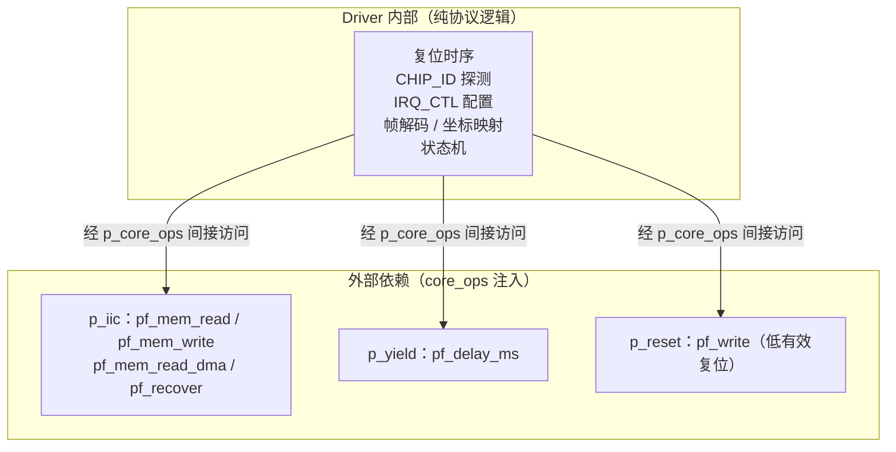
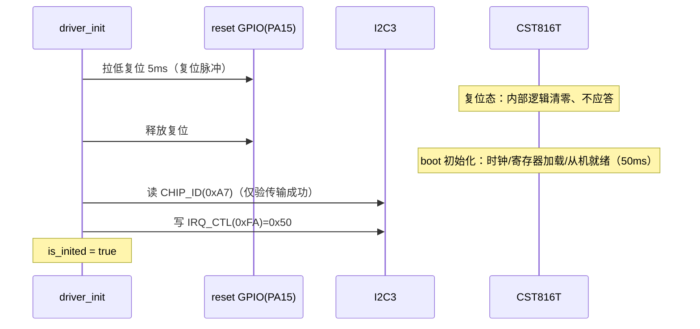
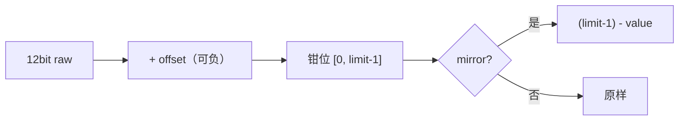
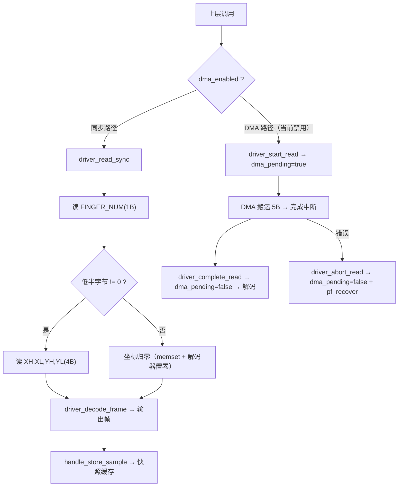

> 来源：Deep-In-Embedded / [开发板/ARM架构/STM32F411CEU6/CST816T的driver文件架构设计思路.md](https://github.com/shuai-yemao/Deep-In-Embedded/blob/5fcab575fc20cf681f3e79e163337211097c898a/%E5%BC%80%E5%8F%91%E6%9D%BF/ARM%E6%9E%B6%E6%9E%84/STM32F411CEU6/CST816T%E7%9A%84driver%E6%96%87%E4%BB%B6%E6%9E%B6%E6%9E%84%E8%AE%BE%E8%AE%A1%E6%80%9D%E8%B7%AF.md)

# 📖 引言

> 通过接口注入（`bsp_cst816t_core_ops_t`）将 CST816T 触摸驱动与芯片平台和 OS 解耦，以实例函数指针表 + 同步/DMA 双读取路径 + 编译期坐标映射，实现可移植、可测试的触摸控制器驱动层。

---

# 📝 CST816T driver 文件的设计思路

> 一句话定义：Driver 对 CST816T 芯片的初始化与核心逻辑做抽象，通过 `bsp_cst816t_core_ops_t` 把 I2C、延时、复位 GPIO 等硬件实现抽离解耦；Driver 只负责协议时序与逻辑（复位序列、同步/DMA 读、5 字节帧解码、坐标映射），不碰任何 HAL/GPIO/RTOS，从而可在任意支持 C 语言的 MCU 上复用。

## 实际意义

> 没有 Driver 时，当前项目会在哪些环节变复杂、出错或难以完成：

1. **代码臃肿、可读性差**：App/LVGL 层若直接操作 I2C 读寄存器，协议细节（帧拼接、坐标镜像钳位、复位时序）散落各处，每处消费都要重复且易写错。
2. **无法复用**：直接依赖 STM32 HAL/I2C3，切换 MCU 后整段触摸代码无法复用，必须重写。
3. **LVGL 非阻塞要求**：LVGL 的 indev 读取要求非阻塞——App 里直接同步 I2C 会阻塞 UI 线程。

## 应用场景

> 从已扫描路径中定位的两处使用：

1. **装配建链**：`Bsp/porting/drv_adapter_port_touch/src/bsp_adapter_port_touch.c:637` 构造 Driver、注册到 Handle、启动 worker，建立 "PB2 EXTI → 事件队列 → worker → 快照缓存 " 整条数据链路。
2. **LVGL 输入设备**：`Core/Src/lvgl_port.c:45` 经 Wrapper `bsp_touch_adapter_wrapper_get_latest()` 非阻塞读取触摸快照，驱动点击/滑动交互（输入角色；显示输出由 ST7789 承担）。

> 角色区分：CST816T 给 LVGL 的是**输入（indev）**能力——LVGL 从它 " 读 " 触摸；ST7789 是**输出**出**出**出**qe}输出**端——LVGL 把渲染好的画面 " 写 " 给屏幕。

## 核心逻辑/原理

### 0. 分层调用链（内嵌 SVG 静态架构图）


### 1. React 交互组件（动态 · 需 obsidian-react-components 插件）

> Mermaid/SVG 为静态图，各有适用领域；下方 React 组件实现**可交互**分层架构图——点击任一层次，右侧高亮该层的职责、关键文件与核心函数。安装插件：设置 → 社区插件 → 浏览 → 搜索 `React Components`（作者 elias-sundqvist，下载量最高）。

```jsx:component:ArchitectureViewer
const layers = [
  { name: "App / LVGL",   file: "lvgl_port.c",                duty: "indev 非阻塞读取触摸快照，驱动 UI 交互",          api: "bsp_touch_adapter_wrapper_get_latest()" },
  { name: "Wrapper",      file: "bsp_adapter_wrapper_touch",  duty: "静态函数表注入，App 免持有实例",                  api: "register() / init() / get_latest()" },
  { name: "Handle",       file: "bsp_touch_handle",           duty: "事件队列 worker · 快照缓存 · ISR 桥接 · 20ms 轮询兜底", api: "register_driver() / pf_notify_*_from_isr() / pf_get_latest()" },
  { name: "Driver",       file: "bsp_cst816t_driver",         duty: "复位/探测/配置 · 帧解码 · 坐标映射 · dma_pending 状态机", api: "bsp_cst816t_driver_inst() → pf_read_sync / pf_start_read" },
  { name: "Port / Core",  file: "bsp_adapter_port_touch",     duty: "I2C3(0x15) · PA15 RST · PB2 EXTI · RX-DMA · osal 服务",  api: "port_core_ops() → p_iic / p_yield / p_reset" },
];
const [active, setActive] = useState(3);
const box = (i) => ({
  width: "100%", padding: "10px 14px", margin: "6px 0",
  border: i === active ? "2px solid #c0504d" : "1px solid #ccc",
  borderRadius: 8, cursor: "pointer", fontFamily: "monospace",
  background: i === active ? "#fdeef0" : "#fff", textAlign: "left",
});
return (
  <div style={{ display: "flex", gap: 16, flexWrap: "wrap", fontFamily: "monospace" }}>
    <div style={{ flex: 1, minWidth: 260 }}>
      {layers.map((l, i) => (
        <button key={i} style={box(i)} onClick={() => setActive(i)}>
          <b>{l.name}</b> — {l.file}
        </button>
      ))}
    </div>
    <div style={{ flex: 1.4, minWidth: 300, border: "1px solid #c0504d",
                  borderRadius: 8, padding: "12px 16px", background: "#fdeef0" }}>
      <h4 style={{ marginTop: 0 }}>当前层：{layers[active].name}</h4>
      <p><b>职责：</b>{layers[active].duty}</p>
      <p><b>关键 API：</b><code>{layers[active].api}</code></p>
    </div>
  </div>
);
```

```jsx:
<bsp.cst816t.ArchitectureViewer/>
```

### 2. 机制一：接口注入与构造函数

Driver 内部不调任何 HAL/GPIO/RTOS，所有外部能力经 `bsp_cst816t_core_ops_t` 聚合注入：



`bsp_cst816t_driver_inst()`（`Bsp/board_driver/touch/driver/cst816t/src/bsp_cst816t_driver.c:309`）一次性完成：`memset` 清零 → 绑定 `p_core_ops` → 绑定 6 个方法函数指针 → `driver_core_is_valid`（9 项函数指针 NULL 校验，driver.c:30）。对外只暴露唯一构造函数。

### 3. 机制二：初始化时序



- **拉低 5ms** = 复位脉冲宽度（进入复位态）；**释放后 50ms** = boot 稳定时间（期间不应访问）。
- CHIP_ID 探测只作 I2C 通路可用性检查（driver.c:101-105 只判 status），**不校验具体 ID 值**（兼容不同批次）。
- 过早访问 → 从机未 boot 不 ACK → I2C 传输超时 → 初始化失败（而非 " 读到错误 ID"——本驱动根本不比对 ID 值）。

### 4. 机制三：帧解码与 12bit 坐标拼接

```
pressed = FINGER_NUM 低半字节 != 0        // 手指数量字段，非 0 即按下
raw_x = (X_POS_H & 0x0F) << 8 | X_POS_L   // 高4位 + 低8位 = 12bit（0~4095）
raw_y = (Y_POS_H & 0x0F) << 8 | Y_POS_L
```

- 低半字节是**手指数量**字段（0=无手指，1~N=有手指），本驱动只做单点所以 `!=0` 即按下。
- 原始分辨率 `2^12 = 4096` 级，由芯片触摸感应 ADC 决定，与显示范围无关；映射阶段才钳位。

### 5. 机制四：坐标映射（偏移 → 钳位 → 镜像）



镜像 = 坐标轴翻转（面板贴装方向与屏幕相反时校正），`(limit-1)-value` 是减法映射非取模。本项目 `MIRROR_X=1, MIRROR_Y=0, SWAP_XY=0` → X 翻转、Y 原样、不交换。`int32_t` 中间量是为了承载负 offset 并在钳位后安全转回 `uint16_t`。

### 6. 机制五：同步读 vs DMA 读 + dma_pending 状态机

- **同步读**（driver.c:216）：两步——先读 FINGER_NUM，有触摸才读坐标 4 字节；无触摸跳过坐标读**省流量**（触摸事件稀疏，多数轮询周期无触摸）；`memset` + 解码器无条件置 `x=y=0` 保证无残留。
- **DMA 读**（driver.c:144/261/285）：start 置 `dma_pending=true` → complete/abort 清 false → 入口检查拒绝并发。`dma_pending` 是 " 单次传输互斥锁 "，保证同步与 DMA 读不争用 I2C3 总线；被拒返回 `BSP_CST816T_STATUS_STATE`（忙碌拒绝，非 I2C 传输失败）。



### 7. 机制六：中断配置

`IRQ_CTL(0xFA)=0x50`（宏 `BSP_CST816T_IRQ_CTL_TOUCH_MOTION`）使能 " 触摸 + 移动 " 两类事件位，任一发生芯片拉低 INT（PB2 下降沿 → EXTI）。配 `0x00` 则 EXTI 不触发，但 Handle 层 20ms 轮询兜底仍可检测触摸（50Hz）。

## 🔑 关键代码片段：同步读 + DMA 状态机

### 1. 同步读（实际运行路径，两步 I2C）

```c
/* 来源：Bsp/board_driver/touch/driver/cst816t/src/bsp_cst816t_driver.c:216-252 */
static bsp_cst816t_status_t driver_read_sync(bsp_cst816t_driver_t *p_self,
                                             bsp_cst816t_frame_t *p_frame)
{
    uint8_t finger_count;
    bsp_cst816t_status_t status;

    if ((!driver_core_is_valid(p_self)) || (p_frame == NULL))
        return BSP_CST816T_STATUS_ARGUMENT;
    if ((!p_self->is_inited) || p_self->dma_pending)     /* dma_pending 守卫并发 */
        return BSP_CST816T_STATUS_STATE;

    /* 第一步：读 FINGER_NUM 判断是否有按下 */
    status = p_self->p_core_ops->p_iic->pf_mem_read(
        p_self->p_core_ops->p_iic->context, BSP_CST816T_I2C_ADDRESS_7BIT,
        BSP_CST816T_REG_FINGER_NUM, &finger_count, 1U,
        BSP_CST816T_I2C_TIMEOUT_MS);
    if (status != BSP_CST816T_STATUS_OK)
        return status;

    (void)memset(p_self->dma_frame, 0, sizeof(p_self->dma_frame)); /* 防残留 */
    p_self->dma_frame[0] = finger_count;
    if ((finger_count & 0x0FU) != 0U) {                  /* 有触摸才读坐标 */
        status = p_self->p_core_ops->p_iic->pf_mem_read(
            p_self->p_core_ops->p_iic->context, BSP_CST816T_I2C_ADDRESS_7BIT,
            BSP_CST816T_REG_X_POS_H, &p_self->dma_frame[1],
            BSP_CST816T_TOUCH_FRAME_BYTES - 1U,
            BSP_CST816T_I2C_TIMEOUT_MS);
        if (status != BSP_CST816T_STATUS_OK)
            return status;
    }
    driver_decode_frame(p_self, p_frame);
    return BSP_CST816T_STATUS_OK;
}
```

### 2. DMA 读状态机（start / complete / abort，当前 Handle 层 `dma_enabled=false` 预留）

```c
/* 来源：bsp_cst816t_driver.c:144-165 — 启动 */
static bsp_cst816t_status_t driver_start_read(bsp_cst816t_driver_t *p_self)
{
    if (!driver_core_is_valid(p_self)) return BSP_CST816T_STATUS_ARGUMENT;
    if ((!p_self->is_inited) || p_self->dma_pending) return BSP_CST816T_STATUS_STATE;
    status = p_self->p_core_ops->p_iic->pf_mem_read_dma(
        p_self->p_core_ops->p_iic->context, BSP_CST816T_I2C_ADDRESS_7BIT,
        BSP_CST816T_REG_FINGER_NUM, p_self->dma_frame,
        BSP_CST816T_TOUCH_FRAME_BYTES);
    if (status == BSP_CST816T_STATUS_OK)
        p_self->dma_pending = true;      /* 置位：占用总线 */
    return status;
}

/* 来源：bsp_cst816t_driver.c:261-277 — DMA 完成解码 */
static bsp_cst816t_status_t driver_complete_read(bsp_cst816t_driver_t *p_self,
                                                 bsp_cst816t_frame_t *p_frame)
{
    if ((!driver_core_is_valid(p_self)) || (p_frame == NULL)) return BSP_CST816T_STATUS_ARGUMENT;
    if ((!p_self->is_inited) || (!p_self->dma_pending))      return BSP_CST816T_STATUS_STATE;
    p_self->dma_pending = false;         /* 清零：释放总线 */
    driver_decode_frame(p_self, p_frame);
    return BSP_CST816T_STATUS_OK;
}

/* 来源：bsp_cst816t_driver.c:285-300 — 失败恢复 */
static bsp_cst816t_status_t driver_abort_read(bsp_cst816t_driver_t *p_self)
{
    if (!driver_core_is_valid(p_self)) return BSP_CST816T_STATUS_ARGUMENT;
    p_self->dma_pending = false;         /* 先清标志，再恢复 I2C */
    if (!p_self->is_inited) return BSP_CST816T_STATUS_STATE;
    return p_self->p_core_ops->p_iic->pf_recover(
               p_self->p_core_ops->p_iic->context) ?
           BSP_CST816T_STATUS_OK : BSP_CST816T_STATUS_IO;
}
```

## 关键公式/结论

| 项 | 值 | 说明 |
|---|---|---|
| I2C 地址 | `0x15`（7bit） | 器件地址 |
| 帧格式 | NUM,XH,XL,YH,YL（5B） | 12bit 坐标 |
| 寄存器 | FINGER_NUM `0x02` / X_POS_H `0x03` / CHIP_ID `0xA7` / IRQ_CTL `0xFA` | config.h:31-35 |
| 复位时序 | 拉低 5ms + 释放后 50ms boot | config.h:26-27 |
| I2C 超时 | 100ms | config.h:28 |
| 坐标 profile | 240×280、MIRROR_X=1、SWAP_XY=0、offset=0 | config.h:17-23 |
| 状态码 | OK / ARGUMENT / IO / STATE | driver.h:32-38 |
| 南向接口 | p_iic / p_yield / p_reset（共 4+1+1 个函数指针） | driver.h:56-107 |
| 中断配置 | IRQ_CTL=0x50：触摸 + 移动 → INT 低脉冲 | config.h:35 |

## 实际操作步骤

> 用户表述的开发流程：

1. 明确 CST816T 在架构中的职责，备好数据手册。
2. 按手册编写 `bsp_cst816t_config.h`（寄存器地址、时序、坐标 profile）。
3. 按架构需求编写 `bsp_cst816t_driver.h`：以 `bsp_cst816t_driver_t` 为核心——core 接口表（p_iic/p_yield/p_reset）、错误码枚举、实例函数指针。
4. 对外只暴露唯一构造函数 `bsp_cst816t_driver_inst()`。
5. 上层用 self 指针逐函数验证，用屏幕/逻辑分析仪波形判断。
6. 失败用 ELOG 日志快速定位。

> 补充验证实验：准备 J-Link → 上电触摸 → 观察 `g_touch_exti_count`（EXTI 次数）、`g_touch_sync_read_count`（轮询读次数）、`g_touch_valid_sample_count`（有效按下次数）；三者递增且 LVGL 有响应 = 成功。若 `sync_read` 不增 → 查 I2C 上拉/复位时序；若只 `exti` 增而 `valid_sample` 不增 → 查坐标解码与镜像配置。

## 常见问题

| 现象 | 根因 | 当前处理 |
|---|---|---|
| 组合 DMA 帧读取停滞 | 板级调试曾现 I2C3 RX-DMA 组合读停滞（根因未完全定位） | `bsp_touch_handle.c:404` 设 `dma_enabled=false` 走两步同步读 |
| 初始化失败/传输超时 | 复位后 <50ms 过早访问，从机未 boot 不 ACK | 保证 boot 时序；driver.c:105 超时返回非 OK |
| 触摸坐标方向偏 | `MIRROR_X` / `SWAP_XY` 与面板贴装方向不匹配 | 调整 config.h:21-23 编译期宏 |
| DMA 停滞无恢复兜底 | `dma_pending` 悬挂 → 读全被 STATE 拒绝 → 触摸永久失效（系统不死机，FreeRTOS 照常运行，死的是 I2C3+ 触摸这一路） | 必须有 abort/recover 兜底 |

## 💬 Q&A

### 🟢 基础

#### Q1: 为什么 12bit 坐标要 " 高 4 位 + 低 8 位 " 拼接？

**用户原答：** 根据寄存器描述，x 坐标由高 4 位和低 8 位组成。

**修正后理解：** 芯片触摸 ADC 输出 12bit 分辨率（2^12=4096 级），坐标分存于高字节低 4 位 + 低字节全 8 位；原始分辨率与显示范围无关，映射阶段才钳位。

**证据：** driver.c:187-190；config.h:31-36

#### Q2: `dma_pending` 标志扮演什么角色？

**用户原答：** 告诉我们 DMA 读取状态，读取开始置位、接收清零，读取期间再次读取返回失败。

**修正后理解：** " 单次传输互斥锁 "——start 置位、complete/abort 清零、入口检查拒绝并发（返回 STATE），保证同步与 DMA 读不争用 I2C3 总线。

**证据：** driver.c:152/161/274/293

### 🟡 进阶

#### Q3: 同步读为什么先读状态、有触摸才读坐标？

**用户原答：** 保存外设正常状态能读出正确数据，多了一层异常判断。

**修正后理解：** 主要目的不是异常判断而是省流量——触摸事件稀疏，多数轮询周期无触摸，只读 1 字节状态省去 4 字节坐标读；`memset` 保证无触摸时坐标归零。

**证据：** driver.c:216-252

#### Q4: IRQ_CTL=0x00 时 EXTI 不触发，触摸还能检测吗？

**用户原答：** 能，系统周期性轮询检查。

**修正后理解：** 能。worker 队列接收 20ms 超时 → 轮询兜底路径 → 50Hz 检测；这就是 Handle 层 "PB2 无可观测边沿时轮询作为兜底 " 的设计。

**证据：** bsp_touch_handle.c:30,178-193

### 🔴 困难

#### Q5: 镜像公式 `(limit-1)-value` 的数学意义是什么？

**用户原答：** 防止有符号运算强制转化巨大数值；进行了 % 操作。

**修正后理解：** 坐标轴翻转（减法映射，非取模）：0↔limit-1 区间反转 180°，用于面板贴装方向与屏幕相反时校正；例 limit=240，value=10 → 229。

**证据：** driver.c:54-70；config.h:21

#### Q6: DMA 停滞且无恢复兜底，最终现象是什么？

**用户原答：** 功能无法使用，没有错误处理让系统死机。

**修正后理解：** 触摸链路永久失效（dma_pending 悬挂 → 读全被 STATE 拒绝）；但系统不死机，FreeRTOS 调度器照常运行，死的是 I2C3+ 触摸这一路——因此必须有 abort/recover 兜底。

**证据：** driver.c:285-300；bsp_touch_handle.c:148-158

## 📋 总结

> **用户原话：** driver 是对 cst816t 芯片的逻辑进行抽象与其他层级进行解耦，无外部依赖，实现了高内聚低耦合的设计想法，舍弃了栈深要求后换来的代码的复用性。
>
> **AI 修正：** Driver 经 `core_ops` 接口注入解耦硬件依赖，实例函数指针表 + 状态机（`is_inited` / `dma_pending`）实现协议逻辑闭环；以函数指针间接调用与接口注入为代价，换取跨芯片可移植与可测试性。

## 📎 参考资料

### 🔗 博客/文档链接

- [CST816T 数据手册](https://github.com/goodpi-labs/CST816S-driver/blob/master/CST816T_datasheet_v1.0.pdf) — 寄存器布局、触摸帧格式与 IRQ 配置（待核对版本）
- [Obsidian React Components 插件](https://github.com/elias-sundqvist/obsidian-react-components) — 笔记内 JSX/React 组件渲染（官方社区插件，下载量最高，最新版 0.1.6 于 2022-01，新版本 Obsidian 兼容性需实测）

### 📄 代码/附件

- `Bsp/board_driver/touch/driver/cst816t/inc/bsp_cst816t_config.h` — 编译期协议事实（地址/寄存器/时序/坐标 profile）
- `Bsp/board_driver/touch/driver/cst816t/inc/bsp_cst816t_driver.h` — 状态码、南向接口、实例结构体、唯一构造函数
- `Bsp/board_driver/touch/driver/cst816t/src/bsp_cst816t_driver.c` — 复位、同步/DMA 读、帧解码、坐标映射实现
- `Bsp/porting/drv_adapter_port_touch/src/bsp_adapter_port_touch.c` — I2C3/DMA/GPIO/osal 南向注入与装配
- [[MPU6050的driver文件架构设计思路]]
- [[CST816T的handle文件架构设计思路]]
