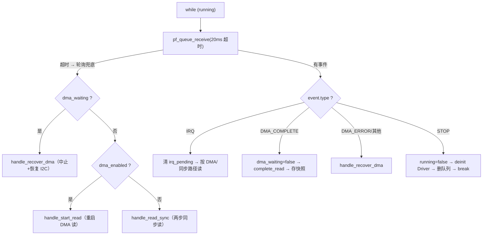
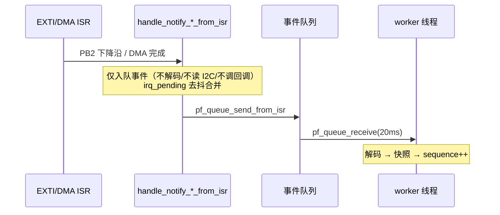

> 来源：Deep-In-Embedded / [开发板/ARM架构/STM32F411CEU6/CST816T的handle文件架构设计思路.md](https://github.com/shuai-yemao/Deep-In-Embedded/blob/5fcab575fc20cf681f3e79e163337211097c898a/%E5%BC%80%E5%8F%91%E6%9D%BF/ARM%E6%9E%B6%E6%9E%84/STM32F411CEU6/CST816T%E7%9A%84handle%E6%96%87%E4%BB%B6%E6%9E%B6%E6%9E%84%E8%AE%BE%E8%AE%A1%E6%80%9D%E8%B7%AF.md)

# 📖 引言

> Handler 位于 Driver 之上，通过事件队列与 worker 线程统一管理触摸类外设的 ISR→任务上下文桥接、20ms 轮询兜底、快照缓存与生命周期，将 " 数据从哪来、何时处理、交给谁 " 的调度逻辑从芯片驱动中剥离。

---

# 📝 CST816T handle 文件的设计思路

> 一句话定义：Handle 对 " 触摸 " 这一类外设做统一管理——创建并使用 worker 线程、事件队列与快照缓存，桥接 ISR→任务上下文，并管理 Driver 注册与生命周期；不负责具体协议/硬件实现（属 Driver）。

## 实际意义

> 无 Handle 时应用层需自建线程/队列/信号量、自管 EXTI/DMA 回调与 ISR→任务数据搬运，每个消费方重复一套；最危险的是在 ISR 里做 I2C 解码（阻塞 SysTick）；Handle 将 "ISR 只入队、worker 解码 " 固化为通用骨架。

## 应用场景

1. **ISR 事件入队**：`Bsp/porting/drv_adapter_port_touch/src/bsp_adapter_port_touch.c:717` `HAL_GPIO_EXTI_Callback` → `pf_notify_touch_from_isr`（通知 worker 有触摸）。
2. **任务侧快照读取**：`bsp_adapter_port_touch.c:682` `bsp_touch_adapter_port_get_latest` → `pf_get_latest`（LVGL indev 非阻塞读）。

## 核心逻辑/原理

### 0. 线程数据流（内嵌 SVG 静态图）


### 1. React 交互组件：触摸快照模拟器（动态）

> 演示快照缓存的核心：**只有内容变化才 `sequence++`**。点击按钮模拟按下/移动/松开，观察 `sequence` 是否变化。需 obsidian-react-components 插件（笔记①已配置）。

```jsx:component:TouchSnapshotSimulator
const init = { pressed:false, x:0, y:0, sequence:0 };
const [s, setS] = useState(init);
const apply = (next) => {
  setS((prev) => {
    let changed = prev.pressed !== next.pressed || prev.x !== next.x || prev.y !== next.y;
    return { ...next, sequence: changed ? prev.sequence + 1 : prev.sequence };
  });
};
const btn = { margin:"6px 8px 6px 0", padding:"8px 14px", fontFamily:"monospace", cursor:"pointer", borderRadius:6, border:"1px solid #4a9b5a", background:"#f0f8f0" };
return (
  <div style={{ fontFamily:"monospace", border:"1px solid #4a9b5a", borderRadius:8, padding:16 }}>
    <button style={btn} onClick={() => apply({ pressed:true,  x:120, y:80 })}>按下 (120,80)</button>
    <button style={btn} onClick={() => apply({ pressed:true,  x:130, y:85 })}>移动 (130,85)</button>
    <button style={btn} onClick={() => apply({ pressed:false, x:0, y:0 })}>松开</button>
    <p>pressed = {String(s.pressed)} · x = {s.x} · y = {s.y} · <b>sequence = {s.sequence}</b></p>
    <p style={{color:"#888"}}>再次点击同一按钮：sequence 不变（内容未变化才递增）</p>
  </div>
);
```

```jsx:
<bsp.cst816t.handle.TouchSnapshotSimulator/>
```

### 2. 机制一：worker 事件循环与 20ms 轮询兜底



**20ms 超时 = 事件驱动 + 轮询兜底融合**：EXTI 失效/丢事件时，超时强制 worker 定期主动读，触摸不停摆。

### 3. 机制二：快照缓存与 sequence 版本号

临界区保护 worker（写）与消费者（读）的撕裂竞争；`sequence` 仅在内容真正变化时递增，消费者对比 `sequence` 判断 " 新帧 "（`bsp_adapter_port_touch.c:701`）。释放时保留最后一次有效位置（`handle.c:94-97`），错误采样仅更新 error。

### 4. 机制三：ISR 桥接与 irq_pending 去抖



`irq_pending` 去抖：上个事件未处理完（`irq_pending=true`）、DMA 在读（`dma_waiting`）、DMA 禁用（`!dma_enabled`）三情况忽略新边沿。

### 5. 机制四：协作式停止（对比强杀线程）

STOP 事件入队 → worker 处理完当前事件后自然 `break` 退出（先 deinit Driver、删队列）。对比 [[MPU6050的handle文件架构设计思路]] 中 `vTaskDelete` 强杀线程在回调持锁时导致的死锁隐患。

### 6. 机制五：Driver 注册与资源逆序回滚

创建序 Driver→队列→线程；失败按逆序回滚（线程失败：删队列→deinit Driver；队列失败：仅 deinit Driver）。逆序由**资源依赖**决定（worker 依赖队列、二者依赖 Driver），防悬挂引用。

## 🔑 关键代码片段：事件循环 + 快照缓存 + ISR 桥接

### 1. worker 事件循环与轮询兜底

```c
/* 来源：bsp_touch_handle.c:166-229 */
static void handle_worker(void *argument) {
    bsp_touch_handle_t *p_self = (bsp_touch_handle_t *)argument;
    while (p_self->running) {
        if (!p_self->p_os_ops->pf_queue_receive(
                p_self->p_os_ops->context, p_self->queue_handler,
                &event, BSP_TOUCH_POLL_INTERVAL_MS)) {
            /* PB2 无可观测边沿时，轮询作为 I2C/DMA 兜底 */
            if (p_self->dma_waiting)      handle_recover_dma(p_self);
            if (p_self->dma_enabled)      handle_start_read(p_self);
            else                          handle_read_sync(p_self);
            continue;
        }
        if (BSP_TOUCH_EVENT_STOP == event.type) {   /* 协作式停止 */
            p_self->running = false;
            (void)p_self->p_driver_ops->pf_deinit(p_self->driver_instance);
            p_self->p_os_ops->pf_queue_delete(p_self->p_os_ops->context,
                                              p_self->queue_handler);
            p_self->queue_handler = NULL;
            p_self->thread_handler = NULL;
            break;
        }
        if (BSP_TOUCH_EVENT_IRQ == event.type) { ... }
        if (BSP_TOUCH_EVENT_DMA_COMPLETE == event.type) { ... }
        handle_recover_dma(p_self);
    }
    p_self->p_os_ops->pf_thread_exit(p_self->p_os_ops->context);
}
```

### 2. 快照缓存（临界区 + sequence）

```c
/* 来源：bsp_touch_handle.c:77-107 */
static void handle_store_sample(bsp_touch_handle_t *p_self,
                                const bsp_cst816t_frame_t *p_frame,
                                bsp_cst816t_status_t error) {
    bool changed;
    p_self->p_os_ops->pf_critical_enter(p_self->p_os_ops->context);
    changed = (p_self->sample.error != error);
    if (NULL != p_frame) {
        changed = changed || (p_self->sample.pressed != p_frame->pressed);
        if (p_frame->pressed)
            changed = changed || (p_self->sample.x != p_frame->x) ||
                      (p_self->sample.y != p_frame->y);
        p_self->sample.pressed = p_frame->pressed;
        if (p_frame->pressed) { p_self->sample.x = p_frame->x; p_self->sample.y = p_frame->y; }
    } else {
        changed = changed || p_self->sample.pressed;
        p_self->sample.pressed = false;
    }
    p_self->sample.error = error;
    if (changed) p_self->sample.sequence++;   /* 内容变化才递增版本号 */
    p_self->p_os_ops->pf_critical_exit(p_self->p_os_ops->context);
}
```

### 3. ISR 桥接（仅入队，去抖）

```c
/* 来源：bsp_touch_handle.c:256-298 */
static bool handle_notify_touch_from_isr(bsp_touch_handle_t *p_self) {
    if ((!handle_is_valid(p_self)) || (!p_self->running)) return false;
    /* DMA 恢复后轮询独占总线，忽略抖动的 PB2 边沿 */
    if (p_self->dma_waiting || (!p_self->dma_enabled) || p_self->irq_pending)
        return true;
    p_self->irq_pending = true;
    notified = handle_notify_from_isr(p_self, BSP_TOUCH_EVENT_IRQ);
    if (!notified) p_self->irq_pending = false;
    return notified;
}
```

## 关键公式/结论

| 项 | 值 | 说明 |
|---|---|---|
| 队列长度 | 8 | 事件队列容量（handle.c:27） |
| worker 栈深 | 384 字 | 因调 HAL I2C 同步读，调用链压栈深（handle.c:28） |
| worker 优先级 | 1 | 触摸低频非实时（handle.c:29） |
| 轮询周期 | 20ms | 队列超时 = 兜底周期，50Hz（handle.c:30） |
| 事件类型 | IRQ / DMA_COMPLETE / DMA_ERROR / STOP | handle.c:33-39 |
| 状态标志 | running / dma_waiting / dma_enabled / irq_pending | handle.h:124-128 |
| 快照字段 | pressed / x / y / sequence / error | handle.h:34-41 |

## 实际操作步骤（生命周期）

1. `bsp_touch_handle_inst(&s_handle, port_os_ops())` 构造 Handle（绑定实例方法 + OS 接口）。
2. `bsp_touch_handle_register_driver(&s_handle, &s_driver_if)` 注册 Driver（内部 `pf_construct` 构造 → init → 建队列 → 起线程）。
3. 运行期：EXTI/DMA ISR 经 `pf_notify_*_from_isr` 入队；LVGL 经 `pf_get_latest` 读快照。
4. `pf_request_stop()` 投 STOP 事件 → worker 自然退出。

> **必须在 FreeRTOS 调度器启动后的任务上下文装配**：worker 线程依赖调度器运行、Driver 初始化用 `osal_task_delay_ms`、EXTI/DMA 中断须调度器就绪后使能。

## 常见问题

| 现象 | 根因 | 处理 |
|---|---|---|
| deinit 后死锁 | 强杀线程时回调持锁（MPU6050 handler 历史问题） | 协作式 STOP 自然退出 |
| DMA 悬挂触摸失效 | `dma_pending` 永不清零，读全被 STATE 拒 | 20ms 轮询 detect → `handle_recover_dma` |
| 装配期 worker 抢占 | 调度器启动前装配，资源未就绪即抢占 | 须在调度器启动后的任务上下文装配 |

## 💬 Q&A

### 🟢 基础

#### Q1: 快照缓存为什么要进临界区？sequence 的作用？

**用户原答：** 防止线程切换后触摸数据被覆盖；sequence 是触摸位置顺序。

**修正后理解：** 临界区保护 worker 写 / 消费者读的撕裂竞争；sequence 是采样版本号（内容变化才递增），消费者对比它判新帧，而非 " 位置顺序 "。

**证据：** handle.c:77-107；bsp_adapter_port_touch.c:701

#### Q2: worker 为什么用 20ms 超时而非永久阻塞？

**用户原答：** 不知道（薄弱点）。

**修正后理解：** 轮询兜底——EXTI 失效/丢事件时超时强制定期主动读，事件驱动与周期轮询融合。

**证据：** handle.c:178-193

### 🟡 进阶

#### Q3: irq_pending 的三个忽略条件各是什么？

**用户原答：** irq_pending 是中断运行状态。

**修正后理解：** 去抖防洪泛标志。`irq_pending`=上个事件未处理完；`dma_waiting`=DMA 在读总线被占；`!dma_enabled`=走轮询不靠 EXTI。

**证据：** handle.c:281-298

#### Q4: 为什么协作式停止优于强杀线程？

**用户原答：** 不知道（薄弱点）。

**修正后理解：** 强杀线程在回调持锁时死锁；协作式让 worker 处理完当前事件自然退出，资源安全释放。

**证据：** handle.c:195-204, 320-335；[[MPU6050的handle文件架构设计思路]]

### 🔴 困难

#### Q5: 资源创建与回滚为什么必须逆序？

**用户原答：** 先删队列后删线程最后删 driver，避免内存泄露。

**修正后理解：** 逆序由资源依赖决定（worker 依赖队列、二者依赖 Driver）；线程创建失败时无 " 线程可删 "，实际回滚是 " 删队列→deinit Driver"。防悬挂引用而非仅内存泄露。

**证据：** handle.c:370-438

#### Q6: 为什么装配必须在调度器启动后的任务上下文？

**用户原答：** 调度之前初始化防止访问野指针/空指针。

**修正后理解：** 非 " 调度之前 " 而是 " 调度之后 "。worker 线程依赖调度器运行、Driver init 用 `osal_task_delay_ms`、EXTI/DMA 中断须调度器就绪后使能；防资源未就绪即被抢占。

**证据：** bsp_adapter_port_touch.c:625

## 📋 总结

> **用户原话：** handle 是对多实例的管理，对线程的同步和异步操作，对 isr 和 dma 的上下文管理。
>
> **AI 补充：** Handle 以 "ISR 只入队、worker 串行处理 " 固化为无锁骨架，快照 + sequence 供 LVGL 非阻塞读，20ms 轮询兜底 + 协作式停止保障鲁棒性，依赖注入保持 RTOS 无关。

## 📎 参考资料

### 📄 代码/附件

- `Bsp/board_driver/touch/handler/inc/bsp_touch_handle.h` — 事件/快照/OS 接口/Driver 注入/实例定义
- `Bsp/board_driver/touch/handler/src/bsp_touch_handle.c` — worker、快照、ISR 桥接、协作式停止实现
- `Bsp/porting/drv_adapter_port_touch/src/bsp_adapter_port_touch.c` — 装配与 ISR/DMA 回调转发
- [[CST816T的driver文件架构设计思路]]
- [[MPU6050的handle文件架构设计思路]]
