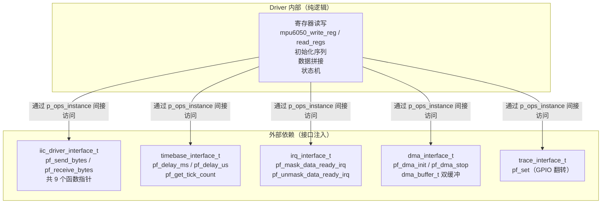
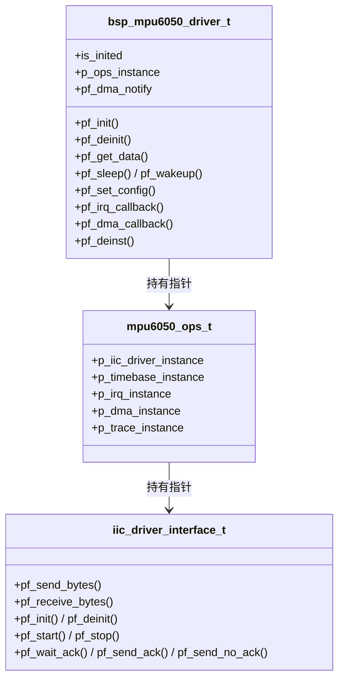
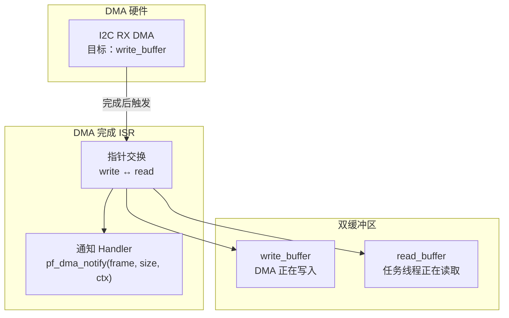
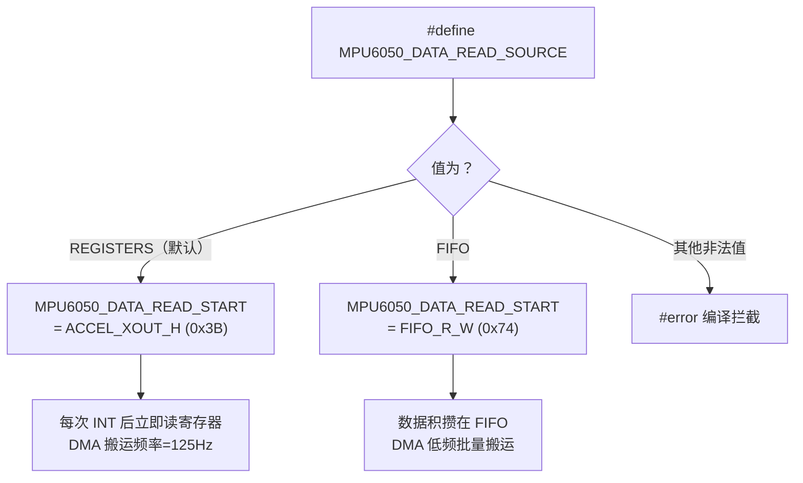
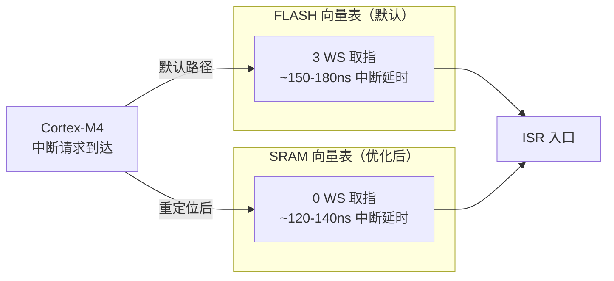
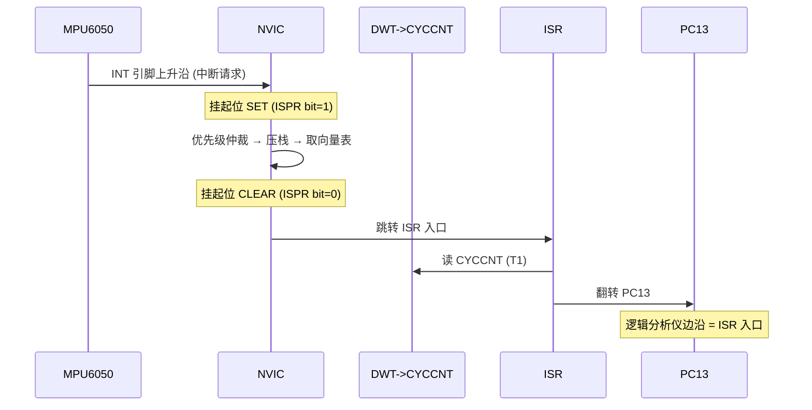

> 来源：Deep-In-Embedded / [开发板/ARM架构/STM32F411CEU6/MPU6050的driver文件架构设计思路.md](https://github.com/shuai-yemao/Deep-In-Embedded/blob/5fcab575fc20cf681f3e79e163337211097c898a/%E5%BC%80%E5%8F%91%E6%9D%BF/ARM%E6%9E%B6%E6%9E%84/STM32F411CEU6/MPU6050%E7%9A%84driver%E6%96%87%E4%BB%B6%E6%9E%B6%E6%9E%84%E8%AE%BE%E8%AE%A1%E6%80%9D%E8%B7%AF.md)

# 📖 引言

> 这篇笔记要讲什么？用一句话概括核心主题。

通过接口注入将 MPU6050 驱动与具体芯片平台和 OS 解耦，以函数指针表 + DMA 双缓冲 + 中断上下半部分离实现可移植、可测试的高频 IMU 数据采集驱动层。

---

# 📝 driver 文件的设计思路

> 用一句话说清楚这个知识点是什么。

通过接口注入将 MPU6050 驱动与具体芯片平台和 OS 解耦，使其可移植到任意 C 语言平台，无需重写驱动代码。

## 实际意义

> 为什么会有该知识点？解决了什么实际问题？

传统做法中 MPU6050 驱动与 STM32 的 HAL/标准库/寄存器强耦合，切换芯片或抽象层就需要重写全部驱动代码并重新测试。接口注入将 I2C 时序、时基、中断、DMA 全部抽象为函数指针，驱动只依赖接口不依赖具体实现。ISR 过长会阻塞 SysTick 导致 FreeRTOS 时基偏移，中断上下半部分离将重活推迟到任务上下文，保证系统实时性。

## 应用场景

> 在实际中主要被用来做什么？

1. **芯片平台替换**：面对芯片制裁、价格上涨等不可抗力需更换 MCU 时，只改 Adapter 层
2. **多项目复用**：同一驱动代码可在 STM32F4/GD32/ESP32 等多个项目中直接使用
3. **单元测试**：PC 上注入 mock 的 I2C 和时基函数即可跑全部驱动逻辑

## 核心逻辑/原理

> 它是如何工作的？拆解背后的机制。

### 1. 依赖注入：驱动不依赖任何具体硬件



`bsp_mpu6050_driver_inst()` 一次性完成：绑定接口指针 → 绑定 11 个方法函数指针 → 调用 `pf_init` 执行硬件初始化。所有外部依赖通过 `mpu6050_ops_t` 聚合注入，Driver 内部不调任何 HAL 或 OS 函数。

```c
// driver.c:32-55 — 驱动内部只调接口，不碰 HAL
static mpu6050_status_t mpu6050_write_reg(bsp_mpu6050_driver_t *self,
                                          uint8_t reg, uint8_t value) {
    // 4 级 NULL 检查链：self → p_ops_instance → p_iic_driver_instance → pf_send_bytes
    iic_driver_interface_t *iic = self->p_ops_instance->p_iic_driver_instance;
    return iic->pf_send_bytes(reg, &value, 1U);  // 不关心后面是 HAL 还是软件模拟
}
```



**驱动输出数据结构：**

```c
// driver.h:252-260
typedef struct {
  int16_t accel_x;       // X 轴加速度原始值
  int16_t accel_y;       // Y 轴加速度原始值
  int16_t accel_z;       // Z 轴加速度原始值
  int16_t temperature;   // 温度原始值
  int16_t gyro_x;        // X 轴角速度原始值
  int16_t gyro_y;        // Y 轴角速度原始值
  int16_t gyro_z;        // Z 轴角速度原始值
} mpu6050_data_t;
```

7 个 `int16_t` 字段全部是**原始码值**，单位换算在服务层完成。一次 `pf_get_data()` 调用通过 14 字节 burst read 填充整个结构体——即使调用者只选了 `MPU6050_DATA_ACCEL`，温度字段也会被填充（保证同一采样时刻）。

### 2. 中断上下半部（Deferred Interrupt Handling）

ARM Cortex-M NVIC 在 ISR 执行期间阻塞同级和更低优先级中断。FreeRTOS 官方术语为 **Deferred Interrupt Handling** —— ISR 只记录中断原因、清除标志位、唤醒任务，耗时处理在任务中完成。本项目采用**应用控制式**延迟处理：ISR → 消息队列 → 读取线程。

```mermaid
sequenceDiagram
    participant MPU as MPU6050
    participant NVIC as Cortex-M NVIC
    participant DRV as Driver ISR
    participant DMA as DMA 硬件
    participant BUF as 双缓冲
    participant Q as FreeRTOS 消息队列
    participant THD as Handler 读取线程

    MPU->>NVIC: INT 引脚上升沿
    NVIC->>DRV: 硬件自动压栈 → 跳转 pf_irq_callback()
    Note over DRV: ① 关 EXTI<br/>② 读 INT_STATUS 确认 DATA_RDY<br/>③ 启动 I2C RX DMA<br/>（ISR 只做硬件应答，&lt;5μs）
    DRV->>DMA: 启动 DMA 传输
    DMA->>MPU: I2C burst read 14 bytes
    MPU->>BUF: 数据写入 write_buffer

    DMA->>DRV: DMA 完成中断 → pf_dma_callback()
    Note over DRV: ④ 交换 read/write 指针<br/>⑤ 调 pf_dma_notify 通知 Handler<br/>⑥ 恢复 EXTI
    DRV->>Q: FromISR 队列发送
    Q->>THD: pf_os_queue_get(WAIT_FOREVER)
    Note over THD: ⑦ pf_decode_frame 解码<br/>⑧ lifetime 限频（50ms）<br/>⑨ 更新 latest_data<br/>⑩ 触发 pf_data_callback
```

**ISR 中必须遵守的 FreeRTOS 规则：**

- 只能调带 `FromISR` 后缀的 API（如 `xQueueSendFromISR`、`xSemaphoreGiveFromISR`）
- 不能阻塞（禁止 `portMAX_DELAY`）
- 退出前检查 `portYIELD_FROM_ISR()` 决定是否立即切换任务

**`mpu6050_irq_callback` 的三级 goto 错误恢复路径：**

```
正常路径：mask_irq → read_INT_STATUS(确认 DATA_RDY) → dma_init(成功) → callback_exit
          ↑ EXTI 保持关闭，在 dma_callback 中才恢复

恢复路径A：mask_irq → read_INT_STATUS(失败) → callback_restore_irq → unmask_irq
恢复路径B：mask_irq → read_INT_STATUS → 非 DATA_RDY → callback_restore_irq → unmask_irq
```

关键设计意图：DMA 启动成功后 EXTI 保持关闭（等 dma_callback 完成才恢复），但**任何失败路径都必须恢复 EXTI**，否则驱动永久丢失后续中断。

### 3. 函数指针表模式

Driver 所有方法（`pf_init`, `pf_get_data`, `pf_sleep` 等共 11 个）在 `bsp_mpu6050_driver_inst()` 中一次性绑定到静态函数。实现三大能力：

1. **多态替换**：上层调 `drv->pf_get_data(...)` 不关心后面是 MPU6050 还是未来换的 ICM-20948
2. **Mock 测试**：注入假的 I2C 函数指针，PC 上跑全部驱动逻辑，不需要硬件
3. **封装保护**：上层无法直接调静态函数绕过安全检查

```c
// driver.c:582-640 — inst 中一次性绑定
self->pf_init       = mpu6050_init;
self->pf_deinit     = mpu6050_deinit;
self->pf_get_data   = mpu6050_get_data;
self->pf_set_config = mpu6050_set_config;
self->pf_irq_callback = mpu6050_irq_callback;
self->pf_dma_callback = mpu6050_dma_callback;
// ... 共 11 个方法全部绑定
```

### 4. DMA 双缓冲

两块 buffer 永不重叠：DMA 写 `write_buffer` 时任务线程读 `read_buffer`。DMA 完成后交换指针——刚写完的变新的 `read_buffer`，旧 `read_buffer` 变为新的 `write_buffer`。

```c
// driver.c:192-194 — 指针交换
completed_buffer = dma->dma_buffer->write_buffer;
dma->dma_buffer->write_buffer = dma->dma_buffer->read_buffer;
dma->dma_buffer->read_buffer = completed_buffer;
```



**安全保证：**

- 指针交换发生在 EXTI 关闭期间（`dma_callback` 末尾才恢复 EXTI），与新数据中断天然互斥
- 源码三重检查（[driver.c:187-189](BSP/MPU6050/driver/Src/bsp_mpu6050_driver.c#L187)）：读指针非空 + 写指针非空 + 两者不相等 → 防止 Adapter 分配错误导致双缓冲退化为单缓冲

### 5. 生命周期与状态管理

`is_inited` 状态标志贯穿所有公开 API 入口，防御三类问题：

1. **未初始化调用**：每个 API 首行检查 `is_inited != INITED` → 拒绝
2. **重复初始化**：`bsp_mpu6050_driver_inst()` 检查 ` INITED` → 拒绝
3. **去初始化后被使用**：`mpu6050_deinst` 将 11 个函数指针全部置 NULL，即使上层犯错也不会顺着空指针跳 HardFault

```c
// driver.c:234-262 — deinst 防御性清零
static mpu6050_status_t mpu6050_deinst(bsp_mpu6050_driver_t *self) {
    self->is_inited = MPU6050_NOT_INITED;
    self->p_ops_instance = NULL;
    self->pf_init   = NULL;    // 11 个方法指针全部清零
    self->pf_get_data = NULL;
    self->pf_irq_callback = NULL;
    self->pf_dma_callback = NULL;
    self->pf_dma_notify = NULL;
    self->p_dma_notify_context = NULL;
    return MPU6050_OK;
}
```

> **⚠️ 隐蔽陷阱：`mpu6050_delay_ms` 的静默降级**

```c
// driver.c:98-105 — 时基未注入时静默跳过，不阻塞驱动
static void mpu6050_delay_ms(bsp_mpu6050_driver_t *self, uint32_t ms) {
    if (NULL != self && NULL != self->p_ops_instance &&
        NULL != self->p_ops_instance->p_timebase_instance &&
        NULL != self->p_ops_instance->p_timebase_instance->pf_delay_ms) {
        self->p_ops_instance->p_timebase_instance->pf_delay_ms(ms);
    }
    // 时基未注入 → 静默跳过，不报错、不阻塞
}
```

这个设计的本意是**可选资源降级**——时基是可选的，没有时基就跳过去，不阻塞其他初始化步骤。但这也埋了一个隐蔽陷阱：

`mpu6050_init` 里 `DEVICE_RESET` 后调了 `mpu6050_delay_ms(self, 100U)`——如果 Adapter 初始化时**忘了给 `p_timebase_instance` 赋值**，这个 100ms 等待会被静默跳过。后果是：PWR_MGMT_2 和后续寄存器在 PLL 未锁定时就被写入，芯片行为不可预期。`mpu6050_init` 不会报错（delay 本身不返回状态码），直到最后的 `mpu6050_read_id` 才可能失败——而根因（时基缺失）被 100ms 延时的静默跳过完全掩盖。

**教训**：可选资源降级虽然灵活，但关键路径（如初始化等待 PLL 锁）依赖它时必须在上层做强制检查——Adapter 注入后验证 `p_timebase_instance` 和 `pf_delay_ms` 非空。

### 6. 编译期数据源选择与按位读取掩码



```c
// config.h:517-524 — 编译期切换 + 非法值拦截
#ifndef MPU6050_DATA_READ_SOURCE
#define MPU6050_DATA_READ_SOURCE MPU6050_DATA_READ_SOURCE_REGISTERS  // 默认
#endif

#if (值 != REGISTERS) && (值 != FIFO)
#error "MPU6050_DATA_READ_SOURCE must be REGISTERS or FIFO"  // 编译期防护
#endif
```

`mpu6050_data_select_t` 按位掩码——即使只选 ACCEL，驱动仍一次 burst read 读全部 14 字节，保证输出数据属于同一采样时刻。

### 7. set_config 白名单校验模式

`mpu6050_set_config`（[driver.c:308-363](BSP/MPU6050/driver/Src/bsp_mpu6050_driver.c#L308)）写入配置寄存器前对每个字段做范围校验，而非直接信任调用者传入的值：

```c
// driver.c:315-318 — 白名单校验，任一项越界立即拒绝
if (NULL == self || NULL == config || MPU6050_INITED != self->is_inited ||
    MPU6050_DLPF_CFG_MAX < config->dlpf_cfg ||        // dlpf_cfg > 6？非法
    MPU6050_ACCEL_FS_16G < config->accel_fs ||         // accel_fs > 3？非法
    MPU6050_GYRO_FS_2000DPS < config->gyro_fs) {       // gyro_fs > 3？非法
    return MPU6050_ERRORPARAMETER;
}
```

为什么不用 `switch` 去匹配合法值、而是用 `> MAX` 判断？因为枚举值本身就是连续整数（0/1/2/3），`> MAX` 比 `switch` 更简洁且自动覆盖所有未来非法值，不会因新增枚举漏加 case。

**校验通过后才逐项写寄存器**——且任一步 I2C 写入失败立即停止后续写入，返回错误状态码。这样不会出现 "SMPLRT_DIV 已改但 ACCEL_CONFIG 还是旧值 " 的半套配置。

## 关键公式/结论

> 最终结论和公式。

### 初始化序列

```
DEVICE_RESET(0x6B 写 0x80) → 等 100ms（PLL 锁）
→ CLOCK_PLL_XGYRO(0x6B 写 0x01) → PWR_MGMT_2 写 0x00（全轴不休眠）
→ SMPLRT_DIV=7 → CONFIG.DLPF_CFG=3 → GYRO_CONFIG.FS_SEL=0 → ACCEL_CONFIG.FS_SEL=0
→ INT_PIN_CFG=0x00 → INT_ENABLE=0x01(仅 DATA_RDY)
→ FIFO_EN → USER_CTRL
→ 读 WHO_AM_I(0x75) 校验
```

任一步失败 → `is_inited` 立即回滚为 `NOT_INITED`。

### 时钟选择

| CLKSEL | 时钟源 | 精度 | 锁定时间 | 是否默认 |
|--------|-------|------|---------|---------|
| 0 | 内部 8MHz RC | ±2% | 立即 | |
| **1** | **X 轴陀螺仪 PLL** | **最高** | **≈60ms** | **是** |
| 2/3 | Y/Z 轴 PLL | 最高 | 略慢 | |
| 4-6 | 外部晶振 | 取决于晶振 | — | |

### 采样率

```
采样率 = 陀螺仪输出速率 / (1 + SMPLRT_DIV)
       = 1kHz / (1 + 7) = 125Hz（默认）
```

DLPF 使能时陀螺仪输出速率固定 1kHz（内部 ADC 在 8kHz 采样，经 DLPF 降采样至 1kHz 输出）。

### DLPF 带宽与延迟参考

| DLPF_CFG | 加速度计带宽 | 陀螺仪带宽 | 延迟 (ms) | 适用场景 |
|----------|------------|-----------|----------|---------|
| 0 | 260 Hz | 256 Hz | 0.98 | 振动分析（高频） |
| 1 | 184 Hz | 188 Hz | 1.9 | 快速姿态解算 |
| 2 | 94 Hz | 98 Hz | 2.8 | 中等动态 |
| **3** | **44 Hz** | **42 Hz** | **4.8** | **姿态解算（默认）** |
| 4 | 21 Hz | 20 Hz | 9.7 | 慢速变化检测 |
| 5 | 10 Hz | 10 Hz | 18.8 | 准静态测量 |
| 6 | 5 Hz | 5 Hz | 33.5 | 极低噪声 |
| 7 | — | — | — | 保留值，不可用 |

数据来源：RM-MPU-6000A-00 Rev 4.2。**值 7 为保留值不可用**——`mpu6050_set_config` 中检查 `dlpf_cfg > 6` 正是拦截此值。

实测权衡：dlpf 越低带宽越大延迟越小，但噪声越多；dlpf 越高噪声越少但延迟越大。默认选 3 是在噪声抑制和响应速度之间的折中。

### 量程与灵敏度

| 传感器 | FS_SEL | 量程 | 灵敏度 | 换算 |
|--------|--------|------|--------|------|
| 加速度（默认 0） | 0 | ±2g | 16384 LSB/g | `g = raw / 16384.0` |
| | 1 | ±4g | 8192 LSB/g | `g = raw / 8192.0` |
| | 2 | ±8g | 4096 LSB/g | `g = raw / 4096.0` |
| | 3 | ±16g | 2048 LSB/g | `g = raw / 2048.0` |
| 陀螺仪（默认 0） | 0 | ±250°/s | 131 LSB/dps | `dps = raw / 131.0` |
| | 1 | ±500°/s | 65.5 LSB/dps | `dps = raw / 65.5` |
| | 2 | ±1000°/s | 32.8 LSB/dps | `dps = raw / 32.8` |
| | 3 | ±2000°/s | 16.4 LSB/dps | `dps = raw / 16.4` |

**默认选最小量程 → 最高分辨率 → 姿态解算最优。**

### 温度

```
T(°C) = TEMP_OUT / 340.0 + 36.53
```

### 原始数据拼接（大端序）

14 字节 burst read 从 `ACCEL_XOUT_H`（0x3B）或 `FIFO_R_W`（0x74）开始连续读取，高位在前：

| 字节偏移 | 数据 | 拼接方式 |
|---------|------|---------|
| 0-1 | ACCEL_X | `(int16_t)((raw[0]<<8) \| raw[1])` |
| 2-3 | ACCEL_Y | 同理 |
| 4-5 | ACCEL_Z | 同理 |
| 6-7 | TEMP | 同理 |
| 8-13 | GYRO_XYZ | 同理 |

```c
// driver.c:543 — 大端拼接
data->accel_x = (int16_t)(((uint16_t)raw[0] << 8) | raw[1]);
```

### INT 中断引脚

| 寄存器 | 默认值 | 效果 |
|--------|--------|------|
| `INT_PIN_CFG`(0x37) | 0x00 | 高电平有效、推挽输出、50μs 脉冲 |
| `INT_ENABLE`(0x38) | 0x01 | **仅使能 DATA_RDY**（bit0=1） |

ISR 内读 `INT_STATUS`(0x3A) 二次确认中断源：是 DATA_RDY → 启动 DMA；非 DATA_RDY → 恢复 EXTI 丢弃。

### FIFO vs REGISTERS（编译期选择）

| | REGISTERS 模式（默认） | FIFO 模式 |
|------|----------------------|-----------|
| 数据出口 | ACCEL_XOUT_H 起 14 字节寄存器 | FIFO_R_W 寄存器 |
| DMA 搬运频率 | 等于采样率（125Hz），每次 14 字节 | 可攒多帧一次性搬 |
| 数据覆盖风险 | CPU 未及时读 → 被下个采样覆盖 | FIFO 容量 1024 字节≈73 帧缓冲 |
| 中断频率 | 高 | 低（多帧一次搬运） |
| 适用场景 | 单次轮询 | DMA 连续高频采集 |

### 默认配置 " 组合拳 "

| 参数 | 默认值 | 在链上的角色 | 为什么是这个值 |
|------|--------|------------|--------------|
| `dlpf_cfg` | 3 (42Hz) | 低通滤机械振动噪声 | 姿态解算带宽够用，太高引入噪声 |
| `sample_rate_div` | 7 (125Hz) | 输出率满足奈奎斯特 | `125 > 2×42 = 84` ✓ |
| `gyro_fs` | 0 (±250°/s) | 最高分辨率 | 42Hz 带宽内角速度不超量程 |
| `accel_fs` | 0 (±2g) | 最高分辨率 | 姿态解算场景加速度不超 ±2g |
| `INT_ENABLE` | 0x01 | 仅数据就绪触发 | 避免自由落体/运动检测等无关中断 |

## 实际操作步骤

> 动手验证/配置的具体操作。

### 第一步：编写 `bsp_mpu6050_config.h` — 寄存器映射

按数据手册（RM-MPU-6000A-00 Rev 4.2）将寄存器地址、位域掩码、配置结构体翻译为 C 定义，零运行时逻辑。

```c
// 寄存器地址
#define MPU6050_REG_PWR_MGMT_1   0x6BU
#define MPU6050_REG_WHO_AM_I     0x75U
#define MPU6050_REG_INT_ENABLE   0x38U
#define MPU6050_REG_ACCEL_XOUT_H 0x3BU

// 位域掩码
#define MPU6050_PWR_MGMT_1_SLEEP       0x40U
#define MPU6050_PWR_MGMT_1_DEVICE_RESET 0x80U
#define MPU6050_INT_ENABLE_DATA_RDY_EN  0x01U

// 配置结构体 — 纯数据承载，无执行逻辑
typedef struct {
    uint8_t sample_rate_div;
    uint8_t dlpf_cfg;
    mpu6050_accel_fs_t accel_fs;
    mpu6050_gyro_fs_t gyro_fs;
    uint8_t int_pin_cfg;
    uint8_t int_enable;
    uint8_t fifo_enable;
    uint8_t user_ctrl;
} mpu6050_config_t;
```

### 第二步：编写 `bsp_mpu6050_driver.h` — 接口定义

按分区组织：宏定义 → 错误码枚举 → 数据选择掩码 → 南向接口表 → 聚合接口集 → 驱动实例结构体 → 公开 API 声明。

关键结构体：

```c
// 错误码 — 8 种状态
typedef enum {
  MPU6050_OK = 0,
  MPU6050_ERROR = 1,
  MPU6050_ERRORTIMEOUT = 2,
  MPU6050_ERRORRESOURCE = 3,
  MPU6050_ERRORPARAMETER = 4,
  MPU6050_ERRORNOMEMORY = 5,
  MPU6050_ERRORISR = 6,
  MPU6050_RESERVED = 0x7FFFFFFF
} mpu6050_status_t;

// 选择掩码 — 按位或组合
typedef enum {
  MPU6050_DATA_NONE  = 0U,
  MPU6050_DATA_ACCEL = 1U << 0,
  MPU6050_DATA_TEMP  = 1U << 1,
  MPU6050_DATA_GYRO  = 1U << 2,
  MPU6050_DATA_ALL = MPU6050_DATA_ACCEL | MPU6050_DATA_TEMP | MPU6050_DATA_GYRO
} mpu6050_data_select_t;

// 聚合接口集
typedef struct {
  iic_driver_interface_t *p_iic_driver_instance;
  timebase_interface_t   *p_timebase_instance;
  irq_interface_t        *p_irq_instance;
  dma_interface_t        *p_dma_instance;
  trace_interface_t      *p_trace_instance;
} mpu6050_ops_t;
```

### 第三步：编写 `bsp_mpu6050_driver.c` — 实现

**先写构造器，再写内部函数。所有函数头部做 NULL/状态检查。**

```c
mpu6050_status_t bsp_mpu6050_driver_inst(bsp_mpu6050_driver_t *self,
                                         mpu6050_ops_t *ops_instance) {
    // 1. NULL 检查 + 防重复
    if (NULL == self || NULL == ops_instance) return MPU6050_ERRORPARAMETER;
    if (MPU6050_INITED == self->is_inited)   return MPU6050_ERRORPARAMETER;

    // 2. 绑定接口指针
    self->p_ops_instance = ops_instance;

    // 3. 绑定 11 个方法函数指针
    self->pf_init     = mpu6050_init;
    self->pf_get_data = mpu6050_get_data;
    // ... 全部绑定

    // 4. 硬件初始化（失败自动回滚）
    self->is_inited = MPU6050_NOT_INITED;
    if (MPU6050_OK != self->pf_init(self)) {
        self->pf_deinst(self);
        return MPU6050_ERRORTIMEOUT;
    }
    return MPU6050_OK;
}
```

**内部函数示例 — 写寄存器（4 级 NULL 校验链）：**

```c
static mpu6050_status_t mpu6050_write_reg(bsp_mpu6050_driver_t *self,
                                          uint8_t reg, uint8_t value) {
    if (NULL == self || NULL == self->p_ops_instance ||
        NULL == self->p_ops_instance->p_iic_driver_instance)
        return MPU6050_ERRORPARAMETER;
    iic_driver_interface_t *iic = self->p_ops_instance->p_iic_driver_instance;
    if (NULL == iic->pf_send_bytes)
        return MPU6050_ERRORPARAMETER;
    return iic->pf_send_bytes(reg, &value, 1U);
}
```

### 第四步：在 Adapter 层实例化并测试

```c
// Adapter 实现各接口表
iic_driver_interface_t i2c_if = {
    .pf_send_bytes    = adapter_i2c_send,     // 封装 HAL_I2C_Mem_Write
    .pf_receive_bytes = adapter_i2c_receive,  // 封装 HAL_I2C_Mem_Read
};
timebase_interface_t tick_if = { .pf_delay_ms = HAL_Delay };
irq_interface_t irq_if = {
    .pf_mask_data_ready_irq   = HAL_NVIC_DisableIRQ,
    .pf_unmask_data_ready_irq = HAL_NVIC_EnableIRQ,
};

// 聚合注入
mpu6050_ops_t ops = {
    .p_iic_driver_instance = &i2c_if,
    .p_timebase_instance   = &tick_if,
    .p_irq_instance        = &irq_if,
    .p_dma_instance        = NULL,  // 不用 DMA → NULL
};

// 实例化
bsp_mpu6050_driver_t mpu_drv = {0};
mpu6050_status_t ret = bsp_mpu6050_driver_inst(&mpu_drv, &ops);
// 返回 MPU6050_OK → 芯片已初始化，可调用 pf_get_data 读数据
```

### 设计原则（贯穿全部步骤）

- **与 Core/OS 解耦**：所有外部依赖通过结构体指针注入，不直接调 HAL 或 RTOS API
- **每个函数入口做空指针检查 + `is_inited` 状态检查**
- **初始化失败自动回滚**（调 `pf_deinst` 清零方法表）
- **私有函数用 `static` 限制作用域**，公开函数通过方法表暴露

## ⚡ 性能优化：降低中断延时 + 精确测量

> 如何在系统层面减少 ISR 入口延迟，并量化验证优化效果。

### 1. SCT 向量表重定位至 SRAM

**问题**：Cortex-M4 默认从 FLASH（0x08000000）读取向量表。STM32F411 @100MHz 时 FLASH 需 3 个等待周期（WS），每次中断取 ISR 地址要走 3 WS × 每次 FLASH 读 ≈ 30ns 额外延迟。对于 125Hz 的 MPU6050 EXTI 中断 + I2C DMA 完成中断，累积效应显著。

**原理**：ARM Cortex-M 通过 `SCB->VTOR` 寄存器指定向量表基地址。启动时向量表必须在 FLASH（CPU 从 0x08000000 取 SP/PC），但运行时可将完整向量表复制到 SRAM（0 WS）并重定位 VTOR，中断取向量不再经过 FLASH。



**修改 scatter 文件（`.sct`）**：

```c
// STM32F411CEU6_Mpu6050.sct — 预留 SRAM 前 512 字节给向量表
LR_IROM1 0x08000000 0x00080000  {
  ER_IROM1 0x08000000 0x00080000  {
   *.o (RESET, +First)           // SP + PC 留在 FLASH 供上电复位
   *(InRoot$$Sections)
   .ANY (+RO)
   .ANY (+XO)
  }
  // RW/ZI 数据从 SRAM+0x200 开始, 前 512 字节留给向量表
  RW_IRAM1 0x20000200 0x0001FE00  {
   .ANY (+RW +ZI)
  }
}
```

**修改 `system_stm32f4xx.c` — `SystemInit()` 中复制 + 重定位**：

```c
// system_stm32f4xx.c — 使能向量表 SRAM 重定位
#define USER_VECT_TAB_ADDRESS
#define VECT_TAB_SRAM

void SystemInit(void)
{
    // ... FPU 初始化 ...

    // 将向量表从 FLASH 复制到 SRAM (0x20000000)
    extern uint32_t __Vectors;       // startup 中导出的向量表起始地址
    extern uint32_t __Vectors_End;   // startup 中导出的向量表结束地址
    uint32_t *pSrc  = (uint32_t *)&__Vectors;
    uint32_t *pDst  = (uint32_t *)SRAM_BASE;
    uint32_t  count = (uint32_t)(&__Vectors_End - &__Vectors);
    while (count--) { *pDst++ = *pSrc++; }

    SCB->VTOR = SRAM_BASE;  // 从此中断查找走 SRAM (0 WS)
}
```

**SRAM 内存布局变化**：

```
优化前:                              优化后:
0x20000000 ┌────────────┐           0x20000000 ┌────────────┐
           │  STACK     │                       │  向量表副本 │ ← SCB->VTOR
           │  HEAP      │                       │  (512B)    │
           │  全局变量   │           0x20000200 ├────────────┤
           │  ...       │                       │  STACK     │
           │            │                       │  HEAP      │
           │            │                       │  全局变量   │
0x20020000 └────────────┘           0x20020000 └────────────┘
```

**实测效果（100MHz）**：

| 指标 | FLASH 向量表 | SRAM 向量表 | 节省 |
|------|:----------:|:----------:|:----:|
| 中断延时 | ~15-18 cycles | ~12-14 cycles | **3-4 cycles** |
| 时间 | ~150-180ns | ~120-140ns | **~30-40ns** |

### 2. DWT 周期计数器 — 精确测量中断延时

**问题**：NVIC 的挂起位（ISPR）是内部寄存器，无法用逻辑分析仪直接观测。如何精确测量从 " 中断请求到达 " 到 " 挂起位清零 + ISR 入口 " 的 CPU 周期数？

**原理**：Cortex-M4 内建 DWT（Data Watchpoint and Trace）单元包含 32 位周期计数器 `DWT->CYCCNT`，以 CPU 时钟频率自增。在 ISR 第一条指令读计数器，与中断触发前的计数值相减，差值即中断延时。

```c
// debug.h — 条件编译开关
#define DBG_DWT_ENABLE  1   // 1=使能, 0=禁用 → 零开销

#if DBG_DWT_ENABLE
    void DbgDwt_Init(void);      // main() 中调用一次
    void DbgDwt_IsrEntry(void);  // ISR 第一条 C 语句调用
#else
    #define DbgDwt_Init()      ((void)0)
    #define DbgDwt_IsrEntry()  ((void)0)
#endif
```

**核心实现（`debug.c`）**：

```c
void DbgDwt_Init(void)
{
    CoreDebug->DEMCR |= CoreDebug_DEMCR_TRCENA_Msk;
    DWT->CYCCNT = 0;
    DWT->CTRL |= DWT_CTRL_CYCCNTENA_Msk;

    // 配置测试 GPIO (PC13) 用于逻辑分析仪
    GPIO_InitTypeDef cfg = { 0 };
    cfg.Pin = GPIO_PIN_13; cfg.Mode = GPIO_MODE_OUTPUT_PP;
    cfg.Speed = GPIO_SPEED_FREQ_VERY_HIGH;
    HAL_GPIO_Init(GPIOC, &cfg);
}

void DbgDwt_IsrEntry(void)
{
    HAL_GPIO_TogglePin(GPIOC, GPIO_PIN_13);  // 逻辑分析仪边沿 = ISR 入口
    uint32_t now = DWT->CYCCNT;              // CPU 周期时间戳
    // 与上次入口的差值 → 统计 min/max/avg
    static uint32_t last_cycle, interval, min, max, count;
    if (last_cycle != 0 && now >= last_cycle) {
        interval = now - last_cycle;
        count++;
        if (interval < min) min = interval;
        if (interval > max) max = interval;
    }
    last_cycle = now;
}
```

**集成到项目 ISR**：

```c
// stm32f4xx_it.c — 两个关键中断入口均集成
void EXTI9_5_IRQHandler(void)           // MPU6050 INT 数据就绪
{
    DbgDwt_IsrEntry();                  // ← ISR 第一条语句
    HAL_GPIO_EXTI_IRQHandler(GPIO_PIN_5);
}

void DMA1_Stream0_IRQHandler(void)      // I2C DMA 传输完成
{
    DbgDwt_IsrEntry();                  // ← ISR 第一条语句
    HAL_DMA_IRQHandler(&hdma_i2c1_rx);
}
```

**初始化**（`main.c` 中 `SystemClock_Config()` 之后）：

```c
DbgDwt_Init();  // 使能 DWT 周期计数器 + 配置 PC13 测试 GPIO
```

**两种测量方式**：

| 方式 | 工具 | 测量精度 | 操作 |
|------|------|---------|------|
| **CPU 周期法** | DWT->CYCCNT | ±1 cycle (10ns) | 调试器 Watch `dwt_interval` 变量 |
| **逻辑分析仪法** | PC13 + 中断源引脚 | ±10ns | CH0←INT 引脚, CH1←PC13, 边沿差=延时 |



**禁用方式**：将 `debug.h` 中 `DBG_DWT_ENABLE` 改为 `0`，所有 `DbgDwt_*` 调用编译为 `((void)0)`，零 ROM/RAM/CPU 开销。

### 3. 中断延时测量结果解读

以 MPU6050 125Hz EXTI 中断为例，`dwt_interval` 的含义因场景而异：

| 中断类型 | `dwt_interval` 含义 | 参考值 (@100MHz) |
|---------|-------------------|-----------------|
| 定时器周期中断 | 两次 ISR 的实际间隔，减去期望周期 = 抖动 | 期望 800,000 cycles (8ms) |
| EXTI 外部中断 | 两次数据就绪间隔，受 MPU6050 采样率决定 | ~800,000 cycles (125Hz) |
| DMA 完成中断 | DMA 传输时间 + 上次中断后的时间 | 取决于 I2C 速率 |

对于**验证 SRAM 向量表优化效果**，需对比 FLASH vs SRAM 两种配置下的 `dwt_min_interval`（对固定周期中断来说，最小值最接近理论延时）。`dwt_count` 持续自增 → 中断系统正常工作，可用于生产环境的运行时健康监控。

## 常见问题

> 现象 → 根因 → 修复。均来自实际调试经历。

### 问题 1：初始化时 WHO_AM_I 校验失败

**现象**：`bsp_mpu6050_driver_inst()` 返回 `MPU6050_ERRORTIMEOUT`，日志打印 `stage=hw_init, result=failed, step=config_or_id_check`。

**根因**：未按数据手册初始化序列发送测量命令就直接读 ID。`mpu6050_init` 必须先 DEVICE_RESET → 等 100ms（PLL 锁）→ 选 PLL 时钟 → 配 PWR_MGMT_2 → 再校验 WHO_AM_I。跳过任一步，芯片处于未知状态，读回的 ID 与 `MPU6050_WHO_AM_I_VALUE`（0x68 & 0x7E）不匹配。

**定位**：

1. 在 `mpu6050_read_id` 入口加断点看 I2C 返回值——返回 OK 但 ID 不匹配 = 芯片状态不对；返回 TIMEOUT = I2C 总线不通
2. 用逻辑分析仪抓 I2C 波形——看 SDA 是否被从机拉低（ACK）

**修复**：严格按手册初始化序列执行全部步骤，不跳过任何一个。用万用表量 SDA/SCL 对 VCC 电压确认上拉电阻存在（标准 4.7kΩ）。

### 问题 2：同步读取频率过高导致 CPU 被 ISR 占满

**现象**：REGISTERS 模式下高频调用或 DMA 中断太密，SysTick 被长时间阻塞，FreeRTOS 任务调度停滞。

**根因**：REGISTERS 模式下每次数据就绪都触发一次 EXTI → ISR → DMA → 中断嵌套。125Hz 采样率 = 每 8ms 一次中断，加上 DMA 完成中断，中断频率极高。NVIC 每次中断上下文切换本身有 24 周期开销（压栈 12 + 出栈 12），高频中断叠加占据显著 CPU 时间。

**定位**：利用 Driver 的 trace 接口（`trace_interface_t`）接逻辑分析仪观察 ISR 进出频率和时长。

**修复**：

1. 换 FIFO 模式：数据积攒在 FIFO，DMA 低频批量搬运，减少中断次数
2. Handler 层设置 lifetime 限频（默认 50ms=20Hz），跳过不必要的解码和回调
3. 评估实际需求——姿态解算通常 100~200Hz 够用，不需要 8kHz 全速

---

# 💬 Q&A

> 自问自答，检验理解深度。按难度递进排列。

## 🟢 基础

> 最基本的概念和用法，入门必知。

### Q1: `mpu6050_data_select_t` 按位掩码控制读取——为什么不能分三次 I2C 分别读 ACCEL / TEMP / GYRO？

A1: MPU6050 内部只有一个 ADC，同一时刻采样所有传感器。一次 I2C burst read 连续读 14 字节从 `ACCEL_XOUT_H`（0x3B）开始，保证三轴加速度 + 温度 + 三轴陀螺仪全部来自同一次 ADC 采样，数据在时间上一致。掩码只控制读完后填充哪些字段到 `mpu6050_data_t`——不减少 I2C 读取量（永远 14 字节）。

### Q2: `mpu6050_delay_ms` 在时基未注入时静默跳过——这带来什么隐患？怎么改进？

A2: `mpu6050_delay_ms` 不用于 I2C 通信时序，但在 `mpu6050_init` 中负责 DEVICE_RESET 后等 100ms（PLL 锁）。时基缺失时静默跳过导致 PLL 未锁定就写后续寄存器，芯片行为不可预期。改进方向：要么函数加返回值让调用者感知，要么在 `bsp_mpu6050_driver_inst` 入口强制校验 `pf_delay_ms` 非空——初始化阶段不该允许 " 可选 "。

## 🟡 进阶

> 容易踩的坑和常见误区。

### Q3: 为什么 ISR 里不能做解码、计算时间和打日志？

A3: ISR 执行期间，Cortex-M NVIC 阻塞同级和更低优先级的所有中断。如果 ISR 里做耗时操作——解码 14 字节数据、读时间戳、格式化日志——SysTick（通常配置为最低优先级）会被阻塞，FreeRTOS 时基偏移，系统实时性崩溃。FreeRTOS 要求 ISR 中只能调带 `FromISR` 后缀的 API、不能阻塞。耗时处理通过队列/信号量投递到任务上下文完成。

### Q4: DLPF_CFG 从 3（42Hz）改成 0（256Hz）后，SMPLRT_DIV=7 还能保持不变吗？

A4: 不能。DLPF_CFG=0 → 带宽 256Hz → Nyquist 要求采样率 > 512Hz。SMPLRT_DIV=7 输出 125Hz 远低于 Nyquist，严重欠采样导致高频信号混叠。DIV 必须降至 0（1kHz 输出）才能满足。至于 GYRO_FS=±250dps 能否保持，取决于应用环境——256Hz 带宽放行了更多高频振动，安静环境可以，振动环境需评估量程是否够。

## 🔴 困难

> 结合实战的深层原理和设计权衡。

### Q5: `mpu6050_irq_callback` 中为什么有三个 goto 标签？各处理什么情况？

A5: 三个标签对应不同的错误恢复级别：

- `callback_exit`：正常退出——DMA 启动成功，EXTI 保持关闭（等 dma_callback 才恢复）
- `callback_restore_irq`：DMA 启动前失败——INT_STATUS 读错或非 DATA_RDY → 必须恢复 EXTI，否则驱动永久丢中断
- 如果 `pf_mask_data_ready_irq` 本身失败，直接 `callback_exit`（不开 EXTI 是正确的——说明中断系统异常，强行恢复更危险）

关键设计意图：**任何失败路径都必须恢复 EXTI**，但 DMA 启动成功则不恢复——指针交换和帧发布完成后再由 `dma_callback` 恢复。

### Q6: DLPF_CFG=3、SMPLRT_DIV=7、GYRO_FS=±250dps 这三个默认值为什么是一个 " 组合拳 "？

A6: 三者是带宽→采样率→量程的链式约束：

- `DLPF_CFG=3` → 加速度 44Hz / 陀螺仪 42Hz 低通截止，滤除机械振动噪声
- `SMPLRT_DIV=7` → 125Hz 输出率，满足奈奎斯特定理（125 > 2×42 = 84），不混叠
- `GYRO_FS=±250dps` → 最高分辨率（131 LSB/dps），42Hz 带宽内角速度不可能超过 ±250°/s——高频高幅振动已被 DLPF 滤除，无需大量程

任一值改了，另外两个就得重新评估。

### Q7: 硬件 IIC 相较于软件 IIC 是如何实现异步的？

A7: 软件 IIC 是 bit-banging——CPU 逐位翻转 GPIO 模拟 I2C 时序，传输期间 CPU 完全被占用，不能执行其他任务。硬件 IIC 有独立外设自动发送 I2C 协议时序和收发数据：CPU 发启动命令后立即返回继续执行其他任务，I2C 外设自己在总线上完成传输，完成后通过中断/DMA 通知 CPU。异步=CPU 不被传输过程阻塞。

### Q8: I2C 的传输完成中断如何从硬件传递到 CPU？信号在内核中如何传递？

A8: I2C 是 STM32 内部外设，传输完成后**直接向 NVIC 发送中断请求**（不经 EXTI）。路径：I2C 硬件 → NVIC 挂起该中断请求 → CPU 硬件自动压栈 → 查向量表跳转 `I2Cx_EV_IRQHandler` 或 `I2Cx_ER_IRQHandler` → HAL 库分派到 `HAL_I2C_EV_IRQHandler` → 处理完成/错误事件。区别于 MPU6050 INT 引脚走的是 **EXTI → NVIC** 的路径（芯片外部信号），I2C 是内部外设直连 NVIC。

### Q9: 中断和线程之间同步一定要用信号量吗？另有哪些方式？各自优劣？

A9: 不一定。FreeRTOS ISR→任务通信有 5 种标准方式（开销从低到高）：

| 方式 | 传数据 | 开销 | 适用 |
|------|--------|------|------|
| 任务通知 | 仅信号 | 最低（零 RAM） | ISR→单任务 |
| 二值/计数信号量 | 仅信号 | 低 | 事件锁存 |
| 队列 | **可传数据** | 中 | ISR→任务传数据 |
| 事件组 | 多事件 | 中 | 多源同步 |
| 共享变量 | 有限 | 需 volatile+ 临界区 | 不推荐单独用 |

本项目中 Handler 的消息队列选择队列而非信号量，因为 DMA ISR 不仅要 " 通知 "，还要把 14 字节原始帧**传递给**读取线程。单独信号量不够用。

---

# 📋 总结

> 3-5 句话回顾核心要点，用自己的话复述。

`bsp_mpu6050_driver` 通过依赖注入实现与芯片平台和 OS 的彻底解耦——I2C、时基、中断、DMA、trace 全部抽象为函数指针表，换 MCU 只改 Adapter 层。中断上下半部分离（ISR 只做硬件应答，重活推迟到任务上下文）遵循 FreeRTOS Deferred Interrupt Handling 规范，保证系统实时性不受 MPU6050 高频数据就绪（最高 8kHz）影响。DMA 双缓冲在 EXTI 关闭期间交换指针，天然互斥；函数指针表模式支持多态替换和 PC 端单元测试。编译期 `#if` 宏允许在 REGISTERS 直读和 FIFO 缓冲两种数据源间切换，配合 `#error` 编译期拦截非法配置。默认 DLPF=3 + SMPLRT_DIV=7 + FS=±250dps/±2g 是一条链上的一致性设计——带宽决定采样率需求，低频高分辨率适合姿态解算。

在系统层面，**SCT 向量表重定位至 SRAM** 将中断取向量从 3WS FLASH 迁移到 0WS SRAM，每个中断节省约 30-40ns 延时。**DWT 周期计数器**通过 `DBG_DWT_ENABLE` 条件编译集成到 EXTI 和 DMA 两个 ISR 入口，同时翻转 GPIO 供逻辑分析仪捕获，实现中断延时的 CPU 周期级精确测量——调试器 Watch 变量或逻辑分析仪均可验证优化效果，禁用时零开销。

---

# 📎 参考资料

> 学习过程中用到的外部资源汇总。

## 🔗 博客/文档链接

> 分析最透彻的博客、官方文档、社区帖子。

- [RM-MPU-6000A-00 Rev 4.2](https://invensense.tdk.com/wp-content/uploads/2015/02/MPU-6000-Datasheet1.pdf) — MPU6050 官方寄存器手册，寄存器布局 page 6-8，配置 page 11-16，数据 page 29-31，电源管理 page 40-42
- [FreeRTOS Deferred Interrupt Handling](https://www.freertos.freertos.org/Documentation/02-Kernel/02-Kernel-features/11-Deferred-interrupt-handling) — FreeRTOS 官方延迟中断处理文档，集中式 vs 应用控制式两种方案
- [ARM Cortex-M4 Technical Reference Manual](https://developer.arm.com/documentation/100166/0001/Programmers-Model/Exceptions/Exception-handling-and-prioritization?lang=en) — NVIC 异常处理、优先级抢占、尾链机制的官方定义

## 💻 仓库链接

> GitHub/Gitee 源码仓库，含 Demo 工程和工具链。

- 当前笔记对应本地工程：`STM32F411CEU6_Mpu6050`，分支 `mpu6050`
- 构建工具链：Keil MDK + arm-none-eabi-gcc

## 📄 代码/附件

> 本地代码文件、PDF、工具链文件。

- `BSP/MPU6050/driver/Inc/bsp_mpu6050_config.h` — 寄存器地址、位域掩码、配置结构体和编译期数据源选择
- `BSP/MPU6050/driver/Inc/bsp_mpu6050_driver.h` — 状态码、接口表、驱动实例结构体和公开 API 声明
- `BSP/MPU6050/driver/Src/bsp_mpu6050_driver.c` — 寄存器读写、初始化序列、DMA 双缓冲、中断回调的完整实现
- `MDK-ARM/STM32F411CEU6_Mpu6050/STM32F411CEU6_Mpu6050.sct` — scatter 链接器脚本，SRAM 向量表预留
- `Core/Src/system_stm32f4xx.c` — 系统初始化，向量表 FLASH→SRAM 复制 + SCB->VTOR 重定位
- `Core/Src/stm32f4xx_it.c` — 中断向量入口，EXTI9_5 + DMA1_Stream0 集成 DbgDwt_IsrEntry()
- `User/Debug/Inc/debug.h` — DWT 中断延时测量接口 + DBG_DWT_ENABLE 条件编译开关
- `User/Debug/Src/debug.c` — DWT 周期计数器初始化、ISR 入口 GPIO 翻转 + 时间戳记录
- [[MPU6050的handle文件架构设计思路]]
- [[MPU6050.md]]
