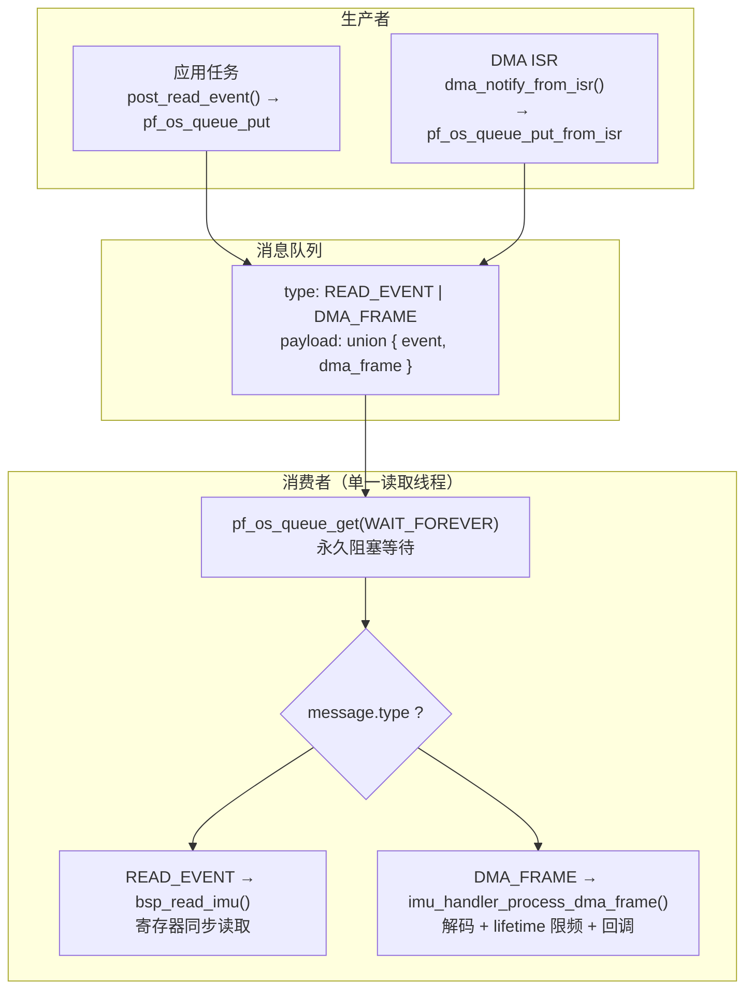
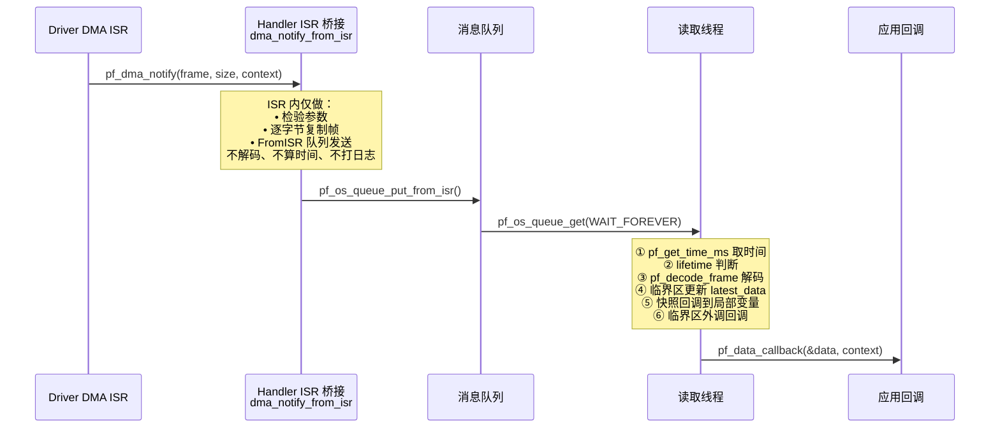
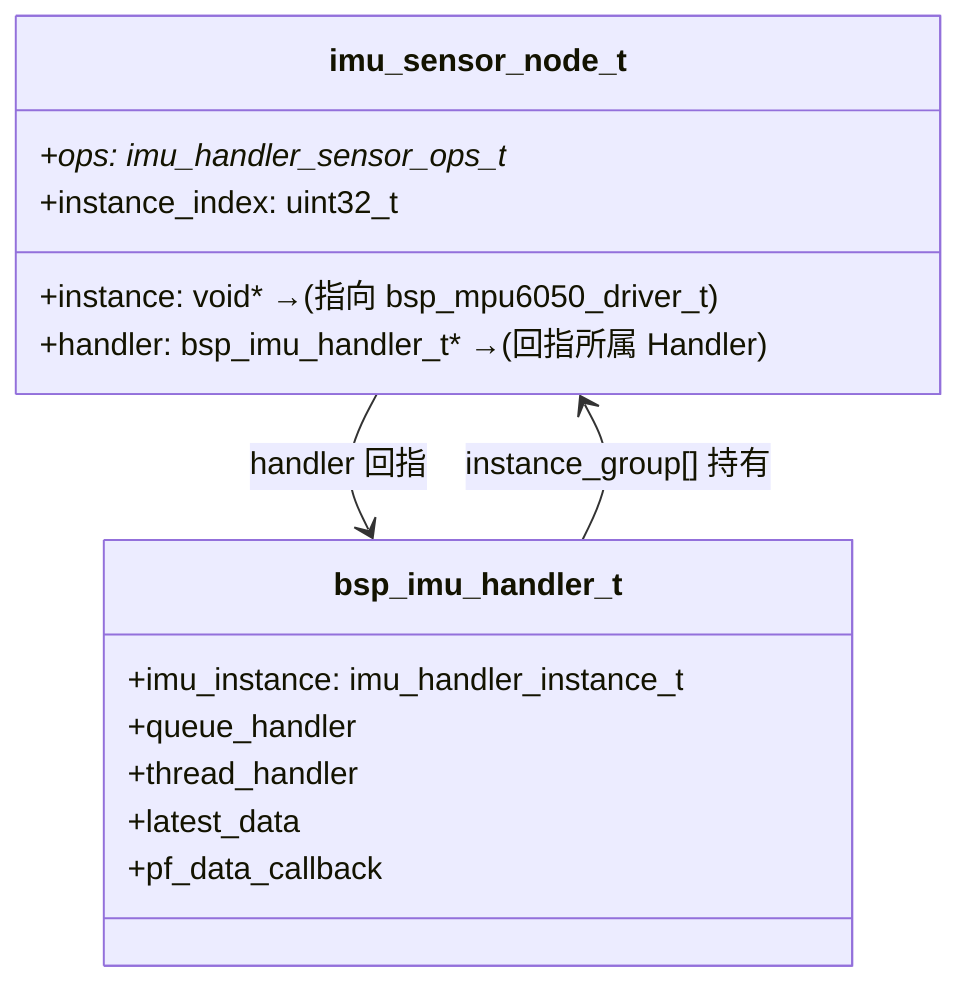

> 来源：Deep-In-Embedded / [开发板/ARM架构/STM32F411CEU6/MPU6050的handle文件架构设计思路.md](https://github.com/shuai-yemao/Deep-In-Embedded/blob/5fcab575fc20cf681f3e79e163337211097c898a/%E5%BC%80%E5%8F%91%E6%9D%BF/ARM%E6%9E%B6%E6%9E%84/STM32F411CEU6/MPU6050%E7%9A%84handle%E6%96%87%E4%BB%B6%E6%9E%B6%E6%9E%84%E8%AE%BE%E8%AE%A1%E6%80%9D%E8%B7%AF.md)

# 📖 引言

> 这篇笔记要讲什么？用一句话概括核心主题。

Handler 位于 Driver 之上，通过消息队列统一管理 IMU 实例的注册、ISR→任务上下文的异步桥接、lifetime 限频与数据回调，将 "IMU 数据从哪来、什么时候处理、处理完交给谁 " 的调度逻辑从芯片驱动中彻底剥离。

---

# 📝 handle 文件的设计思路

> 用一句话说清楚这个知识点是什么。

Handler 位于 Driver 之上，承接 OS 层接口，通过消息队列统一管理同一类外设（IMU）的多实例注册、数据读取调度和 DMA 异步通知分发，为应用层提供统一的传感器数据接口。

## 实际意义

> 为什么会有该知识点？解决了什么实际问题？

如果只有 Driver 而没有 Handler，应用层需要自己写读取线程、管理队列、处理 ISR→任务的数据桥接、对每个 IMU 实例做 lifetime 限频——每个应用都重复一套。更致命的是：MPU6050 数据就绪可达 8kHz，应用层直接接 Driver 的 DMA 通知将导致回调被每秒调用 8000 次，CPU 被完全占满，其他任务饿死。

Handler 解决了五个具体问题：

1. **中断上下半部分离**：ISR 只复制帧到队列，解码/限频/回调推迟到读取线程
2. **消息来源统一调度**：DMA ISR 的高频推送和应用任务的低频查询在同一条线程串行处理，无锁设计
3. **多实例管理**：最多 3 个 IMU 独立维护操作表、lifetime 时间戳，`instance_index` 贯穿整条数据链路
4. **平台解耦**：不调任何 HAL、CMSIS-RTOS 或 FreeRTOS API，全部通过 Adapter 注入
5. **裸机兼容**：`OS_SUPPORTING` 宏一键切换 RTOS 模式和裸机模式

## 应用场景

> 在实际中主要被用来做什么？

### 1. DMA + 中断驱动的高频采集（核心场景）

启动阶段一次性配置——注册 Driver 到 Handler、设置数据回调。此后 MPU6050 INT → EXTI → DMA → 队列 → 读取线程 → 回调，全链路自动运行，应用层零代码介入。适合姿态解算、振动分析等需要连续采样的场景。

关键 API：`bsp_imu_handler_inst()` → `pf_instance_register()` → `set_data_callback()`

### 2. 应用层低频主动查询

裸机模式（`OS_SUPPORTING=0`）或不启用 DMA，应用层定时调用 `bsp_imu_handler_post_read_event()` 投递读取请求到队列，读取线程通过 Driver 的 `pf_get_data` 同步读一次数据。适合低功耗传感器轮询场景。

关键 API：`bsp_imu_handler_post_read_event()`

### 3. 多 IMU 冗余管理

机器人关节上挂 2-3 个 MPU6050 做姿态冗余，全部注册到同一个 Handler。Handler 遍历所有已注册实例依次调用 `pf_read_data`，`instance_index` 区分数据来源。

关键 API：`pf_instance_register()` × N

## 核心逻辑/原理

> 它是如何工作的？拆解背后的机制。

### 1. 消息队列统一调度：单消费者 + union 复用

Handler 只有**一条读取线程**，所有消息源都通过**一条队列**投递：



**为什么用 union 而非两条队列？** 如果两条队列，读取线程需同时等待两个阻塞源——要么用 FreeRTOS 队列集（API 更复杂、开销更大），要么创建两条线程各等一条（浪费栈空间、徒增任务切换）。union + `type` 字段让单消费者模型成立：**一条队列、一个永久阻塞点、一个 switch**——无并发竞争、不需要互斥锁。

线程无消息时永久阻塞在 `WAIT_FOREVER` 上，零 CPU 占用。

### 2. ISR 桥接：`bsp_imu_handler_dma_notify_from_isr`

这是 Handler 中**唯一可在 ISR 上下文调用的函数**。它在 ISR 里做的事：

1. 从 `context`（其实是 `imu_sensor_node_t*`）还原出 `handler` 和 `instance_index`
2. 校验 `frame` 和 `size` 不超过 `IMU_HANDLER_RAW_FRAME_MAX_SIZE`（32 字节）
3. **逐字节复制帧数据**到 `message.payload.dma_frame.frame[]`
4. 调 `pf_os_queue_put_from_isr()` 投递到队列
5. 返回 `higher_priority_task_woken` ——通知调用方（Driver 的 DMA 回调）是否在退出 ISR 前触发任务调度

**刻意不做的：** 不解码（`pf_decode_frame` 留给线程）、不读时间戳（`pf_get_time_ms` 留给线程）、不调回调（`pf_data_callback` 留给线程）、不打日志。全部重活推迟到读取线程——ISR 总耗时 <5μs。

```c
// handler.c:636-668 — ISR 桥接函数核心逻辑
uint32_t bsp_imu_handler_dma_notify_from_isr(const uint8_t *const frame,
                                             uint32_t size,
                                             void *const context) {
    imu_sensor_node_t *node = (imu_sensor_node_t *)context;  // ① 从 context 还原 handler
    // ② 逐字节复制帧
    for (index = 0U; index < size; index++) {
        message.payload.dma_frame.frame[index] = frame[index];
    }
    // ③ FromISR 队列投递
    status = self->p_imu_os->p_os_queue->pf_os_queue_put_from_isr(
        self->queue_handler, &message, &higher_priority_task_woken);
    return (IMU_HANDLER_OK == status) ? higher_priority_task_woken : 0U;
}
```



### 3. 线程主循环与退出

```c
// handler.c:694 — 线程主循环
while (IMU_INITED == self->is_inited) {
    status = self->p_imu_os->p_os_queue->pf_os_queue_get(
        self->queue_handler, &message, IMU_HANDLER_OS_WAIT_FOREVER);
    if (IMU_HANDLER_OK != status) break;

    if (IMU_HANDLER_MESSAGE_READ_EVENT == message.type)
        status = bsp_read_imu(self, &message.payload.read_event);
    else if (IMU_HANDLER_MESSAGE_DMA_FRAME == message.type)
        status = imu_handler_process_dma_frame(self, &message.payload.dma_frame);
}
```

**当前退出机制的隐患：** `imu_handler_deinit` 先调 `pf_os_thread_delete` 强杀线程（等价于 `vTaskDelete`），**然后才设** `is_inited = NOT_INITED`。线程可能正在 `pf_data_callback` 回调中被强杀——如果回调持有了互斥锁，锁永远不释放，等待该锁的所有任务永久阻塞（死锁）。

**改进方案（三段式退出）：**

1. 设 `is_inited = NOT_INITED` — 阻止新消息投递
2. 用 `pf_os_task_notify_give` 投递退出信号 — 唤醒阻塞在 `WAIT_FOREVER` 的线程
3. 线程收到信号后自然 `break` → `return`
4. 等线程 return 后**再**删线程→删队列→删信号量

Handler 已定义了 `imu_handler_os_task_notify_t` 接口但未在退出流程中使用——这是预留接口，待实现。

### 4. 实例注册与双向引用



`imu_sensor_node_t.handler` 回指指针在 ISR 中起关键作用：

```c
// handler.c:636 — ISR 中 context → node → handler 的还原链
imu_sensor_node_t *node = (imu_sensor_node_t *)context;
bsp_imu_handler_t *self = node->handler;  // ← 通过回指拿到 handler
// 然后调 self->queue_handler → 投递到正确的队列
```

没有回指，ISR 不知道帧该投递到哪个 Handler 的队列。注册时防重复：`pf_instance_register` 用线性扫描检查同一 `instance` 指针不可重复注册。

### 5. 临界区保护

三处共享资源需保护：

| 位置 | 共享资源 | 保护方式 |
|------|---------|---------|
| `set_data_callback` | `pf_data_callback` + `context` | `enter_critical` / `exit_critical` 原子更新 |
| `process_dma_frame` | `latest_data` + `latest_status` | 临界区内写入 + 快照回调到局部变量 |
| `process_dma_frame` | `pf_data_callback` + `context` | 临界区内快照到局部变量，**回调在临界区外调用** |

```c
// handler.c:622-632 — 回调在临界区外调用，防止死锁
imu_handler_enter_critical(self);
self->latest_data = data;
data_callback    = self->pf_data_callback;      // 快照
callback_context = self->p_data_callback_context; // 快照
imu_handler_exit_critical(self);

if (NULL != data_callback) {
    data_callback(&self->latest_data, callback_context);  // 临界区外
}
```

### 6. lifetime 限频与首次跳过

```c
// handler.c:602-608
elapsed_time = timestamp_ms - self->dma_last_process_time[signal->instance_index];
if (IMU_HANDLER_DMA_TIMESTAMP_INVALID !=
        self->dma_last_process_time[signal->instance_index] &&
    elapsed_time < IMU_HANDLER_DMA_LIFETIME_MS) {
    return IMU_HANDLER_OK;  // 未到期，跳过不解码
}
```

初始值 `0xFFFFFFFF`（`INVALID`）确保首次帧永远被处理——必须拿到第一个时间基准才能计算后续帧的 elapsed。

DMA ISR 不做 lifetime 判断——不管是否需要，ISR 都复制帧进队列。lifetime 判断推迟到读取线程，保证 ISR 足够短。

DMA 帧的 `frame[32]` 使用**固定大小数组**而非动态分配——因为 ISR 中禁止 `malloc`（非 ISR 安全），且 `pf_os_queue_put_from_isr` 按值复制整个消息体，固定大小保证复制开销可预测。32 字节覆盖 MPU6050 的 14 字节并留余量兼容其他 IMU（如 ICM-20948 的 22 字节）。

同步读取路径（`bsp_read_imu`）使用 **`static uint32_t last_read_time[4]`** 为四种读取类型独立计时：

```c
// handler.c:397 — 四种读取类型各占一个 lifetime 槽
static uint32_t last_read_time[4] = {0U};
// [0]=ACCEL, [1]=GYRO, [2]=TEMPERATURE, [3]=ALL
```

`static` 使时间戳跨调用保持，但有一个隐含约束：**所有 Handler 实例共享同一组 `last_read_time`**——如果创建多个 Handler，它们的同步读取 lifetime 会互相影响。DMA 路径无此问题（`dma_last_process_time` 是实例成员）。

### 7. OS_SUPPORTING 条件编译

```c
// handler.h:49
#define OS_SUPPORTING 1
```

| 模式 | OS_SUPPORTING=1（默认） | OS_SUPPORTING=0 |
|------|----------------------|-----------------|
| 资源 | 信号量 + 队列 + 读取线程 | 无 OS 资源 |
| init | 创建信号量→队列→线程（失败逆序回滚） | 仅设 `is_inited = INITED` |
| post_read_event | 通过队列投递 | 返回 `IMU_HANDLER_ERRORRESOURCE` |
| DMA ISR 桥接 | 队列投递 | 不能用（无队列） |
| 适用 | 连续采集、需 DMA | 裸机轮询、单次读取 |

裸机模式下 `bsp_read_imu` 仍可被直接调用（同步读取），但 DMA 异步路径不可用。

## 关键公式/结论

> 最终结论和公式。

### Handler 核心常量

| 宏 | 默认值 | 选择理由 |
|----|--------|---------|
| `IMU_NUM_MAX` | 3 | 姿态冗余 + 关节测量，通常 2-3 个够用 |
| `IMU_HANDLER_RAW_FRAME_MAX_SIZE` | 32 | MPU6050 仅 14 字节，留余量兼容其他 IMU |
| `IMU_HANDLER_READ_QUEUE_LENGTH` | 8 | 3 实例 × 每 50ms 各 1 帧 = 3 帧，8 有余量吸收突发 |
| `IMU_HANDLER_READ_THREAD_STACK_DEPTH` | 256 | 线程不递归、不长周期计算，256 字充裕 |
| `IMU_HANDLER_READ_THREAD_PRIORITY` | 2 | 低于关键控制线程、高于普通应用线程 |
| `IMU_HANDLER_DMA_LIFETIME_MS` | 50ms | 8kHz → 20Hz = 每 400 帧处理 1 帧，保护 CPU |
| `IMU_HANDLER_DMA_TIMESTAMP_INVALID` | 0xFFFFFFFF | 标记首次帧永远放行 |

### lifetime 限频逻辑

```
elapsed = current_time - dma_last_process_time[i]
if (last_time != INVALID && elapsed < 50ms):
    skip → return OK
else:
    decode → update latest_data → callback
```

DMA ISR 不做限频——帧总是复制进队列。限频在读取线程执行，保证 ISR 短。

### 资源创建与回滚

```
创建：信号量 → 队列 → 线程
回滚：线程失败 → 删队列 → 删信号量
      队列失败 → 删信号量
      信号量失败 → 直接返回
```

### 预留但未使用的接口

Handler 的 `imu_handler_os_t` 聚合了 6 类 OS 接口，其中 3 类当前**已定义但未实际使用**：

| 接口 | 定义位置 | 预留用途 | 当前替代方案 |
|------|---------|---------|------------|
| `p_os_delay` | [handler.h:295-303](BSP/MPU6050/handler/Inc/bsp_imu_handler.h#L295) | 同步读取失败后的退避等待 | 无——失败直接返回错误 |
| `p_os_task_notify` | [handler.h:411-441](BSP/MPU6050/handler/Inc/bsp_imu_handler.h#L411) | 线程退出信令、ISR→任务轻量通知 | 线程被强杀 |
| `p_os_semaphore` | [handler.h:448-495](BSP/MPU6050/handler/Inc/bsp_imu_handler.h#L448) | `latest_data` 的读写同步 | `enter_critical`/`exit_critical` |

设计意图：接口表是**能力声明**而非**能力使用**——Adapter 注入后，Handler 未来可以选择用信号量替代临界区（减少关中断时间）、用任务通知替代哨兵消息（退出流程更轻量）、用延时退避替代直接失败（读失败重试）。当前是功能最小化实现。

### `imu_handler_data_t` vs `mpu6050_data_t`

字段完全一致，区别在于 `imu_handler_data_t` 额外包含 `instance_index` 和 `timestamp_ms`，由 Handler 在读取成功后填写。Driver 不感知这些元数据。

## 实际操作步骤

> 动手验证/配置的具体操作。

### 第一步：Adapter 填充接口表

```c
// OS 接口 — 封装 FreeRTOS API
imu_handler_os_queue_t queue_if = {
    .pf_os_queue_create       = adapter_queue_create,     // → xQueueCreate
    .pf_os_queue_put          = adapter_queue_put,        // → xQueueSend
    .pf_os_queue_put_from_isr = adapter_queue_put_from_isr, // → xQueueSendFromISR
    .pf_os_queue_get          = adapter_queue_get,        // → xQueueReceive
    .pf_os_queue_delete       = adapter_queue_delete,     // → vQueueDelete
};

imu_handler_os_thread_t thread_if = {
    .pf_os_thread_create = adapter_thread_create,         // → xTaskCreate
    .pf_os_thread_delete = adapter_thread_delete,         // → vTaskDelete
};

imu_handler_os_critical_t critical_if = {
    .pf_os_critical_enter = adapter_critical_enter,       // → taskENTER_CRITICAL
    .pf_os_critical_exit  = adapter_critical_exit,        // → taskEXIT_CRITICAL
};

// 时基 — HAL_GetTick 或 xTaskGetTickCount
imu_handler_timebase_ms_t timebase = {
    .pf_get_time_ms = adapter_get_time_ms,
};

// 聚合
imu_handler_os_t imu_os = {
    .p_os_queue     = &queue_if,
    .p_os_thread    = &thread_if,
    .p_os_critical  = &critical_if,
};
```

### 第二步：实现 sensor_ops（Driver 桥接）

```c
// 解码：14 字节原始帧 → imu_handler_data_t
imu_handler_status_t mpu6050_decode_frame(void *self,
    const uint8_t *frame, uint32_t size, imu_handler_data_t *data) {
    if (14 != size) return IMU_HANDLER_ERRORPARAMETER;
    data->accel_x = (int16_t)(((uint16_t)frame[0] << 8) | frame[1]);
    data->accel_y = (int16_t)(((uint16_t)frame[2] << 8) | frame[3]);
    // ... 以此类推 14 字节解出 7 个 int16_t
    return IMU_HANDLER_OK;
}

// 读取：调 Driver 的 pf_get_data，映射状态码
imu_handler_status_t mpu6050_read_data(void *self, imu_handler_data_t *data) {
    bsp_mpu6050_driver_t *drv = (bsp_mpu6050_driver_t *)self;
    return (imu_handler_status_t)drv->pf_get_data(drv, MPU6050_DATA_ALL, data);
}

imu_handler_sensor_ops_t sensor_ops = {
    .pf_init            = (void*)mpu_drv.pf_init,
    .pf_deinit          = (void*)mpu_drv.pf_deinit,
    .pf_read_data       = mpu6050_read_data,
    .pf_decode_frame    = mpu6050_decode_frame,
    .pf_set_dma_notify  = (void*)mpu_drv.pf_set_dma_notify,
    .pf_detect          = (void*)mpu_drv.pf_read_id,
};
```

### 第三步：实例化 + 注册（顺序不可颠倒）

```c
// ① 先实例化 Driver
bsp_mpu6050_driver_t mpu_drv = {0};
bsp_mpu6050_driver_inst(&mpu_drv, &driver_ops);

// ② 再实例化 Handler（内部自动创建信号量→队列→线程）
bsp_imu_handler_t handler = {0};
bsp_imu_handler_inst(&handler, &timebase, &imu_os);

// ③ 注册 Driver 到 Handler（自动绑定 DMA 通知）
handler.pf_instance_register(&handler, &mpu_drv, &sensor_ops);

// ④ 配置 DMA 数据回调
handler.pf_set_data_callback(&handler, on_imu_data, NULL);
```

此后 DMA 路径全自动运行：MPU6050 INT → DMA → Handler ISR 桥接 → 队列 → 读取线程 → `on_imu_data()`。

### 第四步：同步读取（可选）

```c
imu_handler_data_t data = {0};
imu_handler_event_t event = {
    .data        = &data,
    .lifetime    = 20,
    .read_status = IMU_HANDLER_READ_ALL,
    .pf_event_callback = my_read_done,
};
bsp_imu_handler_post_read_event(&handler, &event, 100);
```

### 第五步：停止和清理（逆序）

```c
handler.pf_deinit(&handler);  // 线程→队列→信号量→清实例引用
mpu_drv.pf_deinit(&mpu_drv);  // SLEEP→NOT_INITED
```

## 常见问题

> 现象 → 根因 → 修复。均来自代码分析。

### 问题 1：deinit 强杀线程导致死锁

**现象**：应用层调用 `pf_deinit` 后系统整体卡死，部分任务一直 Blocked。

**根因**：`imu_handler_deinit` 通过 `pf_os_thread_delete` 强杀线程（等价 `vTaskDelete`）。如果线程正在 `pf_data_callback` 回调中持有互斥锁，锁永远不释放——等待该锁的所有任务永久阻塞。

**修复**：三段式退出——先设 `is_inited = NOT_INITED`，再用任务通知唤醒线程自然 return，等线程函数退出后再删线程。

### 问题 2：Handler 初始化在 Driver 之前，数据无法读取

**现象**：`bsp_imu_handler_inst` 成功返回，注册也成功，但应用层一直没有数据回调触发。

**根因**：`bsp_imu_handler_inst` 本身不依赖 Driver 实例——只创建信号量、队列、线程。`pf_instance_register` 传入未初始化或未就绪的 Driver 指针时，`ops->pf_set_dma_notify` 操作异常返回错误，Handler 注册失败但线程仍在默默空转。

**修复**：严格遵守初始化顺序——Driver 实例化 → Handler 实例化 → 注册 Driver。

---

# 💬 Q&A

> 自问自答，检验理解深度。按难度递进排列。

## 🟢 基础

> 最基本的概念和用法，入门必知。

### Q1: Handler 的消息队列为什么使用一个 struct 内嵌 union，融合两种消息类型？

A1: 使用 union 让 `read_event` 和 `dma_frame` 共享同一块内存，读取线程只需一次 `pf_os_queue_get(WAIT_FOREVER)` + 一次 `switch(message.type)`。如果用两条队列分别存放两种消息，读取线程需要同时等待两个阻塞源——需引入 FreeRTOS 队列集（API 更复杂、开销更大）或创建两条线程各等一条（浪费栈空间）。union + type 字段让单消费者模型成立：一条队列、一个永久阻塞点、一个 switch——无并发竞争、不需要互斥锁。

### Q2: `dma_last_process_time` 的初始值为什么设为 `0xFFFFFFFF`？

A2: `0xFFFFFFFF` 作为 `IMU_HANDLER_DMA_TIMESTAMP_INVALID` 标记首次帧放行。lifetime 限频需要在首次帧被处理后拿到第一个时间基准（`last_time`），后续帧才能计算 `elapsed = current - last`。如果首帧也要做 `elapsed < 50ms` 检查——`0xFFFFFFFF` 的差值远超 50ms，逻辑上不可行。首次帧永远被处理是必然设计。

## 🟡 进阶

> 容易踩的坑和常见误区。

### Q3: 读取线程的退出条件 `while (IMU_INITED == self->is_inited)` 为什么实际不会被触发？

A3: 因为 `imu_handler_deinit` 的执行顺序是**先调 `pf_os_thread_delete` 强杀线程**，再设 `is_inited = NOT_INITED`。线程在运行到循环条件检查之前就已经被删除了。`is_inited` 的检查只是防御性设计——防止某些平台的线程删除是异步的、线程可能在标志改变后才真正退出。

### Q4: `imu_handler_deinit` 应如何改进以避免死锁？

A4: 改进为三段式退出：①设 `is_inited = NOT_INITED` 阻止新消息投递 → ②用 `p_os_task_notify_give` 投递退出信号唤醒阻塞在 `WAIT_FOREVER` 的线程 → ③线程收到信号后自然 `break`→`return` → ④等线程函数 return 后**再**删线程句柄 → ⑤删队列 → ⑥删信号量。Handler 已定义的 `imu_handler_os_task_notify_t` 接口正是为此预留，但当前未在退出流程中使用。

## 🔴 困难

> 结合实战的深层原理和设计权衡。

### Q5: `pf_data_callback` 回调为什么在临界区**外面**调用？

A5: 避免死锁。回调函数是用户代码——可能调用 `set_data_callback`（需要同一临界区锁）或其他依赖 Handler 内部锁的 API。如果回调在临界区内执行，形成锁的重入或嵌套，导致死锁。Handler 在临界区内完成 `latest_data` 写入、`pf_data_callback` 和 `context` 的快照到局部变量——然后退出临界区、使用局部副本安全调用回调。

### Q6: 什么是时间片切割？

A6: 时间片切割是 FreeRTOS 对**同优先级多任务**的调度策略——每个任务轮流获得 CPU，每次运行固定时长（默认 1 个 tick = 1ms），到期后强制切换到下一个同优先级就绪任务。不同优先级的任务不参与时间片切割：高优先级任务直接抢占 CPU（不等时间片到期），低优先级任务只在无高优先级就绪时才运行。

### Q7: 为什么在 FreeRTOS 中要少用（长）中断？

A7: Cortex-M NVIC 在 ISR 执行期间阻塞同级和更低优先级的所有中断。SysTick 通常配置为最低优先级——如果 ISR 耗时过长，SysTick 被阻塞无法递减 → FreeRTOS 时基漂移 → `vTaskDelay`、带超时的 `xQueueReceive` 等全部失准 → 整个系统实时性崩溃。ISR 中只能调 `FromISR` 后缀 API、不能阻塞（禁止 `portMAX_DELAY`）、退出前检查 `portYIELD_FROM_ISR`。

### Q8: 什么是 CPU 运行流水线？

A8: CPU 流水线是把每条指令的执行拆成多个阶段（如"取指→译码→执行→写回"），不同指令的不同阶段**同时进行**。类比工厂流水线：第一个产品在组装时，第二个在喷漆，第三个在包装——同一时钟周期可以加工多个产品。Cortex-M3/M4 为 3 级流水线（取指→译码→执行），Cortex-M7 为 6 级。流水线提高了指令吞吐率，但遇到分支跳转时需要"排空"流水线（flush），这就是分支延迟的根因。

### Q9: FreeRTOS 切换任务时如何保存和恢复线程上下文？

A9: 上下文切换由 PendSV 异常驱动，分四步：

1. **NVIC 硬件自动压栈**：将当前任务的 R0-R3, R12, LR, PC, PSR 自动压入当前任务栈（12 个周期）
2. **PendSV ISR 手动保存**：将 R4-R11 手动压入当前任务栈 → 将当前栈顶指针存入任务 TCB 的 `pxTopOfStack`
3. **选择新任务**：选最高优先级就绪任务 → 从新 TCB 读取其 `pxTopOfStack` → 设为新的 PSP（进程栈指针）
4. **NVIC 硬件自动出栈**：异常返回时 NVIC 自动从新任务栈恢复 R0-R3, R12, LR, PC, PSR → PC 指向新任务断点继续执行

Cortex-M 的设计优势：上下文切换中大部分寄存器保存/恢复由**硬件自动完成**（不需要软件逐条 `PUSH`/`POP`），切换效率远高于其他架构。

---

# 📋 总结

> 3-5 句话回顾核心要点，用自己的话复述。

Handler 位于 Driver 之上，通过消息队列统一管理 IMU 实例的注册与数据调度——DMA ISR 只复制帧、不解码不算时间，读取线程在消息驱动的单消费者模型中串行处理，天然无锁。ISR 桥接函数利用 `imu_sensor_node_t.handler` 回指指针还原 Handler 上下文，FromISR 队列投递后由线程完成解码、lifetime 限频（8kHz→20Hz）和回调发布。依赖注入使 Handler 不与任何具体 RTOS 或 IMU 型号绑定，`OS_SUPPORTING` 宏支持裸机降级。临界区保护回调指针和 `latest_data` 原子更新，回调在临界区外调用防止死锁。当前去初始化的强杀线程方式存在死锁隐患——需改为三段式退出。

---

# 📎 参考资料

> 学习过程中用到的外部资源汇总。

## 🔗 博客/文档链接

> 分析最透彻的博客、官方文档、社区帖子。

- [FreeRTOS Queue Management](https://www.freertos.org/Embedded-RTOS-Queues.html) — 理解 `xQueueSendFromISR` 与 `xQueueReceive` 的语义，`pxHigherPriorityTaskWoken` 的作用
- [FreeRTOS Task Notifications](https://www.freertos.org/RTOS-task-notifications.html) — 轻量级任务通知，比队列更快但不传数据
- [FreeRTOS Deferred Interrupt Handling](https://www.freertos.freertos.org/Documentation/02-Kernel/02-Kernel-features/11-Deferred-interrupt-handling) — 集中式 vs 应用控制式延迟中断处理

## 💻 仓库链接

> GitHub/Gitee 源码仓库，含 Demo 工程和工具链。

- 当前笔记对应本地工程：`STM32F411CEU6_Mpu6050`，分支 `mpu6050`
- 构建工具链：Keil MDK + arm-none-eabi-gcc

## 📄 代码/附件

> 本地代码文件、PDF、工具链文件。

- `BSP/MPU6050/handler/Inc/bsp_imu_handler.h` — 状态码、消息结构体、传感器操作表、OS 接口和实例结构体定义
- `BSP/MPU6050/handler/Src/bsp_imu_handler.c` — 实例化、资源创建/回滚、ISR 桥接、读取线程、lifetime 限频和临界区保护的完整实现
- `BSP/MPU6050/driver/Inc/bsp_mpu6050_driver.h` — Driver 层接口定义，含 `mpu6050_dma_notify_t` 回调类型
- [[MPU6050的driver文件架构设计思路]]
- [[AHT21的handler文件架构设计思路]]
