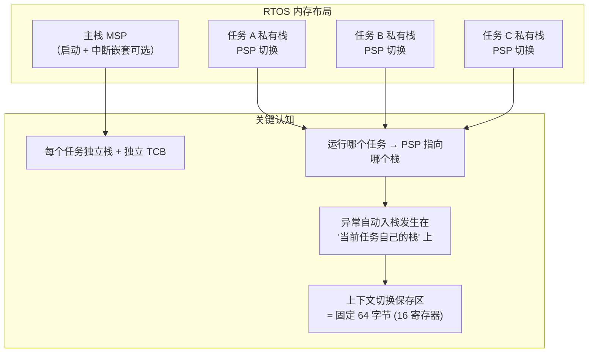

> 来源：Deep-In-Embedded / [开发板/ARM架构/STM32F411CEU6/OS异步栈回溯.md](https://github.com/shuai-yemao/Deep-In-Embedded/blob/5fcab575fc20cf681f3e79e163337211097c898a/%E5%BC%80%E5%8F%91%E6%9D%BF/ARM%E6%9E%B6%E6%9E%84/STM32F411CEU6/OS%E5%BC%82%E6%AD%A5%E6%A0%88%E5%9B%9E%E6%BA%AF.md)

# 📖 引言

> OS 异步栈回溯：在 RTOS 多任务环境下，当系统崩溃（HardFault 等异常）时，离线从**当前任务的私有栈**中还原出完整函数调用链的技术。它回答一个核心问题——" 系统死后，怎么知道它死在了哪个任务的哪条调用路径上？"

前置知识：[[函数调用栈和栈回溯定位故障]]、[[Cmbacktrace库]]。本文是 CmBacktrace 的 RTOS 模式原理补充，聚焦于**多任务栈**场景下的回溯差异。

---

# 📝 OS 异步栈回溯

> " 异步 " 是相对调试器的 " 同步 " 回溯而言的：**同步回溯** = 断点暂停，调试器通过 SWD/JTAG 实时读取寄存器与内存（需要在线仿真器）；**异步回溯** = 系统已经崩溃/复位，只能靠异常发生时保存下来的**栈现场 + 上下文**离线还原调用链（可脱离仿真器，量产设备也能用）。

## 实际意义

> 为什么会有该知识点？

1. **裸机一套回溯逻辑在 RTOS 下失效**：裸机只有一个主栈（MSP），回溯逻辑简单；RTOS 下每个任务有独立栈（PSP 切换），崩之前任务可能刚被切换走，" 该回溯哪个栈 " 成了首要问题。
2. **量产设备无法接仿真器**：设备在现场死机后自动复位，工程师手上只有一串串口日志。异步栈回溯 + `addr2line` 反解析是唯一的定位手段。
3. **偶发故障无法复现**：断点会破坏实时性、改变时序，很多并发 bug 一旦停住就再也抓不到。异步回溯不打断系统，捕获的是 " 原生态 " 的崩溃现场。
4. **中断里调用 OS 接口导致的随机崩溃**：这类故障没有固定复现路径，只能靠崩溃后的完整调用链反推。

## 应用场景

> 在实际中主要被用来做什么？

- **RTOS 任务栈溢出定位** — 崩在哪个任务、哪条调用路径，任务栈差几字节就溢出了
- **偶发 HardFault 死机** — 产品跑几天才崩一次，无仿真器，靠串口日志离线回溯
- **中断上下文误用 OS API** — 在 ISR 中调用了 `osDelay`/`vTaskDelay` 等不可中断调用的接口
- **任务优先级/调度导致的时序崩溃** — 需要确认崩溃瞬间正在运行的任务与调用链
- **Ozone/SystemView 等工具回溯失败时的兜底方案** — SEGGER 工具对 RTOS 栈回溯支持有限（见硬汉论坛讨论），此时软件回溯库（CmBacktrace）反而更可靠

## 核心逻辑/原理

> 它是如何工作的？拆解背后的机制。

### ① 同步回溯 vs 异步回溯

| 维度 | 同步回溯（调试器） | 异步回溯（OS 栈回溯库） |
|------|-------------------|------------------------|
| 触发方式 | 断点 / 暂停按钮 | 异常 Handler 自动触发 |
| 数据来源 | 实时读取寄存器 + 内存 | 异常时刻硬件压栈的现场 + 栈内存 |
| 依赖硬件 | 需要 SWD/JTAG + 在线调试器 | 只需串口 / RTT 输出 |
| 适用场景 | 开发调试、可复现 bug | 量产现场、偶发崩溃、离线分析 |
| RTOS 适配 | 依赖 IDE 的 RTOS 插件 | 库自身读取 TCB 判断当前任务 |

### ② RTOS 下的栈架构 —— " 异步 " 的真正难点



**核心结论（硬汉论坛 eric2013 原话）：** 各任务栈空间不同，是 OS 栈回溯与裸机的**唯一区别**。进入中断时硬件自动入栈用的栈空间，就是**当前任务自己的栈**。

### ③ 异常入口：EXC_RETURN 决定回溯哪个栈

Cortex-M 进入异常时，LR 被替换为 `EXC_RETURN`（0xFFFFFFEx），其中 **bit2 是 MSP/PSP 选择位**：

```c
EXC_RETURN & (1 << 2) == 0  → 使用 MSP（裸机/中断上下文）
EXC_RETURN & (1 << 2) != 0  → 使用 PSP（RTOS 任务上下文）
```

常用值速查：

| EXC_RETURN 值 | 含义 |
|---------------|------|
| `0xFFFFFFF1` | Handler 模式 + MSP（异常/中断内） |
| `0xFFFFFFF9` | Thread 模式 + MSP（裸机 main） |
| `0xFFFFFFFD` | Thread 模式 + PSP（RTOS 任务，**最常见崩溃场景**） |

> 选错栈指针 → 读到的异常帧全是错的 → 回溯结果完全不可用。这是 OS 异步回溯的**第一道分水岭**。

### ④ 任务识别：崩在哪个任务？

拿到 PSP 后，还要回答 " 这个 PSP 属于哪个任务 "。CmBacktrace 的 RTOS 模式通过当前任务句柄实现：

```c
/* 伪代码：CmBacktrace RTOS 模式获取当前任务信息 */
void cmb_os_get_cur_task(void)
{
    tcb = xTaskGetCurrentTaskHandle();   /* FreeRTOS 返回 pxCurrentTCB */
    name = tcb->pcTaskName;              /* 任务名 */
    stack_start = tcb->pxStack;          /* 栈底（向下生长的高地址端） */
    stack_size  = tcb->uxSizeOfStack;    /* 栈大小 */
}
```

对应任务名输出示例：

```
Fault on thread: SensorTask
Stack Size: 1024 bytes
```

> **为什么 FreeRTOS 要改源码？** FreeRTOS 的 TCB 中**没有**导出任务栈大小的官方 API，CmBacktrace 官方移植要求向 `tasks.c` 追加 `vTaskStackAddr()/vTaskStackSize()/vTaskName()` 三个函数。网上流传的 " 免改源码 "trace 宏方案（PR #82）**至今未合并**，存在宏作用域缺陷，不推荐生产环境采用（详见 Q4）。

### ⑤ 栈回溯算法：从异常帧沿 LR 链向上翻

异常时刻硬件自动压栈 8 个字（32 字节），布局固定：

| SP 偏移 | 内容 | 用途 |
|---------|------|------|
| +0 | R0 | 第 0 个参数 |
| +4 | R1 | 参数 |
| +8 | R2 | 参数 |
| +12 | R3 | 参数 |
| +16 | R12 | 临时寄存器 |
| +20 | **LR** | **调用者返回地址（回溯起点）** |
| +24 | **PC** | **出错指令地址（核心）** |
| +28 | xPSR | 程序状态寄存器 |

回溯流程：


回溯算法的本质（ARM 调用约定 AAPCS）：函数调用 `BL func` 自动把返回地址存入 LR；函数入口通常 `PUSH {LR}`（或 `PUSH {R4-R7, LR}`）把 LR 压栈。**回溯就是沿当前任务栈向下翻找这些被保存的 LR 值**，每找到一个就是一个调用层。

```c
/* 栈回溯核心伪代码 */
#define MAX_DEPTH  20
uint32_t call_stack[MAX_DEPTH];
uint32_t current_lr = fault_lr;       /* 从异常帧的 LR 开始 */
int depth = 0;

while (current_lr != 0 && depth < MAX_DEPTH) {
    if (current_lr >= FLASH_BASE && current_lr <= FLASH_END) {
        call_stack[depth++] = current_lr & ~1;   /* 清 Thumb bit */
    }
    /* 沿当前任务栈扫描，找到下一个疑似被保存的 LR */
    current_lr = find_next_lr_on_stack(psp, depth);
}

/* addr2line 命令自动生成，供离线反解析 */
/* addr2line -e firmware.axf -a -f 08000a60 08000141 0800313f */
```

## 关键公式/结论

> 最终结论和公式。

1. **OS 与裸机栈回溯唯一区别 = 各任务栈空间不同**；异常自动入栈发生在当前任务自己的栈上，回溯它就对了（硬汉论坛结论）。
2. **" 切换了任务怎么回溯？" → 不影响**。出错发生在切换**之后**，回溯的就是切换后的当前任务栈，而不是切换前的旧任务。
3. **EXC_RETURN bit2** = 0 → MSP（裸机/中断）；= 1 → PSP（RTOS 任务）。
4. **异常帧 8 字布局**：R0-R3、R12、LR、PC、xPSR，PC 在偏移 +24（索引 6），LR 在偏移 +20（索引 5）。
5. **Cortex-M4F FPU Lazy Stacking**：FPU Active 时基础 8 字 + S0~S15(16 字) + FPSCR(1 字) + 对齐 (1 字) = **26 字 = 104 字节**。
6. **地址必须清 Thumb bit**（`& ~1`）：Cortex-M 强制 Thumb 模式，PC bit0 恒为 1。
7. **成功率约 70%**：栈已被破坏（DMA 溢出写栈）或深度递归时回溯可能断裂，需结合其他手段。

## 实际操作步骤

> 动手验证/配置的具体操作。

### 第一步：移植 CmBacktrace 到 RTOS 工程

1. 从 [armink/CmBacktrace](https://github.com/armink/CmBacktrace) 下载源码，复制 `src/`、`fault_handler/cmb_fault.S`、`Languages/` 到工程
2. 创建 `cmb_cfg.h`，开启 OS 平台并指定 RTOS 类型：

```c
#define CMB_USING_OS_PLATFORM                        /* 打开 OS 模式 */
#define CMB_OS_PLATFORM_TYPE CMB_OS_PLATFORM_FREERTOS /* FreeRTOS */
#define CMB_CPU_PLATFORM_TYPE  CMB_CPU_ARM_CORTEX_M4  /* F411 */
```

### 第二步：让 OS 层暴露任务栈信息（FreeRTOS 需改源码）

在 `tasks.c` 末尾追加：

```c
uint32_t *vTaskStackAddr(void) { return (uint32_t *)pxCurrentTCB->pxStack; }
uint32_t vTaskStackSize(void)  { return 256; }   /* 或改为从 TCB 读取 */
char *vTaskName(void)          { return (char *)pxCurrentTCB->pcTaskName; }
```

> **关于 " 免改源码 " 的 trace 宏方案（PR #82）**：原理是在 FreeRTOS 配置中重定义 `traceRETURN_xTaskGetCurrentTaskHandle` 宏，让 `xTaskGetCurrentTaskHandle()` 返回时顺带记录当前任务的栈地址/大小。但该宏的调用点在 FreeRTOS 内核 `tasks.c` 内部，宏替换必须在该编译单元可见才生效——实际上仍需把宏定义塞进 FreeRTOS 配置或源码，且栈大小是用 `TCB地址 − pxStack − 4` **估算**的（依赖 TCB 与栈内存相邻分配的假设，静态任务栈会算错）。该 PR 长期未合并、社区反馈有 bug，**不推荐**；官方改 `tasks.c` 的方案最稳妥。

### 第三步：接管 Fault Handler 并验证

1. 使能 Fault 异常（复位后默认关闭）：

```c
SCB->SHCSR |= SCB_SHCSR_MEMFAULTENA_Msk
           |  SCB_SHCSR_BUSFAULTENA_Msk
           |  SCB_SHCSR_USGFAULTENA_Msk;
SCB->CCR  |= SCB_CCR_DIV_0_TRP_Msk;   /* 除零捕获（调试用） */
```

2. 注释原 `HardFault_Handler`，用 `cmb_fault.S` 接管（汇编版能正确保存 FPU 寄存器）
3. 在 main 中调用 `cm_backtrace_init("F411-App", "HW-1.0", "SW-1.0.0")`
4. **在 FreeRTOS 任务中**（不是 main 里！）触发一次除零/非法指针：

```c
void StartTestTask(void *argument)
{
    volatile uint32_t a = 100, b = 0;
    volatile uint32_t c = a / b;        /* 触发除零异常 */
}
```

> 在 main() 中触发 → 调度器未启动 → 输出 "bare metal(no OS)"，无法验证 OS 模式。**必须在任务中触发**才能看到 `Fault on thread: xxx`。

5. 串口输出中复制自动生成的 `addr2line` 命令，在 `.axf` 目录执行：

```bash
arm-none-eabi-addr2line -e firmware.axf -a -f 08000a60 08000141 0800313f
```

输出函数名 + 行号即验证成功。

## 常见问题

> 现象 → 根因 → 修复。

### 发现的问题

- **现象 1**：串口输出 "bare metal(no OS)"，但工程明明用了 FreeRTOS
- **现象 2**：输出没有 `Fault on thread` 任务名，只有地址
- **现象 3**：`addr2line` 反解析全部是 `??:?`
- **现象 4**：回溯链断裂，只还原出 2~3 层调用

### 根因分析

| 现象 | 根因 |
|------|------|
| 裸机输出 | 故障在 `vTaskStartScheduler()` 之前触发，调度器没起来，PSP 还没启用 |
| 无任务名 | TCB 中读不到 `uxSizeOfStack`，或 `vTaskName()` 未正确实现 |
| 全是 `??:?` | Keil 未勾选 Debug Information，或编译优化 `-O2/-O3` 移除了符号 |
| 回溯链断裂 | 编译器**内联函数**（无独立栈帧无 BL 指令）、**尾调用优化**、或栈已被破坏 |

### 改进方法

- **调度器启动后再崩溃**：测试代码放任务函数里，别放 main
- **任务名缺失**：补全 `vTaskStackAddr/vTaskStackSize/vTaskName` 三个函数
- **`??:?` 问题**：Keil 勾选 Project → Output → Debug Information；编译用 `-Og` 或 `-O1`
- **优化破坏回溯**：对关键函数用 `__attribute__((noinline))` 禁内联，关闭尾调用优化 `-fno-optimize-sibling-calls`
- **栈被 DMA 踩坏**：用 MPU 栈守卫（栈底设置不可读写区域，栈增长到底立即触发 MemManage Fault），或对 DMA 目标区做总线保护
- **栈溢出量化**：栈初始化填充 0xA5，运行后用 `uxTaskGetStackHighWaterMark()` 查询最小剩余栈（水位线）

---

# 💬 Q&A

> 自问自答，检验理解深度。按难度递进排列。

## 🟢 基础

> 最基本的概念和用法，入门必知。

### Q1: 什么是 " 异步 " 栈回溯？它和调试器里看到的 Call Stack 有什么区别？

A1：" 异步 " 是相对调试器 " 同步暂停 " 而言的。调试器通过断点把 CPU 停下来，实时读寄存器/内存显示调用栈，这叫同步回溯；系统崩溃后（异常/复位）只能靠硬件压栈保存的现场 + 栈内存离线还原调用链，叫异步回溯。异步回溯的核心优势是**不打断系统**、**不依赖仿真器**，适合量产现场和偶发崩溃。

### Q2: RTOS 下异步栈回溯和裸机相比，难点在哪？是不是不能用了？

A2：不是不能用，难点只有一个——**每个任务有独立的栈**。裸机回溯主栈 MSP 就够了；RTOS 崩溃时 PSP 指向 " 当前正在运行的任务 " 的栈，必须先通过 `EXC_RETURN` 判断用的是 PSP 还是 MSP，再通过当前任务句柄（TCB）拿到任务名和栈范围，最后对这个任务栈执行回溯。其余回溯算法（沿 LR 链翻找返回地址）与裸机完全一致。

## 🟡 进阶

> 容易踩的坑和常见误区。

### Q3: 系统在切换任务之后才崩，PSP 已经指向新任务了，旧任务的调用栈会不会丢失？到底该回溯哪个栈？

A3：该回溯**当前任务**（切换后正在运行的）的栈。关键点：异常发生在切换**之后**，此时 PSP 已经指向新任务的栈，硬件压栈的 8 个字也压在新任务的栈上——新任务的栈帧信息完整无缺。旧任务已经切走，它的栈此刻是 " 冻结快照 " 状态，不需要回溯。这正是硬汉论坛版主强调的结论：" 出错发生在切换之后，而不是切换之前。"

### Q4: 为什么 FreeRTOS 移植 CmBacktrace 要改 tasks.c？所有 RTOS 都要改吗？

A4：分三层回答——① **栈回溯本身不需要 trace 宏**：`EXC_RETURN` 判断 + LR 链扫描 + `addr2line` 反解析完全不依赖任何 trace 机制；trace 宏只是 " 获取当前任务栈地址/大小 " 这一项的可选手段。② **为什么官方要改 tasks.c**：CmBacktrace 需要从 TCB 读三个信息（栈地址、栈大小、任务名），FreeRTOS 没有官方 API 直接返回当前任务的栈范围，官方做法是往 `tasks.c` 追加 `vTaskStackAddr()/vTaskStackSize()/vTaskName()`（任务名其实可用官方 `pcTaskGetName(NULL)` 拿到）。③ **trace 宏方案（PR #82）为什么不可靠**：它重定义 `traceRETURN_xTaskGetCurrentTaskHandle`，但该宏调用点在 FreeRTOS 内核 `tasks.c` 内部，宏替换只在编译该文件时生效——CmBacktrace 的 `cmb_def.h` 不会被 tasks.c 包含，宏根本不展开；即使强行把宏塞进 FreeRTOS 配置，栈大小也是用 `TCB地址 − pxStack` 相减估算的（依赖相邻分配假设），静态任务栈会算错。该 PR 从 2024 年挂到现在仍未合并，评论区已有人反馈 " 无法生成 addr2line 提示 "。RT-Thread 等 TCB 完整暴露栈信息的 RTOS 则不需要改源码。

## 🔴 困难

> 结合实战的深层原理和设计权衡。

### Q5: 生产固件开 `-O2` 后，为什么 CmBacktrace 回溯链会断裂？有哪些补救手段？

A5：三层原因：① **函数内联**——inline 后没有独立的 BL 调用指令，也没有独立的栈帧，调用链信息直接消失；② **尾调用优化**——`return f(x)` 被优化成 `jmp f(x)`，复用当前栈帧，LR 不再压栈，链路断裂；③ **省略帧指针** `-fomit-frame-pointer`（ARM GCC 新版默认开）——基于 FP 的链路式回溯直接失效。补救手段：对关键函数加 `__attribute__((noinline))`；关闭尾调用优化 `-fno-optimize-sibling-calls`；保留帧指针 `-fno-omit-frame-pointer`；或改用 `-funwind-tables` 生成 unwind 表走 ELF 展开。注意 `-O2` 下回溯本身不保证完整，应保留 `-Og` 版本用于定位、`-O2` 版本用于发布。

### Q6: 如果 DMA 把当前任务栈写坏了，栈回溯会不会拿到一堆垃圾地址？硬件上有没有 " 早发现 " 的手段？

A6：会。栈一旦被踩，`PUSH {LR}` 保存的返回地址可能已经被覆盖成垃圾值，回溯算法拿到的地址要么落在代码区外（被地址有效性检查过滤掉，导致链断裂），要么恰好落在代码区（产生**误导性的假函数名**，比断裂更危险）。" 早发现 " 手段：① **MPU 栈守卫**——在任务栈底设一块不可读写区域，栈增长越界立即触发 MemManage Fault，把崩溃点精确卡在溢出瞬间；② **栈填充哨兵 + 水位线**——初始化填充 0xA5，定期检查哨兵是否被覆盖，配合 `uxTaskGetStackHighWaterMark()` 量化余量；③ **canary 校验**——`-fstack-protector-strong` 在栈帧间插安全边界，函数返回时校验，被改则主动抛异常。回溯库输出**前**先做地址有效性校验（PC 必须在 Flash 范围内）也能过滤掉大部分垃圾。

---

# 📋 总结

> 3-5 句话回顾核心要点，用自己的话复述。

1. OS 异步栈回溯 = 异常崩溃后离线回溯**当前任务私有栈**，相对调试器同步回溯的优势是不打断系统、不依赖仿真器，量产设备也能定位偶发崩溃。
2. 与裸机的唯一区别是每个任务有独立栈：先用 `EXC_RETURN` bit2 判断 MSP/PSP，再用当前任务句柄拿到任务名和栈范围，最后沿 LR 链翻找被 `PUSH {LR}` 保存的返回地址还原调用链。
3. " 切换后崩溃 " 不丢现场——异常发生在切换之后，回溯当前任务栈即可，旧任务栈是冻结快照无需处理。
4. 栈回溯受编译器优化（内联、尾调用、省帧指针）影响大，需配合 `-Og`/`noinline`/unwind 表等策略，栈被 DMA 踩坏时回溯可能产生假调用链，需 MPU 守卫等硬件手段兜底。
5. 落地首选 CmBacktrace 的 OS 模式，配合 `addr2line` 离线反解析函数名 + 行号，成功率约 70%。

---

# 📎 参考资料

> 学习过程中用到的外部资源汇总。

## 🎥 视频链接

> B 站 / YouTube 教程，优先选项目实战类和原理动画类。

- [B 站: CmBacktrace 移植与使用教程](https://www.bilibili.com/video/BV1LB4y1Q78a) — 从零移植 + 触发验证
- [B 站: FreeRTOS + CmBacktrace 实战](https://www.bilibili.com/video/BV1rb4y1474Y) — RTOS 模式下的故障定位
- [B 站: MCU HardFault 异常调试](https://www.bilibili.com/video/BV16q421F7K2/) — 裸机 + RTOS 异常定位入门

## 🔗 博客/文档链接

> 分析最透彻的博客、官方文档、社区帖子。

- [硬汉嵌入式论坛: OS 异步栈回溯讨论](https://forum.anfulai.cn/forum.php/forum.php?mod=viewthread&action=printable&tid=130350) — " 切换后 PSP 变了怎么回溯 " 的权威解答（本文核心结论来源）
- [eet-china: FreeRTOS 任务栈：翻车原因、定位方法与防范技巧](https://www.eet-china.com/mp/a477232.html) — 栈溢出定位全流程
- [eet-china: RTOS 栈溢出里的致命坑](https://www.eet-china.com/mp/a481972.html) — 异步诊断 + 栈保护实战
- [eet-china: 使用 Tracealyzer 进行 RTOS 任务栈分析](https://www.eet-china.com/mp/a320398.html) — 工具链视角的任务栈可视化
- [腾讯云: arm 平台根据栈进行 backtrace 的方法](https://cloud.tencent.com.cn/developer/article/1198218) — ARM 栈回溯通用算法
- [CSDN: CmBackTrace 库的移植与高级用法](https://blog.csdn.net/xgboost6farmer/article/details/151300905) — RTOS 模式移植细节
- [硬汉论坛: ARM 系列死机分析工具汇总](https://forum.anfulai.cn/archiver/?tid-120392.html) — 各类死机分析工具横向对比

## 💻 仓库链接

> GitHub / Gitee 源码仓库，含 Demo 工程和工具链。

- [armink/CmBacktrace](https://github.com/armink/CmBacktrace) — ARM Cortex-M 错误回溯库，本文主要实践对象
- [CmBacktrace PR #82](https://github.com/armink/CmBacktrace/pull/82) — trace 宏方案（未合并、存在宏作用域缺陷，仅作了解）
- [FreeRTOS 官方文档: 任务相关 API](https://www.freertos.org/Documentation/RTOS_book_html/API.html) — `pcTaskGetName`/`xTaskGetCurrentTaskHandle` 等免改源码可用的官方接口

## 📄 代码/附件

> 本地 PDF、代码包、工具链文件。

- [[函数调用栈和栈回溯定位故障]] — 栈帧/调用链基础（前置知识）
- [[Cmbacktrace库]] — CmBacktrace 裸机模式原理与移植全流程
- [[Systemview的移植和使用]] — RTOS 运行时可视化（互补手段）
- [[Ozone调试工具的使用与Bug现场快照保存]] — J-Link 侧 Bug 快照方案
- [[面包屑（Breadcrumb）崩溃前状态记录与启动报告]] — 崩溃前状态记录（互补手段）
