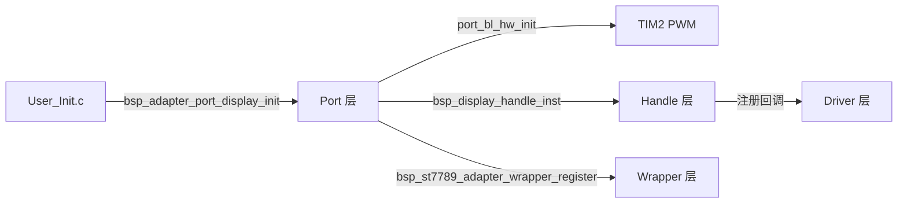
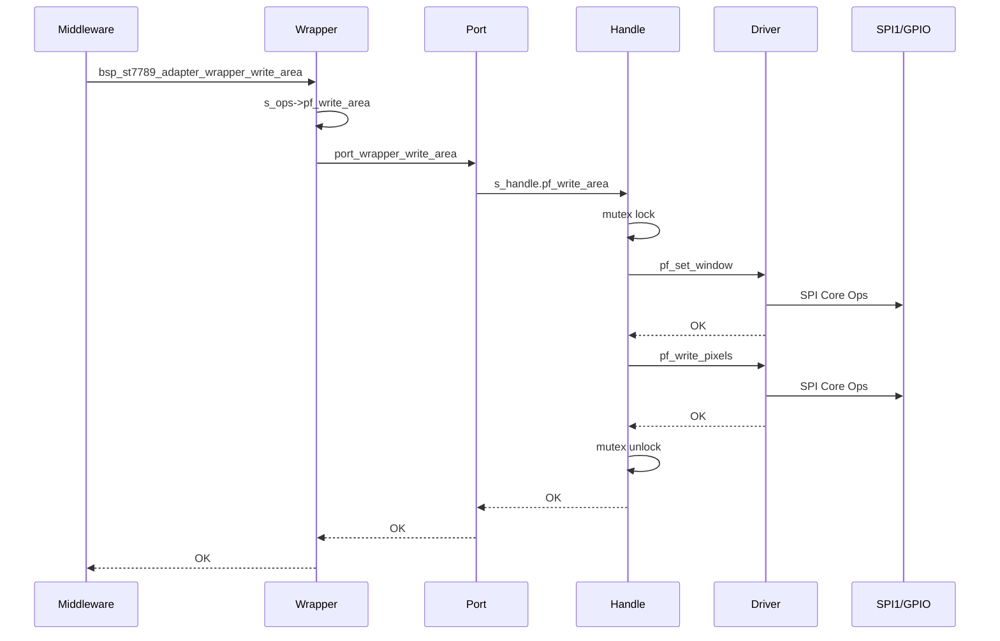

> 来源：Deep-In-Embedded / [开发板/ARM架构/STM32F411CEU6/ST7789 驱动四层架构学习笔记.md](https://github.com/shuai-yemao/Deep-In-Embedded/blob/5fcab575fc20cf681f3e79e163337211097c898a/%E5%BC%80%E5%8F%91%E6%9D%BF/ARM%E6%9E%B6%E6%9E%84/STM32F411CEU6/ST7789%20%E9%A9%B1%E5%8A%A8%E5%9B%9B%E5%B1%82%E6%9E%B6%E6%9E%84%E5%AD%A6%E4%B9%A0%E7%AC%94%E8%AE%B0.md)

# 📖 引言

以 `D:\zhuomian\stm32f411ceu6_freertos_transplant` 工程为背景，学习 ST7789 显示屏驱动的四层架构设计：Driver → Handle → Port → Wrapper。

# 📝 ST7789 驱动四层架构学习笔记

一句话定义：
**Driver 封装 ST7789 协议，Handle 管理并发与 OS 资源，Port 装配板级硬件，Wrapper 提供稳定北向 API。**

## 实际意义

没有分层时，LVGL 刷新一行像素会直接调用 `HAL_SPI_Transmit_DMA()` 并操作 PA4/PA6/PB10/PA1。换 MCU、换面板引脚、换 RTOS 时，修改会散落整个工程。四层把协议、并发、硬件、App API 拆开，变化收敛到单层。

## 应用场景

1. `User_Task/User_Init/User_Init.c:37` 调用 `bsp_adapter_port_display_init()` 初始化显示。
2. `Core/Src/lvgl_port.c:150` 调用 `bsp_st7789_adapter_wrapper_write_area()` 刷新画面。
3. `User_Task/User_Sensor/User_Sensor.c:26` 调用 `bsp_st7789_adapter_wrapper_set_brightness()` 调节背光。

## 核心逻辑/原理

### 机制 1：启动装配链



### 机制 2：运行时刷新链



## 关键公式/结论

| 层 | 职责 | 知道 | 不知道 |
|---|---|---|---|
| Driver | ST7789 协议 | 命令、窗口、像素、方向 | 引脚、HAL、RTOS |
| Handle | 并发与 OS 资源 | mutex、queue、task、Driver Ops | 引脚、HAL |
| Port | 板级装配 | 引脚、SPI1、TIM2 PWM、OSAL | ST7789 协议 |
| Wrapper | 稳定北向 API | 函数表转发 | 所有 BSP 细节 |

## 实际操作与实现路径

### 第一步：实现 Driver 层

创建目录：

```
Bsp/board_driver/display/driver/st7789/
├── inc/bsp_st7789_config.h
├── inc/bsp_st7789_driver.h
└── src/bsp_st7789_driver.c
```

内容要点：

- `config.h`：面板几何、寄存器常量、初始化参数
- `driver.h`：Core Ops 接口、Driver 实例、构造函数
- `driver.c`：命令序列、窗口设置、像素写入、整屏填充

### 第二步：实现 Handle 层

创建目录：

```
Bsp/board_driver/display/handler/
├── inc/bsp_display_handle.h
└── src/bsp_display_handle.c
```

内容要点：

- `handle.h`：OS Ops、Driver Ops、事件消息、实例结构
- `handle.c`：mutex、queue、task、注册 Driver、同步 API

### 第三步：实现 Port 层

创建目录：

```
Bsp/porting/drv_adapter_port_display/
├── inc/bsp_adapter_port_display.h
└── src/bsp_adapter_port_display.c
```

内容要点：

- `port.h`：只暴露 `init()` / `deinit()`
- `port.c`：Core Ops、OS Ops、Driver Ops 转发、Wrapper 函数表、装配

### 第四步：实现 Wrapper 层

创建目录：

```
Bsp/wrapper/drv_adapter_wrapper_display/
├── inc/bsp_adapter_wrapper_display.h
└── src/bsp_adapter_wrapper_display.c
```

内容要点：

- `wrapper.h`：函数表、API、独立状态码
- `wrapper.c`：函数表注册、API 转发

### 第五步：CMake 集成

在 `cmake/stm32cubemx/CMakeLists.txt` 中添加四个 .c 文件和 include 路径。

### 第六步：App 调用

- `User_Init.c` 调用 `bsp_adapter_port_display_init()`
- `lvgl_port.c` 调用 `bsp_st7789_adapter_wrapper_write_area()`

## 常见问题

### 问题 1：Driver 为什么不直接调用 HAL？

**现象**：想简化代码，把 `HAL_SPI_Transmit_DMA` 放进 `bsp_st7789_driver.c`。
**根因**：Driver 应只负责 ST7789 协议，SPI 实现细节由 Port 注入。
**修复**：保持 `bsp_st7789_spi_interface_t` 注入，HAL 调用放在 Port。
**验证**：换 MCU 时 Driver 文件完全不变，只替换 Port 的 Core Ops 实现。

### 问题 2：Handle 的 mutex 能否去掉？

**现象**：单任务 demo 里 mutex 看起来多余。
**根因**：多任务并发写屏时，窗口设置和像素写入必须原子完成。
**修复**：保留 `handle_write_area()` 中的加锁/解锁。
**验证**：J-Link 观察画面无撕裂。

### 问题 3：为什么先初始化 PWM 再初始化 Handle？

**现象**：背光不亮或初始化异常。
**根因**：Driver 构造完成时会调用 `driver_set_backlight(true)`，操作 `TIM2->CCR2`。
**修复**：`bsp_adapter_port_display_init()` 中先 `port_bl_hw_init()`，再构造 Handle。
**验证**：上电后背光正常点亮。

### 问题 4：DMA 完成信号量为什么要排空？

**现象**：画面随机花屏。
**根因**：上一次 DMA 完成中断残留的信号量会被误判为本次完成。
**修复**：启动 DMA 前用 `osal_sema_take(..., 0U)` 循环清空残留信号。
**验证**：DMA 完成计数与启动计数一致，无花屏。

## 💬 Q&A

### 🟢 基础

#### Q1：Driver 层把哪三类接口交给 Port 注入？

**已确认理解**：SPI 通信、timebase、GPIO。
**判断依据**：`bsp_st7789_driver.h:56-97` 定义三组 Core Ops。
**证据**：`Bsp/board_driver/display/driver/st7789/inc/bsp_st7789_driver.h:56-97`

#### Q2：Handle 的 mutex 保护哪两个 Driver 操作？

**已确认理解**：`pf_set_window` 和 `pf_write_pixels`。
**判断依据**：`bsp_display_handle.c:448-453` 在 lock/unlock 之间调用。
**证据**：`Bsp/board_driver/display/handler/src/bsp_display_handle.c:444-456`

### 🟡 进阶

#### Q3：32 字节 DMA 阈值是什么含义？

**已确认理解**：小数据走轮询、大数据走 DMA 的经验阈值。
**判断依据**：`bsp_adapter_port_display.c:44-46` 宏定义与分支实现。
**证据**：`Bsp/porting/drv_adapter_port_display/src/bsp_adapter_port_display.c:44-176`

#### Q4：背光 gamma 表为什么不是线性？

**已确认理解**：人眼感知亮度非线性，gamma 表让 percent 与感知亮度线性对应。
**判断依据**：`bsp_adapter_port_display.c:318-333` 注释与表。
**证据**：`Bsp/porting/drv_adapter_port_display/src/bsp_adapter_port_display.c:318-346`

### 🔴 困难

#### Q5：换板子到 F407 且背光改 GPIO，哪些文件必须改？

**已确认理解**：只改 Port 层。
**判断依据**：Driver/Handle/Wrapper 不依赖具体硬件。
**证据**：`Bsp/porting/drv_adapter_port_display/src/bsp_adapter_port_display.c:50-62`

## 🧭 架构推理

- **问题**：如何把 ST7789 驱动拆成可移植、可测试、可并发的层次？
- **职责**：Driver=协议，Handle=并发/资源，Port=板级装配，Wrapper=稳定 API。
- **数据流**：App → Wrapper → Port → Handle(mutex) → Driver → Core Ops → HAL。
- **约束**：Driver 无同步；Handle 在调度器后构造；Port 知道硬件；Wrapper 零依赖。
- **取舍**：当前方案增加文件数量，换取换平台/换 RTOS/换 GUI 时修改范围最小化。
- **验证**：编译通过、J-Link 观察、LVGL 正常刷新、DMA error_count 不增长。

## 📋 总结

ST7789 驱动拆为四层：Driver 管协议，Handle 管并发，Port 管板级，Wrapper 管 API。App 只调用 Wrapper；Port 启动时一次性装配；Handle 运行时加锁保护；Driver 只把协议翻译成注入的 SPI/GPIO 调用。

## 📎 参考资料

### 💻 仓库链接

- `D:\zhuomian\stm32f411ceu6_freertos_transplant`

### 📄 代码/附件

- `Bsp/board_driver/display/driver/st7789/src/bsp_st7789_driver.c`
- `Bsp/board_driver/display/handler/src/bsp_display_handle.c`
- `Bsp/porting/drv_adapter_port_display/src/bsp_adapter_port_display.c`
- `Bsp/wrapper/drv_adapter_wrapper_display/src/bsp_adapter_wrapper_display.c`
- `User_Task/User_Init/User_Init.c`
- `Core/Src/lvgl_port.c`

---

# 🔗 相关笔记

[[STM32F411 FreeRTOS 移植工程]]

[[BSP 分层架构]]

[[ST7789 驱动四层架构设计]]

[[OSAL 抽象层]]
