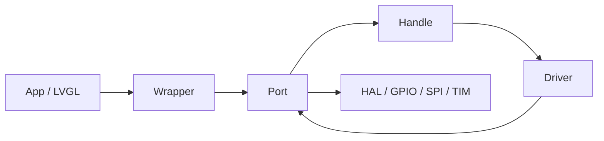

> 来源：Deep-In-Embedded / [开发板/ARM架构/STM32F411CEU6/ST7789 驱动四层架构设计.md](https://github.com/shuai-yemao/Deep-In-Embedded/blob/5fcab575fc20cf681f3e79e163337211097c898a/%E5%BC%80%E5%8F%91%E6%9D%BF/ARM%E6%9E%B6%E6%9E%84/STM32F411CEU6/ST7789%20%E9%A9%B1%E5%8A%A8%E5%9B%9B%E5%B1%82%E6%9E%B6%E6%9E%84%E8%AE%BE%E8%AE%A1.md)

# ST7789 驱动四层架构：从 " 一把梭 " 到 " 能换板子 "

## 项目背景

这个工程是 `D:\zhuomian\stm32f411ceu6_freertos_transplant`，一块 STM32F411CEU6 + FreeRTOS 的小板子，上面挂了一块 240×280 的 ST7789 SPI 屏，还有 CST816T 触摸。

刚开始做的时候，很容易 temptation 就是把 `HAL_SPI_Transmit_DMA` 直接塞进 `st7789.c` 里，然后 LVGL 刷一行就调一次。代码能跑，但问题也很明显：

- 换一块 MCU，这文件要重写。
- 换一个引脚布局，这文件要重写。
- 将来想换 ILI9341 面板，上层代码还得跟着改。
- 测试 Driver 的时候必须连真机，没办法在 PC 上跑 fake 总线测试。

所以最后拆成了四层：**Driver → Handle → Port → Wrapper**。这篇文章记录为什么这么拆，以及每一层具体写了什么。

---

## 四层分工：一句话版本

- **Driver**：只写 ST7789 协议。不知道你用的哪块 MCU、哪根引脚、哪个 RTOS。
- **Handle**：管并发。多个任务都想写屏时，由它排队。
- **Port**：管板级事实。PA4/PA6/PB10/PA1 怎么连、SPI1 DMA 怎么用、TIM2 PWM 怎么调，全在这。
- **Wrapper**：给 App 的稳定 API。App 只认识它，不认识下面三层。



注意 Driver 和 Port 之间是双向的：Port 把 SPI/GPIO/timebase 注入给 Driver，Driver 通过它们访问硬件。

---

## Driver 层：只写协议，别碰 HAL

### 为什么 Driver 不能 include "spi.h"？

看 `bsp_st7789_driver.h` 里的 Core Ops 注入：

```c
typedef struct {
    void *context;
    bsp_st7789_status_t (*pf_init)(void *context);
    bsp_st7789_status_t (*pf_write)(void *context, const uint8_t *data, uint32_t length);
    void (*pf_cs_enable)(void *context);
    void (*pf_cs_disable)(void *context);
    void (*pf_dc_write)(void *context, bool high);
} bsp_st7789_spi_interface_t;
```

Driver 只认一个 `pf_write(data, length)`。至于是 STM32 硬件 SPI、GPIO 模拟 SPI、DMA 还是轮询，它根本不 care。

这带来一个巨大的好处：**Driver 可以直接在 PC 上 fake 测试**。你写一套 fake 的 `pf_write`，记录所有发出去的命令和数据，就能验证初始化序列、窗口设置、方向切换对不对，不需要连真机。

### 命令/数据分离

ST7789 的 DC 线决定当前是命令还是数据。Driver 里把它抽象成两个函数：

```c
// 发命令：DC = 0
p_spi->pf_dc_write(p_spi->context, false);
status = driver_write(p_self, &command, 1U);

// 发数据：DC = 1
p_spi->pf_dc_write(p_spi->context, true);
status = driver_write(p_self, data, length);
```

这里有个细节：每次写都重新拉 CS。有些人会想把 CS 一直拉低，批量发完再释放。但 ST7789 的 SPI 模式要求每次事务前用 DC 区分命令/数据，所以每次单独拉 CS 是最稳妥的。

### 窗口偏移

`bsp_st7789_config.h` 里定义了 `BSP_ST7789_Y_OFFSET = 20U`。这块屏物理上可能是 240×320，但有效显示区从第 20 行开始。Driver 在 `driver_set_window()` 里自动加上 offset：

```c
data[0] = (uint8_t)((x0 + p_self->x_offset) >> 8);
data[1] = (uint8_t)(x0 + p_self->x_offset);
```

这样上层 LVGL 传 (0,0) 时，实际发送到面板的是 (0,20)。这个 offset 如果分散在 App 里，很容易改一个地方漏一个地方；放在 Driver 里，整个项目只需要改一次 config。

### 整屏填充的共享缓冲

F411 只有 128KB SRAM，全屏 240×280×2 = 134KB，根本放不下。所以 `driver_fill()` 只分配一行 480 字节的缓冲，逐行发送：

```c
static uint8_t s_fill_row[BSP_ST7789_TX_ROW_BYTES];  // 240 * 2 = 480 字节

for (row = 0U; row < p_self->height; row++) {
    status = driver_write_data(p_self, s_fill_row, sizeof(s_fill_row));
}
```

但这里有个坑：`s_fill_row` 是 static 共享缓冲。如果两个任务同时调 `driver_fill()`，就会互相覆盖。所以注释里明确写了：

> 共享缓冲的线程安全依赖 Handle 层互斥，Driver 内部不做同步。

这是故意的设计选择：Driver 保持简单，同步交给 Handle。

---

## Handle 层：并发不是 Driver 的事

### 为什么要有 Handle？

如果只是单任务 demo，其实完全可以 App 直接调 Driver。但一旦用了 FreeRTOS，事情就变了：

- LVGL 刷新任务在写屏。
- 某个传感器任务也可能想清屏或显示告警。
- 如果两个任务同时调用 `driver_set_window()` 和 `driver_write_pixels()`，第二个任务可能把窗口改成别的位置，第一个任务的像素就写到错误地址，画面直接撕裂。

所以 Handle 用 mutex 把 " 设置窗口 " 和 " 写像素 " 包成一个原子操作：

```c
locked = handle_lock(p_self);
status = p_self->p_driver_ops->pf_set_window(...);
if (BSP_ST7789_STATUS_OK == status) {
    status = p_self->p_driver_ops->pf_write_pixels(...);
}
handle_unlock(p_self, locked);
```

### Handle 不认识 ST7789

`bsp_display_handle.h` 里定义的是泛化的 Driver Ops：

```c
typedef struct {
    bool (*pf_is_ready)(void *driver_instance);
    bsp_st7789_status_t (*pf_init)(void *driver_instance);
    bsp_st7789_status_t (*pf_set_window)(void *driver_instance, ...);
    bsp_st7789_status_t (*pf_write_pixels)(void *driver_instance, ...);
    uint16_t (*pf_get_width)(void *driver_instance);
    uint16_t (*pf_get_height)(void *driver_instance);
    // ...
} bsp_display_handle_driver_ops_t;
```

所有函数第一个参数都是 `void *`。这意味着 Handle 不仅可以用在 ST7789 上，也可以套在 ILI9341、SSD1963 等 Driver 上。Handle 是 " 显示设备 " 的抽象，不是 "ST7789" 的抽象。

### 惰性 Driver 构造

Handle 注册 Driver 时，不是直接调 `bsp_st7789_driver_inst()`，而是接收一个构造回调：

```c
typedef struct {
    void *driver_storage;
    bsp_st7789_status_t (*pf_construct)(void *driver_storage);
    const bsp_display_handle_driver_ops_t *p_driver_ops;
} bsp_display_handle_driver_if_t;
```

Handle 只负责调用 `pf_construct()`，具体怎么构造由 Port 决定。这样 Handle 完全不知道 ST7789 的存在，只知道有一个 generic driver 需要被构造。

### 异步队列是预留的

Handle 里其实创建了 mutex、queue、task，但当前 LVGL 走的是同步路径。那为什么要创建 queue 和 worker thread？

因为 GUI 框架将来可能需要异步 flush：把一帧数据塞进 queue，worker thread 慢慢发，UI 任务不被阻塞。现在虽然没用，但基础设施已经搭好，未来启用时只需要改 App 调用方式。

---

## Port 层：脏活累活全在这

Port 层是整个工程里最 " 脏 " 的一层。它要知道：

- PA4 是 CS，PA6 是 DC，PB10 是 RST，PA1 是背光 PWM
- SPI1 的 DMA 通道
- TIM2_CH2 输出 10kHz PWM
- osal 的 mutex/queue/task 怎么创建

### SPI 轮询 + DMA 双路径

`port_spi_write()` 里有一个 32 字节阈值：

```c
if (length < BSP_ST7789_SPI_DMA_MIN_BYTES) {
    return (HAL_SPI_Transmit(&hspi1, ...) == HAL_OK) ? OK : IO;
}
```

小数据走轮询，大数据走 DMA。这个 32 不是算出来的，是经验值。DMA 有启动开销，小数据量时轮询反而更快；数据量大了，DMA 的并行优势才体现出来。

### DMA 完成信号量的坑

DMA 路径用了二进制信号量同步：

```c
while (OSAL_SUCCESS == osal_sema_take(s_lcd_spi_dma_done, 0U)) { }
s_lcd_spi_dma_error = false;
HAL_SPI_Transmit_DMA(&hspi1, ...);
if (OSAL_SUCCESS != osal_sema_take(s_lcd_spi_dma_done, 100U)) {
    HAL_SPI_Abort(&hspi1);
    return BSP_ST7789_STATUS_IO;
}
```

这个 `while` 循环很关键。它是用 0 超时非阻塞地清空可能残留的信号量。如果上一次 DMA 完成中断已经 give 了信号量，但任务还没来得及 take，残留信号会让下一次 `osal_sema_take(100)` 立即返回，程序误以为本次 DMA 已完成，实际上数据还没发完。

我曾经删掉这个 `while` 试过，结果画面随机花屏，查了半天才发现是信号量残留。

超时后用 `HAL_SPI_Abort(&hspi1)` 也很重要。如果不 abort，SPI 状态机可能卡在 BUSY，下一次传输直接 HAL_BUSY，整个显示路径就挂了。

### 背光 PWM 的 " 上电不闪 " 技巧

背光用 PA1 接 TIM2_CH2 PWM。`port_bl_hw_init()` 里的顺序很有意思：

```c
// 1. 先启动 PWM，占空比 1/999
s_config_oc.Pulse = 1U;
HAL_TIM_PWM_Init(&s_htim2);
HAL_TIM_PWM_ConfigChannel(&s_htim2, &s_config_oc, TIM_CHANNEL_2);
HAL_TIM_PWM_Start(&s_htim2, TIM_CHANNEL_2);

// 2. 再把 PA1 从 GPIO 切到 AF 模式
gpio_init.Mode = GPIO_MODE_AF_PP;
gpio_init.Alternate = GPIO_AF1_TIM2;
HAL_GPIO_Init(BSP_ST7789_BL_PORT, &gpio_init);
```

为什么先启动 PWM 再切 GPIO？因为如果先切到 AF 模式，而 PWM 还没输出，PA1 可能浮空或者处于一个不确定电平，上电瞬间会闪一下。先把 PWM 起在一个极低的占空比（0.1%），再切 AF，眼睛基本看不到闪亮。

### gamma 亮度表

人眼对亮度的感知不是线性的。如果 CCR 从 0 到 999 线性增加，会感觉中间亮度挤在高亮区，暗部变化不明显。

工程里用了一张 gamma 2.2 的查找表：

```c
static const uint16_t s_bl_gamma_table[101] = {
     0, 0, 0, 0, 1, 1, 2, 3, 4, 5,
     6, 8, 9, 11, 13, 15, 18, 20, 23, 26,
     ...
     999
};
```

`percent=50` 时，实际 CCR 是 268 左右，而不是 500。这样 percent 和感知亮度才是线性对应的。

渐变用软件循环实现：

```c
while (cur_ccr != target_ccr) {
    cur_ccr += step;
    __HAL_TIM_SET_COMPARE(&s_htim2, TIM_CHANNEL_2, cur_ccr);
    osal_task_delay_ms(10U);
}
```

注释里说曾经尝试过用 DMA 自动渐变，但 DMA 传输从不完成，每次都被 100ms 超时兜底，所以弃用了。这个故事告诉我们：不是所有看起来该用 DMA 的地方都真能用 DMA。

### 装配顺序很重要

`bsp_adapter_port_display_init()` 的初始化顺序不能乱：

```c
// 1. 先初始化 PWM
port_bl_hw_init();

// 2. 再构造 Handle
bsp_display_handle_inst(&s_handle, port_timebase_ops(), port_os_ops());

// 3. 注册 Driver（构造 Driver，Driver 构造时会打开背光）
bsp_display_handle_register_driver(&s_handle, &s_driver_if);

// 4. 最后注册 Wrapper
bsp_st7789_adapter_wrapper_register(&s_st7789_wrapper_ops);
```

为什么 PWM 必须在 Handle 之前？因为 Driver 构造完成时会调用 `driver_set_backlight(true)`，最终操作 `TIM2->CCR2`。如果 PWM 没初始化，写 CCR 无效。

为什么 Wrapper 在最后？因为只有前面全部成功，才对外暴露 API。任何一步失败都要回滚。

---

## Wrapper 层：App 的防火墙

Wrapper 的文件头只 include 了 `<stdbool.h>` 和 `<stdint.h>`，没有 include 任何 BSP 文件。这是故意的。

```c
#include <stdbool.h>
#include <stdint.h>
```

App 调用 Wrapper 时，不需要知道 HAL、FreeRTOS、PA4/PA6 这些细节。Wrapper 内部只保存一个函数表：

```c
static const bsp_st7789_adapter_wrapper_ops_t *s_ops;

bsp_st7789_adapter_wrapper_status_t bsp_st7789_adapter_wrapper_write_area(...) {
    if ((NULL == s_ops) || (NULL == s_ops->pf_write_area)) {
        return BSP_ST7789_ADAPTER_WRAPPER_STATUS_STATE;
    }
    return s_ops->pf_write_area(x0, y0, x1, y1, pixels, length);
}
```

未装配时返回 `STATE`，而不是崩溃。这对调试很友好：如果 App 在 `bsp_adapter_port_display_init()` 之前调 Wrapper，你能立刻知道是顺序问题。

Wrapper 还有自己独立的状态码。虽然值和 Driver 状态码一样，但语义独立，未来可以单独扩展。Port 里做了显式映射：

```c
case BSP_ST7789_STATUS_IO:
    return BSP_ST7789_ADAPTER_WRAPPER_STATUS_IO;
```

---

## 完整实现路径

如果你是第一次写这套分层，建议按这个顺序：

1. **先写 Driver**
   - `bsp_st7789_config.h`：面板几何、寄存器、初始化参数
   - `bsp_st7789_driver.h`：Core Ops 接口、Driver 实例结构、构造函数
   - `bsp_st7789_driver.c`：命令序列、窗口、像素、填充

2. **再写 Handle**
   - `bsp_display_handle.h`：OS Ops、Driver Ops、事件、实例结构
   - `bsp_display_handle.c`：mutex、注册 Driver、同步 API

3. **然后写 Port**
   - `bsp_adapter_port_display.h`：只暴露 init/deinit
   - `bsp_adapter_port_display.c`：Core Ops、OS Ops、Driver Ops 转发、Wrapper 函数表、装配

4. **最后写 Wrapper**
   - `bsp_adapter_wrapper_display.h`：函数表、API、状态码
   - `bsp_adapter_wrapper_display.c`：注册、转发

5. **CMake 集成**
   - 把四个 .c 文件加进 `cmake/stm32cubemx/CMakeLists.txt`
   - 添加对应的 include 目录

6. **App 调用**
   - `User_Init.c` 里调 `bsp_adapter_port_display_init()`
   - `lvgl_port.c` 里调 `bsp_st7789_adapter_wrapper_write_area()`

---

## 迁移到另一块板子有多爽？

假设你换到 STM32F407，引脚变了，背光从 PWM 改成 GPIO：

- **Driver**：一行不改。协议没变，引脚抽象在 Core Ops 里。
- **Handle**：一行不改。它不管硬件。
- **Wrapper**：一行不改。它只转发。
- **Port**：要改引脚宏、背光实现、可能 SPI 句柄从 hspi1 变 hspi2。

所有修改集中在一个文件里。这就是分层的意义。

---

## 几个容易踩的坑

1. **在 Driver 里直接调 HAL_SPI_Transmit_DMA**
   看着省事，但换 MCU 或做 fake 测试时会很痛苦。

2. **Handle 里去掉 mutex**
   单任务 demo 没问题，多任务时画面会撕裂，而且很难调试。

3. **DMA 完成信号量不排空**
   随机花屏，查半天发现是上一次残留信号。

4. **背光 PWM 没初始化就先构造 Driver**
   Driver 构造完成会开背光，此时 TIM2 没使能，背光不亮。

5. **Wrapper 依赖 BSP 头文件**
   失去隔离意义，App 编译变慢，换平台时 App 也要改。

---

## 总结

这套四层的核心思想不是 " 为了分层而分层 "，而是让每一层只负责一件确定的事：

- Driver 只懂 ST7789 协议。
- Handle 只负责并发和资源。
- Port 只处理这块板子的硬件事实。
- Wrapper 只给 App 一个稳定的脸。

当你的项目从 " 能跑就行 " 进化到 " 要能换板子、能测试、能维护 " 时，这种分层几乎是必然的。ST7789 这个例子不大，但把四层的边界讲清楚了。

---

## 参考代码路径

- `Bsp/board_driver/display/driver/st7789/src/bsp_st7789_driver.c`
- `Bsp/board_driver/display/handler/src/bsp_display_handle.c`
- `Bsp/porting/drv_adapter_port_display/src/bsp_adapter_port_display.c`
- `Bsp/wrapper/drv_adapter_wrapper_display/src/bsp_adapter_wrapper_display.c`
- `User_Task/User_Init/User_Init.c`
- `Core/Src/lvgl_port.c`

---

# 🔗 相关笔记

[[STM32F411 FreeRTOS 移植工程]]

[[BSP 分层架构]]
