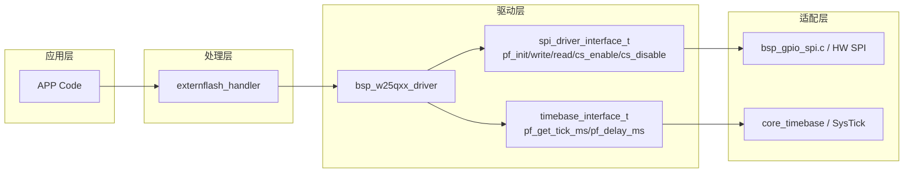
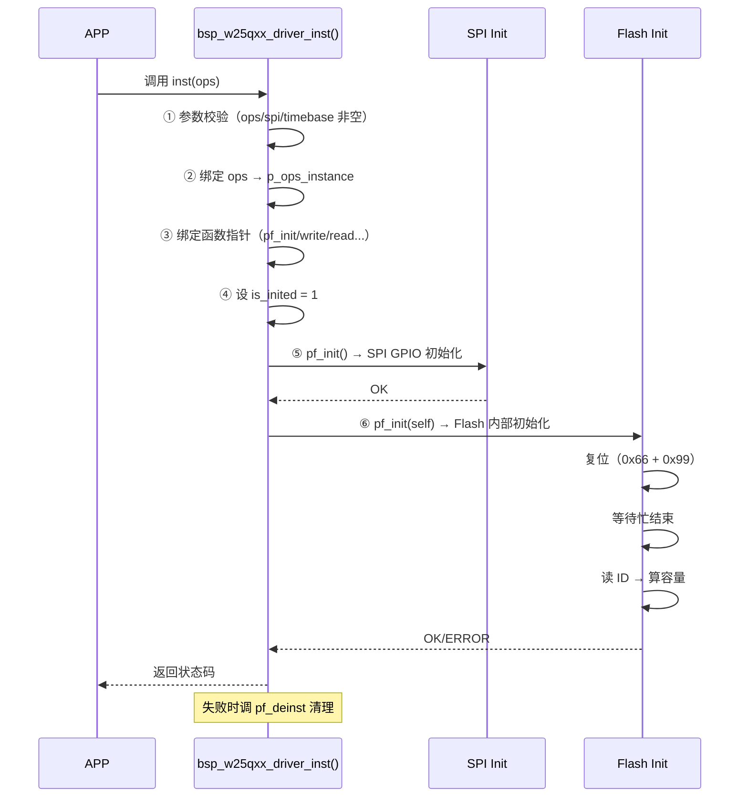

> 来源：Deep-In-Embedded / [开发板/ARM架构/STM32F411CEU6/W25Qxx的driver文件架构设计思路.md](https://github.com/shuai-yemao/Deep-In-Embedded/blob/5fcab575fc20cf681f3e79e163337211097c898a/%E5%BC%80%E5%8F%91%E6%9D%BF/ARM%E6%9E%B6%E6%9E%84/STM32F411CEU6/W25Qxx%E7%9A%84driver%E6%96%87%E4%BB%B6%E6%9E%B6%E6%9E%84%E8%AE%BE%E8%AE%A1%E6%80%9D%E8%B7%AF.md)

# 📖 引言

> W25Qxx Driver 将 Flash 芯片的协议操作（复位、读 ID、页编程、擦除、忙状态轮询）封装为平台无关的 C 语言接口，通过依赖注入解耦 SPI 收发和时基，让同一套代码驱动 W25Q80~W25Q128 全系列芯片。

---

# 📝 W25Qxx 的 driver 文件架构设计思路

> 将 W25Qxx 系列 Flash 芯片从芯片平台和 OS 中解耦出来，快速移植只需修改适配层代码即可实现功能——Driver 只通过 `spi_driver_interface_t`（SPI 收发/片选）和 `timebase_interface_t`（时基）两个南向接口访问硬件，通过 8 个北向函数指针暴露 Flash 操作。

## 实际意义

直接调 SPI 接口操作 W25Qxx 容易踩三个坑：**页对齐**（写入跨页时数据回卷覆盖）、**忙状态**（擦除/写入未完成时发命令被忽略）、**写使能**（每次页编程/擦除前必须发 0x06）。Driver 层封装这三个功能正确性问题，APP 只需调 `pf_write(addr, data, len)` 即可。

## 应用场景

1. **OTA 固件存储**：通过外部 Flash 存储接收到的固件包，利用 handler 层缓冲写入机制降低擦写频率
2. **日志持久化**：系统运行日志和传感器历史数据频繁记录（每次十几字节），handler 的 4KB 缓冲区吸收小数据后统一刷入
3. **掉电数据保护**：关键配置参数写入 Flash，掉电不丢失（需配合 PVD 掉电检测刷缓存）

## 核心逻辑/原理

### 1. 接口隔离原则（ISP）



对比 AHT21 Driver（4 个南向接口：IIC + Timebase + Yield + IRQ），W25Qxx Driver 只用了 **2 个**：

- `spi_driver_interface_t` — SPI 收发 + 片选
- `timebase_interface_t` — 获取滴答 + 阻塞延时

**为什么不用 Yield/IRQ 接口？** W25Qxx 没有中断引脚通知数据就绪，所有操作（读/写/擦除）都是主机主动发起、从机被动响应，所以不需要中断接口。

### 2. 实例化生命周期



**关键设计：** `is_inited` 在第 ④ 步就设为 `W25QXX_INITIALIZED`，而不是在所有初始化完成后。这是因为 `pf_init`（第 ⑥ 步）内部会调 `check_ready()` 检查 `is_inited`——如果不提前设置，`check_ready` 会因未初始化而返回错误。

### 3. 页对齐写入

```c
// 从地址 150 写 300 字节的拆分过程：
current_addr = (150 + 256) & ~(256 - 1) = 512

// 第1次写：addr=150, size=106  → 页1（地址150~255）
// 第2次写：addr=256, size=256  → 页2（地址256~511）
// 第3次写：addr=512, size=38   → 页3（地址512~549）
```

W25Qxx 页编程一次最多写 256 字节，且地址不能跨页——如果地址超出当前页末尾，数据会回卷覆盖该页开头。Driver 通过 do-while 循环自动计算每页边界并分拆：

```c
current_addr = (addr + PAGE_SIZE) & ~(PAGE_SIZE - 1U);  // 向上对齐
do {
    w25qxx_write_enable(self);      // 每页前发写使能
    spi_write(cmd + data, size);    // 发命令+数据
    w25qxx_wait_busy(self, ...);    // 等写入完成
    current_addr += current_size;   // 前进到下一页
} while (current_addr < end_addr);
```

### 4. ID → 容量动态计算

W25Qxx 系列每增加 1 容量翻倍：

| 型号 | ID | 容量 |
|------|----|------|
| W25Q80 | 0xEF13 | 1MB |
| W25Q16 | 0xEF14 | 2MB |
| W25Q32 | 0xEF15 | 4MB |
| W25Q64 | 0xEF16 | 8MB |
| W25Q128 | 0xEF17 | 16MB |

公式：`size = (1UL << (id - W25Q80_ID)) * 1024UL * 1024UL`

以 W25Q64（ID=0xEF16）为例：

```
0xEF16 - 0xEF13 = 3
1UL << 3 = 8
8 * 1024 * 1024 = 8MB ✅
```

### 5. 存储层次与写使能锁

```
页（Page）      = 256 字节      ← 写入单位
子扇区（Subsector）= 4KB = 16 页  ← 最小擦除单位
扇区（Sector）  = 64KB = 16 子扇区
```

**Well 写使能锁（SR1 bit1）：** Flash 上电后 Well=0，任何页编程/擦除命令都被忽略。必须先发 0x06 使 Well=1，然后紧跟的操作才能执行，执行后 Well 自动归零。这是防止 MCU 上电 GPIO 抖动或程序跑飞时意外改写 Flash 数据的**硬件安全开关**。

### 6. 设计约束

- **所有带阻塞的操作（擦除/写入等待）不能在 ISR 中调用**——`wait_busy` 内部使用 `delay_ms` 轮询，最长阻塞 3s
- **整片擦除（0xC7）最长耗时 250 秒**，仅用于生产测试或出厂初始化，运行时绝不调用
- **页编程前目标地址必须先擦除**（子扇区级），Driver 不自动擦除——这是 handler 层的职责

## 关键公式/结论

**Storage Hierarchy:**

| 单位 | 大小 | 用途 |
|------|------|------|
| 页 | 256 字节 | 页编程（0x02）写入单位 |
| 子扇区 | 4KB（=16 页） | 擦除（0x20）最小单位 |
| 扇区 | 64KB（=16 子扇区） | 块擦除（0xD8）单位 |

**ID 范围：** W25Q80（0xEF13）~ W25Q128（0xEF17）

**Command Set:**

| 命令 | 码值 | 说明 |
|------|------|------|
| 复位使能 | 0x66 | 先发 |
| 复位内存 | 0x99 | 后发（需先 0x66） |
| 读 ID | 0x90 | 后跟 4 字节→读 2 字节 ID |
| 读数据 | 0x03 | 后跟 3 字节地址→连续读 |
| 页编程 | 0x02 | 后跟 3 字节地址 + 1~256 字节数据 |
| 子扇区擦除 | 0x20 | 后跟 3 字节地址 |
| 整片擦除 | 0xC7 | 无地址，直接发 |
| 写使能 | 0x06 | 页编程/擦除前必须先发 |
| 读状态寄存器 1 | 0x05 | BUSY=bit0, Well=bit1 |

**时序参数（默认超时 1000ms，数据来源：W25Q64 数据手册）：**

| 操作 | 最大耗时 | 说明 |
|------|---------|------|
| 页编程 | 3ms | 写入 256 字节，典型值 0.7ms |
| 子扇区擦除 | 800ms（W25Q64FV）/ 400ms（W25Q64DW） | 4KB 擦除，不同后缀型号有差异 |
| 扇区擦除 | 3s | 64KB 块擦除（0xD8 命令） |
| 整片擦除（W25Q64） | 250s | 整颗芯片全部擦除 |

## 实际操作步骤

### 1. 定义配置参数

在 `bsp_w25qxx_config.h` 中定义 ID 范围、命令码、存储层次、时序参数。

### 2. 设计南向接口 + 北向操作指针

```c
// 南向接口（由适配层注入）
typedef struct {
    w25qxx_status_t (*pf_init)(void);
    w25qxx_status_t (*pf_write)(uint8_t*, uint16_t, uint32_t);
    w25qxx_status_t (*pf_read)(uint8_t*, uint16_t, uint32_t);
    void (*pf_cs_enable)(void);
    void (*pf_cs_disable)(void);
} spi_driver_interface_t;

typedef struct {
    uint32_t (*pf_get_tick_ms)(void);
    void (*pf_delay_ms)(uint32_t);
} timebase_interface_t;

// 北向操作指针（暴露给上层）
typedef struct {
    // ... 实例化后绑定的 pf_init/pf_read/pf_write/pf_erase_sector/...
} w25qxx_ops_t;
```

### 3. 实例化

```c
bsp_w25qxx_driver_t flash;
w25qxx_ops_t ops = {
    .p_spi_instance      = &g_spi_driver,
    .p_timebase_instance = &g_timebase,
};
bsp_w25qxx_driver_inst(&flash, &ops);
```

### 4. 使用

```c
flash.pf_read(&flash, buf, 0x1000, 1024);          // 读 1KB
flash.pf_write(&flash, data, 0x2000, 300);          // 写 300 字节（自动拆页）
flash.pf_erase_sector(&flash, 0x3000);              // 擦除子扇区
flash.pf_get_parameter(&flash, ¶);                 // 获取参数
flash.pf_deinst(&flash);                             // 反初始化
```

## 常见问题

### 问题 1：读 ID 超时或 ID=0xFFFF

**现象**：`pf_read_id` 返回 0xFFFF 或卡在 `wait_busy` 超时。

**根因**：SPI Mode 不匹配——W25Qxx 默认 Mode 0/3，如果模拟 SPI 用了 Mode 1/2 或 CPOL/CPHA 配置有误，芯片不响应任何命令。

**修复**：用逻辑分析仪抓 SCK 空闲电平（Mode 0=低，Mode 3=高）和数据采样时刻（Mode 0=上升沿，Mode 1/2 各有不同）。

### 问题 2：写入后读出数据错乱

**现象**：写 300 字节，但读回来的数据在一段正确后出现重复片段。

**根因**：越页写入。300 字节跨了 2 个页（256+44），如果软件没有显式分页，超出 256 字节的部分回卷到当前页开头覆盖已写数据。

**修复**：确认 driver 的 `w25qxx_drv_write` 使用了页对齐拆分。

### 问题 3：Flash 擦除时间过长导致系统卡顿

**现象**：调 `pf_erase_sector` 后系统卡死数秒。

**根因**：W25Qxx 扇区擦除最长 3s，如果直接在 APP 任务里调，整个任务被阻塞 3 秒。

**修复**：通过 handler 层（后台线程）执行擦除，或使用分段擦除 + 状态机。

---

# 💬 Q&A

## 🟢 基础

### Q1: 写 W25Qxx 时为什么要先发 0x06（写使能）？不先发 0x06 直接发页编程/擦除命令会怎样？

**A1:** Well（写使能锁，Status Register bit 1）是 Flash 内部的**硬件安全开关**——上电后 Well=0，页编程/擦除命令被忽略。必须发 0x06 使 Well=1，然后紧跟的操作才能执行，执行后 Well 自动归零。这是为了防止 MCU 上电 GPIO 抖动或程序跑飞时意外改写 Flash 数据。

## 🟡 进阶

### Q2: 为什么读操作不需要页对齐，但写操作必须对齐？

**A2:** 读命令（0x03）内部地址自动递增，可以跨页连续读任意长度；页编程命令（0x02）的地址**不会自动跨页**——超出当前页末尾时，数据回卷到该页开头覆盖已写内容。这是 Flash 芯片硬件行为决定的，Driver 必须通过 do-while 循环手动拆页。

## 🔴 困难

### Q3: `w25qxx_drv_write` 中有一段代码 `current_addr = (addr + PAGE_SIZE) & ~(PAGE_SIZE - 1U);`，如果 addr=300, PAGE_SIZE=256，结果是多少？这个计算是干什么的？

**A3:**

```
300 + 256 = 556 = 0x22C
~(256 - 1) = ~0xFF = 0xFFFFFF00
0x22C & 0xFFFFFF00 = 0x200 = 512
```

结果 = 512。这是在将地址**向上对齐**到 256 字节页边界——从 addr=300 开始，到下一个页边界（512）之前还有 212 字节可写，这 212 字节在第 1 页（256~511）内，不会跨页。

---

# 📋 总结

> W25Qxx Driver 通过两个南向接口（SPI 收发 + 时基）将 Flash 协议操作从平台和 OS 中解耦，封装了页对齐拆分、忙状态轮询、写使能这三个必须正确处理的细节。核心设计包括：实例化时提前设 `is_inited` 以通过内部就绪检查、失败时逆序清理的 `pf_deinst`、利用 Flash 芯片 ID 线性递增规律推算出容量的公式、以及 Well 写使能锁作为硬件级防误写保护。相比 AHT21 Driver 的 4 个南向接口，W25Qxx 只需要 2 个——因为它不需要中断（没有就绪通知引脚）和 RTOS yield（当前用阻塞轮询）。

# 📎 参考资料

## 🎥 视频链接

- 暂无

## 🔗 博客/文档链接

- [STM32 W25Q(16/32/64/128) 芯片学习汇总](https://shequ.stmicroelectronics.cn/thread-634719-1-1.html) — ST 社区经验分享
- W25Q64 数据手册（Winbond）— 指令集、页编程时序、擦除时间参数

## 💻 仓库链接

- 暂无

## 📄 代码/附件

- `Bsp\W25Qxx\hal_driver\Inc\bsp_w25qxx_driver.h` — Driver 头文件（接口定义、实例结构体、状态码枚举）
- `Bsp\W25Qxx\hal_driver\Src\bsp_w25qxx_driver.c` — Driver 实现（协议操作 + 实例化）
- `Bsp\W25Qxx\hal_driver\Inc\bsp_w25qxx_config.h` — 配置参数（ID 范围、命令码、存储层次、时序）
- `Bsp\W25Qxx\spi\Inc\bsp_gpio_spi.h` — SPI 适配层头文件（模拟 SPI 实现）
- [[模拟SPI的设计思路]] — Driver 依赖的底层 SPI 接口来源
- [[W25Qxx的handler文件架构设计思路]] — 基于此 Driver 的上层块存储管理层
