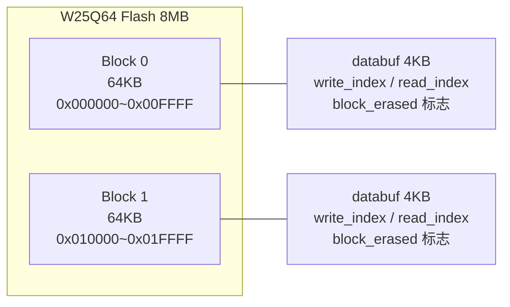
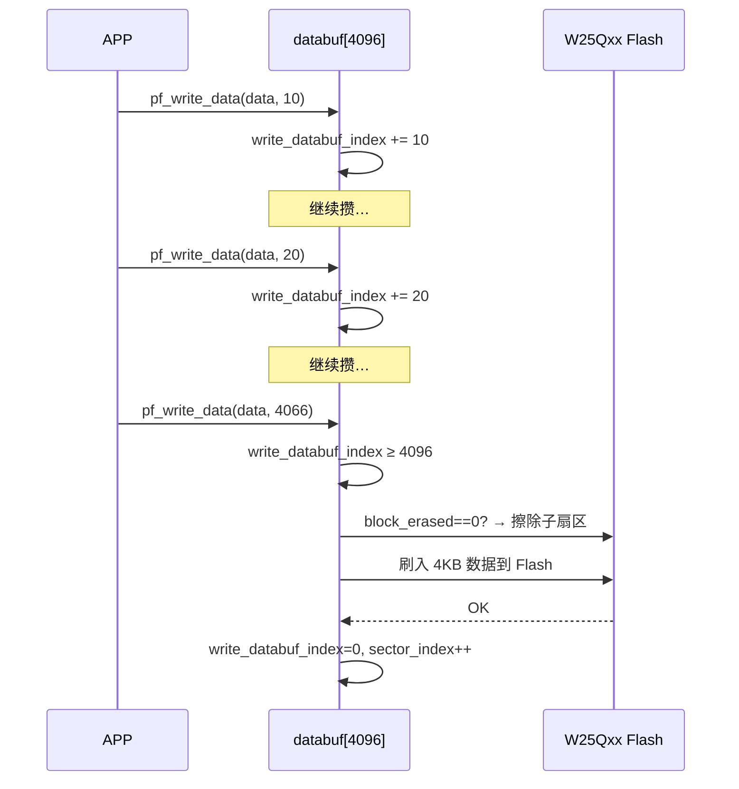
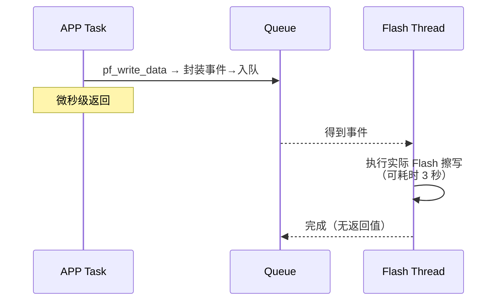

> 来源：Deep-In-Embedded / [开发板/ARM架构/STM32F411CEU6/W25Qxx的handler文件架构设计思路.md](https://github.com/shuai-yemao/Deep-In-Embedded/blob/5fcab575fc20cf681f3e79e163337211097c898a/%E5%BC%80%E5%8F%91%E6%9D%BF/ARM%E6%9E%B6%E6%9E%84/STM32F411CEU6/W25Qxx%E7%9A%84handler%E6%96%87%E4%BB%B6%E6%9E%B6%E6%9E%84%E8%AE%BE%E8%AE%A1%E6%80%9D%E8%B7%AF.md)

# 📖 引言
> ExternFlash Handler 将 W25Qxx Driver 的"按地址擦除/页编程"封装为块存储管理——在内存中按 4KB 子扇区缓冲数据，填满后才实际刷入 Flash，同时通过事件队列支持 OS 异步写入，避免 APP 被擦除操作阻塞。

---

# 📝 W25Qxx 的 handler 文件架构设计思路

> 事件驱动的外部 Flash 管理和块存储管理——Handler 通过双块分区（`blocks[2]`）和 4KB 缓存缓冲区，将 W25Qxx Driver 的底层擦写操作封装为按块读写的简易接口，配合 OS 线程将耗时擦写异步化。

## 实际意义

如果没有 Handler 层，APP 直接调 Driver 的 `pf_write` 存几字节数据：

1. **写放大 400 倍**：每次写前需先擦除 4KB，改几字节写一整个子扇区
2. **Flash 寿命加速消耗**：每次小写入都触发一次擦除（10 万次寿命更快耗尽）
3. **页对齐暴露给 APP**：APP 需自己维护地址跨页拆分逻辑

Handler 用 `databuf[4096]` 缓存小数据，攒满 4KB 才擦写一次——写放大降到 1x，擦除次数缩减到 1/16（相对 256B 缓冲方案）。

## 应用场景

1. **OTA 固件存储**：接收到的固件包通过 Handler 写入外部 Flash，缓冲机制让碎片先缓存再一次性刷入
2. **日志数据持久化**：频繁记录的传感器数据（每次十几字节）先攒到 4KB 再刷入，避免每次记录都擦写一次
3. **掉电数据保护**：关键配置参数写入 Flash（需配合 PVD 掉电检测，在电压跌落时调 `pf_write_data_end` 刷缓存）

## 核心逻辑/原理

### 1. 双块循环存储



`blocks[2]` 是同一颗 Flash 芯片上的两个独立 64KB 存储分区，通过 `idx` 参数手动指定操作哪个块：

| 块 | 基地址 | 范围 | 典型用途 |
|----|--------|------|---------|
| block 0 | 0x000000 | 0~65535（64KB） | OTA 固件 |
| block 1 | 0x010000 | 65536~131071（64KB） | 日志数据 |

```c
// 用户通过 idx 参数选择块
pf_write_data(self, 0, ota_data, len);   // 写入 block 0
pf_write_data(self, 1, log_data, len);   // 写入 block 1
pf_read_data(self, 0, buf, &len);        // 从 block 0 读取
```

每个块独立维护自己的读/写索引、`databuf` 缓存和 `block_erased` 擦除标志。

### 2. 4KB 子扇区缓冲写入



**核心代码（`bsp_externflash_handler.c:114-150`）：**
```c
for (uint32_t i = 0; i < length; i++) {
    b->databuf[b->write_databuf_index] = data[i];
    b->write_databuf_index++;
    if (b->write_databuf_index >= EXTERNFLASH_HANDLER_SUBSECTOR_SIZE) {
        // databuf 攒满 4KB → 刷入 Flash
        if (0U == b->block_erased) {
            // 块未整体擦除过 → 先擦除
            pf_erase_sector(flash, addr);
        }
        pf_write(flash, b->databuf, addr, 4096);
        b->write_databuf_index = 0;
        b->write_sector_index++;
    }
}
```

`pf_write_data_end` 用于在写入结束时刷剩余不足 4KB 的缓存（`bsp_externflash_handler.c:153-177`），同时将 `block_erased` 清零——表示块不再处于全擦除状态，下次写入新子扇区需要先擦。

### 3. 事件队列 + OS 线程异步刷写



**为什么需要后台线程？**

W25Qxx 子扇区擦除最长 3 秒。如果 APP 直接调 `pf_write_data`，攒满 4KB 时触发擦除——APP 会被阻塞 3 秒。Handler 的线程设计将耗时操作异步化：

- APP 只往队列塞数据（微秒级）
- 后台线程排队执行实际擦写（3 秒也不影响 APP）
- 高优任务（如 1ms 控制周期）不会被 Flash 擦写阻塞

```c
// bsp_externflash_handler.c:325-353
static void externflash_thread_entry(void *argument)
{
    while (1) {
        if (h->stop_requested) break;
        
        // 从队列获取事件（阻塞等待）
        pf_os_queue_get(h->queue_handler, &ev, 0xFFFFFFFF);
        
        if (ev是读操作)
            h->pf_read_data(h, block_idx, data, p_rlen);
        else
            h->pf_write_data(h, block_idx, data, data_len);
    }
}
```

**线程安全性：** 所有 Flash 操作通过同一队列串行化到唯一后台线程，天然不需要互斥锁保护 SPI 总线。

### 4. 设计约束

- **`pf_write_data` 不保证数据立即落 Flash**——写入的数据只是在 `databuf` 中缓存，必须调 `pf_write_data_end` 或等攒满 4KB 才实际刷入
- **掉电时缓存数据可能丢失**，需配合 STM32 PVD 中断在电压跌落时紧急刷缓存
- **后台线程中的 Flash 操作不能加 `osKernelLock`**——擦除最长耗时 3 秒，加锁会阻塞整个内核

## 关键公式/结论

**块结构参数（`bsp_externflash_handler.h:48-50`）：**
| 常量 | 值 | 说明 |
|------|-----|------|
| `BLOCK_SIZE` | 0x10000（64KB） | 每个存储块大小 |
| `BLOCK_COUNT` | 2 | 双块设计 |
| `SUBSECTOR_SIZE` | 4096（4KB） | 缓存/擦除单位 |

**block_erased 生命周期：**
```
pf_erase_block → block_erased = 1  → 后续写入免擦
                                    ↓
                          攒满 4KB 刷入 Flash → block_erased 仍为 1
                          攒满 4KB 刷入 Flash → block_erased 仍为 1
                          ...
pf_write_data_end        → block_erased = 0  → 下次新子扇区需要擦
```

## 实际操作步骤

### 初始化
```c
static bsp_externflash_handler_t flash_handler;

// 1. 实例化
bsp_externflash_handler_inst(&flash_handler, &timebase, &os);

// 2. 注册 Flash Driver
flash_handler.pf_instance_register(&flash_handler, &flash_driver, &flash_ops);

// 3. 设置块参数（如 block 0 存 50KB OTA 固件）
flash_handler.pf_set_block_param(&flash_handler, 0, 50 * 1024);
```

### 写入数据
```c
// 写传感器日志到 block 1（底层自动缓冲到 4KB 才刷入）
flash_handler.pf_write_data(&flash_handler, 1, log_buf, 20);

// 写入结束，刷剩余缓存
flash_handler.pf_write_data_end(&flash_handler, 1);
```

### 读出数据
```c
uint8_t read_buf[4096];
uint16_t read_len;
flash_handler.pf_read_data(&flash_handler, 1, read_buf, &read_len);
```

### 擦除与清理
```c
flash_handler.pf_erase_block(&flash_handler, 0);   // 擦除 block 0
flash_handler.pf_erase_chip(&flash_handler);        // 整片擦除
flash_handler.pf_deinit(&flash_handler);             // 反初始化
flash_handler.pf_deinst(&flash_handler);             // 反实例化
```

## 常见问题

### 问题 1：写入后读出来全是 0xFF

**现象**：`pf_write_data` 写入一批数据后，`pf_read_data` 读回来全是 0xFF。

**根因**：`pf_write_data_end` 没有被调用。最后一批数据填不满 4KB，还留在 `databuf` 缓存里没有刷入 Flash。

**修复**：写入结束后必须调用 `pf_write_data_end`。

### 问题 2：意外断电后部分数据丢失

**现象**：断电重启，上次写入的最后一部分数据不存在（不是全部，是最末尾一段）。

**根因**：Handler 的缓冲设计——数据先攒在内存 `databuf`，攒满 4KB 才刷入 Flash。断电时不足 4KB 的缓存数据丢失。

**修复**：配合 STM32 的 PVD（可编程电压检测）中断，电压跌落时紧急调 `pf_write_data_end` 刷缓存。

---

# 💬 Q&A

## 🟢 基础

### Q1: Handler 的两个块（blocks[2]）跟 DMA 双缓冲区是一回事吗？

**A1:** 不是。DMA 双缓冲区是硬件自动交替角色（写 B 时读 A，下一轮反过来），而 Handler 的双块由用户通过 `idx` 参数手动指定操作哪个块，两个块是独立存储分区（如 block 0 存 OTA，block 1 存日志），不会自动切换角色。

## 🟡 进阶

### Q2: `block_erased` 标志的作用是什么？如果整块擦除后连续写入 16 次满 4KB（覆盖整个块），每次都免擦吗？什么时候 block_erased 变成 0？

**A2:** `block_erased = 1` 表示该块已被整体擦除，内部的每个子扇区都是 0xFF，所以写入时跳过擦除直接写。只要不调 `pf_write_data_end`，`block_erased` 始终为 1，16 次刷入全部免擦。`pf_write_data_end` 调完后 `block_erased` 清零，下一次新子扇区写入需要先擦。

## 🔴 困难

### Q3: Handler 通过后台线程执行 Flash 操作，那 SPI 总线在多任务环境下需要互斥锁保护吗？如果 APP 和 Handler 线程同时操作 Flash，会冲突吗？

**A3:** 这个 Handler 设计中所有 Flash 操作都通过队列串行化到唯一后台线程执行，天然不会出现两个任务同时操作 Flash 的情况，所以不需要互斥锁保护 SPI 总线。但如果 APP 绕过 Handler 直接调 Driver 接口，或者多个线程都往队列塞操作，就需要显式加锁保护。

---

# 📋 总结

> ExternFlash Handler 将 W25Qxx Driver 的底层擦写封装为块存储管理，核心价值在于：① 用 4KB `databuf` 缓存吸收小数据，攒满才刷入 Flash，将写放大从 400x 降到 1x；② 通过 `block_erased` 标志实现整块擦除后免重复擦除，节省 Flash 寿命；③ 将耗时 3 秒的擦除操作放入后台线程，避免阻塞高优任务。设计上的关键取舍包括：用 4KB 内存换取擦除次数缩减到 1/16（相对 256B 缓冲）、`pf_write_data_end` 作为刷缓存和重置 `block_erased` 的同步点、事件队列天然实现 SPI 总线串行化无需互斥锁。

# 📎 参考资料

## 🎥 视频链接
- 暂无

## 🔗 博客/文档链接
- 暂无

## 💻 仓库链接
- 暂无

## 📄 代码/附件
- `Bsp\W25Qxx\handler\Inc\bsp_externflash_handler.h` — Handler 头文件（块结构体、OS 接口、API 声明）
- `Bsp\W25Qxx\handler\Src\bsp_externflash_handler.c` — Handler 实现（块管理、缓冲写入、OS 线程）
- `Bsp\W25Qxx\hal_driver\Inc\bsp_w25qxx_driver.h` — Driver 头文件（被 Handler 通过 `flash_ops` 调用）
- [[W25Qxx的driver文件架构设计思路]] — Handler 向下调用的 Flash Driver 层
- [[AHT21的handler文件架构设计思路]] — 参考架构：事件+限频 vs 块存储两种 Handler 设计模式
