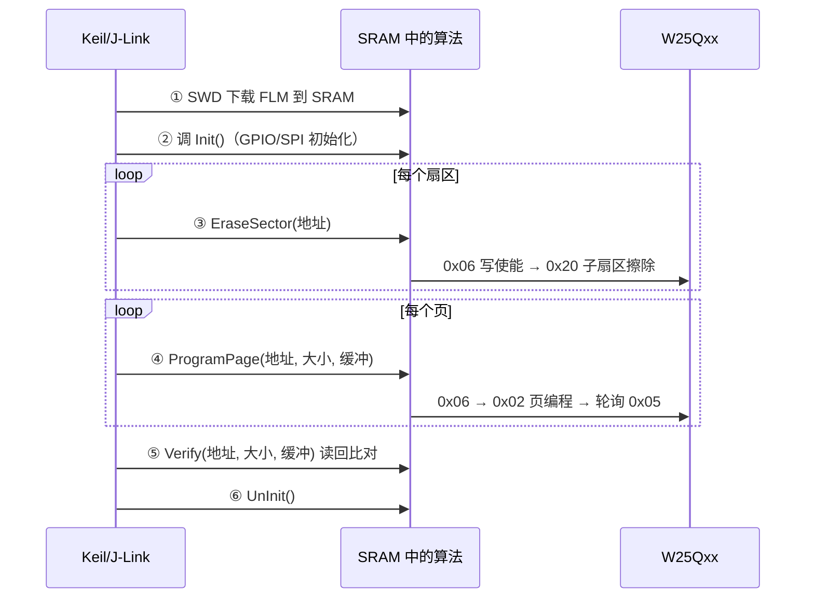

> 来源：Deep-In-Embedded / [开发板/ARM架构/STM32F411CEU6/下载算法的创建与使用.md](https://github.com/shuai-yemao/Deep-In-Embedded/blob/5fcab575fc20cf681f3e79e163337211097c898a/%E5%BC%80%E5%8F%91%E6%9D%BF/ARM%E6%9E%B6%E6%9E%84/STM32F411CEU6/%E4%B8%8B%E8%BD%BD%E7%AE%97%E6%B3%95%E7%9A%84%E5%88%9B%E5%BB%BA%E4%B8%8E%E4%BD%BF%E7%94%A8.md)

# 📖 引言

> 这篇笔记要讲什么？用一句话概括核心主题。

因为 mcu 内部 flash 的大小及其有限，人们通过将资源放入外部 flash 来释放内存资源的压力，那如何将资源下载到外部 flash 中，根据通过下载器将代码下载到内部 flash 的原理，将代码下载的地址转移至外部 flash 中

---

# 📝 下载算法

> 用一句话说清楚这个知识点是什么。

如何创建一个下载算法和使用下载算法

## 实际意义

> 为什么会有该知识点？

1. 随着互联网的兴起，图片和视频资源也开始流行，但是芯片内部 flash 注定无法存放大量图片和视频资源，而下载算法将内部 flash 无法存放的资源放入外部内存资源中如 sd 卡，机械硬盘等等
2. 提前加载信息，无需 mcu 上电后加载到栈中
3. 多核情况下，mcu 上电可以从外部 flash 中获取固件
4. 通过外部加密芯片对下载过程进行加密

## 应用场景

> 在实际中主要被用来做什么？

1. **LVGL 图形资源库**：字库、图片、动画帧经编译段指定到外部 Flash 地址段（0x90000000），Keil 下载时用自建算法直接把资源写进 W25Qxx，运行时按地址读取，无需上电后加载到内存——解决内部 Flash 容量不足，见 [[lvgl移植指南]]
2. **边缘 AI 模型/训练数据**：模型权重（数百 KB）与数据集存外部 Flash，下载算法负责灌装，运行时边用边读
3. **OTA 固件预置与备份**：出厂时用下载算法把 " 初始固件/出厂备份 " 直接灌入外部 Flash 备份区，Bootloader 之后从备份区恢复或升级，见 [[OTA加密升级框架]]
4. **产线烧录简化**：无需先烧 Bootloader 再走串口——产线用 J-Link + J-Flash 加载同一份 FLM，一步把程序（内部）与资源/参数（外部）全部烧好
5. **参数/日志出厂初始化**：配合 [[W25Qxx的handler文件架构设计思路]] 的双块分区，产线一次写入出厂配置、校准表等固化数据

## 核心逻辑/原理

> 它是如何工作的？拆解背后的机制。

### 机制 1：FLM 本质 —— 一段在 SRAM 中运行的 " 临时固件 "

调试器（Keil→J-Link→SWD）无法直接操作外部 SPI Flash，它只认识内核调试接口（AHB-AP 读写寄存器/内存）。于是把一段**无 `main()` 的驱动代码**（FLM）经 SWD 下载进 SRAM，让 CPU 运行它来驱动 GPIO 模拟 SPI 操作 W25Qxx；下载完算法即弃，不占用户程序空间。


### 机制 2：调试器的调用协议



传参靠寄存器约定，返回 `0=成功 / 1=失败`——这就是为什么 FlashDrg.c 的每个函数必须严格签名。

### 机制 3：ProgramPage 的地址转换与写时序（核心）

F411 **无 QSPI 内存映射**，`FlashDev.StartAddress`（本工程为 0x90000000）只是 " 假想映射基地址 "。`adr` 必须先减基地址变回 W25Qxx 物理偏移，再按页拆分写：

```c
int ProgramPage(unsigned long adr, unsigned long sz, unsigned char *buf)
{
    adr -= 0x90000000UL;          /* 映射地址 → W25Qxx 物理偏移 */
    while (sz > 0) {
        uint16_t chunk = (sz > 256) ? 256 : sz;  /* 页编程上限 256B */
        w25qxx_write_enable();                    /* 0x06 写使能 */
        w25qxx_page_program(adr, buf, chunk);     /* 0x02 页编程 */
        w25qxx_wait_busy();                       /* 轮询 0x05 忙状态 */
        adr += chunk; buf += chunk; sz -= chunk;  /* 跨页拆分 */
    }
    return 0;
}
```

### 机制 4：FlashDev 设备描述符 —— 算法与 Keil 的 " 契约 "

`FlashDevice` 结构体编译进 FLM，Keil 加载时解析出设备名（下拉框显示）、类型 `EXTSPI`、起始地址、容量、页大小、超时、扇区表。**这就是为什么步骤 6 改命名、步骤 4 填 API 后 Keil 才认得出 " 新设备 "。**

### 机制 5：按目标地址自动选择算法

同一工程可同时挂 " 内部 Flash 算法 "+" 自建外部算法 "，Keil 按目标地址自动切换：`0x08000000` 段走内部算法，`0x90000000` 段走 W25Qxx 算法，无需手工干预。

## 关键公式/结论

> 最终结论和公式。

1. **地址转换**：`W25Qxx 物理偏移 = 传入地址 − FlashDevice.StartAddress`。本工程 StartAddress = `0x90000000`（F411 无 QSPI 时的约定映射段）；若设 `0x00000000` 则免去减法
2. **存储层次**（源自 [[W25Qxx的driver文件架构设计思路]]）：

| 单位 | 大小 | 用途 |
|------|------|------|
| 页 Page | 256 B | 页编程 0x02 单次上限，跨页必须拆分 |
| 子扇区 Subsector | 4 KB = 16 页 | 擦除 0x20 最小单位 |
| 扇区 Sector | 64 KB = 16 子扇区 | 块擦除 0xD8 单位 |

3. **容量推导**：`size(MB) = 1 << (DeviceID − 0xEF13)`，W25Q80=1MB … W25Q128=16MB，算法可按 ID 动态识别容量
4. **RAM for Algorithm 约束**：`RAM_for_Algorithm ≥ FLM 二进制大小`。Keil 默认 `0x1000`（4KB），FLM 自 `0x20000000` 加载执行；若 FLM 超过该值会报 "cannot load flash programming algorithm"
5. **超时参数约束**：FlashDev 中 `ProgramPageTimeout` / `EraseSectorTimeout` 必须 ≥ W25Qxx 数据手册最大耗时（页编程 3ms、子扇区擦除 800ms/3s），否则下载中途失败
6. **下载总耗时估算**：`T ≈ N_sector × t_erase + N_page × t_program`。例：写入 1MB 资源 ≈ 256 次子扇区擦除 + 4096 次页编程，可据此评估产线节拍
7. **Verify 可靠性**：`Verify(adr, sz, buf)` 逐字节读回比对，擦除后单元应为 0xFF；读回不一致即报 "Verify Failed"——用于抓 SPI 模式错误、页回卷等时序问题

## 实际操作步骤

> 动手验证/配置的具体操作。

### 第一步

移植 ARM 文件中的 _Template_Flash 文件夹内所有文件 

### 第二步

打开 NewDevice 的 keil 工程文件，进入后进行编译，无警告无报错即正常

**工程配置关键项（编译前核对，算法须在 SRAM 中运行）：**

- 取消启动文件（startup）参与编译——算法无 `main()`，不跑 startup
- 勾选 Read-Only Position Independent + Read-Write Position Independent（位置无关代码）
- 优化等级建议 -O0 或 -O1，避免优化掉关键时序代码
- 分散加载文件用模板自带的 `PRG 0 PI + DSCR` 结构——保证 `FlashDevice` 结构体落在 FLM 固定偏移，Keil 才能解析

### 第三步

添加 spi 和 w 25 qxx 的代码文件和头文件目录到 keil 工程中 

### 第四步

在 FlashDrg.c 文件中引用 W 25 Qxx 头文件，并分别在 init，erasechip，erasesector，programpage 函数内使用 w 25 qxx 的 api  

**函数签名与返回约定（Keil 按寄存器传参，签名必须严格）：**

- `int Init(void)` / `int UnInit(void)` / `int EraseChip(void)`
- `int EraseSector(unsigned long adr)`
- `int ProgramPage(unsigned long adr, unsigned long sz, unsigned char *buf)`
- `int Verify(unsigned long adr, unsigned long sz, unsigned char *buf)`
- 返回值：`0 = 成功，1 = 失败`

**ProgramPage 核心：** 先做地址转换 `adr -= 0x90000000UL`（映射地址 → W25Qxx 物理偏移），再按 256B 页边界拆分写入——每页前发 0x06 写使能，写后轮询 0x05 忙状态。

### 第五步

在 FlashDrg.c 文件中创建 Verify 函数 

### 第六步

修改 FlashDev.c 中结构体对输出下载算法的命名 

**FlashDev 关键字段（不只改名，需核对）：**

- `DeviceType = EXTSPI`（外部 SPI Flash）
- `DeviceStartAddress = 0x90000000`
- `DeviceSize` = W25Qxx 实际容量
- `ProgrammingPageSize = 256`（页编程单位）
- `ErasedValue = 0xFF`
- `ProgramPageTimeout` ≥ 3ms / `EraseSectorTimeout` ≥ 800ms~3s
- `SectorSize = 0x1000`（4KB 子扇区）

### 第七步

在编译 after 添加命令行创建 FLM 文件 

**典型命令行写法：** `cmd.exe /C copy "Objects\%L" ".\@L.FLM"`（或 `fromelf.exe --bin --output "$L@L.FLM" "$L@L.AXF"`）

### 第八步

将创建的 FLM 文件放入 ARM/FLASH 文件夹中

### 第九步（目标工程注册算法）

在**目标工程**中注册下载算法：


1. Options for Target → Debug → Settings → Flash Download → **Add**
2. 选择刚生成的 FLM，配置 RAM for Algorithm（默认 `0x1000` = 4KB，必须 **≥ FLM 文件大小**）
3. 确认算法地址范围：Start = `0x90000000`，Size = W25Qxx 容量

### 第十步（把资源指定到外部 Flash 地址段）

用户工程中把资源数据放到 0x90000000 段，二选一：


- **分散加载**：在 sct 文件中新增执行域，起始地址 `0x90000000`
- **编译器属性**：`__attribute__((section(".ARM.__at_0x90000000"))) const uint8_t img[] = {...};`

### 第十一步（验证）

1. Keil 点击 Download，观察输出日志 Erase / Program / Verify 全部通过
2. 用 J-Flash 读回比对，或程序内读 W25Qxx 对应地址校验数据

### 第十二步（可选）J-Link 离线烧录注册

若需用 J-Flash 产线烧录：把 FLM 复制到 JLink 安装目录 `Devices` 下，并在 `JLinkDevices.xml` 中注册（Vendor / Name / Core / BaseAddr / Loader 路径）。

## 常见问题

> 现象 → 根因 → 修复 → 验证。

### 问题 1：其他 Keil 工程无法选择该下载算法

**现象**：FLM 已放入 ARM/FLASH 文件夹，原工程下载正常；但其他 Keil 工程的 Flash Download 算法列表里看不到它，调试器无法选择它与外部 flash 通信。

**根因**：每个 Keil 工程**独立维护**自己的 Programming Algorithm 列表。FLM 放进 ARM/FLASH 只是让 Keil 的算法目录能搜到文件，目标工程必须手动 Add 一次才能出现在列表；此外若 FLM 描述符解析失败（文件不完整、地址范围与工程内存映射不重叠）也会被过滤。

**修复**：

1. 目标工程 Options for Target → Debug → Settings → Flash Download → **Add**，选择该 FLM
2. 核对算法地址范围 Start = 0x90000000、Size = 容量，与工程内存映射重叠
3. 确认 RAM for Algorithm ≥ FLM 文件大小
4. 若列表仍无：检查生成的 FLM 大小是否正常（应 ≥ 4KB），选中 FLM 看 Keil 显示的起始地址/容量是否正确

**验证**：Add 后列表出现该算法，勾选后可正常 Download 到 0x90000000。

### 问题 2：下载报 "cannot load flash programming algorithm"

**现象**：点击 Download 直接报错，算法无法加载到 RAM。

**根因**：RAM for Algorithm（默认 0x1000 = 4KB）小于 FLM 二进制大小，算法装不进 SRAM；或算法工程误编译了 startup 文件导致入口异常。

**修复**：增大 RAM for Algorithm 直到 ≥ FLM 大小；确认算法工程未编译 startup 文件。

**验证**：重新 Download 通过。

### 问题 3：Verify Failed / 读出全 0xFF

**现象**：下载过程中 Verify 失败，或烧完读回资源全是 0xFF。

**根因**：① SPI Mode 不匹配（W25Qxx 要求 Mode 0/3，配成 Mode 1/2 芯片不响应）；② ProgramPage 漏了 `adr -= 0x90000000` 地址转换，写到错误扇区；③ 页边界未拆分，数据回卷覆盖。

**修复**：抓 SCK 空闲电平/采样沿核对 Mode；检查 ProgramPage 地址转换与 256B 页拆分；参考 [[W25Qxx的driver文件架构设计思路]] 的时序。

**验证**：读回比对一致。

### 问题 4：下载卡死/超时

**现象**：EraseSector 或 ProgramPage 阶段长时间无响应，最终超时。

**根因**：FlashDev 中 `EraseSectorTimeout` / `ProgramPageTimeout` 小于 W25Qxx 数据手册最大耗时（子扇区擦除最长 800ms~3s）；或 wait_busy 轮询无超时退出。

**修复**：超时参数调大到手册最大值以上；确认 wait_busy 有超时退出而非死循环。

**验证**：下载全程通过，日志无超时。

### 问题 5：FLM 文件异常小（几百字节）

**现象**：after-build 生成的 FLM 只有几百字节，Add 时 Keil 无法识别/过滤掉。

**根因**：after-build 命令行输出错误，或链接时 FlashDevice 段（DSCR）未落在固定偏移，描述符缺失。

**修复**：改用标准命令行 `cmd.exe /C copy "Objects\%L" ".\@L.FLM"`；确认分散加载为模板的 PRG+DSCR 结构。

**验证**：FLM 大小 ≥ 4KB，Keil Add 后能显示设备名与容量。

---

# 💬 Q&A

> 自问自答，检验理解深度。按难度递进排列。

## 🟢 基础

> 最基本的概念和用法，入门必知。

### Q 1：FLM 下载算法本质是什么？为什么调试器不能直接写外部 SPI Flash？

A 1：FLM 是一段无 `main()`、运行在 MCU SRAM 中的临时驱动代码。调试器经 SWD/DAP→AHB-AP 只能读写内存和寄存器，无法直接驱动 SPI/GPIO 引脚；必须把 FLM 下载进 SRAM 让 CPU 执行，由 CPU 翻转 GPIO 模拟 SPI 时序操作 W25Qxx，下载完算法即弃。SWD 调试链路（DP→AHB-AP）与 Flash 数据通路（SPI）分离，FLM 就是两套接口之间的 " 翻译官 "。

### Q 2：ProgramPage 里 `adr -= 0x90000000` 的作用？漏了会怎样？

A 2：0x90000000 是 MCU/Keil 视角的假想映射基地址，W25Qxx 的 SPI 命令只认从 0x000000 起的芯片物理偏移，两者差一个基地址所以必须减。本工程基地址低 24 位恰好全 0，漏减时对 ≤16MB 芯片可能 " 碰巧 " 工作，但一旦换基地址（低 24 位非 0）或芯片走 32 位地址模式，就会写到错误扇区、擦错位置、Verify 全 0xFF。

## 🟡 进阶

> 容易踩的坑和常见误区。

### Q 3：Keil 如何选择用哪个下载算法烧哪个地址？DeviceSize 设小会怎样？

A 3：Keil 按目标地址落在哪个算法声明的地址窗口 `[StartAddress, StartAddress + DeviceSize)` 自动选择——0x08000000 段走内部算法，0x90000000 段走外部算法，无需手工干预。若 DeviceSize 设小（如 8MB 设成 1MB），向 0x90060000（偏移 6MB）下载会因超出范围直接报错。

## 🔴 困难

> 结合实战的深层原理和设计权衡。

### Q 4：算法在 SRAM 运行对代码有哪些隐藏约束？如何提速？

A 4：

1. **隐藏约束**：
   - 代码体积受限：FLM 整体必须 ≤ RAM for Algorithm（默认 4KB），超了报 cannot load；算法内不能用大局部数组/深递归
   - 引脚必须与应用工程一致：算法与应用在同一颗芯片跑，GPIO 模拟 SPI 的引脚必须完全对齐
   - 全局变量初值未定义：RAM 上电无 startup 清零段（无 `.data/.bss` 初始化），HAL 句柄等须手动清零
   - 位置无关：算法加载地址由 Keil 决定，需编译勾选 ROPI/RWPI
   - 不能依赖中断/RTOS：用自旋轮询等待，不用 OS 延时/信号量
2. **提速方向**：硬件 SPI + DMA 替代 GPIO 模拟 SPI——省去每条命令的 GPIO 翻转，DMA 搬运不占 CPU。代价：占用 1 路 DMA 流 + 1 个硬件 SPI 外设（及对应 AF 引脚），且算法代码增大、挤占 RAM。

---

# 📋 总结

> 下载算法（FLM）本质是一段无 `main()` 的临时固件，被调试器经 SWD 下载进 SRAM 运行，从而让 Keil/J-Link 能通过 GPIO 模拟 SPI 操作外部 W25Qxx Flash，解决 F411 内部 Flash 容量有限且无 QSPI 内存映射的矛盾。核心机制是 `FlashDevice` 设备描述符作为算法与 Keil 的 " 契约 "，`ProgramPage` 内必须先把映射地址（0x90000000）减成 W25Qxx 物理偏移，再按 256B 页边界拆分写入。创建流程：移植模板 → 编译 → FlashDrg.c 各函数填入 W25Qxx API → 生成 FLM → 放入 ARM/FLASH → 目标工程注册并配置 RAM for Algorithm；使用侧把资源段指定到 0x90000000，Keil 按目标地址自动选择内部/外部算法。关键约束是 RAM for Algorithm ≥ FLM 大小、超时参数 ≥ W25Qxx 手册最大值，否则会触发 cannot load / Verify Failed / 超时等典型故障。

---

# 📎 参考资料

> 学习过程中用到的外部资源汇总。

## 🎥 视频链接

> B 站 / YouTube 教程，优先选项目实战类和原理动画类。

- [适配STM32H7系列芯片的外部FLASH下载算法制作教程（QSPI、W25Q64/128/256）](https://www.bilibili.com/video/BV1oE6fYKEum/) — B 站：外部 Flash 下载算法制作全流程（H7 示例，机制与 F411 相同可参考，附代码包）

## 🔗 博客/文档链接

> 分析最透彻的博客、官方文档、社区帖子。

- [深入解析Keil MDK FLM算法：SRAM运行原理与下载机制](https://blog.csdn.net/weixin_28706541/article/details/161252882) — CSDN：FLM 的 SRAM 运行原理与下载机制解析
- [聊聊MCU下载算法（FLM）在Keil MDK里的那些事儿：从入门到硬核](https://community.geehy.cn/blog/1305-liao-liao-mcuxia-zai-suan-fa-flmzai-keil-mdkli-de-na-xie-shi-er-cong-ru-men-dao-ying-he) — 极海社区：FLM 结构、函数表、创建与集成全流程
- [基于Keil生成外部Nor Flash下载算法，并使用J-Flash直接烧录（以W25Q64为例）](https://blog.csdn.net/sinat_42731525/article/details/130609351) — CSDN：W25Q64 下载算法制作 + J-Flash 烧录实战
- [STM32外挂Flash调试救星：详解MDK下载算法FLM文件制作与配置（以W25Q32为例）](https://blog.csdn.net/weixin_30615767/article/details/97596543) — CSDN：W25Q32 FLM 制作与 Keil 配置
- [制作STM32F429的SPI FLASH下载算法](https://cloud.tencent.cn/developer/article/1660552?policyId=1003) — 腾讯云：SPI Flash 下载算法制作步骤
- [避坑指南：用STM32CubeMX+Keil为外部Flash定制下载算法（以W25Q64为例）](https://blog.csdn.net/weixin_28727975/article/details/160519367) — CSDN：W25Q64 定制下载算法踩坑汇总
- [基于 STM32F407 的 SPI Flash下载算法](https://blog.csdn.net/Teminator_/article/details/142728299) — CSDN：F407 SPI Flash 下载算法（W25Q128）
- [Keil MDK下载设置RAM for Algorithm的大小](https://forum.anfulai.cn/archiver/?tid-118891.html) — 硬汉论坛：RAM for Algorithm 取值与 FLM 大小关系
- W25Q64 数据手册（Winbond）— 指令集、页编程/擦除时序与超时参数

## 💻 仓库链接

> GitHub / Gitee 源码仓库，含 Demo 工程和工具链。

- [ChongKaKam/STM32CubeProg_Algorithm](https://github.com/ChongKaKam/STM32CubeProg_Algorithm) — GitHub：外部 Flash 下载算法示例工程（含 W25Q64 Keil 工程）
- [ARM-software/CMSIS_5](https://github.com/ARM-software/CMSIS_5) — GitHub：Keil 下载算法官方模板来源（`Device/_Template_Flash`）

## 📄 代码/附件

> 本地 PDF、代码包、工具链文件。

- [[W25Qxx的driver文件架构设计思路]] — 下载算法依赖的 W25Qxx 驱动（命令集/时序/存储层次/ID 容量公式）
- [[模拟SPI的设计思路]] — F411 无 QSPI，算法用的 GPIO 模拟 SPI 实现
- [[Jlink下载原理及其应用]] — 下载算法运行的调试链路（SWD/CoreSight/AHB-AP）原理
- FLM 工程源码（_Template_Flash + NewDevice 移植版）— 本地 Keil 工程，路径待补充
