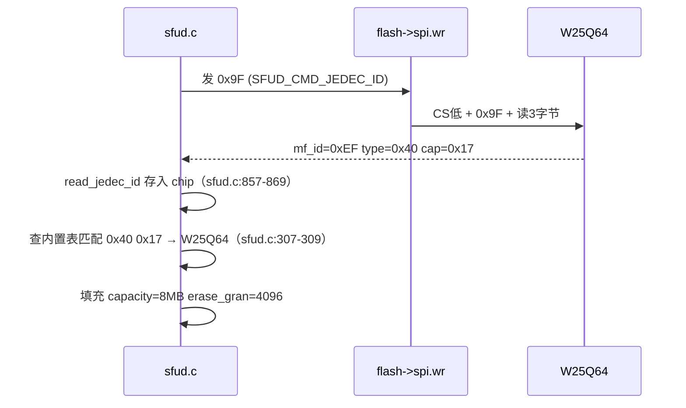
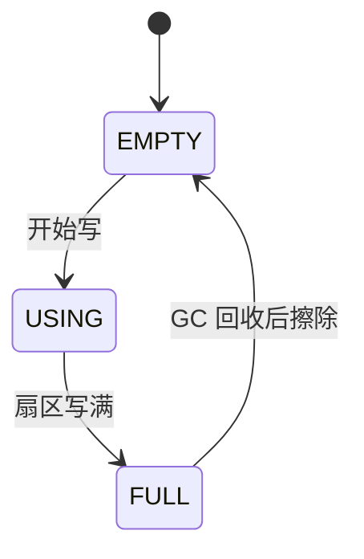
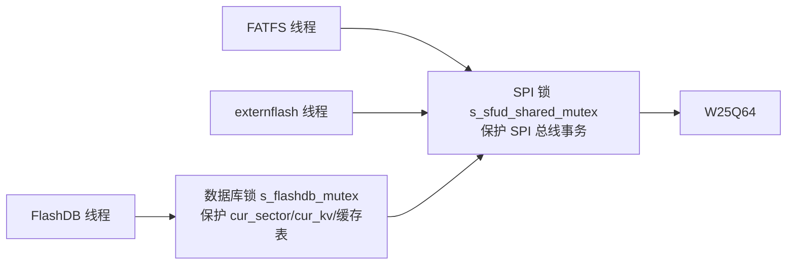

> 来源：Deep-In-Embedded / [开发板/ARM架构/STM32F411CEU6/外部flash中SFUD，FAL，FlashDB,FATFS以及OTA和LVGL资源的统筹方案.md](https://github.com/shuai-yemao/Deep-In-Embedded/blob/5fcab575fc20cf681f3e79e163337211097c898a/%E5%BC%80%E5%8F%91%E6%9D%BF/ARM%E6%9E%B6%E6%9E%84/STM32F411CEU6/%E5%A4%96%E9%83%A8flash%E4%B8%ADSFUD%EF%BC%8CFAL%EF%BC%8CFlashDB%2CFATFS%E4%BB%A5%E5%8F%8AOTA%E5%92%8CLVGL%E8%B5%84%E6%BA%90%E7%9A%84%E7%BB%9F%E7%AD%B9%E6%96%B9%E6%A1%88.md)

# 📖 引言

> 在 STM32F411CEU6（内部 512K Flash / 128K RAM）+ W25Q64（外部 8MB SPI Flash）上，SFUD、FAL、FlashDB、FATFS、OTA、LVGL 六大组件如何共享 8MB 外部空间、分配 128KB 内部内存、并在共用一根 SPI 总线时保证并发安全。
>
> 核心结论一句话：**以 FAL 分区表为 " 单一事实来源 "，上层组件只认 " 分区名 + 相对偏移 "**。由此换来三个能力——换芯片不改代码（SFUD 内置表 + 动态容量）、改分区只改一处（静态表 + 相对寻址）、并发安全分层守护（SPI 物理锁 + 数据库逻辑锁）。

---

# 📝 分层存储栈的设计思路

> 一句话定义：**W25Q64 ← SPI ← SFUD ← FAL ← {FlashDB KVDB, FatFs}**。每层只认下一层给的接口，靠 " 函数指针多态 + 编译期静态分区表 + 相对偏移寻址 " 三层机制解耦。

## 每一层的职责（谁负责什么，不负责什么）

| 层 | 对象 | 负责 | 不负责 |
|---|---|---|---|
| SPI 驱动 | `spi_driver_interface_t`（[bsp_w25qxx_driver.h:91](Bsp/Borad_drive/ExternFlash/hal_driver/Inc/bsp_w25qxx_driver.h#L91)） | 字节收发（SW/HW 两种实现） | 命令、扇区、芯片识别 |
| SFUD | `sfud_flash`（[sfud_def.h:269](Middlewares/SFUD/inc/sfud_def.h#L269)） | JEDEC 识别、统一读写擦命令、跨页编程 | 分区概念 |
| FAL 设备 | `nor_flash0`（[fal_flash_sfud_port.c:75](Middlewares/FAL/port/fal_flash_sfud_port.c#L75)） | 把 SFUD 封装成 `ops` 函数指针，供 FAL 调用 | 芯片型号认知 |
| FAL 分区 | `struct fal_partition`（[fal_def.h:124](Middlewares/FAL/inc/fal_def.h#L124)） | 名字→偏移/长度映射，相对地址换算 | 文件格式、KV 语义 |
| FlashDB | `fdb_kvdb`（[user_flashdb.c:58](User_Task/User_Flashdb/Src/user_flashdb.c#L58)） | KV 键值 + 掉电安全 + GC | 文件目录结构 |
| FatFs | `FATFS`/`FIL`/`diskio` | 文件/目录/簇 | 底层 flash 物理细节 |

## 实际意义

### 1. 换芯片零改动（W25Q64 → W25Q128）

- **SFUD 内置表**已有 W25Q128BV 条目（[sfud_flash_def.h:134](Middlewares/SFUD/inc/sfud_flash_def.h#L134)，JEDEC `0x40 0x18` / 16MB / 4KB），上电自动匹配，无需改 SFUD。
- **FAL 容量运行时动态取**（[fal_flash_sfud_port.c:129](Middlewares/FAL/port/fal_flash_sfud_port.c#L129) `nor_flash0.len = chip.capacity`），所以 port 层也不用写死型号。
- **只需重规划 `fal_cfg.h` 分区表**。SFUD / port / FlashDB / FATFS 源码全部零改动。

### 2. 改分区全链生效

- 分区物理位置只定义在 `fal_cfg.h` 一处。
- 上层读写时传**分区内相对偏移**，FAL 内部换算 `part->offset + addr`（[fal_partition.c:428](Middlewares/FAL/src/fal_partition.c#L428)）。
- FlashDB/FATFS 从不持有绝对物理地址 → 改表 = 全链跟随。

### 3. 并发安全分层

- SPI 锁保证**单次 flash 事务**物理原子（防总线交错）。
- 数据库锁保证 **set_kv 复合操作**逻辑原子（防状态变量被交错修改）。
- 两者职责不同、缺一不可。

## 应用场景

1. FlashDB 通过 `fal_partition_find("fdb")` 拿 KV 分区句柄（[fdb.c:66](Middlewares/FlashDB/src/fdb.c#L66)）。
2. FatFs 通过 `fal_partition_find("fatfs")` 拿文件系统分区（[diskio.c:70](Middlewares/FATFS/port/diskio.c#L70)）。
3. SFUD 换 SPI 实现：改 `ADAPTER_PORT_SPI_MODE` 宏（0=SW / 1=HW，[drv_adapter_port_externflash.c:27-28](Bsp/porting/drv_adapter_port_externflash/Src/drv_adapter_port_externflash.c#L27-L28)）。
4. 扩容分区：改 `fal_cfg.h` 对应行 + 邻接分区让位。

## 核心逻辑/原理

### 机制 1：分层存储栈完整调用链


关键点：**SFUD 路径不经过 driver/handler**（[drv_adapter_sfud_externflash.c:118](Bsp/porting/drv_adapter_sfud_externflash/Src/drv_adapter_sfud_externflash.c#L118) 直接从 `user_data` 拿 `spi_driver_interface_t`）；driver/handler 是 externflash 测试任务的平行路径，两条路在 port 层 `s_port_spi` 汇合。

### 机制 2：SFUD 的 JEDEC 识别流程



证据：`read_jedec_id`（[sfud.c:857-869](Middlewares/SFUD/src/sfud.c#L857-L869)）→ 内置表循环匹配（[sfud.c:307-309](Middlewares/SFUD/src/sfud.c#L307-L309)）。

### 机制 3：FAL 分区初始化 + 相对偏移寻址

FAL 初始化分两步（[fal.c:22-52](Middlewares/FAL/src/fal.c#L22-L52)）：`fal_flash_init()`（挂载设备）→ `fal_partition_init()`（从静态表构建分区数组，[fal_partition.c:52](Middlewares/FAL/src/fal_partition.c#L52) `partition_table_def[] = FAL_PART_TABLE`）。

上层读写换算：

```c
// fal_partition.c:428 读
ret = flash_dev->ops.read(part->offset + addr, buf, size);
//                          ──┬────  ──┬─
//                   物理地址 = 分区偏移 + 分区内相对地址
```

FlashDB 传的是 " 相对 0~512K" 的 `addr`，FAL 加 `part->offset` 变物理地址——**上层永远不知道自己在物理 6MB 还是 7MB**。

### 机制 4：FlashDB 追加写 + 扇区状态机（掉电安全）

**KV 节点结构**（[fdb_kvdb.c:119-122](Middlewares/FlashDB/src/fdb_kvdb.c#L119-L122)）：

```
status_table[]  ← 写入状态渐变（0xFF→...→0x00，掉电可判读到哪一步）
name_len/len    ← 元数据
crc32           ← name+value 校验和（[fdb_kvdb.c:122]）
```

**扇区状态机**（[fdb_kvdb.c:316](Middlewares/FlashDB/src/fdb_kvdb.c#L316)）：



**掉电安全原理**：更新 key 是**追加写**——旧节点标记废弃，新节点写新位置。掉电时无论掉在哪个字节，重启重扫靠 " 状态表判读到哪一步 + CRC 判数据完整性 "（[fdb_kvdb.c:364-399](Middlewares/FlashDB/src/fdb_kvdb.c#L364-L399)），半截节点直接作废，不会破坏旧值。

### 机制 5：GC 垃圾回收（分区的 " 磨损均衡器 "）

触发条件（[fdb_kvdb.c:1076-1086](Middlewares/FlashDB/src/fdb_kvdb.c#L1076-L1086)）：

```c
if ((empty_kv = alloc_kv(db, sector, kv_size)) == FAILED_ADDR) {
    gc_collect_by_free_size(db, kv_size);  // 写不下 → GC 腾空间
    goto __retry;                          // 重试
} else if (already_gc) {
    FDB_INFO("Error: ... KV full.\n");      // GC 后仍不够 → 写入失败
}
```

GC 动作：把**最脏扇区**（有效数据最少，[fdb_kvdb.c:907](Middlewares/FlashDB/src/fdb_kvdb.c#L907)）的有效 KV 逐个 `move_kv` 到空闲扇区，再擦除旧扇区。**分区大 = 空闲扇区多 = GC 缓冲足 = 高频 KV 更新几乎不触发回收**。

### 机制 6：两层互斥锁（并发安全）



| 锁 | 保护对象 | 粒度 | 证据 |
|---|---|---|---|
| SFUD SPI 锁 | SPI 总线单次事务 | 一次 read/write/erase | [drv_adapter_sfud_externflash.c:157-174](Bsp/porting/drv_adapter_sfud_externflash/Src/drv_adapter_sfud_externflash.c#L157-L174) |
| FlashDB 数据库锁 | cur_sector/cur_kv/缓存表 | 整个 set_kv 复合操作 | [user_flashdb.c:68-82](User_Task/User_Flashdb/Src/user_flashdb.c#L68-L82) |

set_kv 六步（[fdb_kvdb.c:1295-1324](Middlewares/FlashDB/src/fdb_kvdb.c#L1295-L1324)）：找空间 → 找旧值 → 删旧标记 → 写新值 → 再删旧 → 可能 GC。**数据库锁保证这六步在逻辑上原子**；SPI 锁保证其中**每一步的物理字节**原子。删掉任一锁都会出问题（见 FAQ）。

### 机制 7：OTA 双区解耦（下载与安装分离）

```
内部 Flash：bootloader(需预留) + app(0x08000000 后移) + VTOR 重定位
外部 Flash：app(当前固件备份) | download(新固件暂存)
```


**中间缓冲区的价值**：下载中断电/校验失败/安装失败都不会破坏当前运行固件——download 区是 " 回滚保险 + 本地重试源 "（无需二次下载）。当前内部 512K Flash 全被 app 占用（[STM32F411XX_FLASH.ld:59](STM32F411XX_FLASH.ld#L59)），实现 OTA 需预留 bootloader 区并后移 app 起点。

### 机制 8：LVGL 的两处资源矛盾

| 矛盾 | 数值 | 解法 |
|---|---|---|
| 显存超 RAM | 320×240 RGB565 = 150KB > 128KB | **分区渲染**：画一块 flush 一块，只留小块缓冲 |
| 资源超内部 Flash | 图片/字体几十 KB 起步 | 放外部 `lvgl_res` 3MB 分区，经 FAL/SFUD 读取 |

**SPI+DMA ≠ 分区渲染**：SPI+DMA 是送显手段（异步搬移降 CPU 占用），分区渲染是内存策略（解决 RAM 不够）。LVGL 代码若走文件系统方案，需排在 FATFS 之后初始化（[user_init.c:81](User_Task/User_Init/Src/user_init.c#L81)）。

## 关键公式/结论

### 1. 分区表排布（[fal_cfg.h:55-63](Middlewares/FAL/port/fal_cfg.h#L55-L63)）

| 分区 | offset | len | 用途 |
|---|---|---|---|
| app | 0x00000000 | 512K | OTA 主区 |
| download | 0x00080000 | 512K | OTA 下载槽 |
| log | 0x00100000 | 1M | 日志循环区 |
| lvgl_res | 0x00200000 | 3M | LVGL 资源（未接入） |
| fatfs | 0x00500000 | 1M | FATFS 文件系统 |
| fdb | 0x00600000 | 512K | FlashDB KVDB |
| rsvd | 0x00680000 | 1.5M | 保留（未来功能） |
| **合计** | | **8M** | 4KB 对齐 |

### 2. 分区表约束（规划者自查）

1. **不越界**：`offset + len ≤ 设备容量(8MB)` → 初始化校验（[fal_partition.c:145](Middlewares/FAL/src/fal_partition.c#L145)）拒绝越界分区。
2. **不重叠**：各分区首尾相接、互不交叉。**FAL 不查重叠，这是规划者的责任**——改一个分区必须联动邻接分区。
3. **读写边界**：`addr + size ≤ part->len` → 每次操作校验（[fal_partition.c:415](Middlewares/FAL/src/fal_partition.c#L415)）。

### 3. RAM 账本（128KB）

| 项目 | 大小 | 类型 | 可裁剪? |
|---|---|---|---|
| FreeRTOS 堆 | 24KB | 配置 | 可调 |
| 任务栈 ×3 | ~12KB | 配置 | 可实测裁剪 |
| s_work（f_mkfs 工作区） | 8KB | 静态 | **一次性**，mkfs 后释放 |
| s_fs（含 win[4096]） | ~4.1KB | 静态 | 不用文件系统可腾 |
| s_kvdb | ~0.9KB | 静态 | 固定 |
| FalPartTable + s_fil 等 | ~0.5KB | 静态 | 固定 |
| **小计** | **~49.5KB** | | 余 **~78KB** |

map 实测：`FalPartTable` 0x1c0 / `s_kvdb` 0x36c / `s_fs` 0x1034 / `s_work` 0x2000 / `s_fil` 0x28。

### 4. FatFs 扇区/文件系统约束

- 逻辑扇区 4096B（[diskio.c:43](Middlewares/FATFS/port/diskio.c#L43)）== W25Q64 擦除粒度 → 先擦后写天然对齐（[diskio.c:176-193](Middlewares/FATFS/port/diskio.c#L176-L193)）。
- 1MB 分区 / 4KB 扇区 = 256 簇 → 自动 **FAT12**（FAT32 需 ≥65525 簇，8MB 上物理不可能）。

## 实际操作步骤

### 第一步：初始化顺序

`user_init()`（[user_init.c:38-89](User_Task/User_Init/Src/user_init.c#L38-L89)）：

1. `drv_adapter_port_externflash_register()` — 注册 port
2. `drv_adapter_wrapper_externflash_init()` — wrapper 初始化（SPI + 互斥锁）
3. `user_externflash_init()` — 测试线程
4. `user_fal_init()` — **必须先于 FlashDB/FATFS**（分区表来源）
5. `user_flashdb_init()` — 依赖 FAL 的 fdb 分区
6. `user_fatfs_init()` — 依赖 FAL 的 fatfs 分区

### 第二步：扩容分区（fdb 512K→1M 为例）

1. 改 [fal_cfg.h:62](Middlewares/FAL/port/fal_cfg.h#L62)：fdb `len` → `1UL*1024*1024`。
2. **联动让位**：rsvd 的 `offset` 前移到 fdb 新末尾（7MB）、`len` 缩到 1MB（[fal_cfg.h:63](Middlewares/FAL/port/fal_cfg.h#L63)）。
3. 自查：fdb 现占 [6M,7M)，rsvd 占 [7M,8M)，不重叠不越界。
4. 重新编译，其余源码零改动。

### 第三步：真实 Flash 操作必须在任务线程内

SFUD 层 SPI 锁 take 依赖调度器已启动（[drv_adapter_sfud_externflash.c:186](Bsp/porting/drv_adapter_sfud_externflash/Src/drv_adapter_sfud_externflash.c#L186) 注释）。调度器前同步读写会崩溃——**初始化只建线程，真实读写在线程内**（[user_flashdb.c:16-17](User_Task/User_Flashdb/Src/user_flashdb.c#L16-L17)）。

### 第四步：新增录音分区（2.4MB 环形，实战题）

1. lvgl_res 3M→2M（腾 1M，LVGL 未接入）+ rsvd 让 1.4M。
2. 新建 record 分区 2.4M，插到 lvgl 后，fatfs/fdb 顺移。
3. 写入用 **TSDB**（`fdb_tsl_append`，天然环形 + 时序 + 掉电安全），TSDB 源码已编译（[fdb_cfg.h:32](Middlewares/FlashDB/port/fdb_cfg.h#L32) `FDB_USING_TSDB`），仅未初始化。

## 常见问题

### 问题 1：FlashDB 分区太小 → GC 频繁

- **现象**：KV 高频更新时写入慢、偶尔 `KV full`。
- **根因**：分区小 → 空闲扇区跌破阈值 → 写不下触发 GC 迁移 + 擦除（[fdb_kvdb.c:1076](Middlewares/FlashDB/src/fdb_kvdb.c#L1076)）。
- **修复**：扩大 fdb 分区提供 GC 缓冲。
- **验证**：观测 GC 触发频率下降。

### 问题 2：误删 SFUD SPI 锁

- **现象**：FATFS/FlashDB 数据偶发损坏。
- **根因**：SPI 事务被其他线程腰斩（总线交错）；数据库锁只防逻辑状态、不防物理事务。
- **修复**：恢复 SPI 锁；两层锁缺一不可。

### 问题 3：分区表重叠

- **现象**：FAL 初始化通过，但写一个分区破坏另一个分区数据。
- **根因**：改分区只改 len、没联动邻接分区 offset，两分区重叠。
- **修复**：规划者自查 " 首尾相接 "；FAL 只查越界不查重叠。

### 问题 4：FatFs 写失败误判

- **现象**：`f_write` 返回错误，应用以为是文件系统坏了。
- **根因**：FAL 返回 -1 → diskio 翻译 `RES_ERROR`（[diskio.c:140-143](Middlewares/FATFS/port/diskio.c#L140-L143)）→ ff.c 提升 `FR_DISK_ERR`。**RES_ERROR 是物理层问题，RES_PARERR 才是 FatFs 请求越界**。
- **修复**：看错误码区分物理层 vs 逻辑层。

---

# 💬 Q&A

## 🟢 基础

### Q1：换 W25Q128 并扩 fdb 分区，要改什么？

A1：只改 `fal_cfg.h` 分区表——fdb 的 len（512K→1M）+ 邻接分区（rsvd）offset/len 联动让位，保证不越界不重叠。SFUD/port/FlashDB/FATFS 源码零改动（SFUD 内置表已有 W25Q128BV [sfud_flash_def.h:134](Middlewares/SFUD/inc/sfud_flash_def.h#L134)，FAL 容量运行时动态取 [fal_flash_sfud_port.c:129](Middlewares/FAL/port/fal_flash_sfud_port.c#L129)）。

### Q2：分区表初始化校验查什么？

A2：每个分区 `offset < flash_dev->len`（[fal_partition.c:145](Middlewares/FAL/src/fal_partition.c#L145)）——查分区**是否超出设备容量**。重叠不查，规划者自查。

## 🟡 进阶

### Q3：删掉 SPI 锁会怎样？

A3：SPI 字节流交错 → FATFS 读回错误数据（文件损坏）、FlashDB 写入字节错误（CRC 不过，KV 损坏）。FlashDB 数据库锁只保护 cur_sector/cur_kv/缓存等逻辑状态，不碰 SPI 总线；两层锁各自管一层，缺一不可。

### Q4：FlashDB 分区为什么至少 2 个扇区？

A4：扇区状态机要求——USING 扇区写满后，GC 需要一个空闲扇区做迁移目标。2 扇区（8KB）是 " 无缓冲乒乓 "：每次写满立即全扇区迁移 + 擦除，磨损几十倍且无冗余应对 GC 中途掉电。512K（128 扇区）提供大量空间缓冲。

## 🔴 困难

### Q5：加 2.4MB 环形录音分区，怎么统筹？

A5：压缩未接入的 LVGL（lvgl_res 3M→2M 腾 1M）+ 动用预留区（rsvd 让 1.4M），新建 record 2.4M 插到 lvgl 后，fatfs/fdb 顺移。写入用 **TSDB**（`fdb_tsl_append`，天然环形 + 时序 + 掉电安全），而非 KVDB。

### Q6：FlashDB 小分区的高频更新，真正代价是什么？

A6：不是 " 数据被覆盖 "（FlashDB 永不原地覆盖），而是**写入时 alloc 失败 → 触发 GC → 阻塞重试**（[fdb_kvdb.c:1076-1086](Middlewares/FlashDB/src/fdb_kvdb.c#L1076-L1086)）。高频更新下大部分时间耗在等 GC，且每次 GC 搬动全部有效数据，Flash 磨损加剧。

---

# 📋 总结

> 外部 8MB 按 "OTA 双区（1M）+ LVGL 资源（3M）+ FATFS（1M）+ KVDB（512K）+ 日志（1M）+ 预留（1.5M）" 划分，**分区表是唯一事实来源**，上层只用相对偏移寻址；内部 128KB 的大头是堆/栈/s_work，均可裁剪；并发靠 "SPI 物理锁 + 数据库逻辑锁 " 两层；换芯片、改 SPI、扩分区都只动配置。
>
> 验证顺序：FAL 必须先于 FlashDB/FATFS；真实 Flash 操作必须在任务线程内；分区规划要自查 " 不越界 + 不重叠 "。

---

# 📎 参考资料

## 🔗 博客/文档链接

- [SFUD 文档](https://github.com/armink/SFUD) — 串行 Flash 通用驱动库（JEDEC 识别、统一命令）
- [FAL 文档](https://github.com/armink/FAL) — Flash 抽象层（分区表 + 相对偏移）
- [FlashDB 文档](https://github.com/armink/FlashDB) — KVDB/TSDB 嵌入式数据库（追加写 + GC）
- [FatFs 官方](http://elm-chan.org/fsw/ff/00index_e.html) — 通用 FAT 文件系统模块（含 diskio 接口说明）

## 💻 仓库链接

- [armink/SFUD](https://github.com/armink/SFUD)
- [armink/FAL](https://github.com/armink/FAL)
- [armink/FlashDB](https://github.com/armink/FlashDB)
- [chaN/FatFs](http://elm-chan.org/fsw/ff/00index_e.html)
