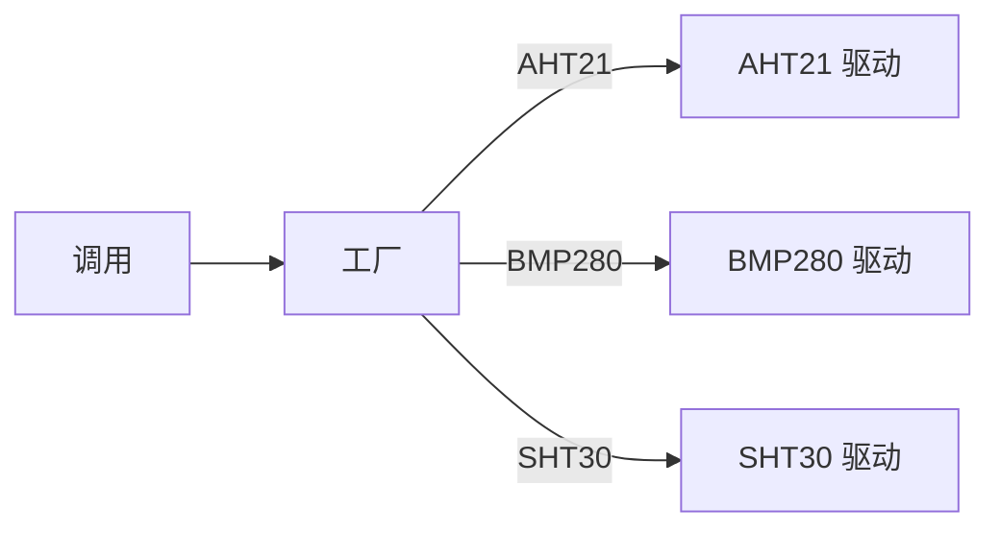
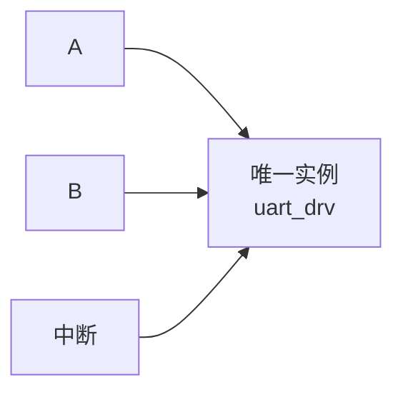
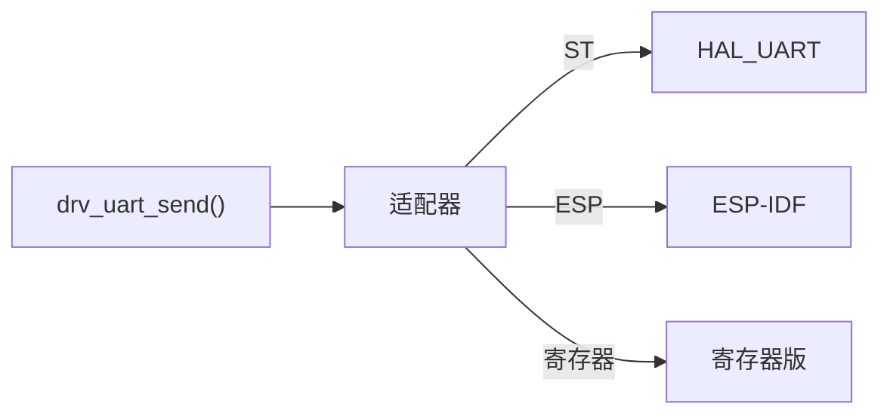
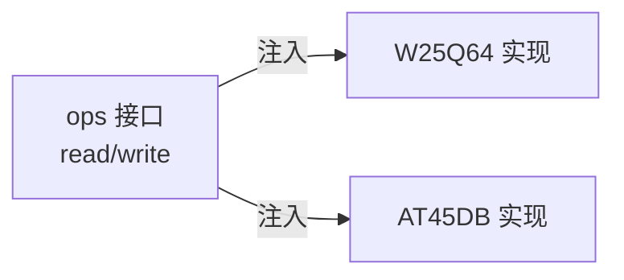
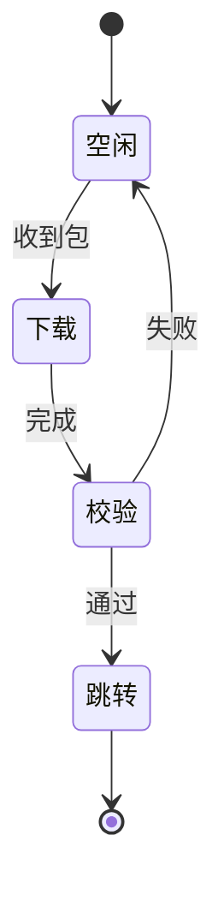

> 来源：Deep-In-Embedded / [开发板/ARM架构/STM32F411CEU6/嵌入式架构中设计模式的应用.md](https://github.com/shuai-yemao/Deep-In-Embedded/blob/5fcab575fc20cf681f3e79e163337211097c898a/%E5%BC%80%E5%8F%91%E6%9D%BF/ARM%E6%9E%B6%E6%9E%84/STM32F411CEU6/%E5%B5%8C%E5%85%A5%E5%BC%8F%E6%9E%B6%E6%9E%84%E4%B8%AD%E8%AE%BE%E8%AE%A1%E6%A8%A1%E5%BC%8F%E7%9A%84%E5%BA%94%E7%94%A8.md)

# 📖 引言

> 这篇笔记要讲什么？用一句话概括核心主题。

设计模式（Pattern）= **针对反复出现问题的可复用解决方案**。在嵌入式架构中，它通过标准的 " 接法 " 让 HAL 层、BSP 层与应用层解耦，实现 **" 换芯不换上层、加功能不动源码 "**。

---

# 📝 设计模式在架构中的应用

> 用一句话说清楚这个知识点是什么。

设计模式是在合适场景内需要付出一定代价解决反复问题的可复用解决方法

## 实际意义

> 为什么会有该知识点？

1. **让架构走向抽象**，设计模式是现成的解决方案，让各层之间解耦达成抽象
2. **解决 " 改不动 " 的痛点**：应用层直接操作寄存器，换 MCU（如 F103 → F411）就要重写上层代码；用 Adapter / Facade 隔离底层差异后，换芯不换上层
3. **控制复杂度与维护成本**：State 状态机、Ring Buffer 环形缓冲等模式把散落的 if/else、裸指针逻辑收拢成可管理的标准结构，代码更易读、可测试、可复用
4. **多平台 / 多外设可移植**：Bridge 桥接把接口与实现分离，Factory 工厂按型号创建驱动，SDK 差异被封装在局部，跨芯片移植成本大幅下降

## 应用场景

> 在实际中主要被用来做什么？

1. Bsp 层中使用工厂模式，port 对 driver 实例进行生产，handle 进行管理
2. 在 bsp 层的 driver 使用单例模式创建一个对象
3. 对于不同层级之间的连接使用 adapter 适配器模式来进行解耦
4. Handle 线程与 app 线程使用观察者模式来进行订阅消费
5. OTA 中使用 state 状态机模式来对固件状态进行管理
6. Platform 层统一接口也是 facade 门禁模式，让应用层不用直接面对 impl 层文件
7. 在 port 也有通过 bridge 桥接模式将 ops 接口注入到 handle 或者 driver 中
8. Callback 回调模式在中断和事件处理中常用

## 核心逻辑/原理

> 它是如何工作的？拆解背后的机制。

设计模式不是魔法，本质是**把「怎么组织代码」沉淀成固定套路**。下面用紧凑图讲清 4 个最高频模式（工厂 / 单例 / 适配器 / 桥接），并附观察者、状态机。

### 0️⃣ 全景：模式在分层架构中的位置

<svg viewBox="0 0 420 250" xmlns="http://www.w3.org/2000/svg" style="max-width:420px">
  <rect x="20" y="8" width="380" height="28" rx="5" fill="#eef3ff" stroke="#7a8cb0"/>
  <text x="32" y="27" font-size="12" font-family="Microsoft YaHei,sans-serif" fill="#222">应用层 App</text>
  <line x1="210" y1="36" x2="210" y2="44" stroke="#7a8cb0" stroke-width="2"/>
  <rect x="20" y="44" width="380" height="28" rx="5" fill="#eef3ff" stroke="#7a8cb0"/>
  <text x="32" y="63" font-size="12" font-family="Microsoft YaHei,sans-serif" fill="#222">平台层 Platform</text>
  <text x="330" y="63" font-size="11" font-family="Consolas,monospace" fill="#b00">Facade</text>
  <line x1="210" y1="72" x2="210" y2="80" stroke="#7a8cb0" stroke-width="2"/>
  <rect x="20" y="80" width="380" height="56" rx="5" fill="#eef3ff" stroke="#7a8cb0"/>
  <text x="32" y="99" font-size="12" font-family="Microsoft YaHei,sans-serif" fill="#222">BSP 层：handle → port → driver</text>
  <text x="276" y="99" font-size="11" font-family="Consolas,monospace" fill="#b00">Singleton</text>
  <text x="276" y="125" font-size="11" font-family="Consolas,monospace" fill="#b00">Bridge/Factory</text>
  <line x1="210" y1="136" x2="210" y2="144" stroke="#7a8cb0" stroke-width="2"/>
  <rect x="20" y="144" width="380" height="28" rx="5" fill="#eef3ff" stroke="#7a8cb0"/>
  <text x="32" y="163" font-size="12" font-family="Microsoft YaHei,sans-serif" fill="#222">HAL / 寄存器层</text>
  <line x1="210" y1="172" x2="210" y2="180" stroke="#7a8cb0" stroke-width="2"/>
  <rect x="20" y="180" width="380" height="28" rx="5" fill="#eef3ff" stroke="#7a8cb0"/>
  <text x="32" y="199" font-size="12" font-family="Microsoft YaHei,sans-serif" fill="#222">硬件外设</text>
</svg>

### 1️⃣ 工厂 Factory —— 「按需生产驱动」

> 工厂函数按参数返回对应驱动，调用方不关心构造细节。



- **举例**：BSP 的 `port` 用工厂生产 `driver`，`handle` 统一管理。换传感器只改参数，驱动选择收拢在工厂里。

### 2️⃣ 单例 Singleton —— 「一个外设只有一份」

> 驱动全局只有一份实例，所有模块共享同一句柄。



- **举例**：UART / ADC 驱动只初始化一次，避免重复初始化、寄存器被二次覆盖。

### 3️⃣ 适配器 Adapter —— 「把 SDK 翻译成统一接口」

> 中间加一层翻译，把不兼容接口转成目标接口。



- **举例**：把 STM32 HAL、ESP-IDF 统一包装成 `drv_uart_send()`。换芯片只改适配器，上层不动。

### 4️⃣ 桥接 Bridge —— 「接口与实现分离」

> 抽象接口（ops）与具体实现拆开，经 port 注入组合，各自独立变化。



- **举例**：`port` 把 `ops` 注入 `handle` / `driver`。换 Flash 芯片只换实现，接口和上层不改。
- **vs Adapter**：Adapter 解决「接口长得不一样」（翻译），Bridge 解决「接口与实现各自演化」（分离）。

### 5️⃣ 附：观察者 + 状态机

- **Observer 观察者**：handle 线程发事件，app 线程订阅消费，互不依赖。
- **State 状态机**：拆成状态 + 转移，替代散落的 if/else。



## 关键公式/结论

> 最终结论和公式。

1. **模式四要素**：模式 = **名称 + 问题 + 解决方案 + 后果**。缺少任何一项都只是「代码片段」而不是模式
2. **解耦核心结论**：上层只依赖**抽象接口（ops / 句柄）**，不依赖具体实现。依赖方向必须单向——上层 → 接口 → 实现
3. **换芯成本公式**：`换 MCU 改动量 ≈ 直接依赖底层 API 的代码行数`。用 Adapter / Facade 隔离后，改动收敛到适配层一处
4. **代价守恒**：每个模式都引入间接层与代码量，「在合适场景付出一定代价解决反复问题」——简单问题直接用 if/else，不套模式

## 实际操作步骤

> 动手验证/配置的具体操作。

### 第一步：梳理分层，定义接口

先画依赖方向图（参考 0️⃣ 全景图），明确 `app → platform → bsp(handle/port/driver) → hal`。为每层定义一个 `ops` 结构体接口：

```c
typedef struct {
    int  (*init)(void *ctx);
    int  (*read)(void *ctx, uint8_t *buf, uint16_t len);
    int  (*write)(void *ctx, const uint8_t *buf, uint16_t len);
} drv_ops_t;   // 抽象接口：实现方填函数指针
```

**验证**：上层代码只 `#include` 接口头文件，不 include 具体驱动头文件。

### 第二步：按模式逐层落地

- **driver 层**：单例 —— 用 `static` 实例保证唯一；工厂 —— `driver_factory(型号)` 返回对应驱动实例
- **port 层**：桥接 —— 把 `ops` 实例注入 `handle`，`handle` 只操作接口指针
- **层间**：适配器 —— 把 ST HAL / 寄存器版包装成统一 `drv_*` 函数
- **线程间**：观察者 —— 中断 / `handle` 线程发事件，`app` 注册回调订阅

### 第三步：换板验证解耦效果

1. 换一块 MCU 或换一个传感器型号，只改动**适配器 / 工厂**对应项
2. 上层代码**零修改**，重新编译应无报错
3. 检查编译产物：上层源文件对应的 `.o` 文件内容**无变化**（真正的解耦证据）

> 附：用 `git diff` 对比换板前后改动文件清单，应只命中底层 bsp / hal 层。

## 常见问题

> 现象 → 根因 → 修复。

### 发现的问题

1. **过度设计**：小工程为了「用模式」塞满抽象层，代码量翻倍、难读懂
2. **单例被中断和主循环并发访问**，数据错乱（如共享句柄的收发状态）
3. **工厂创建的实例所有权不清**，多个模块重复释放 / 悬空指针
4. **适配器链过长**，UART 收发走 5 层函数调用，丢字节或延迟超标

### 根因分析

1. 把模式当目的而非手段，违背「合适场景、付出代价」原则
2. 非原子读写 + 无临界区保护；`static` 单例在 ISR 与主循环间共享
3. 嵌入式多用**静态分配 + 句柄**，缺少所有权约定
4. 过度封装把高频路径（ISR、DMA 回调）也塞进抽象层

### 改进方法

1. **先直白后抽象**：出现重复 / 耦合再引入模式；优先用函数指针 + 结构体
2. 单例共享变量加 `volatile`，关键区用 `__disable_irq()/__enable_irq()` 或 RTOS 临界区保护
3. 明确所有权：**创建者 = 管理者**，销毁统一走 `handle` 管理接口，禁止外部直接 `free`
4. **实时路径直连**：ISR / DMA 回调直接调用底层 API，适配器只用于非实时（任务）路径

---

# 💬 Q&A

> 自问自答，检验理解深度。按难度递进排列。

## 🟢 基础

> 最基本的概念和用法，入门必知。

### Q 1

设计模式的四要素是什么？「模式」和「现成代码库 / 框架」的根本区别在哪里？

A 1：

1. **四要素 = 名称 + 问题 + 解决方案 + 后果**（记法：模式 = 解法 + 适用场景 + 代价）
2. **模式是可复用的解决办法，不是现成代码**——它是「经验模板」，要按自己的 MCU 和外设适配
3. **模式 vs 库 vs 框架**
   - 库 Library = 可调用的现成函数集，你的代码主动调用它
   - 框架 Framework = 半成品骨架 + 控制流，**框架反向调用你的代码**（控制反转 IoC）
   - 类比：模式 = 菜谱；库 = 调料仓库；框架 = 已搭好台面的厨房

### Q 2

看 0️⃣ 全景图：BSP 层的 handle、port、driver 各自用到了哪些模式？分别解决什么问题？

A 2：

1. **模式定位（结合 0️⃣ 全景图）**
   - driver：**单例**（外设唯一实例），由 **工厂** 生产（port 按型号创建）
   - port：**桥接**（ops 接口注入 handle / driver）+ **适配器**（层间接口统一）
   - handle：**观察者 / 回调**（与 app 线程订阅消费，事件回调分发）
2. **解决的问题**
   - handle：统一管理 driver 实例 + 事件 / 线程同步分发，让调用方**不被同步操作阻塞**（你答的「解决阻塞 CPU」方向对，落点是事件异步化）
   - port：注入 ops 实现「接口与实现分离」——这就是 **C 语言里的多态**（函数指针 + 结构体）
   - 工厂：实例创建与型号选择收拢一处，换传感器只改参数
   - 单例：避免外设重复初始化、寄存器被二次覆盖
3. 注意：**Adapter 解决层间接口不统一，Bridge 解决接口与实现分离**，两者常配合使用，别混为一谈

## 🟡 进阶

> 容易踩的坑和常见误区。

### Q 3

Adapter 和 Bridge 都能让上层不感知底层变化，它们的本质区别是什么？什么样的需求会让你选 Bridge 而不是 Adapter？

A 3：

1. **核心区别**
   - Adapter（适配器）：**面对已有的、接口不兼容**的对象，中间加一层翻译，让它符合目标接口——不改两端任何一方
   - Bridge（桥接）：**在设计阶段就把抽象与实现分离**，两者各自独立演化、实现可替换
2. 修正：Adapter 适配的不是「数据类型」，而是**接口形态（函数签名 / 调用方式）**——例如 `HAL_UART_Transmit()` 和 `uart_write_bytes()` 形态不同，包一层统一成 `drv_uart_send()`
3. **什么需求选 Bridge 而非 Adapter**：当抽象接口稳定、需要支持多种可替换实现（多芯片 / 多外设）、实现要独立扩展时用 Bridge；只是要让一个**既有的、接口不匹配**的组件接入时用 Adapter

## 🔴 困难

> 结合实战的深层原理和设计权衡。

### Q 4

```c
static uart_drv_t *uart_get_instance(void) {
    static uart_drv_t *inst = NULL;
    if (inst == NULL) {
        inst = uart_create(9600);
    }
    return inst;
}
```

上面这段「单例」代码在中断 + 主循环的嵌入式环境里有什么隐患？如果两个执行流**同时**第一次调用它，会发生什么？如何修复？

A 4：

1. **核心隐患 = 竞态条件（race condition）**：`inst == NULL` 判断和 `inst = uart_create()` 赋值**不是原子操作**
2. **发生什么**：中断在主循环通过 `if (inst==NULL)` 之后、赋值完成之前插入 → 两个执行流各自创建一份实例 → **重复创建**，前一份的句柄 / 内存被覆盖丢失（内存泄漏 + 双实例违反单例语义）。
3. **修复**
   - 初始化放到**上电 / 启动阶段一次性完成**，不进可并发调用路径
   - 临界区保护：`__disable_irq(); ... __enable_irq();` 或 RTOS 临界区
   - **静态分配**——`static uart_drv_t inst;` 编译期构造，无需运行时创建，天然无竞态

---

# 📋 总结

> 3-5 句话回顾核心要点，用自己的话复述。

1. **设计模式 = 针对反复出现问题的可复用解法**，由名称、问题、解决方案、后果四要素构成，不是现成代码而是「经验模板」。
2. 嵌入式架构用模式的**核心目的就是解耦**：Facade 统一入口、Adapter 翻译 SDK、Bridge 分离接口与实现，让上层只依赖抽象接口。
3. 工厂 + 单例管理驱动实例的**创建与唯一性**；状态机、观察者管理**流程与事件**，替代散落的 if/else 和硬编码调用。
4. 模式有代价：过度设计比不用更糟。**先写直白代码，出现重复 / 耦合再按需引入**，并保护实时路径（ISR）不被过度封装。
5. 最终目标：**换芯不换上层、加功能不动源码**——换 MCU 时改动只收敛到适配层，其余层零修改。

---

# 📎 参考资料

> 学习过程中用到的外部资源汇总。

## 🎥 视频链接

> B 站 / YouTube 教程，优先选项目实战类和原理动画类。

- 搜索关键词：`嵌入式 设计模式` / `STM32 分层架构` / `C语言 回调函数 状态机` —— 优先选项目实战类和原理动画类视频
- [Refactoring Guru 设计模式](https://refactoringguru.cn/design-patterns) — 图解 + 示例，含动画演示

## 🔗 博客/文档链接

> 分析最透彻的博客、官方文档、社区帖子。

- [设计模式（菜鸟教程）](https://www.runoob.com/design-pattern/design-pattern-tutorial.html) — 23 种 GoF 模式速查，C 语言友好
- [Refactoring Guru 中文站](https://refactoringguru.cn/design-patterns) — 每种模式「问题/方案/后果」三维拆解，配真实场景
- 《设计模式：可复用面向对象软件的基础》（GoF）— 经典原典，模式四要素定义出处
- 《Head First 设计模式》— 入门友好，类比生动（菜谱 / 框架类比喻来源）
- ST 官方：STM32Cube 固件包 HAL 源码 — 观察 HAL 如何用「模板方法 + 回调」组织外设初始化

## 💻 仓库链接

> GitHub / Gitee 源码仓库，含 Demo 工程和工具链。

- [STMicroelectronics/STM32CubeF4](https://github.com/STMicroelectronics/STM32CubeF4) — STM32F4 官方 HAL/LL 固件包，分层与回调的真实范例
- [FreeRTOS/FreeRTOS-Kernel](https://github.com/FreeRTOS/FreeRTOS-Kernel) — 观察「消息队列 + 任务调度」如何实现模块解耦
- [shuai-yemao/mcu-workbench](https://github.com/shuai-yemao/mcu-workbench) — 本仓库的 BSP 分层（handle/port/driver）就是本笔记模式的落地实例

## 📄 代码/附件

> 本地 PDF、代码包、工具链文件。

- [[示例代码.zip]] — 待补充：可放一个「换传感器只改工厂参数」的 demo 工程
