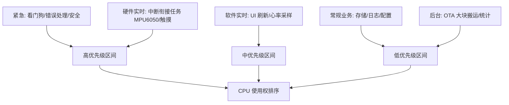
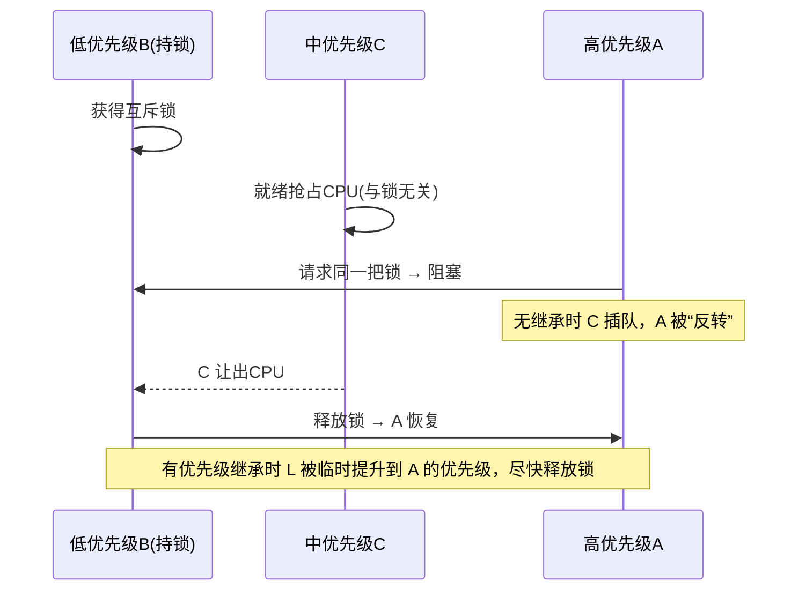

> 来源：Deep-In-Embedded / [开发板/ARM架构/STM32F411CEU6/架构师视角下关于任务的优先级分配.md](https://github.com/shuai-yemao/Deep-In-Embedded/blob/5fcab575fc20cf681f3e79e163337211097c898a/%E5%BC%80%E5%8F%91%E6%9D%BF/ARM%E6%9E%B6%E6%9E%84/STM32F411CEU6/%E6%9E%B6%E6%9E%84%E5%B8%88%E8%A7%86%E8%A7%92%E4%B8%8B%E5%85%B3%E4%BA%8E%E4%BB%BB%E5%8A%A1%E7%9A%84%E4%BC%98%E5%85%88%E7%BA%A7%E5%88%86%E9%85%8D.md)

# 📖 引言

> 这篇笔记要讲什么？用一句话概括核心主题。

作为一个架构设计师，该如何基于业务为任务分配合理的优先级，来防止优先级反转甚至死锁

---

# 📝 优先级分配的原则与分类

> 用一句话说清楚这个知识点是什么。

优先级分配遵循的核心指导思想与经典优先级分级思路：先按业务价值把任务分成若干实时等级，再在等级内分配优先级编号，并用互斥锁优先级继承来防止优先级反转。

## 实际意义

> 为什么会有该知识点？

1. 随着工程中业务的不断扩展，代码中各种类型的线程任务也随之不断增加，同时各种问题也纷至沓来（优先级反转、任务饿死、共享资源竞争、死锁），此时就需要根据业务对齐线程进行分类和优先级管理
2. 让系统功能能够在设定好的反应时间范围内正常响应，不会系统死机或者死锁导致资源无法使用

## 应用场景

> 在实际中主要被用来做什么？

1. 提高系统运行速度，即系统性能优化：把 CPU 优先分配给关键链路，减少无效等待与上下文切换
2. 多任务实时系统的统一优先级规划表：工程中每个任务上线前先查表归位（EC-S100 的“任务优先级分配”与 OS Platform 的“任务优先级整体规划和统一表”）[[EC-S100智能手表软件架构设计文档STM32F411侧 copy]] §3.3.1 / §4.2.1
3. 中断→线程的衔接：ISR 只做“快进快出”并唤醒高优先级处理任务，实质工作在线程中完成（如 MPU6050 FIFO 中断 → 任务通知 → 硬件实时层任务批量处理）[[EC-S100智能手表软件架构设计文档STM32F411侧 copy]] §3.4.4

## 核心逻辑/原理

> 它是如何工作的？拆解背后的机制。

### 机制 1：优先级 = 截止时间与周期的排序表达

FreeRTOS 中**数值越大优先级越高**，就绪态下高优先级任务抢占低优先级任务。架构师的工作是把业务的“时间约束”翻译成这个排序：

- 硬实时（错过即失败）→ 最高优先级区间
- 软实时（偶尔抖动可接受）→ 中间区间
- 非实时（后台/批量）→ 低优先级区间

### 机制 2：四大原则如何落到优先级

1. **关键路径优先**：从数据源→处理→响应的整条链路分配最低延迟预算，链路上的任务优先级最高
2. **实时性分层**：按硬实时/软实时/非实时分层，每层占一个优先级区间，层内再编号细分，避免“全部平铺”导致饿死
3. **资源依赖解耦**：共享资源用带优先级继承的互斥锁保护，持锁任务不被无关中优先级任务抢占
4. **能耗优化**：低频/非关键任务降优先级、按需采样（如 0.1Hz 温湿度），不打扰高优先级实时任务

### 机制 3：五级分类 → 优先级区间



### 机制 4：优先级反转与互斥锁优先级继承



```c
/* 示例：五级分级的优先级编号（非本工程源码，数值需按工程 FreeRTOSConfig.h 调整）
 * 工程统一经 OSAL 封装任务创建，OSAL 设计见对应学习笔记 */
#define PRIO_EMERGENCY    7   /* 紧急：看门狗/错误处理 */
#define PRIO_HW_REALTIME  6   /* 硬件实时：MPU6050/触摸衔接任务 */
#define PRIO_SW_REALTIME  5   /* 软件实时：UI 刷新/心率采样 */
#define PRIO_NORMAL       3   /* 常规业务：存储/日志/配置 */
#define PRIO_BACKGROUND   1   /* 后台：OTA 大块搬运/统计 */
/* FreeRTOSConfig.h: #define configMAX_PRIORITIES 8 */
```

## 关键公式/结论

> 最终结论和公式。

1. 其优先级分配的核心原则分别是关键路径优先，实时性分层，资源依赖解耦，能耗优化
2. 其经典优先级分级为紧急，硬件实时，软件实时，常规业务和后台任务
3. FreeRTOS 落地参数（本工程实测）：`configMAX_PRIORITIES=56`（`FreeRTOSConfig.h:69`），数值越大优先级越高，空闲任务优先级恒为 0；`configUSE_MUTEXES=1` 已开启，优先级继承只在互斥锁 `xSemaphoreCreateMutex` 上内置，信号量/二值信号量没有
4. 优先级反转的三个必要条件：低优先级任务持锁 + 中优先级任务就绪 + 高优先级任务请求同一把锁；三者齐备才会出现“假死”

## 实际操作步骤

> 以立芯嵌入式 FreeRTOS 工程（STM32F411CEU6 + FreeRTOS V10.3.1 + LVGL）为样例，从真实代码盘点任务并分配优先级。

### 第一步 任务盘点（工程实测）

| # | 任务名 | 创建处 | 优先级 (代码) | 栈 (字/字节) | 状态 |
|---|---|---|---|---|---|
| 1 | `userTask` | `User_Init.c:109` | 26 | 512/2KB | ✅ 一次性初始化 |
| 2 | `LVGLTask` | `User_Init.c:90` | 26 | 1024/4KB | ✅ UI 刷新 |
| 3 | `ExtFlashTask` | `User_Init.c:78` | 26 | 512/2KB | ✅ 存储管理 |
| 4 | `ExtFlashDrv` | `drv_adapter_port_flash.c:200` | 26 | 512/2KB | ✅ W25Q64 驱动 |
| 5 | `defaultTask` | `freertos.c:95` | 24 | 128/512B | ✅ 占位 |
| 6 | `tempHandlerTask` | `drv_adapter_port_temp_humi.c:203` | 24 | 768B | ⛔ `#if 0` 未使能 |
| 7 | `SensorTask` | `User_Init.c:71`（#if0 内） | 15 | 512/2KB | ⛔ 未使能 |

> 依据：`os_task_create_impl`（`os_impl_task.c:15`）把 OSAL 参数原样透传 `xTaskCreate`，故 26/15 即 FreeRTOS 原始优先级；`configMAX_PRIORITIES=56`（`FreeRTOSConfig.h:69`）。栈单位：`osal_task_create` 的 `stack_size` 为字，×4 得字节。

### 第二步 五级归类并分配优先级区间

按 紧急→硬件实时→软件实时→常规业务→后台任务 归类，在 `configMAX_PRIORITIES=56` 内分配（0 最低、55 最高）：

| 层级 | 区间 | 任务 | 建议优先级 |
|---|---|---|---|
| 紧急 | 47–55 | WatchdogTask（建议新增） | 50 |
| 硬件实时 | 37–46 | ExtFlashDrv | 42 |
| 软件实时 | 27–36 | tempHandlerTask / LVGLTask / ExtFlashTask | 32 / 34 / 30 |
| 常规业务 | 14–26 | userTask（一次性）、(预留)OTA/FATFS | 24 / 22 |
| 后台 | 1–13 | SensorTask | 12 |

> 关键取舍：把 **ExtFlashDrv(42) 提到 LVGLTask(34) 之上**——LVGL 的数据就绪信号量由 ExtFlashDrv 释放，驱动优先级高才能保证关键路径阻塞最短（对应 " 关键路径优先 " 原则）。

### 第三步 优先级分配表（12 列）

| 任务名称 | 优先级 (建议/当前) | 轮询周期/触发条件 | 执行时间估算 | 使用的资源 | 对外接口 | 依赖关系 | 任务状态 | 容错策略 | RAM/ROM | 可扩展性 | 功能描述 |
|---|---|---|---|---|---|---|---|---|---|---|---|
| WatchdogTask(建议新增) | 50 / — | 1s 周期喂狗 | <0.5ms/次 | IWDG、任务心跳表 | 无 | 独立；监测所有任务 | Blocked | 超时日志 + 软复位 | 栈 512B | 注册式心跳表 | 任务级看门狗 |
| tempHandlerTask | 32 / 24(未使能) | 事件触发 | AHT21 软件 I2C ~80–120ms/次 | 软件 I2C PB13/14、事件组 | `temphumi_read_temp_and_humi()` | AHT21 | Blocked | 10s 超时 | 栈 768B | OS 接口已解耦 | 温湿度采集线程 |
| ExtFlashDrv | 42 / 26 | 队列事件 | 1050B SPI 轮询读 ~5–15ms(估算) | SPI1(PB3)、W25Q64、队列 | `externflash_read/write` | 被 ExtFlashTask 依赖 | Blocked | 无超时重试 (隐患) | 栈 2KB | adapter 注册模式 | W25Q64 驱动线程 |
| LVGLTask | 34 / 26 | 5ms 周期 | 每帧 ~1–10ms；全刷 240×240×2B≈30ms(估算) | SPI2+DMA、触摸、LVGL 堆 | `Read_LvglData()`;`SetBackLight()` | →ExtFlashTask→ExtFlashDrv | Running/Blocked | 背光钳制；读数据无超时 (隐患) | 栈 4KB | GUI Guider 生成页面 | LVGL 主循环 |
| ExtFlashTask | 30 / 26 | 事件 (EVENT_LVGL) | 分发 ~0.1ms | 事件组、信号量、互斥锁、`g_au8_lvgldata` | `Read_LvglData()` | →ExtFlashDrv；为 UI 供数 | Blocked | mutex 失败 while(1)(隐患)；地址/范围校验 | 栈 2KB | 事件位预留 OTA/FATFS | 外部 Flash 存储管理 |
| userTask | 24 / 26 | 开机一次性 | 初始化 ~1–5ms | 栈、事件组/信号量 | `UserAppTask_Init()` | 初始化 Flash→建各任务→自删 | Deleted | 创建失败 log_e | 栈 2KB | 任务工厂 | 应用初始化 |
| SensorTask | 12 / 15(未使能) | 2000ms 轮询 | ~80–120ms/次 | AHT21 接口 | `temphumi_read_temp_and_humi()` | →tempHandlerTask | 未创建 | 无回退 (待补) | 栈 2KB | 采样率参数化 | 周期采样 |
| defaultTask | 删除 / 24 | osDelay(1) | <0.1ms | 栈 512B | 无 | 独立 | Blocked | 无 | 512B | 可删 | CubeMX 占位 |

### 第四步 资源与同步审计（工程实测）

- **共享资源**：`g_au8_lvgldata[1100]`（LVGLTask 读 / ExtFlashTask 经 ExtFlashDrv 写）、SPI1（仅 ExtFlashDrv）、SPI2+DMA（仅 LVGLTask）、软件 I2C（仅 tempHandlerTask）
- **同步原语**：事件组 + 二值信号量握手（`Read_LvglData`）、互斥锁（`extern_flash_mutex_handler`）
- **当前隐患**：见 " 常见问题 5/6/7/8"

### 第五步 运行验证

1. SystemView 观察调度时序，确认无饿死、无反转
2. `uxTaskGetStackHighWaterMark` 检查各任务栈余量
3. 建议新增任务级看门狗（当前工程缺失），喂狗周期 > 各任务最大阻塞时长
4. Keil 全速跑，断点观察 `Read_LvglData` 返回路径，量化 Flash 链路时延

## 常见问题

> 现象 → 场景回放（含代码证据）→ 根因 → 修复 → 验证。前 4 条为通用场景（均已落到本工程任务与优先级）；第 5–7 条为本工程实测缺陷。

### 问题 1：高优先级任务饿死低优先级任务

- **现象**：按建议分配后，若新加的 `WatchdogTask(50)` 写成忙等轮询，UI、存储、温湿度全部停摆，串口静默——但 IWDG 一直被喂，不复位，问题极其隐蔽。
- **场景回放**：
  1. 建议分配中 `WatchdogTask=50` 最高优先（见「实际操作步骤」）
  2. 若实现为 `for(;;){ HAL_IWDG_Refresh(&hiwdg); }`，循环体无任何阻塞点
  3. 抢占式调度：prio 50 任务永就绪 → 永不让出 CPU → `LVGLTask(34)/ExtFlashTask(30)/ExtFlashDrv(42)/SensorTask(12)` 全部失去运行机会
  4. 结果：屏幕停在最后一帧、温湿度不更新，但看门狗正常 → 系统 " 活着但死了 "
- **代码证据**：

```c
/* 错误示范：忙等喂狗，饿死所有低优先级任务 */
void WatchdogTask(void *arg) {
    for(;;) { HAL_IWDG_Refresh(&hiwdg); }   /* 无阻塞点 */
}
/* 正确：先延时让出 CPU，再喂狗 */
void WatchdogTask(void *arg) {
    for(;;) { osal_task_delay_ms(1000);     /* 睡眠 1s 让出 CPU */
             HAL_IWDG_Refresh(&hiwdg); }
}
```

- **根因**：FreeRTOS 优先级不是 " 相对快慢 "，而是 " 绝对排他 "——不同优先级任务之间是**抢占不是轮转**；高优先级任务只要就绪，低优先级任务连一个 tick 都分不到。
- **修复**：每个任务主循环必须至少一个阻塞点（`osal_task_delay_ms` / `xEventGroupWaitBits` / `osal_sema_take(超时)`）；喂狗任务一律 " 先延时后喂狗 "；低优先级任务（SensorTask 12）用事件/延时触发而非忙等。
- **验证**：SystemView 确认所有任务都进入过 Running；或每任务加心跳计数变量，由看门狗任务周期检查是否全部增长。

### 问题 2：优先级反转——本项目互斥锁被 timeout=0 绕过

- **现象**：高优先级 `LVGLTask` 偶发拿到旧 Flash 数据或 `Read_LvglData` 直接返回 `Ext_Flash_ERROR`；SystemView 上看不到 " 高任务阻塞等待锁 "，而是 " 立刻失败返回 "。
- **场景回放**：
  1. 某任务正持有 `extern_flash_mutex_handler` 做写/擦（W25Q64 sector erase 典型几十 ms）
  2. `LVGLTask` 调 `Read_LvglData`，第 73 行 `osal_mutex_take(extern_flash_mutex_handler, 0)`，timeout=0（`os_impl_mutex.c:79` → `xSemaphoreTake(handle, 0)`）
  3. 锁被持 → 立即返回 `OSAL_ERROR` → `ret = Ext_Flash_ERROR`（`User_ExternflashManage.c:75`）
  4. **关键**：因为高任务没有阻塞等待，互斥锁的优先级继承机制根本没有触发条件——低优先级持锁任务不会临时升优先级
  5. 若此时中优先级任务（如按建议新分配的 `ExtFlashDrv=42`）持续抢占，持锁任务临界区被拉长，高任务拿锁失败概率上升
- **代码证据**：

```c
/* User_ExternflashManage.c:72-76 —— 拿锁失败即返回，不阻塞 */
else if(OSAL_ERROR == osal_mutex_take(extern_flash_mutex_handler,0)) /* 0ms=非阻塞 */
{
    ret = Ext_Flash_ERROR;   /* 高任务"直接失败"，优先级继承无从谈起 */
}
```

对照 `os_impl_mutex.c:79`：`xSemaphoreTake(handle, OS_MS_TO_TICKS(timeout))`，timeout=0 即无阻塞。

- **根因**：互斥锁的优先级继承依赖 " 高优先级任务**阻塞**在锁上 " 这个动作；本项目以 timeout=0 调用，等于把互斥锁当 " 带锁标志的忙等轮询 " 用，反转防护形同虚设。
- **修复**：
  - 若意图是 " 忙就跳过 "：保留 timeout=0，但 UI 侧必须做数据新鲜度回退 + 有限重试，不能静默用旧数据
  - 若要真正防反转：改 `osal_mutex_take(..., OSAL_MAX_DELAY)` 让高任务阻塞并触发继承；前提是临界区（`User_ExternflashManage.c:80-88`）内**不再阻塞等待其它高优先级任务**（否则死锁）
  - 更优：缩短临界区——只保护 " 拷贝 `s_u32_TargetAddress/s_u32_Size` + 置事件位 "，把真正的 SPI 读放锁外（读本身由 `ExtFlashDrv` 单线程串行化，无需互斥锁）
- **验证**：SystemView 观察高任务是否出现 " 阻塞在 mutex"（继承生效）而非 " 立刻返回失败 "；用 trace 记录锁持有时间峰值。

### 问题 3：进入 Tickless 后高实时任务抖动（本工程未开启，移植/低功耗化时预留）

- **现象**：低功耗化（Tickless）后，周期任务（如 5ms UI 刷新）偶发多出几 ms 抖动，SystemView 显示高任务醒来晚于预期 tick。
- **场景回放**：
  1. Tickless 关闭 tick 中断进入 sleep，`configEXPECTED_IDLE_TIME_BEFORE_SLEEP` 估算空闲时长
  2. 若高实时任务就绪点落在 sleep 窗口内，唤醒依赖外部事件/RTC，精度劣化到 tick 粒度以上
  3. 本项目 `configTICK_RATE_HZ=1000`（1ms tick），`FreeRTOSConfig.h` **未定义 `configUSE_TICKLESS_IDLE`**——当前未开启，此问题属设计期预留
- **根因**：Tickless 用 " 睡眠换功耗 "，代价是 tick 计数不连续，实时任务的时基被拉伸。
- **修复**：仅在无硬实时任务就绪的窗口进入 Tickless（`preSleepProcessing` 钩子检查下一截止时间）；唤醒后先恢复 tick 计数再恢复实时任务；看门狗用独立时钟不受影响。
- **验证**：对比 Tickless 开/关下高任务响应时延直方图。

### 问题 4：看门狗任务被饿死导致整机复位

- **现象**：系统周期性复位，复位原因寄存器（`RCC->CSR`）显示 IWDG 超时；复位间隔不固定，与高负载窗口吻合。
- **场景回放**：
  1. 若喂狗任务被错误归入 " 后台 " 层（如优先级 12），而 UI 链 34/30/42 有长时间连续就绪
  2. 高优先级链持续占 CPU → 喂狗任务饿死
  3. IWDG 超时（如 2s）→ 整机复位 → 重启后短暂正常 → 高负载再触发，周期复现
- **根因**：喂狗任务优先级低于 " 常态占 CPU" 的任务，违背 " 关键路径优先 "——看门狗是最后一道保险，必须最高。
- **修复**：喂狗/错误处理任务归 " 紧急 " 层（47–55）；喂狗周期 > 各任务最大阻塞时长之和（避免 " 合法长阻塞 " 误触发）；用硬件 IWDG（独立 LSI 时钟，不受系统时钟/tick 影响）兜底。
- **验证**：读 `RCC->CSR` 复位原因确认；SystemView 确认喂狗任务周期进入 Running；故意在最高优先级任务里加长阻塞，确认不复位。

### 问题 5（本工程实测）：业务任务优先级全平铺（26）

- **现象**：UI 偶发掉帧；`Read_LvglData` 返回时延抖动明显；背光呼吸节奏（`User_Display.c:45` 的 `cycle_cnt` 200→1000、每 5ms +500）忽快忽慢。
- **场景回放**（整条 UI 取数链）：
  1. `LVGLTask(26)` 进 `display_refresh_task`，首次调 `Read_LvglData(0x00, 1050)`（`User_Display.c:50`）
  2. `Read_LvglData` 置 `EVENT_LVGL`（`User_ExternflashManage.c:83`）→ 唤醒 `ExtFlashTask(26)`（`storage_manager_task`，`User_ExternflashManage.c:99`）
  3. `ExtFlashTask` 调 `externflash_read` → 队列投递 `FLASH_HANDLER_EVENT_READ` → `ExtFlashDrv(26)`（`flash_handler_thread`）处理
  4. `ExtFlashDrv` 逐字节 SPI 轮询读（`spi_write_byte/spi_read_byte`，`drv_adapter_port_flash.c:126-138`，每字节 `HAL_SPI_Transmit/Receive` 阻塞到完成）
  5. 读完 `read_finish_callback` → `osal_sema_give`（`drv_adapter_port_flash.c:140-144`）→ `Read_LvglData` 第 87 行返回
  6. **链路 3 个任务全部优先级 26** → 任一时刻多个任务就绪即时间片轮转（`configUSE_TIME_SLICING` 默认=1，每片 1ms）
- **代码证据**：

```c
/* User_Init.c:78 / :90 / :109 —— 应用任务全 26 */
osal_task_create("ExtFlashTask", storage_manager_task, 512, 26, userStorgeHandle, NULL);
osal_task_create("LVGLTask", display_refresh_task, 1024, 26, LVGLTaskHandle, NULL);
osal_task_create("userTask", userTaskInitFunction, 512, 26, userTaskInitHandle, NULL);
/* drv_adapter_port_flash.c:200 —— 驱动任务也是 26 */
osal_task_create("ExtFlashDrv", flash_handler_thread, 512, 26, flash_handler_task, ...);
```

- **根因**：关键路径（UI 取数）与下游驱动同优先级，靠时间片轮转分配 CPU，无法保证 " 最短关键路径 "，违背 " 关键路径优先 + 实时性分层 "。
- **修复**：按「实际操作步骤」分配表改——`ExtFlashDrv→42`、`LVGLTask→34`、`ExtFlashTask→30`、`userTask→24`。驱动先于 UI 完成取数，UI 阻塞在信号量时驱动立刻响应。
- **验证**：改后 SystemView 观察 `Read_LvglData` 时延峰谷差缩小；`uxTaskGetStackHighWaterMark` 复查各任务栈。

### 问题 6（本工程实测）：互斥锁创建失败死循环

- **现象**：开机后 UI 无内容；`storage_manager_task` 停在 `User_ExternflashManage.c:109` 的 `while(1)`；FreeRTOS 列表显示该任务长期 Running；串口无有效错误日志。
- **场景回放**：
  1. `userTask(26)` 初始化先建 `ExtFlashTask`（`User_Init.c:78`）
  2. `ExtFlashTask` 进 `storage_manager_task`（`User_ExternflashManage.c:99`），第 105 行 `osal_mutex_create(&extern_flash_mutex_handler)`
  3. `os_mutex_create_impl`（`os_impl_mutex.c:6-21`）调 `xSemaphoreCreateMutex()` 返回 NULL → `OSAL_ERROR`——典型原因：**heap 耗尽**。本项目 `configTOTAL_HEAP_SIZE=15360`（仅 15KB，`FreeRTOSConfig.h:71`），任务栈已吃掉 ~11KB（userTask 2K + LVGLTask 4K + ExtFlashTask 2K + ExtFlashDrv 2K + defaultTask 512B + tempHandler 768B），LVGL 再申请缓冲即见底
  4. 第 109 行 `while(1){;}` 死等——不重试、不上报、不自删
  5. 互斥锁未建成 → `Read_LvglData` 第 73 行对空句柄 `osal_mutex_take` 失败 → UI 永远读不到数据
- **代码证据**：

```c
/* User_ExternflashManage.c:104-113 */
ret = osal_mutex_create(&extern_flash_mutex_handler);
if(OSAL_ERROR == ret)
{
    while(1)   /* 死循环：把可恢复错误变成永久故障 */
    {
        ;
    }
}
```

- **根因**：把资源创建失败当作 " 不可能发生 "，用 `while(1)` 代替错误处理；叠加 heap 只有 15KB，创建顺序不当极易触发。
- **修复**：
  - 失败时降级：打印日志 + `vTaskDelay` 重试 N 次，仍失败则置 "Flash 不可用 " 标志，让 UI 走无 Flash 回退
  - 排查 heap：`xPortGetFreeHeapSize()` 打印启动后各阶段 heap 余量，确认是否被 LVGL/任务栈吃光
  - 结构性：把互斥锁创建提前到系统初始化（heap 最富余时），任务内只做失败校验
- **验证**：串口打印 heap 余量曲线；人为调小 `configTOTAL_HEAP_SIZE` 复现，确认改为重试/回退而非死循环。

### 问题 7（本工程实测）：UI 读 Flash 无超时挂死

- **现象**：SPI 读卡住（W25Q64 BUSY / CS 电平异常 / SPI 时钟不稳）时，整机 UI 冻结——`lv_task_handler` 不再执行，背光停在固定亮度，触摸无响应；SystemView 显示 `LVGLTask` 永久 Blocked。
- **场景回放**：
  1. `Read_LvglData` 第 83 行置 `EVENT_LVGL`，第 85 行 `osal_sema_give` 一次，第 86-87 行 `osal_sema_take` 两次
  2. 第 87 行第二次 take 依赖 `ExtFlashDrv` 的 `read_finish_callback`（`drv_adapter_port_flash.c:140-144`）give
  3. 若 SPI 读异常永不回调 → 第 87 行 `osal_sema_take(..., OSAL_MAX_DELAY)` 无限期阻塞（`OSAL_MAX_DELAY=0xFFFFFFFF`，`common_types.h:12`，等价 `portMAX_DELAY`）
  4. `LVGLTask` 是 UI 唯一驱动泵（`User_Display.c:58-71` 循环调 `lv_task_handler`）→ 它一卡，UI 全停
- **代码证据**：

```c
/* User_ExternflashManage.c:83-87 */
xEventGroupSetBits(userExtFlashEveGropHandle, EVENT_LVGL);
osal_sema_give(userExtFlashSemaHandle);
osal_sema_take(userExtFlashSemaHandle,OSAL_MAX_DELAY);  /* 第1次：消费刚 give 的 */
osal_sema_take(userExtFlashSemaHandle,OSAL_MAX_DELAY);  /* 第2次：等驱动回调——永不超时 */
```

- **根因**：对外设 IO 的完成等待用了 " 无限期 " 阻塞，无超时/重试/失败分支；一个外设错误即可拖死整个 UI 任务。
- **修复**：
  - 第 87 行改有限超时：`osal_sema_take(..., 500)`，超时返回 `Ext_Flash_ERROR_TIMEOUT`
  - UI 侧数据新鲜度管理：缓存旧帧 + 时间戳，超时继续用旧帧刷新而非卡死
  - 驱动侧：SPI 命令加 CS 复位/重试（拉高再拉低 CS 复位 W25Q64），避免 BUSY 卡死
- **验证**：人为拔掉/短接 Flash 的 CS 或 MISO，确认 `Read_LvglData` 在 ~500ms 内返回错误、UI 继续刷新（显示旧数据）。

### 问题 8（本工程实测）：互斥锁泄漏——取锁后从不释放且持锁阻塞

- **现象**：`Read_LvglData` 第二次调用必然返回 `Ext_Flash_ERROR`；SystemView 显示 `extern_flash_mutex_handler` 被 LVGLTask 永久持有；未来若有 " 写 Flash" 任务想用同一把锁会一直拿不到。
- **场景回放**：
  1. `Read_LvglData` 第 73 行 `osal_mutex_take(extern_flash_mutex_handler,0)` 成功取锁
  2. 第 80-88 行拷贝地址/长度、置事件位，然后**持锁**阻塞在 `osal_sema_take(...,OSAL_MAX_DELAY)` 等驱动回调
  3. 全函数（58-90 行）**没有任何 `osal_mutex_give`** → 锁在第一次成功后永久被占
  4. 代码注释 " 如果有其他任务正在存储数据,则返回 " 表明设计意图是 " 写任务先占锁、读任务让位 "——但当前写路径（EVENT_OTA/FLASHDB/FATFS）全是 TODO，锁实际从未被释放
- **代码证据**：

```c
/* User_ExternflashManage.c:73-88 —— 取锁后无 give */
else if(OSAL_ERROR == osal_mutex_take(extern_flash_mutex_handler,0)) { ... }
else {
    s_u32_TargetAddress = read_addr;
    s_u32_Size = size;
    xEventGroupSetBits(userExtFlashEveGropHandle, EVENT_LVGL);
    osal_sema_give(userExtFlashSemaHandle);
    osal_sema_take(userExtFlashSemaHandle,OSAL_MAX_DELAY);  /* 持锁阻塞！ */
    osal_sema_take(userExtFlashSemaHandle,OSAL_MAX_DELAY);  /* 持锁阻塞！ */
}   /* 函数返回，锁从未释放 */
```

- **根因**：互斥锁 " 谁取锁谁释放 " 约定被违反——取锁后在等信号量期间不释放，且返回路径上完全遗漏 `osal_mutex_give`。
- **修复**：① 取锁后只保护 " 拷贝地址/长度 + 置事件位 " 这几个共享变量，随即 `osal_mutex_give`，再进入信号量等待（锁外等待）；② 若必须持锁跨整个读流程，则在两个 `osal_sema_take` 返回后、函数返回前补 `osal_mutex_give`；③ 未来写任务接入时用同一把锁，须遵守 " 临界区最短 + 锁外阻塞 "。
- **验证**：连续两次调用 `Read_LvglData`，第二次应仍返回成功（不因持锁失败）；SystemView 确认锁的 hold time 为微秒级而非永久。

---

# 💬 Q&A

> 自问自答，检验理解深度。按难度递进排列。以下为经 tutor 逐题确认后的理解。

## 🟢 基础

> 最基本的概念和用法，入门必知。

### Q 1：FreeRTOS 优先级数值大小与紧急程度的关系？空闲任务优先级？configMAX_PRIORITIES 限定什么？

A 1：数值越大优先级越高、越紧急；空闲任务优先级恒为 0；`configMAX_PRIORITIES` 限定可用优先级等级数。超界行为：未开 `configASSERT` 时静默钳制到 `configMAX_PRIORITIES-1`（创建成功但降级运行），开启则断言失败。证据：`FreeRTOSConfig.h:69`。

### Q 2：按五级分类，本工程 7 个任务各归哪一层？为什么 ExtFlashTask 与 ExtFlashDrv 分层不同？

A 2：WatchdogTask→紧急；ExtFlashDrv→硬件实时；tempHandlerTask→软件实时（AHT21 慢速、软 I2C 阻塞 80-120ms，非硬实时）；LVGLTask/ExtFlashTask→软件实时；userTask→常规业务；SensorTask→后台；defaultTask 可删。分层理由：ExtFlashTask 为 UI 供数在关键路径上属软件实时，ExtFlashDrv 是 SPI 驱动属硬件实时（关键路径优先）。空闲任务（内核自建、优先级 0）≠ defaultTask（CubeMX 占位）。

## 🟡 进阶

> 容易踩的坑和常见误区。

### Q 3：互斥锁与二值信号量的关键区别？差异在什么阶段显现？

A 3：互斥锁内置优先级继承——持锁任务临时提升到 " 当前等待该锁的最高优先级任务 " 的优先级，释放后恢复；二值信号量无继承、无所有权（任何任务可 give、不可递归持有），但也能做互斥。继承只在高优先级任务**阻塞等待**锁时触发；本工程 `Read_LvglData` 用 timeout=0 从不阻塞 → 继承从未生效（问题 2）。证据：`os_impl_mutex.c:79`、`User_ExternflashManage.c:73`。

## 🔴 困难

> 结合实战的深层原理和设计权衡。

### Q 4：如何设计支持动态添加任务的优先级系统？

A 4：① 查表归位——动态任务按类别查 " 任务优先级统一规划表 " 得优先级（对齐 EC-S100 §4.2.1），不硬编码；② 防破坏关键路径：优先级区间约束（新任务不高于关键路径）+ CPU 占用率校验 + 阻塞式设计；互斥锁只护共享数据、不护 CPU 使用权；③ 配套检查：系统功能影响、资源依赖、实时性可调度性。证据：`User_ExternflashManage.c:102` 预留事件位。

### Q 5：多个相同优先级硬实时任务的架构策略？

A 5：时间片轮转是硬实时之敌——同优先级任务每个 tick 被迫切换，连续执行窗口被掐断，无法保证截止时间；`vTaskDelayUntil` 只保证周期不漂移、不解决同优先级碰撞。化解：① 错相调度（相位偏移错开执行窗口）；② 合并任务串行执行（单执行流无冲突）；③ 截止时间不同则细分优先级（如按数据新鲜度降低温湿度采集优先级——它本就是软实时）。

### Q 6：描述处理的优先级反转案例及解决方案

A 6：通用机制——L 持锁、M 抢占、H 等锁，无继承时 H 被拖死。本工程实际：互斥锁由 `storage_manager_task` 创建、`Read_LvglData` 取锁，但全函数无 `osal_mutex_give`——取锁后从不释放且持锁阻塞在信号量 → 第一次成功后永久被占（自我锁死，非典型反转，因 H 从不阻塞等待）。解决方案：① 互斥锁优先级继承（须让高任务阻塞等待）；② 缩短临界区只护共享变量；③ 有限超时 + 数据新鲜度回退。证据：`User_ExternflashManage.c:73-88`。

### Q 7：如何评估现有优先级配置是否最优？给出量化方法

A 7：工具：SystemView / `vTaskGetRunTimeStats` / GPIO 翻转。指标：① CPU 占用率 C/T（LVGLTask 5ms 周期、1ms 执行 = 20%），系统总占用 = 1−空闲占比；② 最坏响应时间 WCRT = 自己执行 + 高优先级抢占 + 等锁阻塞，判定 WCRT ≤ 截止时间 D（触发后最晚完成点，如 Watchdog D≈2s、LVGL D≈5ms）；③ 栈水位 `uxTaskGetStackHighWaterMark` ≥ 安全裕量。判定标准：总利用率 < RMS 上限 n(2^(1/n)−1)（n=5 ≈ 74.3%）；超限则无法保证所有任务 WCRT ≤ D，低优先级任务（SensorTask）先被饿死。

---

# 📋 总结

> 3-5 句话回顾核心要点，用自己的话复述。

任务优先级分配的本质，是把业务的“时间约束”（截止时间、周期、是否硬实时）翻译成 CPU 使用权排序——FreeRTOS 中数值越大优先级越高。核心遵循四大原则：关键路径优先、实时性分层、资源依赖解耦、能耗优化，并据此把任务归入 紧急→硬件实时→软件实时→常规业务→后台任务 五个等级。共享资源必须用带优先级继承的互斥锁保护，否则低优先级持锁 + 中优先级抢占会触发优先级反转，最坏导致高优先级任务“假死”、看门狗复位。落地靠“盘点→归类→审计→验证→回归”五步：先建任务登记表，再分配优先级区间，最后用 SystemView、栈水位和任务看门狗确认无饿死、无反转。优先级分配不是一次性配置，而是随业务扩展持续维护的架构职责——换芯片或换 RTOS 时原则不变，只换配置参数。

---

# 📎 参考资料

> 学习过程中用到的外部资源汇总。

## 🎥 视频链接

> B 站 / YouTube 教程，优先选项目实战类和原理动画类。

- [FreeRTOS入门与工程实践——由浅入深（百问网/韦东山）](https://www.bilibili.com/video/BV1Jw411i7Fz) — 20h 实战课；[5-4] 优先级与阻塞、[9-2-2] 信号量实验 - 优先级反转、[9-3] 互斥量 " 领导临时提拔你 " 解决反转
- [【FreeRTOS】优先级反转（Priority Inversion）](https://www.bilibili.com/video/BV1FkWdzvEw6) — 11 集入门，优先级反转专讲（12:35），含死锁与饥饿
- [【FreeRTOS】互斥锁（Mutex）](https://www.bilibili.com/video/BV1Lvxjz9ERJ) — 互斥锁内置优先级继承机制演示
- [DigiKey《实时操作系统入门》RTOS 入门](https://www.bilibili.com/video/BV17p9dBWEks) — Shawn Hymel 12 讲，调度/优先级反转/临界区（ESP32 实操）
- [正点原子 FreeRTOS 优先级翻转简介及实验（网易公开课）](http://open.163.com/newview/movie/free?pid=YEV1BPMIO&mid=HEV1BQ9NE) — 优先级翻转现象 + 实验对照

## 🔗 博客/文档链接

> 分析最透彻的博客、官方文档、社区帖子。

- [FreeRTOS 官方文档 — Tasks（任务优先级语义）](http://www.openrtos.org/RTOS-task-priority.html) — 数值越大优先级越高、`configMAX_PRIORITIES` 范围与 RAM 代价、就绪表抢占
- [FreeRTOS 官方文档 — Mutexes（优先级继承）](http://www.openrtos.net/Real-time-embedded-RTOS-mutexes.html) — 互斥锁 vs 信号量、优先级继承机制权威说明
- [ST 官方 — STM32Cube FreeRTOS 中间件 Getting Started](https://dev.st.com/stm32cube-docs/mw-freertos/2.0.0/en/docs/markup/getting_started.html) — STM32 上 FreeRTOS 中间件集成与 `FreeRTOSConfig.h` 配置（对应本工程 F411）
- [CSDN — FreeRTOS 优先级反转与优先级继承](https://blog.csdn.net/Outside_/article/details/132166318) — 反转三要素、继承局限、优先级天花板方案
- [韦东山 FreeRTOS 系列教程之互斥量](https://zhuanlan.zhihu.com/p/439099360) — 互斥量本质、谁上锁谁释放约定、ISR 禁用约束

## 💻 仓库链接

> GitHub / Gitee 源码仓库，含 Demo 工程和工具链。

- [FreeRTOS/FreeRTOS-Kernel](https://github.com/FreeRTOS/FreeRTOS-Kernel) — FreeRTOS 内核源码，优先级就绪表与抢占式调度的直接实现（`task.c` / `portable/`）
- [FreeRTOS/FreeRTOS-Kernel-Book](https://github.com/FreeRTOS/FreeRTOS-Kernel-Book) — 官方《Mastering the FreeRTOS Real Time Kernel》Markdown 源，优先级继承/调度的权威教材
- [STMicroelectronics/STM32CubeF4](https://github.com/STMicroelectronics/STM32CubeF4) — STM32F4 官方固件包，含 FreeRTOS 中间件集成与例程，对照 `FreeRTOSConfig.h` 配置优先级参数
- [iclite/Mastering-the-FreeRTOS-Real-Time-Kernel-CN](https://github.com/iclite/Mastering-the-FreeRTOS-Real-Time-Kernel-CN) — 上述官方书的中文翻译，优先级继承与调度章节中文阅读版
- [XcentricCoder/FreeRTOS-Kernel-Profiler](https://github.com/XcentricCoder/FreeRTOS-Kernel-Profiler) — 针对 STM32F411 的 FreeRTOS 运行时分析器（DWT 周期计数），实测每任务执行周期/CPU 占用/切换频率，验证优先级分配是否合理

## 📄 代码/附件

> 本地 PDF、代码包、工具链文件。

- [[FreeRTOS内核实现与应用开发实战指南.pdf]] — 野火 FreeRTOS 内核实现详解（优先级就绪表/调度器）
- [[FreeRTOS入门手册_中文.pdf]] — FreeRTOS 中文入门手册
- [[FreeRTOS开发指南_V1.10.pdf]] — FreeRTOS 中文开发指南 V1.10
- [[02_嵌入式项目集成：OS层与OSAL设计]] — 本工程 OSAL 封装（`os_task_create` 透传优先级依据）
- [[互斥锁与二值信号量及其邮箱]] — 优先级继承 vs 二值信号量对比
- [[修改和获取任务优先级]] — `vTaskPriorityGet/Set` 速查
- [[Systemview的移植和使用]] — 运行验证工具（笔记第五步引用）
- [[STM32FreeRTOSbug大全]] — FreeRTOS 常见 bug 集
