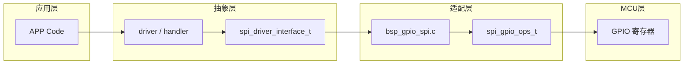
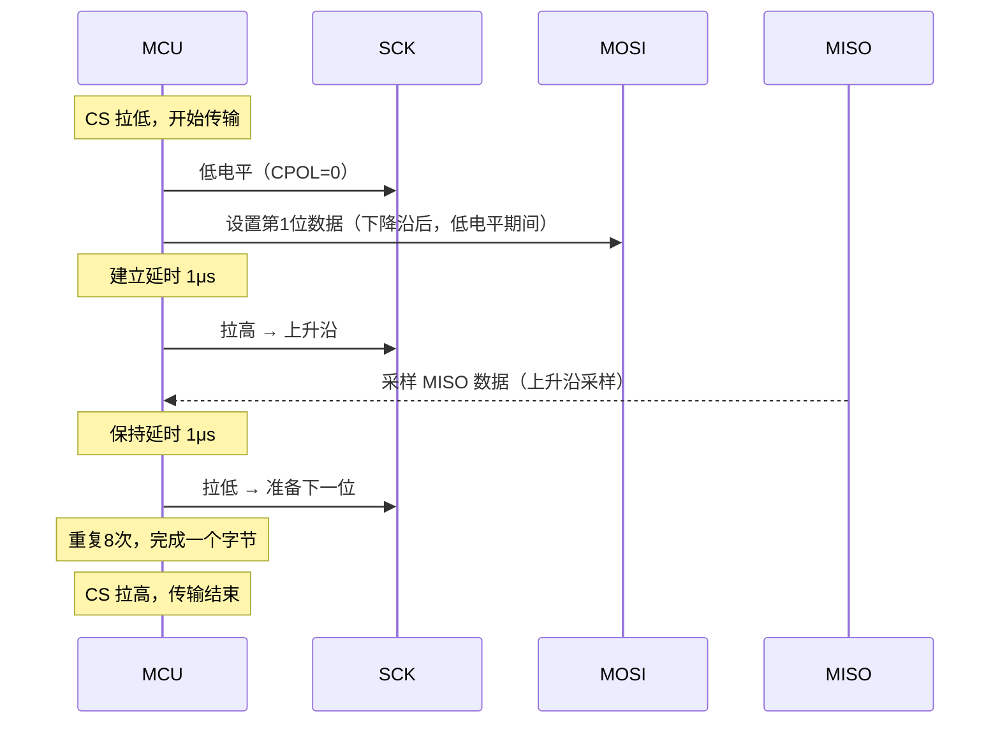

> 来源：Deep-In-Embedded / [开发板/ARM架构/STM32F411CEU6/模拟SPI的设计思路.md](https://github.com/shuai-yemao/Deep-In-Embedded/blob/5fcab575fc20cf681f3e79e163337211097c898a/%E5%BC%80%E5%8F%91%E6%9D%BF/ARM%E6%9E%B6%E6%9E%84/STM32F411CEU6/%E6%A8%A1%E6%8B%9FSPI%E7%9A%84%E8%AE%BE%E8%AE%A1%E6%80%9D%E8%B7%AF.md)

# 📖 引言

> 模拟 SPI（GPIO Bit-Bang）通过 GPIO 引脚直接翻转电平来模拟 SPI 总线时序，是一种不依赖硬件 SPI 外设、纯软件实现的 SPI 通信方案，适用于低速测试、资源紧张或引脚被占用的场景。

---

# 📝 模拟 SPI 的设计思路

> 用 GPIO 模拟 SPI Mode 0 时序（CPOL=0, CPHA=0），通过函数指针注入实现与芯片平台解耦，在不依赖硬件 SPI 外设的情况下完成 SPI 全双工通信。

## 实际意义

在无硬件 SPI、硬件 SPI 引脚被占用或只需低速率通信的场景下，用 GPIO 模拟 SPI 时序替代硬件 SPI，避免为此更换 MCU 或重新设计 PCB。

## 应用场景

1. **快速验证/测试**：在新板子上调试 Flash/传感器，先用 GPIO 模拟 SPI 验证功能，再切到硬件 SPI
2. **硬件资源紧张**：硬件 SPI 已被其他外设占用，但需要额外 SPI 设备
3. **低成本方案**：低端 MCU 可能没有 SPI 外设，或 SPI 通道数不够用

## 核心逻辑/原理

### 1. 四层解耦架构



- **MCU 层**：STM32 GPIO 寄存器操作（写 ODR、读 IDR）
- **适配层**（`bsp_gpio_spi.c`）：实现 SPI Mode 0 位级收发，通过 `spi_gpio_ops_t` 结构体暴露函数指针
- **抽象层**（`spi_driver_interface_t`）：driver 只依赖这个接口，不关心底层是模拟 SPI 还是硬件 SPI
- **应用层**：APP 通过 driver 接口访问 SPI

### 2. SPI Mode 0 时序



**Mode 0 关键特征：**

- CPOL=0：SCK 空闲为低电平
- CPHA=0：SCK 上升沿采样 MISO，下降沿后设置 MOSI
- 每个 bit 建立延时 1μs + 保持延时 1μs → 约 500kHz SPI 时钟

### 3. 全双工与缓冲区共享

```c
// SPI 环形移位寄存器架构：一次时钟脉冲同时完成发送和接收
static uint8_t SPI_ReadWriteByte(uint8_t data)
{
    for (uint8_t i = 0; i < 8; i++) {
        if (data & 0x80) MOSI_HIGH(); else MOSI_LOW();  // 设置 MOSI
        delay_1us();
        SCK_HIGH();                         // 上升沿 → 采样 MISO
        delay_1us();
        data <<= 1;
        if (MISO_READ()) data |= 1;         // 读 MISO 存入 data
        SCK_LOW();                          // 下降沿 → 准备下一位
    }
    return data;  // 返回收到的数据
}
```

- `SPI_ReadWriteByte()`：一次调用同时发送和接收一个字节——传入的 data 被逐位移出到 MOSI，同时 MISO 数据逐位移入 data
- `SPI_ReadByte(buf)`：将 buf 原值作为 dummy 数据发出，接收结果覆盖 buf
- `SPI_WriteByte(buf)`：发送 buf 内容，丢弃接收的数据

### 4. 超时保护

| 等待对象 | 模拟 SPI | 模拟 IIC |
|---------|---------|---------|
| 单次电平变化（ACK） | — | 固定计数 5 次 ≈5μs |
| 不确定字节数传输 | `pf_get_tick_ms` 毫秒超时 | — |

IIC ACK 等待的是单次从机拉低 SDA 的电平变化，用固定计数即可；SPI 多字节传输的字节数不确定，需要真实时钟作为超时基准。

### 5. 片选管理

CS 引脚由调用方通过 `spi_driver_interface_t` 注入 `pf_cs_enable/pf_cs_disable`，独立于 SPI 数据收发。这使得同一个 SPI 总线可以挂载多个设备，通过片选切换访问不同设备。

### 6. 设计约束

- **`SPI_ReadWriteByte` 是阻塞函数**，每字节耗时约 16μs（8 位 × 2μs/位）。不能在 ISR 或临界区中调用，会阻塞中断响应
- **`delay_us(1)` 依赖 CPU 循环**，需确保 MCU 主频不剧烈变化（如动态调频时需调整延时值）
- **延时值可调但不是越小越好**：1μs 约 500kHz，适合 W25Qxx；更低延时会增大时序容错风险，建议保留余量

CS 引脚由调用方通过 `spi_driver_interface_t` 注入 `pf_cs_enable/pf_cs_disable`，独立于 SPI 数据收发。这使得同一个 SPI 总线可以挂载多个设备，通过片选切换访问不同设备。

## 关键公式/结论

| 参数 | 默认值 | 说明 |
|------|--------|------|
| SPI Mode | Mode 0（CPOL=0, CPHA=0） | SCK 空闲低，上升沿采样 |
| 位顺序 | MSB first | 高位在前 |
| 建立/保持延时 | 各 1μs | 约 500kHz，可调 |
| 传输方向 | 全双工 | MOSI 发、MISO 收同时进行 |

## 实际操作步骤

### 1. 编写模拟 SPI 结构体

```c
// spi_gpio_ops_t：将 GPIO 操作抽象为函数指针
typedef struct {
    void (*pf_gpio_init)(void);
    void (*pf_gpio_write_pin)(uint8_t port, uint16_t pin, uint8_t level);
    uint8_t (*pf_gpio_read_pin)(uint8_t port, uint16_t pin);
    void (*pf_delay_us)(uint32_t us);
    uint32_t (*pf_get_tick_ms)(void);
} spi_gpio_ops_t;
```

### 2. 实现 SPI 位级收发

```c
SPI_Init()           → 初始化 CS/SCK/MOSI/MISO 引脚
SPI_ReadWriteByte()  → 8位全双工收发（核心函数）
SPI_WriteByte()      → 发送 + 超时保护
SPI_ReadByte()       → 接收 + 超时保护
```

### 3. 创建适配层实例

在 `bsp_gpio_spi.h` 中定义 `spi_gpio_ops_t` 结构体，在 `bsp_gpio_spi.c` 中创建实例：

```c
spi_gpio_ops_t g_spi_ops = {
    .pf_gpio_init      = MX_GPIO_Init,
    .pf_gpio_write_pin = HAL_GPIO_WritePin,
    .pf_gpio_read_pin  = HAL_GPIO_ReadPin,
    .pf_delay_us       = delay_us,
    .pf_get_tick_ms    = get_tick_ms,
};
```

运行时注入到 `spi_bus_t` 结构体中，实现多态。

## 常见问题

### 问题 1：SPI 通信数据全为 0xFF

**现象**：读 W25Qxx ID 返回 0xFFFF，读数据全为 0xFF。

**根因**：SPI Mode 不匹配——W25Qxx 默认 Mode 0/3，如果模拟时序用了 Mode 1/2，SCK 极性和采样沿对不上。

**修复**：确认 CPOL=0（SCK 空闲低）、CPHA=0（上升沿采样）。调试时用逻辑分析仪看 SCK 空闲电平和数据采样时刻。

### 问题 2：模拟 SPI 通信偶尔出错

**现象**：大部分时间通信正常，偶尔读回的数据错位。

**根因**：建立/保持延时不足。SCK 频率太高，从机来不及在上升沿前准备好 MISO 数据。

**修复**：增大延时值，从 1μs 试到 5μs。优先增加建立延时（SCK 上升沿前 MOSI 数据需提前稳定）。

---

# 💬 Q&A

## 🟢 基础

### Q1: 模拟 SPI 和模拟 IIC 都是 GPIO Bit-Bang，它们的 GPIO 引脚配置方式有什么关键区别？

**A1:** IIC 是开漏总线，SDA 需要切换输入/输出模式（发送时推挽输出，读 ACK 时浮空输入）；SPI 是推挽总线，MOSI/SCK/CS 固定推挽输出，MISO 固定浮空输入，不需要模式切换。这是因为 IIC 是多主机总线需要线与，而 SPI 是单主机总线，输出引脚始终由主机驱动。

## 🟡 进阶

### Q2: 模拟 SPI 的 `pf_get_tick_ms` 在代码中实际用于什么地方？和 IIC 的固定计数超时（ACK_TIMEOUT=5）在设计上有什么本质差异？

**A2:** `pf_get_tick_ms` 用于 `SPI_WriteByte/ReadByte` 中的**毫秒级超时保护**（等待 MISO 电平变化或检查从机状态），而 IIC ACK 超时用固定 5 次循环≈5μs。差异的本质在于**等待对象的不同**：IIC ACK 等待的是单次从机电平变化（时间固定且很短），SPI 多字节传输等的是不确定字节数的完成，需要用真实时钟做超时基准。

### Q3: 为什么模拟 SPI 通常默认 Mode 0 和 MSB first？如果发数据时用了 LSB first，会看到什么现象？

**A3:** 大部分 SPI 设备（W25Qxx、MPU6050 等）默认 MSB first。如果设置成 LSB first，数据会逐位反转——例如发 0xC0 会变成 0x03，读出的 ID 从 0xEF13 变成 0xCF87。现象是通信 " 能通但数据错乱 "，容易被误判为时序问题。

## 🔴 困难

### Q4: 什么时候应该选模拟 SPI 而不是硬件 SPI？模拟 SPI 和硬件 SPI 在引脚分配使用上各有什么优缺点？

**A4:**

- **选模拟 SPI 的场景**：① 低速通信（<1MHz），如 W25Qxx 配置读取、传感器初始化；② 快速测试验证功能；③ 硬件 SPI 引脚被占用或 SPI 通道不足；④ 低端 MCU 无硬件 SPI。
- **硬件 SPI 的优势**：① 通信速率高（可达 40MHz+）；② 不占 CPU（DMA 配合）；③ 硬件自动处理时序，代码简洁。
- **模拟 SPI 的代价**：① 占用 CPU 循环延时；② 无法高速通信；③ 代码略复杂（需自己管时序）。
- **移植注意**：更换 MCU 只需修改适配层（`spi_gpio_ops_t`）绑定的 GPIO 函数，`bsp_gpio_spi.c` 中的 SPI 位级时序代码和数据收发不改。

---

# 📋 总结

> 模拟 SPI 是一种用 GPIO 软件翻转电平模拟 SPI Mode 0 时序的通信方式，核心价值在于与芯片平台解耦（通过函数指针注入），让驱动层不关心底层是硬件 SPI 还是模拟 SPI。它参考了模拟 IIC 的分层设计（GPIO 适配 → 位级时序 → 接口抽象 → 驱动层），通过建立/保持各 1μs 的延时实现约 500kHz 的 SPI 通信，适用于低速测试、资源紧张或引脚不足的场景。设计上的关键取舍包括：用 `pf_get_tick_ms` 毫秒超时而非固定计数（因 SPI 字节数不确定）、CS 独立管理以支持多设备挂接、以及全双工缓冲区共享（一次时钟脉冲同时完成收发）。

# 📎 参考资料

## 🎥 视频链接

- 暂无

## 🔗 博客/文档链接

- [STM32 W25Q(16/32/64/128) 芯片学习汇总](https://shequ.stmicroelectronics.cn/thread-634719-1-1.html) — ST 社区经验分享
- SPI 时序详解 — 逻辑分析仪抓取 Mode 0/1/2/3 对比图

## 💻 仓库链接

- 暂无

## 📄 代码/附件

- `Bsp\W25Qxx\spi\Inc\bsp_gpio_spi.h` — 模拟 SPI 头文件（结构体定义 + 公开 API 声明）
- `Bsp\W25Qxx\spi\Src\bsp_gpio_spi.c` — 模拟 SPI Mode 0 位级时序实现
- [[AHT21的driver文件架构设计思路]] — 参考：模拟 IIC 设计（对比 IIC vs SPI 的接口数量、超时机制差异）
- [[W25Qxx的driver文件架构设计思路]] — 以此 SPI 接口为基础的 Flash Driver 层
