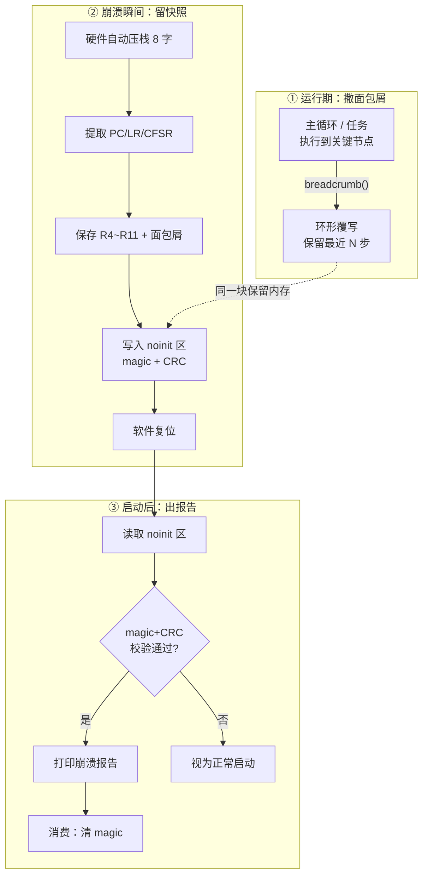

> 来源：Deep-In-Embedded / [开发板/ARM架构/STM32F411CEU6/面包屑（Breadcrumb）崩溃前状态记录与启动报告.md](https://github.com/shuai-yemao/Deep-In-Embedded/blob/5fcab575fc20cf681f3e79e163337211097c898a/%E5%BC%80%E5%8F%91%E6%9D%BF/ARM%E6%9E%B6%E6%9E%84/STM32F411CEU6/%E9%9D%A2%E5%8C%85%E5%B1%91%EF%BC%88Breadcrumb%EF%BC%89%E5%B4%A9%E6%BA%83%E5%89%8D%E7%8A%B6%E6%80%81%E8%AE%B0%E5%BD%95%E4%B8%8E%E5%90%AF%E5%8A%A8%E6%8A%A5%E5%91%8A.md)

# 📖 引言

> **面包屑（Breadcrumb）崩溃前状态记录与启动报告**：程序运行期间周期性地把 " 我在哪、我在做什么 "（代码位置 ID、状态机状态、关键变量）写入一块复位后仍保留的内存区域，崩溃时再叠加一份异常现场快照；系统复位重启后，在启动早期读取并校验这些痕迹，打印上一轮崩溃的报告——像童话里 Hansel 沿路撒面包屑留痕一样，让 " 崩过一次就再也抓不到 " 的偶发故障变得可事后复盘。

---

# 📝 面包屑崩溃记录：从 " 崩溃后黑匣子 " 到 " 崩溃前足迹 "

> 崩溃诊断的两个层次：**CmBacktrace 管 " 崩溃的瞬间 "**（拍现场照），**面包屑管 " 崩溃之前 "**（沿途留脚印）。两者互补，共同构成无调试器场景下的完整故障复盘链路。

## 实际意义

> 为什么需要 " 崩溃前 " 的记录？因为崩完之后的现场往往说明不了 " 怎么走到这一步的 "。

- **量产设备接不了调试器**：JTAG/SWD 引脚被固件占用或外壳封闭，崩溃只能靠串口日志，但日志是易失的
- **偶发故障难复现**：一个问题跑一两个月才出现一次，仿真器一断开就复现不了——必须让设备自己 " 记下来 "
- **崩溃瞬间现场转瞬即逝**：HardFault 一旦触发，栈、外设状态、寄存器立即被破坏或随复位清零，事后读不到
- **区分两类信息**：
  - 崩溃**时**的状态（PC/LR/栈帧）→ 告诉你**崩在哪**
  - 崩溃**前**的轨迹（面包屑）→ 告诉你**为什么走到这一步**
- **启动报告的价值**：复位后第一时间把上次崩溃信息吐出来，之后再被覆盖也不怕——" 先报告、后消费 "

## 应用场景

> 一句话判断：**设备会无人值守地跑、会偶发地崩、崩了之后还要能自证清白**的场景。

| 场景 | 面包屑能做什么 |
|------|--------------|
| 量产设备现场偶发 HardFault | 复位后串口/RTT 自动打印 " 上次崩溃于 PC=0x0800xxxx，执行到状态机 S3" |
| 看门狗反复复位但原因不明 | 记录复位原因 + 复位前最后一个面包屑，区分是 " 任务卡死 " 还是 " 逻辑走飞 " |
| OTA 升级后启动即死 | 启动报告确认 " 新固件崩溃 " 还是 " 跳转异常 "，避免误判回滚策略 |
| 低功耗设备被意外唤醒后崩溃 | 记录唤醒源 + 唤醒后执行到的代码段，快速定位电源状态机缺陷 |
| 现场无串口线（如通过蓝牙/远程上报） | 把崩溃记录通过无线链路回传，参考 ESPHome 的跨重启崩溃上报方案 |

## 核心逻辑/原理

> 面包屑机制本质是三个模块的接力：**撒痕迹（运行时）→ 留快照（崩溃时）→ 做报告（启动时）**。存储介质是贯穿三者的关键——必须 " 复位不清零 "。



### ① 撒面包屑：崩溃前的周期性状态痕迹

面包屑（breadcrumb）是一组**极轻量的状态标签**，不是完整日志。写入必须满足：

- **快**：一条只写几个 word，不能在性能关键路径引入明显开销
- **循环**：固定 N 个槽位，写满后覆写最旧的一条（环形），保证**始终保留 " 最后 N 步 "**
- **有语义**：每个槽位的 `id` 值由开发者映射到代码节点（状态机状态、模块阶段、重要分支）

```c
/* 面包屑槽：6 个，崩溃后读最新的那个就知道执行到哪 */
#define CRUMB_MAX         6
#define CRUMB_ID_MAIN_INIT    0x11
#define CRUMB_ID_STATE_S1     0x21
#define CRUMB_ID_STATE_S2     0x22
#define CRUMB_ID_SENSOR_READ  0x31
#define CRUMB_ID_UART_SEND    0x41

typedef struct {
    uint32_t seq;   /* 单调递增序号：判断写入先后、是否回绕 */
    uint32_t id;    /* 代码位置 ID（查表 → 字符串） */
    uint32_t param; /* 附加参数：状态值 / 计数值 / 传感器原始值 */
} breadcrumb_t;

volatile breadcrumb_t g_crumbs[CRUMB_MAX];
volatile uint32_t     g_crumb_idx;   /* 当前写入槽 */
volatile uint32_t     g_crumb_seq;   /* 全局序号 */
```

写入 API（宏，因为内联函数在调试模式可能有栈开销）：

```c
#define breadcrumb(_id, _param)  do {                             \
    uint32_t i = g_crumb_idx;                                     \
    g_crumbs[i].seq   = ++g_crumb_seq;                            \
    g_crumbs[i].id    = (_id);                                    \
    g_crumbs[i].param = (uint32_t)(_param);                       \
    g_crumb_idx = (i + 1) % CRUMB_MAX;                            \
} while (0)
```

> 关键技巧：`g_crumb_seq` 单调递增，即使槽位被覆写，也能通过 `seq` 分辨**哪条是最新的**（`seq` 最大的那条）。Teensy 的 `CrashReport.breadcrumb(n, value)` 就是同款思路。

### ② 留快照：崩溃瞬间的异常现场捕获

崩溃时 Cortex-M **硬件自动压栈 8 个字**（详见 [[Cmbacktrace库]] 中的入栈布局），面包屑机制在此基础上多保存两样：

1. **R4~R11**（callee-saved，硬件不压栈）——它们常藏着循环计数、缓冲指针、`this`
2. **崩溃前最后一个面包屑**——即 " 走到崩溃前最后执行到哪 "

Handler 需要用**汇编开头**（`__attribute__((naked))`）在 C 代码运行前保存 R4~R11：

```c
/* crash_dump 结构体，存放在 noinit 区（见第③点） */
typedef struct {
    /* --- 校验头 --- */
    uint32_t magic;          /* CRASH_MAGIC 常量，标记记录有效 */
    uint32_t crc;            /* CRC32(从 version 到 param2) */
    uint32_t version;        /* 结构体版本号，兼容升级 */

    /* --- 崩溃时 CPU 现场 --- */
    uint32_t pc;             /* 出错指令地址（异常帧 +24） */
    uint32_t lr;             /* 返回地址（异常帧 +20） */
    uint32_t psr;            /* xPSR（异常帧 +28） */
    uint32_t cfsr;           /* SCB->CFSR：故障细分原因 */
    uint32_t bfsr;           /* SCB->BFAR：总线错误地址 */
    uint32_t r[8];           /* R4~R11（汇编保存） */
    uint32_t sp;             /* 崩溃时栈指针（MSP/PSP） */
    uint32_t exc;            /* 低 9 位 = IPSR，崩溃发生在哪个异常上下文 */

    /* --- 崩溃前轨迹 --- */
    breadcrumb_t last_crumb; /* 最后一个面包屑快照 */

    /* --- 复位信息 --- */
    uint32_t reset_reason;   /* RCC->CSR：复位源 */
} crash_dump_t;

extern crash_dump_t g_crash_dump;   /* 声明在 noinit 段 */
```

### ③ 持久化：三类 " 复位不清零 " 的存储介质

| 存储介质 | 抗复位能力 | 容量 | 适用场景 | STM32F411 例子 |
|---------|-----------|------|---------|---------------|
| **`.noinit` SRAM 段** | 软复位/看门狗复位保留；**掉电丢失** | 大（几百字节随意） | 常规崩溃记录，主推方案 | GCC 链接脚本 `NOLOAD` / Keil 分散加载 `UNINIT` |
| **备份寄存器（RTC BKP）** | 断电也保留（VBAT 供电）；**软件可读** | 小（F411 有 20 个 × 32bit） | 只存关键几项：magic + PC + 原因 | `RTC->BKPxR`（HAL: `HAL_RTCEx_BKUPWrite`） |
| **看门狗 scratch 寄存器** | 除掉电外都保留 | 极小（几 × 32bit） | 精简版启动报告 | 部分 MCU 有；F411 无此寄存器，可退用 BKP |
| **Flash 专用页** | 掉电也保留 | 大 | 需要跨掉电追溯的正式崩溃日志 | 建议 " 启动后从已知良好状态 " 再写入，避免在 Handler 里擦写 Flash |

**GCC `.noinit` 声明 + 链接脚本**：

```c
/* .noinit 段：复位不初始化、不清零 */
__attribute__((section(".noinit"), used, aligned(4)))
crash_dump_t g_crash_dump;
```

```ld
/* 链接脚本片段 */
.noinit (NOLOAD) :
{
    . = ALIGN(4);
    *(.noinit)
    . = ALIGN(4);
} > RAM
```

**Keil/ARMCC 等价写法**（分散加载文件）：

```c
__attribute__((zero_init)) crash_dump_t g_crash_dump;
```

```
; 分散加载文件 .sct 片段
RW_NOINIT 0x20001000 UNINIT 0x200   ; 预留 512B，复位不清零
```

> **`NOLOAD`/`UNINIT` 的语义**：链接器保留这块 RAM 地址，但启动文件里的 `.bss` 清零循环**跳过它**——这就是 " 复位后数据仍在 " 的根本原因。

### ④ 做报告：启动早期的校验与消费

启动报告必须放在 `main()` **最早期**（任何可能覆写这块内存的初始化之前）。校验用 **magic + CRC32 双重保险**：

```c
#define CRASH_MAGIC  0xA5A55A5A

uint32_t crc32_calc(const uint8_t *buf, uint32_t len);  /* 标准 CRC32 */

bool crash_report_on_boot(void)
{
    if (g_crash_dump.magic != CRASH_MAGIC)
        return false;                     /* 从未崩溃过 */
    if (crc32_calc((uint8_t *)&g_crash_dump.version,
                   sizeof(g_crash_dump) - 8) != g_crash_dump.crc)
    {
        g_crash_dump.magic = 0;           /* CRC 不过 = 数据被踩 → 标记无效 */
        return false;
    }

    /* ★ 先报告 */
    printf("*** CRASH DETECTED ON PREVIOUS BOOT ***\r\n");
    printf("  PC  = 0x%08X  LR  = 0x%08X  xPSR = 0x%08X\r\n",
           g_crash_dump.pc, g_crash_dump.lr, g_crash_dump.psr);
    printf("  CFSR = 0x%08X", g_crash_dump.cfsr);
    printf("  Reason: %s\r\n", cfsr_decode(g_crash_dump.cfsr));
    printf("  Last crumb: id=0x%02X param=%lu\r\n",
           g_crash_dump.last_crumb.id, g_crash_dump.last_crumb.param);
    printf("  Reset reason: 0x%08X\r\n", g_crash_dump.reset_reason);
    printf("  addr2line -e firmware.elf -a -f 0x%08X 0x%08X\r\n",
           g_crash_dump.pc, g_crash_dump.lr);

    /* ★ 后消费：清 magic，防止下次启动重复打印 */
    g_crash_dump.magic = 0;
    return true;
}
```

离线解析（同 [[Cmbacktrace库]] 的 addr2line 流程）：

```bash
arm-none-eabi-addr2line -e firmware.elf -a -f 0x08001111 0x08002222
```

## 关键公式/结论

**① 异常自动压栈布局（面包屑与 CmBacktrace 共用的 " 原材料 "）：**

| SP 偏移 | 内容 | 用途 |
|---------|------|------|
| +0 | R0 | 参数 |
| +4 | R1 | 参数 |
| +8 | R2 | 参数 |
| +12 | R3 | 参数 |
| +16 | R12 | 临时 |
| +20 | LR | 返回地址（回溯关键） |
| +24 | **PC** | **出错地址（核心）** |
| +28 | xPSR | 低 9 位 = IPSR 异常号 |

**② EXC_RETURN 判断栈指针（决定崩溃现场在 MSP 还是 PSP）：**

| EXC_RETURN | 模式 | 栈 |
|-----------|------|-----|
| `0xFFFFFFF1` | Handler 模式 | MSP |
| `0xFFFFFFF9` | Thread 模式 | MSP（裸机主循环） |
| `0xFFFFFFFD` | Thread 模式 | PSP（RTOS 任务） |

判断：`EXC_RETURN & (1<<2) == 0` → MSP；`!= 0` → PSP。

**③ 存储介质选择决策（按需从简到繁）：**

```
只需知道"崩没崩、崩在哪"      → 备份寄存器 8~16 字节
需要完整栈帧 + 面包屑          → .noinit SRAM 段（主方案）
需要跨掉电追溯正式崩溃日志      → Flash 专用页（启动后写入）
```

**④ 面包屑设计三原则：**

1. **覆写制**——固定槽位环形覆写，永远保留最后 N 步
2. **带语义**——`id` 必须映射到代码节点，否则就是一堆无意义数字
3. **`seq` 单调递增**——即使覆写也能判断 " 哪条最新 "

## 实际操作步骤

> 以真实工程 **`stmf411_crumbsv10`** 为实际例程，从零上手：打开 → 编译 → 烧录 → 观察 → 触发崩溃 → 看报告 → 移植。
> 工程位置：`G:\BaiduNetdiskDownload\嵌入式\立芯嵌入式资料\stmf411_crumbsv10`

> [!note] 方案差异提醒（重要）
> 本工程采用 **Flash 扇区环形缓冲**（Sector 7 @ `0x08060000`，64 槽），与正文原理示例的 `.noinit` RAM 方案**思想一致、介质不同**：
>
> | 对比 | Flash 方案（本工程） | `.noinit` RAM 方案（正文示例） |
> |------|--------------------|-------------------------------|
> | 掉电保留 | ✅ 掉电不丢 | ❌ 掉电丢失 |
> | 写入代价 | 需解锁 + 擦除 + 按字写，有磨损 | 几个 store 指令，无磨损 |
> | 适用 | 正式崩溃日志、跨掉电追溯 | 高频打点、软复位场景 |
>
> 工程已把 Flash 版本封装好，**零基础用户直接用它验证思想即可，无需自己改链接脚本**；看懂后想移植再参考第 7 步。

### 第 0 步：认识工程（2 分钟）

工程是 STM32CubeMX + Keil MDK 标准结构，面包屑相关文件就 5 个：

```
stmf411_crumbsv10/
├── Core/
│   ├── Inc/
│   │   ├── breadcrumb_log.h     ★ 模块接口：breadcrumb_t 结构 + 7 个 API 声明
│   │   └── user.h               演示任务接口
│   └── Src/
│       ├── breadcrumb_log.c     ★ 核心实现：Flash 环形槽读写 + 校验 + 报告
│       ├── main.c               启动流程：Init → Report → Clear
│       ├── user.c               ★ 演示：Ping/Pong 巡检任务 + TriggerHardFault()
│       └── stm32f4xx_it.c       ★ HardFault_Handler 汇编入口 → 记栈帧
└── MDK-ARM/
    ├── stmf411_crumbsv10.uvprojx   ★ Keil 工程文件（双击打开）
    └── stmf411_crumbsv10/          .sct 分散加载 + 构建产物
```

硬件配置（已定死，无需改）：

| 项 | 配置 |
|----|------|
| MCU | STM32F411（512KB Flash，末尾 Sector7 留给面包屑） |
| 串口 | USART1 @ PA9(TX) / PA10(RX)，**115200-8-N-1** |
| 板载 LED | PC13（Ping/Pong 翻转，作心跳观察） |
| RTOS | FreeRTOS + CMSIS-RTOS v2（3 个任务 + 2 信号量） |

### 第一步：打开并编译工程（3 分钟）

1. 用 **Keil MDK5** 打开 `MDK-ARM\stmf411_crumbsv10.uvprojx`
2. 按 **F7（Build）**。工程已配好 ARMCC 5.06u7 与分散加载，应无报错通过
3. 产物：`MDK-ARM\stmf411_crumbsv10\stmf411_crumbsv10.hex / .axf`
4. 可选验证：打开 `.map`，搜 `BreadcrumbFlashSection`，应看到该段落在 `0x08060000`

### 第二步：接线 + 烧录（5 分钟）

1. **USB-TTL 串口线**：`TTL-TX→PA10(RX)`、`TTL-RX→PA9(TX)`、`GND→GND`（TX/RX 交叉接）
2. **下载器**：ST-Link / J-Link 接 SWD（SWDIO / SWCLK / GND / 3V3）
3. 打开串口助手（XCOM / SSCOM / MobaXterm），**波特率 115200-8-N-1**
4. Keil 按 **F8（Download）** 烧录，再按复位键（或重新上电）

> [!tip] 顺序很重要
> **先打开串口助手，再复位板子**。启动报告在上电瞬间就打印，后开串口会漏掉。

### 第三步：上电看启动报告（3 分钟）

复位后串口应立即输出：

```
System boot ok

=== Breadcrumb Report (count=20) ===
Task ID: 0x10020001
Error:   0
Function: BreadcrumbMonitorPong
Line:    123
Tick:    2632

...（更多正常事件）...
```

读报告要点：

- `System boot ok` — 系统起来，日志已绑定 USART1
- `Breadcrumb Report (count=20)` — 上次运行在 Flash 里留了 20 条记录
- 正常事件打印 5 项：**Task ID / Error / Function / Line / Tick**
- 刚烧录完第一次 count 可能是 0（`No breadcrumb records`）——让板子跑几十秒再复位，就有内容了

### 第四步：看 FreeRTOS 任务打点（3 分钟）

工程里 3 个任务在跑（见 `user.c`）：

- `MonPing` / `MonPong`：二值信号量交替运行，每次进任务就调 `Breadcrumb_RecordEvent(0x10010001/0x10020001, ERROR_NONE, __func__, __LINE__)` 留一条痕迹，同时翻转 PC13
- `MonSupervisor`：每 3 秒巡检；若检测到上次崩溃则记 `ERROR_HARDFAULT`，否则记正常事件；随后调用 `TriggerHardFault()`（见下一步）

跑几十秒后手动复位，报告里 `count` 递增、`Function` 显示 `BreadcrumbMonitorPing` / `BreadcrumbMonitorPong`——这就是**" 撒面包屑 "**的直观效果：系统崩溃前最后在执行哪个函数，一目了然。

### 第五步：触发崩溃 + 看异常快照（5 分钟，核心演示）

`user.c` 的 `MonSupervisor` 启动约 3 秒后会执行：

```c
void TriggerHardFault(void)
{
  typedef void (*fault_fn_t)(void);
  fault_fn_t bad = (fault_fn_t)0xFFFFFFF9UL;   // 非法 Thumb 地址
  bad();                                       // 立刻进入 HardFault_Handler
}
```

此时板子进入 HardFault 死循环（PC13 停止闪烁）。**按复位键**，上电报告变为：

```
=== Breadcrumb Report (count=1) ===
Task ID: 0xFFFFFFFF
Error:   1
Function: FaultHandler
Line:    0
Tick:    10567
PC:      0x08001234
LR:      0x08005678
SP:      0x20007F00
Stack frame:
  R0:  0x20000000
  R1:  0x00000000
  R2:  0x00000000
  R3:  0x00000000
  R12: 0xDEADBEEF
  LR:  0x08005678
  PC:  0x08001234
  xPSR:0x21000000
```

与正常事件的关键差异：

- `Error: 1`（=`ERROR_HARDFAULT`）、`Function: FaultHandler`
- 额外打印 **PC / LR / SP + 完整 8 字异常栈帧**（R0~xPSR，对应硬件自动压栈）
- 复制 `PC: 0x08001234` 到 Keil 菜单 **View → Disassembly / Go To Address**，或 `arm-none-eabi-addr2line -e .axf -a -f 0x08001234`，即可定位到崩溃代码行

**链路回顾**（把正文原理串起来）：HardFault 触发 → 硬件自动压栈 8 字 → `stm32f4xx_it.c` 汇编入口用 `TST LR,#4` 选 MSP/PSP → `Breadcrumb_RecordFaultFrame()` 把栈帧写入 Flash（Fault 场景不擦除）→ 复位 → 启动时 `Breadcrumb_Report()` 打印。

### 第六步：清空记录重来（1 分钟）

`main.c` 启动流程每次都是**先 Report 后 Clear**：

```c
Breadcrumb_Init();          /* 从 Flash 扫描装载上次记录 */
Breadcrumb_Report(&huart1); /* 打印上次运行的报告 */
Breadcrumb_Clear();         /* 擦除面包屑扇区，准备本次记录 */
```

所以**每次上电打印的都是 " 上一次运行 " 的记录**，天然实现 " 报告一次、消费一次 "。想看全新启动：重新烧录，或代码里单独调 `Breadcrumb_Clear()`。

### 第七步：移植到你自己的工程（20 分钟）

工程 README 第 12 节有完整 Checklist，核心 6 步：

1. **拷文件**：`Core/Inc/breadcrumb_log.h` + `Core/Src/breadcrumb_log.c` 进你工程对应目录，并加入 Keil 编译（否则报 `L6218E: Undefined symbol`）
2. **绑串口**：UART 初始化后调用 `Log_Init(&huartX);`
3. **改 Flash 布局**（最关键）：改 `breadcrumb_log.c` 顶部三个宏

   ```c
   #define BREADCRUMB_FLASH_ADDR   (0x08060000UL)   // 你芯片末尾扇区起始地址
   #define BREADCRUMB_FLASH_SECTOR FLASH_SECTOR_7   // 对应扇区号（查 RM 手册）
   #define BREADCRUMB_SLOT_COUNT   (64U)            // 环形槽数量
   ```

4. **改链接脚本**（Keil .sct）预留段，把代码区和面包屑区隔离：

   ```
   ER_BREAD 0x08060000 0x00020000  {  *(BreadcrumbFlashSection)  }
   ```

5. **启动时序**：RTOS 调度器启动前放 `Breadcrumb_Init(); Breadcrumb_Report(&huartX); Breadcrumb_Clear();`
6. **HardFault 接管**：复制 `stm32f4xx_it.c` 的汇编入口 + `HardFault_Handler_C`（ARMCC 写法），GCC 工程可参考 `breadcrumb_log.c` 里已有的内联汇编分支

> [!warning] 移植三大坑
> ① **程序区不能覆盖面包屑区**——改 `.sct` 时务必保持 `ER_IROM1` 与 `ER_BREAD` 不重叠；② Flash 写入前先解锁（库内已做），**Fault 场景强制不擦除**，避免崩溃上下文里做危险操作；③ `breadcrumb_t` 是持久化格式，**改字段会破坏旧记录兼容**，升级需做版本管理。

## 常见问题

> 现象 → 根因 → 修复。

### 发现的问题

1. 复位后启动报告**什么都没打印**，但确实崩过
2. 报告打印了，但 `PC` 是**乱值**（不在 Flash 代码区）
3. 面包屑里 `seq` 全是 0 或乱序，分不清先后
4. 掉电再上电后报告**丢失**（但软复位在）

### 根因分析

1. **magic 被启动代码清零**——`.noinit` 段没生效，变量仍被当 `.bss` 清零；或链接脚本遗漏 `NOLOAD`
2. **选错栈指针**——裸机崩在中断里（MSP）却按 PSP 读帧；或崩在任务里（PSP）却按 MSP 读，读到的 "PC" 是数据。需用 EXC_RETURN 判别
3. **覆写顺序理解错误**——`g_crumb_idx` 指示 " 下一个要写的位置 "，最后一个有效值是 `idx-1` 那个槽，要按 `seq` 取最大者，而非数组末尾
4. **`.noinit` 掉电即失**——SRAM 内容在掉电后不确定（ESP32 文档也明确：掉电后 `.noinit` 是随机值，靠 magic 校验兜底）。需要跨掉电 → 改用备份寄存器或 Flash

### 改进方法

- 用 **CRC32** 而不是单靠 magic：RAM 内容在掉电后可能是任意随机值，若恰好撞上 magic 会误报，CRC 能进一步过滤
- **版本字段**：固件升级后结构体可能变化，用 `version` 决定解析方式，避免新旧固件误读
- 崩溃 Handler 里**不要**做打印/Flash 擦写等重操作，只填结构体 + 复位，把 IO 全部推迟到启动报告（崩溃时 UART/堆可能已损坏）
- 与 [[Cmbacktrace库]] 组合：CmBacktrace 给 " 崩在哪 "，面包屑给 " 为什么走到这 "，两者共享同一块 noinit 区可互相补全
- 参考 ESPHome 方案：用链接器 `--wrap=esp_panic_handler` 方式在 RISC-V/Xtensa 上无缝拦截崩溃，避免手写汇编

---

# 💬 Q&A

> 自问自答，检验理解深度。按难度递进排列。

## 🟢 基础

### Q1：面包屑（breadcrumb）和普通的串口日志（log）有什么区别？为什么要用固定槽位覆写？

A1：日志是**追加式、全量**的，写完一条后面还有，越写越多；面包屑是**环形覆写、只留最近 N 条**。区别根因是存储介质不同——日志放 Flash/环形缓冲，量大但慢；面包屑放极小的保留 RAM，写入只需几个 store 指令，能在性能关键路径上无感执行。覆写制保证了**永远保留 " 崩溃前最后几步 "**，这正是复盘最需要的窗口。经典实现如 Teensy `CrashReport` 只留 6 个 32 位槽，Memfault 的面包屑日志也是固定缓冲。

### Q2：`.noinit` 内存段为什么复位后数据还在？它在链接和启动时分别发生了什么？

A2：启动文件（`startup_stm32f411xe.s`）在 `Reset_Handler` 里会做 `.data` 从 Flash 拷贝到 RAM、`.bss` 清零两步。`.noinit` 段通过链接脚本 `NOLOAD`（或 Keil 分散加载 `UNINIT`）标记为**不装载、不初始化**，链接器保留地址但不生成清零循环，所以启动流程完全跳过它。SRAM 在**上电后的内容**是硬件决定的——软复位（NVIC_SystemReset）和看门狗复位**不清空 SRAM**，所以数据保留；真正断电后内容不确定，才需要 magic+CRC 校验兜底。

## 🟡 进阶

### Q3：崩溃 Handler 里为什么一定要用汇编开头保存 R4~R11？直接用 C 写不行吗？

A3：C 编译器会在函数入口**自动生成压栈指令**保存它自己要用的寄存器（包括 R4~R11），但它保存的时机和内容不可控——你无法保证在 " 现场被破坏前 " 完整捕获。硬件自动压栈的只有 R0~R3/R12/LR/PC/xPSR（caller-saved），R4~R11（callee-saved）通常装着调用者正在用的循环计数、指针、`this`，是崩溃根因的重要线索。所以标准做法是 `__attribute__((naked))` + 纯汇编开头：在**任何 C 代码执行前**先把 R4~R11 搬到栈上或直接存入结构体。注意 ARMv6-M（M0/M0+）下 R8~R11 不能直接 `push`，要先移入低寄存器。

### Q4：在 FreeRTOS 下，任务的栈是 PSP，崩溃现场在 PSP 里；裸机中断里崩在 MSP。代码如何知道该读哪个栈？

A4：看异常入口处的 **EXC_RETURN**（保存在 LR 中）：`0xFFFFFFF9` = Thread/MSP，`0xFFFFFFFD` = Thread/PSP，`0xFFFFFFF1` = Handler/MSP。判据是 bit2：`EXC_RETURN & (1<<2) == 0` 用 MSP，`!= 0` 用 PSP。汇编里就是 `TST LR, #4` / `MRSEQ R0, MSP` / `MRSNE R0, PSP` 三连。选错栈会读出一堆垃圾 "PC"，addr2line 解析出来全是 `??:?`。这也是 [[Cmbacktrace库]] 在裸机和 RTOS 下移植时最关键的分支。

## 🔴 困难

### Q5：掉电后 `.noinit` 内容不确定，怎么区分 " 上次真的崩了 " 和 "RAM 里恰好有随机值撞上 magic"？有没有更可靠的跨掉电方案？

A5：两道保险：① **CRC32**——magic 只占 4 字节，随机撞中的概率是 1/2^32，但加上结构体全字段的 CRC32 校验后，随机数据通过校验的概率趋近于 0；② **版本字段**。但要注意 CRC 本身在掉电后也是随机值，所以校验顺序是 " 先查 magic → 再算 CRC"，两步都过才算有效。若要求**真正跨掉电**保存：用 **RTC 备份寄存器**（STM32F411 有 20 个 32 位 BKP 寄存器，由 VBAT 供电，掉电不丢），只存 magic+PC+CFSR+ 原因 4 项足够；或等系统恢复正常后把崩溃记录**归档到 Flash 专用页**（不要在 Handler 里擦 Flash——XIP 关闭 + ~45ms 擦除在崩溃上下文里极危险）。ESPHome 的 PR 明确标注其 `.noinit` 方案 " 仅支持软复位，断电后靠 magic 校验 "。

### Q6：面包屑配合优化编译（-O2）时，会不会因为内联/重排导致 `id` 记录的位置和实际执行位置不一致？怎么规避？

A6：会。`-O2` 下编译器可能内联函数、重排指令、合并公共子表达式，导致 " 撒面包屑的那条语句 " 和 " 实际崩溃的那条指令 " 在源码序上错位。规避手段：① 给关键路径的面包屑函数加 `__attribute__((noinline))`；② 面包屑写的是**状态机状态/逻辑阶段**而非精确指令地址，所以语义上容忍轻微漂移——它回答的是 " 程序处于什么业务阶段 " 而非 " 执行到第几行 "；③ 若要精确指令级定位，交给崩溃时的 PC + addr2line，面包屑只做阶段级粗定位，两者分工、互不越界。

---

# 📋 总结

> 面包屑崩溃记录是一套 " 崩溃前 → 崩溃时 → 启动后 " 三阶段的故障自述机制：运行期用几个 word 的环形槽位无感记录程序阶段足迹，崩溃时靠 naked 汇编 Handler 把 CPU 现场（PC/LR/CFSR/R4~R11）和最后一个面包屑固化到复位不清零的 `.noinit` 内存，启动最早阶段用 magic+CRC 校验后打印报告并消费。核心设计约束是 " 存储介质必须复位保留、Handler 只做最小工作、报告推迟到安全时刻 "。它与 CmBacktrace（崩溃瞬间定位）互补，构成了无调试器场景下从 " 知道崩了 " 到 " 知道为什么崩 " 的完整闭环，尤其适合量产无人值守设备与偶发故障复盘。

---

# 📎 参考资料

> 学习过程中用到的外部资源汇总。

## 🎥 视频链接

- [B 站: CmBacktrace 移植与使用教程](https://www.bilibili.com/video/BV1LB4y1Q78a) — 崩溃现场捕获的基础，面包屑机制的 " 崩溃时 " 环节参考
- [B 站: ARM Cortex-M HardFault 调试技巧合集](https://www.bilibili.com/video/BV1uF411i7Ka) — HardFault 排查全流程

## 🔗 博客/文档链接

- [单片机 HardFault 调试指南：从崩溃地址到问题代码行](https://blog.csdn.net/wuwovicky/article/details/156694781) — CSDN，PC 地址到源码行的完整转化方法
- [STM32 HardFault_Handler 调试及问题查找方法](http://news.eeworld.com.cn/mcu/article_2017110735683.html) — EEWorld，HardFault 常见根因（野指针/栈溢出/非对齐访问）
- [CrashReport and Breadcrumbs (Teensy)](https://www.pjrc.com/teensy/td_crashreport.html) — PJRC 官方文档，面包屑槽位机制的经典实现
- [Memfault Firmware SDK: log.h](https://chromium.cpp.hybrid-analysis.googlesource.com/external/github.com/memfault/memfault-firmware-sdk/+/refs/tags/0.12.0/components/include/memfault/core/log.h) — 商业级 "trail of breadcrumbs" 日志模块设计
- [Lecture: Fault Handlers and Stack Unwinding on Cortex-M0+](https://codecrunchglobal.vercel.app/course?course=c7&path=https%3A%2F%2Fgithub.com%2FCODECRUNCHWORLDWIDE%2FC7-WIRE-CRUNCH-EMBEDDED-SYSTEMS%2Fblob%2Fmain%2Fcurriculum%2Fweek-12-debugging-like-a-senior%2Flecture-notes%2F02-fault-handlers-and-stack-unwinding.md) — 崩溃 dump 记录 + 启动 postmortem 报告的完整工作流（含 noinit/scratch/Flash 三档存储对比）

## 💻 仓库链接

> GitHub 源码仓库。崩溃记录分两类：**可复用库**管 " 崩溃瞬间 "，**产品工程参考**内含完整的 " 崩溃前面包屑 + 启动报告 " 实现。

### 可复用库（崩溃瞬间捕获）

- [armink/CmBacktrace](https://github.com/armink/CmBacktrace) — 崩溃现场自动捕获与回溯库，面包屑的 " 崩溃时/报告 " 环节可直接复用
- [adamgreen/CrashCatcher](https://github.com/adamgreen/CrashCatcher) — Cortex-M HardFault 捕获，crash dump 保存供 CrashDebug 离线解析（257★）
- [BenBE/stm32-crashreporter](https://github.com/BenBE/stm32-crashreporter) — STM32 F3/F4 专用，汇编 stub 接管 5 个 fault handler，UART 同步输出寄存器现场（AGPLv3）

### 产品工程参考（面包屑 + 启动报告完整模式）

- [DecentLabs/officeAir](https://github.com/DecentLabs/officeAir) — **模式最全**：`RTC_NOINIT` + magic 校验、每个阶段 `setCheckpoint()`、启动读复位原因 + `checkpointToString()`、NVS 防重启风暴、远程上报
- [chattock/sp1-tape-looper](https://github.com/chattock/sp1-tape-looper) — **最贴近 Cortex-M 裸机**：`__noinit` RAM + magic key `0xFA17FA17`，启动打印 `flt=reason@pc`
- [esphome/esphome PR #14709: crash handler across reboots](https://github.com/esphome/esphome/pull/14709) — ESP32 跨重启崩溃上报工程化实现（`.noinit` 84B 结构体 + magic/version + 启动 `ESP_LOGE` 报告）
- [botts7/esp32-wallbox](https://github.com/botts7/esp32-wallbox) — RTC NOINIT 崩溃轨迹 + `/api/boot/history` 启动历史，能判断 "INT_WDT 触发时是哪个调用卡住 CPU"
- [tensop-au/zephyr-esp32s3-lorawan-fuota](https://github.com/tensop-au/zephyr-esp32s3-lorawan-fuota) — Zephyr 下 `__noinit` 崩溃面包屑 + 启动横幅，把 " 节点夜半重启 " 变成 " 线程 X 死于原因 Y"
- [OffbandMesh/meshcore-firmware](https://github.com/OffbandMesh/meshcore-firmware) — nRF52 手写 `.noinit` 段 + 启动环形缓冲 + 引导计数（Adafruit core 无现成 noinit 的解法）
- [Protocentral/healthypi-move-fw](https://github.com/Protocentral/healthypi-move-fw) — Zephyr `__noinit` "P0 safety net" 崩溃面包屑

## 📄 代码/附件

- **实际操作例程工程**：`G:\BaiduNetdiskDownload\嵌入式\立芯嵌入式资料\stmf411_crumbsv10`（STM32F411 + FreeRTOS，Keil MDK，完整面包屑实现 + 演示任务，工程 README 含输出截图）
- [[Cmbacktrace库.md]] — 本库崩溃瞬间捕获的姊妹笔记
- [[函数调用栈和栈回溯定位故障.md]] — 栈帧与回溯原理基础
- [[WDG看门狗.md]] — 看门狗复位场景与面包屑结合使用
