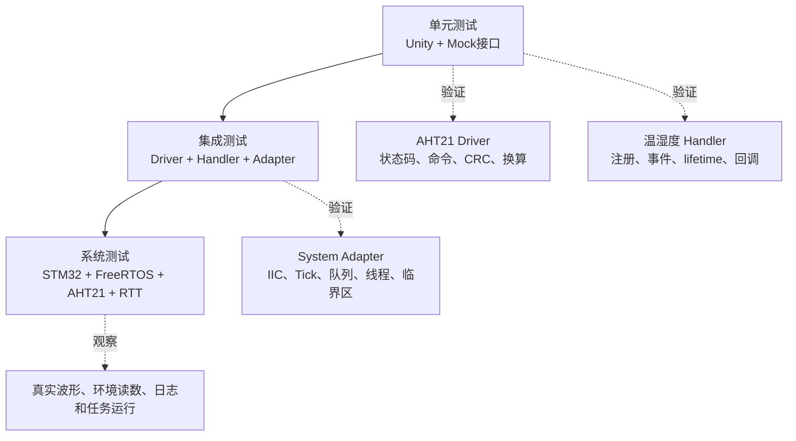
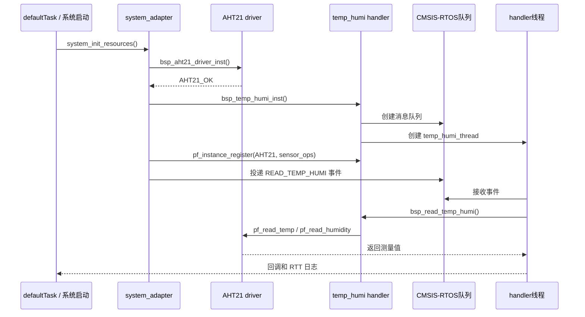
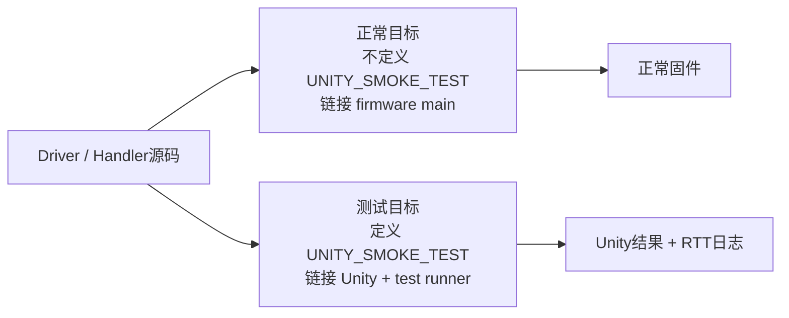

> 来源：Deep-In-Embedded / [开发板/ARM架构/STM32F411CEU6/项目代码的单元测试、集成测试以及系统测试.md](https://github.com/shuai-yemao/Deep-In-Embedded/blob/5fcab575fc20cf681f3e79e163337211097c898a/%E5%BC%80%E5%8F%91%E6%9D%BF/ARM%E6%9E%B6%E6%9E%84/STM32F411CEU6/%E9%A1%B9%E7%9B%AE%E4%BB%A3%E7%A0%81%E7%9A%84%E5%8D%95%E5%85%83%E6%B5%8B%E8%AF%95%E3%80%81%E9%9B%86%E6%88%90%E6%B5%8B%E8%AF%95%E4%BB%A5%E5%8F%8A%E7%B3%BB%E7%BB%9F%E6%B5%8B%E8%AF%95.md)

# 📖 引言

> 这篇笔记要讲什么？用一句话概括核心主题。

实践是检验认知的唯一途径，同理代码是否能用？好用？都需要通过测试来验证

---

# 📝 单元测试

> 用一句话说清楚这个知识点是什么。

## 实际意义

> 为什么会有该知识点？

1. 减少产品发布后项目 bug 的产生，进而提高产品的稳定性
2. 节省项目开发时间成本，将 bug 尽量在开发阶段解决，在项目后期的审查和实际反馈中发现 bug 解决问题的成本大幅提高
3. 在出现 bug 和移植代码后可以快速定位和修改代码 bug

## 应用场景

> 在实际中主要被用来做什么？

1. 函数功能的测试
2. 不同环境下模拟代码的运行情况，体现代码的可重复性
3. 项目代码程序自检

## 核心逻辑/原理

> 它是如何工作的？拆解背后的机制。

1. 根据代码复用率和业务重要性来决定该部分代码的单元测试的重要性
2. 根据业务变化率和人员变化率来决定该部分代码的单元测试的复杂性

### 本工程的测试分层

本工程不是只验证一个函数，而是把验证拆成三层：



- **单元测试**：隔离硬件和 RTOS，用 mock 控制返回值，验证 driver/handler 的逻辑分支。
- **集成测试**：验证 driver、handler、adapter 的接口是否正确绑定，消息队列、线程和函数指针是否能连起来。
- **系统测试**：烧录到 STM32F411CEU6，连接真实 AHT21，在 FreeRTOS 任务中验证启动、测量、日志和长期运行。

当前工程将 Driver 和 Handler 的 Unity 测试集中在 `BSP/AHT21/Test/aht21_unity_test.c`，由 `aht21_unity_test_run()` 统一执行；`User/Debug/Src/debug.c` 中的 `unity_test_run()` 负责 Unity 生命周期、基础断言和结果日志。

### Unity 测试框架在工程中的接入

Unity 的平台适配位于 `Middlewares/Third_Party/Unity/Src/unity_port.c`：

1. `UnityOutputChar()` 收集 Unity 输出字符。
2. `UnityOutputFlush()` 将一行结果通过 `elog_info("UNITY", ...)` 输出到 RTT。
3. `setUp()` 和 `tearDown()` 使用弱定义，测试目标可以提供强定义覆盖它们。
4. 生产目标不编译测试符号，避免 Unity 的 `main()` 或测试入口泄漏到正常固件。

```c
int unity_test_run(void)
{
    app_elog_init();
    UNITY_BEGIN();

    RUN_TEST(test_unity_integer_assertion);
    RUN_TEST(test_unity_string_assertion);
    RUN_TEST(test_unity_pointer_assertions);
    aht21_unity_test_run();

    return UNITY_END();
}
```

> [!warning] 测试入口边界
> `unity_test_run()` 只能属于测试目标，不能和正常固件的 `main()` 一起进入同一个链接目标。工程通过 `UNITY_SMOKE_TEST` 条件编译控制测试代码。

### Driver 单元测试：隔离依赖，验证行为

`aht21_unity_test.c` 为 AHT21 driver 注入 `iic_driver_interface_t`、`timebase_interface_t`、`yield_interface_t` 和 `irq_interface_t`，不连接真实 GPIO。测试通过全局 mock 状态控制异常场景：

| Mock 状态 | 模拟场景 |
| --- | --- |
| `iic_init_result` | IIC 初始化成功或失败 |
| `iic_send_result` | 测量/休眠/唤醒命令发送失败 |
| `iic_receive_result` | 数据读取失败 |
| `iic_status_result` | 状态字读取失败 |
| `busy_remaining` | AHT21 忙若干次后恢复，或一直忙到超时 |
| `measurement[7]` | 注入原始温湿度数据和 CRC |
| `tick`、`yield_count` | 验证等待期间是否推进时间并让出 CPU |

典型的 mock 初始化方式如下：

```c
static void driver_setup(void)
{
    memset(&driver, 0, sizeof(driver));
    memset(&ops, 0, sizeof(ops));

    iic.pf_init = mock_iic_init;
    iic.pf_send_bytes = mock_send;
    iic.pf_receive_bytes = mock_receive;
    iic.pf_read_status = mock_read_status;
    timebase.pf_get_tick_count = mock_tick;
    yield_ops.pf_rtos_yield = mock_yield;

    ops.p_iic_driver_instance = &iic;
    ops.p_timebase_instance = &timebase;
    ops.p_yield_instance = &yield_ops;
    ops.p_irq_instance = &irq_ops;
}
```

Driver 测试覆盖的不是“函数被调用过”这么简单，而是要检查命令地址、命令长度、命令内容、重试次数、状态回滚和最终返回码。例如：

```c
void test_driver_TEMP_007_busy_timeout(void)
{
    float temperature = 0.0f;

    driver_ready();
    busy_remaining = 20U;

    TEST_ASSERT_EQUAL(AHT21_ERRORTIMEOUT,
                      driver.pf_read_temp(&driver, &temperature));
    TEST_ASSERT_EQUAL_UINT32(10U, receive_count);
}
```

### Handler 单元测试：验证注册、事件和限频

Handler 测试使用虚拟传感器 token、`sensor_ops` 和 OS mock，验证通用管理逻辑：

- 实例化时依赖接口缺失、重复实例化、队列创建失败和线程创建失败。
- 注册时空指针、操作表不完整、未初始化和超过 `TEMP_HUMI_NUM_MAX`。
- 读取时空参数、无传感器、时基失败、非法事件类型、温度/湿度单独读取和组合读取。
- `lifetime` 未到期时跳过传感器和回调，避免重复采集。
- 传感器错误向上透传，临界区进入/退出次数保持平衡。
- 去初始化删除线程和队列，反实例化清理所有函数指针与依赖。

```c
void test_handler_HREAD_008_lifetime_skips_sensor_and_callback(void)
{
    float temperature = 0.0f;
    temp_humi_handler_event_t event =
        make_event(READ_TEMP, &temperature, NULL, 1000U);

    handler_ready();
    register_sensor(0U);
    event.pf_event_callback = mock_callback;

    TEST_ASSERT_EQUAL(TEMP_HUMI_OK,
                      bsp_read_temp_humi(&handler, &event));
    TEST_ASSERT_EQUAL_UINT32(0U, temp_read_count);
    TEST_ASSERT_EQUAL_UINT32(0U, callback_count);
}
```

### 集成测试：验证接口链路

集成测试关注多个模块组合后的接口契约，而不是单个函数内部的分支。当前工程的主要集成链路是：



集成测试至少验证：

1. Adapter 中的 AHT21 driver 操作表完整绑定，尤其是专用 `pf_read_status`。
2. Handler 的 `sensor_ops` 能正确把 AHT21 状态码转换为 `TEMP_HUMI_*`。
3. 队列消息大小与 `sizeof(temp_humi_handler_event_t)` 一致。
4. Handler 线程接收到事件后确实调用 `bsp_read_temp_humi()`。
5. `system_init_resources()` 的初始化失败能够停止后续注册，并输出明确日志。

### 系统测试：验证真实目标板行为

系统测试不使用 mock，而是验证真实 STM32F411CEU6、FreeRTOS、软件 IIC、AHT21 和 RTT 的整体行为。建议观察以下结果：

| 测试阶段 | 验证内容 | 通过标准 |
| --- | --- | --- |
| 上电初始化 | driver、handler、队列、线程创建 | RTT 依次出现 instantiate、handler、register success |
| 设备检测 | AHT21 地址和状态字 | `0x38` 有响应，校准状态有效 |
| 启动自检 | `READ_TEMP_HUMI` 事件 | 回调输出温度和湿度，日志无错误 |
| 周期读取 | lifetime 和任务调度 | 未到间隔时跳过，达到间隔后重新读取 |
| 总线验证 | SDA/SCL 波形、ACK、Stop/Start | 逻辑分析仪显示协议符合数据手册 |
| 异常恢复 | 拔掉传感器、CRC 错误、IIC 超时 | 有错误码和日志，不死循环、不崩溃 |
| 长时间运行 | 队列、线程和堆使用 | 无持续堆下降、线程栈无溢出、数据持续更新 |

### 正常构建与测试构建的边界



测试构建必须确认 `UNITY_SMOKE_TEST` 只添加到测试目标的 C/C++ 预处理宏；正常目标不能链接 `aht21_unity_test.c`、Unity 测试入口或第二个 `main()`。构建后查看 `MDK-ARM/STM32F411CEU6_AHT21/STM32F411CEU6_AHT21.build_log.htm`，并把编译结果和 RTT 输出一起作为测试证据。

## 关键公式/结论

> 最终结论和公式。

1. 单元测试的原则有：快速性、重复性、输出正确性、自动化、独立性。
2. 集成测试验证模块之间的接口契约；系统测试验证真实硬件、实时操作系统、驱动和任务调度的整体行为。
3. 一个测试用例应同时验证返回值、输出数据、调用次数、调用参数和资源状态，不能只验证“函数返回成功”。
4. 当前工程用 `UNITY_SMOKE_TEST` 隔离测试代码；测试入口通过 `UNITY_BEGIN()`、`RUN_TEST()` 和 `UNITY_END()` 管理。
5. Mock 可以验证协议和错误分支，但不能替代真实板上的 IIC 波形、传感器响应、RTT 输出和长时间运行测试。
6. 测试失败时应优先区分：被测逻辑失败、Mock 预期错误、工程链接错误、目标板环境错误和测试入口配置错误。

## 实际操作步骤

> 动手验证/配置的具体操作。

### 第一步：确定测试范围和测试构建

指定单元测试的标准与准备工作

1. 指定测试通过/失败的标准
2. 指定测试进入/退出的标准
3. 记录测试环境基础设施

### 第二步：编写 Mock 和夹具

在 `aht21_unity_test.c` 中准备 driver、handler、IIC、时基、yield、IRQ 和 OS mock；每条用例开始前调用 `driver_setup()` 或 `handler_ready()`，确保测试之间不共享脏状态。

记录测试过程

1. 记录验证措施的选择
2. 记录验证试验的结果和试验数据
3. 确保单元测试与被测代码之间的一致性与双向可追溯性

### 第三步：先执行单元测试

先覆盖参数、状态、命令帧、数据换算、CRC、忙超时、实例注册、事件类型、lifetime、回调和清理逻辑。使用 `TEST_ASSERT_EQUAL`、`TEST_ASSERT_FLOAT_WITHIN`、`TEST_ASSERT_EQUAL_HEX8` 和计数器检查行为。

### 第四步：执行集成测试

把真实 Adapter 接口表接入 driver 和 handler，确认 `system_init_resources()` 的初始化顺序、队列、线程和传感器注册链路正确。

### 第五步：烧录并执行系统测试

将测试固件烧录到 STM32F411CEU6，连接 RTT Viewer，观察 Unity 测试结果、AHT21 初始化日志、启动自检事件和周期读取结果；再用逻辑分析仪检查真实 IIC 波形。

### 第六步：记录证据并恢复正常构建

保存 build log、Unity PASS/FAIL 输出、RTT 日志和必要的波形截图。验证结束后去除 `UNITY_SMOKE_TEST`，重新构建正常固件，确认生产目标没有测试入口和 Unity 依赖。

总结测试结果输出至日志系统

## 常见问题

> 现象 → 根因 → 修复。

### 发现的问题

1. 测试代码如果进入正常目标，会出现 `main multiply defined` 或 `__ARM_use_no_argv multiply defined`。
2. 只测试 Unity 基础断言不能证明 AHT21 driver 或 handler 已经被测试。
3. 真实传感器测试受接线、上拉、时序和环境影响，不能替代可重复的 mock 测试。
4. 测试之间如果不清零 `measurement`、调用计数和返回值，前一个用例会污染后一个用例。
5. Keil 输出目录只读或共享状态可能导致 `.d` 文件删除失败，这属于构建环境问题，不应误判为测试逻辑错误。

### 根因分析

单元测试、集成测试和系统测试验证的对象不同：Unity mock 只验证逻辑；Adapter 集成测试验证接口连接；真实板系统测试验证硬件和调度。当前工程还存在“测试入口、正常入口、构建目标”三者边界，如果条件编译和 Keil target 配置没有同步，测试可能无法链接或污染生产固件。

### 改进方法

1. 将测试用例按 Driver、Handler、Adapter 和系统链路分组，并在 `aht21_unity_test_run()` 中明确执行顺序。
2. 每条用例使用独立的 setup/fixture，统一清零 mock 返回值、计数器、时间和测试数据。
3. 对所有错误注入测试同时验证返回码、资源回滚和后续状态，而不是只断言错误码。
4. 建立“Mock 单元测试 → Adapter 集成测试 → 真实板系统测试”的固定验收流程。
5. 正常目标与测试目标使用独立宏和源文件组，构建后检查 map/build log，防止 Unity 入口泄漏。
6. 将 RTT 日志、Unity 结果、IIC 波形和 Keil 构建日志作为可追溯测试记录。

---

# 💬 Q&A

> 自问自答，检验理解深度。按难度递进排列。

## 🟢 基础

> 最基本的概念和用法，入门必知。

### Q 1

A 1：

### Q 2

A 2：

## 🟡 进阶

> 容易踩的坑和常见误区。

### Q 3

A 3：

## 🔴 困难

> 结合实战的深层原理和设计权衡。

### Q 4

A 4：

---

# 📋 总结

> 3-5 句话回顾核心要点，用自己的话复述。

单元测试、集成测试和系统测试验证的是不同层次的问题，不能用一次 Unity 断言或一次真实传感器读取代替全部测试。当前工程使用 Mock 隔离 AHT21 Driver 和 Handler 的 IIC、时基、RTOS 与中断依赖，重点验证参数检查、命令内容、CRC、忙超时、事件限频、回调和资源回滚。集成测试再验证 Adapter、Driver、Handler、队列和线程之间的接口契约，系统测试则在 STM32F411CEU6 真板上观察真实 IIC 波形、FreeRTOS 调度、RTT 日志和持续运行结果。测试代码必须通过 `UNITY_SMOKE_TEST` 与正常固件隔离，并同时保存 Unity 结果、Keil build log、RTT 输出和必要的逻辑分析仪波形，形成可追溯的验证证据。

---

# 📎 参考资料

> 学习过程中用到的外部资源汇总。

## 🎥 视频链接

> B 站 / YouTube 教程，优先选项目实战类和原理动画类。

- 暂无固定视频资源；本笔记以工程 Unity 测试、Mock 代码、Keil 构建和 STM32 目标板验证为主要依据。

## 🔗 博客/文档链接

> 分析最透彻的博客、官方文档、社区帖子。

- [单元测试详解](https://blog.csdn.net/Edward_hjh/article/details/129670775) — 了解单元测试基本流程和测试用例设计。
- [Unity Test Framework](https://github.com/ThrowTheSwitch/Unity) — Unity 官方开源测试框架源码和断言接口。
- [CMSIS-RTOS2 API Reference](https://arm-software.github.io/CMSIS_6/latest/RTOS2/index.html) — 核对消息队列、线程、延时和内核接口。
- [FreeRTOS Documentation](https://www.freertos.org/Documentation/02-Kernel/04-API-references) — 了解任务、队列、临界区和调度相关概念。
- [[AHT21驱动调试-Bug记录]] — 记录测试和真实板联调过程中出现的接口、时序、日志和构建问题。

## 💻 仓库链接

> GitHub / Gitee 源码仓库，含 Demo 工程和工具链。

- 当前工程：`STM32F411CEU6_AHT21` — 包含 AHT21 Driver、Handler、软件 IIC、System Adapter 和 Unity 测试。
- `Middlewares/Third_Party/Unity/` — 工程中实际使用的 Unity 框架源码目录。

## 📄 代码/附件

> 本地 PDF、代码包、工具链文件。

- `BSP/AHT21/Test/aht21_unity_test.c` — Driver 与 Handler 的 Mock、夹具、测试用例和统一测试入口。
- `Middlewares/Third_Party/Unity/Inc/unity.h` — Unity 断言和测试生命周期接口。
- `Middlewares/Third_Party/Unity/Src/unity.c` — Unity 框架核心实现。
- `Middlewares/Third_Party/Unity/Src/unity_port.c` — Unity 输出到 EasyLogger/RTT 的平台适配。
- `User/Debug/Src/debug.c` — `UNITY_SMOKE_TEST` 条件编译、Unity runner 和基础断言测试。
- `BSP/AHT21/driver/Src/bsp_aht21_driver.c` — Driver 被测实现。
- `BSP/AHT21/handler/Src/bsp_temp_humi_handler.c` — Handler 被测实现。
- `System/Adapter/Src/system_adapter.c` — 集成测试和系统测试使用的实际平台绑定。
- `MDK-ARM/STM32F411CEU6_AHT21/STM32F411CEU6_AHT21.build_log.htm` — Keil 构建错误、警告和测试目标验证记录。
- [[05_嵌入式项目集成顺序与实操步骤指南]] — 项目集成设计（OS/BSP/APP 三层 + Adapter 体系），单元/集成/系统测试与集成设计配套使用
- [[项目代码的单元测试、集成测试以及系统测试]]
