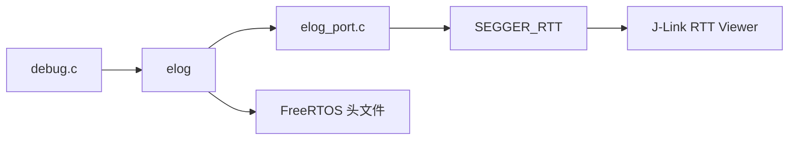

> 来源：Deep-In-Embedded / [必备开发工具/cmake/05-elog日志输出与调试符号修复.md](https://github.com/shuai-yemao/Deep-In-Embedded/blob/5fcab575fc20cf681f3e79e163337211097c898a/%E5%BF%85%E5%A4%87%E5%BC%80%E5%8F%91%E5%B7%A5%E5%85%B7/cmake/05-elog%E6%97%A5%E5%BF%97%E8%BE%93%E5%87%BA%E4%B8%8E%E8%B0%83%E8%AF%95%E7%AC%A6%E5%8F%B7%E4%BF%AE%E5%A4%8D.md)

# 05 — elog 日志输出与调试符号修复

## 背景

CMake 工程改造完成后，遇到三个连锁问题：

1. `Ctrl+Shift+B` 编译报 `elog_init` 类型冲突
2. 编译成功后 `F5` 调试无法跳转到 `main` 函数
3. elog + RTT 日志无输出

## 问题 1：elog_init 类型冲突

### 现象

```text
elog.c:160:13: error: conflicting types for 'elog_init'; have 'ElogErrCode(void)'
elog.h:200:6: note: previous declaration of 'elog_init' with type 'void(void)'
```

### 根因

`elog.h` 第 200 行已将 `elog_init` 声明从 `void` 改为 `ElogErrCode`：

```c
// elog.h:195-200
typedef enum {
    ELOG_NO_ERR,
} ElogErrCode;

ElogErrCode elog_init(void);  // 已修正为返回 ElogErrCode
```

实现文件 `elog.c:160` 也是 `ElogErrCode elog_init(void)`，**头文件和源文件实际一致**。

真正原因是 **CMake 编译缓存过期**：`build/Debug/` 目录中残留了旧版头文件编译的 `.o` 文件，编译器读到的是过期的依赖关系。

### 修复

```bash
rm -rf build/Debug
cmake --preset Debug
cmake --build --preset Debug
```

## 问题 2：F5 调试无法停在 main

### 现象

VS Code 按 `F5` 启动 cortex-debug + J-Link 调试后，程序直接运行，不会停在 `main()` 函数入口，无法单步调试。

### 根因

[cmake/gcc-arm-none-eabi.cmake:30](cmake/gcc-arm-none-eabi.cmake#L30) 中 C 代码 Debug 构建使用了 `-g0`：

```cmake
# 修复前
set(CMAKE_C_FLAGS_DEBUG "-O0 -g0")   # ❌ 零调试信息

# 修复后
set(CMAKE_C_FLAGS_DEBUG "-O0 -g3")   # ✅ 完整调试信息
```

> 注意：同一文件中 C++ 的 Debug 标志是 `-O0 -g3`，说明这是**历史遗漏** — 项目全部是 C 代码，只有 C++ 配置是正确的。

`-g0` 导致编译出的 `.elf` 文件**没有任何调试节区**（`.debug_info`、`.debug_line` 等），GDB 无法：
- 解析 `main` 符号地址
- 在源代码行设置断点
- 进行源代码级单步调试

### 修复验证

```bash
arm-none-eabi-readelf -S build/Debug/stm32f411ceu6_bsp_platform.elf | grep debug
```

修复后 ELF 包含 10 个调试节区：

| 节区 | 用途 |
|------|------|
| `.debug_info` | DWARF 调试信息 |
| `.debug_abbrev` | 缩写表 |
| `.debug_aranges` | 地址范围查找表 |
| `.debug_line` | 源码行号映射 |
| `.debug_line_str` | 行号字符串表 |
| `.debug_str` | 调试字符串表 |
| `.debug_frame` | 栈帧展开信息 |
| `.debug_loclists` | 局部变量位置列表 |
| `.debug_rnglists` | 范围列表 |
| `.debug_macro` | 宏定义信息 |

```bash
arm-none-eabi-nm stm32f411ceu6_bsp_platform.elf | grep "T main"
# 输出: 08009988 T main  ✅
```

## 问题 3：elog → RTT 日志输出链路

### 调用链

```text
main.c
  └─ user_init()                    [User_Task/User_Init/Src/user_init.c:70]
       └─ debug_init()              [DebugComponent/Debug/Src/debug.c:42]
            └─ test_elog()          [DebugComponent/Debug/Src/debug.c:9]
                 ├─ elog_init()                         启动 elog 核心
                 │    └─ elog_port_init()               [elog_port.c:18]
                 │         └─ SEGGER_RTT_Init()         初始化 RTT 底层
                 ├─ elog_set_text_color_enabled(true)   启用彩色输出
                 ├─ elog_set_fmt(...)                   配置各级别日志格式
                 └─ elog_start()                        启动日志输出引擎
```

### 关键模块依赖



### CMake 构建配置

对应 `DebugComponent/CMakeLists.txt`：

```cmake
# RTT 底层库
add_library(segger_rtt OBJECT)
target_sources(segger_rtt PRIVATE
    RTT/Src/SEGGER_RTT.c
    RTT/Src/SEGGER_RTT_printf.c
)

# elog 日志库（依赖 RTT）
add_library(elog OBJECT)
target_sources(elog PRIVATE
    easylogger/src/elog.c
    easylogger/src/elog_utils.c
    easylogger/src/elog_async.c
    easylogger/src/elog_buf.c
    easylogger/port/elog_port.c
)
target_link_libraries(elog PUBLIC segger_rtt stm32cubemx)

# Debug 模块（依赖 elog）
add_library(debug_obj OBJECT)
target_sources(debug_obj PRIVATE Debug/Src/debug.c)
target_link_libraries(debug_obj PUBLIC elog)
```

### elog_port.c 后端实现要点

```c
// 1. 初始化 — 必须返回 ElogErrCode
ElogErrCode elog_port_init(void) {
    SEGGER_RTT_Init();
    return ELOG_NO_ERR;
}

// 2. 输出 — 用 SEGGER_RTT_Write 而非 printf，避免 % 字符冲突
void elog_port_output(const char *log, size_t size) {
    SEGGER_RTT_Write(0, log, size);
}

// 3. 锁 — 关中断保护日志完整性
void elog_port_output_lock(void)   { __disable_irq(); }
void elog_port_output_unlock(void) { __enable_irq(); }

// 4. 时间戳 — 基于 HAL_GetTick()
const char *elog_port_get_time(void) { ... }
```

## 经验总结

| 问题 | 方法 |
|------|------|
| "类型冲突但头文件实际一致" | 清理编译缓存 (`rm -rf build`) |
| "调试器不停止" | 检查 `-g` 标志，用 `readelf -S` 验证 |
| "日志无输出" | 逐层排查：RTT 底层 → elog_port → elog → 应用层调用 |
| "ninja: no work to do" | 是 Ninja 正常行为，源文件变更后自动增量编译 |

## 相关笔记

- [[04-Step2-6-完整CMake工程改造]] — DebugComponent 的 CMake 拆分
- [[02-CMake工程改造设计方案]] — 工程改造总体方案
- [[CMake项目文件结构详解]] — 目录结构与 CMakeLists 对应关系
