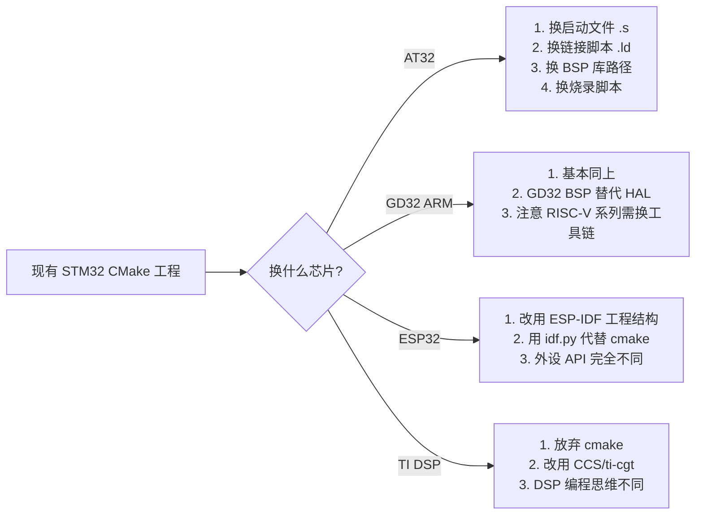

> 来源：Deep-In-Embedded / [必备开发工具/cmake/多芯片CMake适配指南.md](https://github.com/shuai-yemao/Deep-In-Embedded/blob/5fcab575fc20cf681f3e79e163337211097c898a/%E5%BF%85%E5%A4%87%E5%BC%80%E5%8F%91%E5%B7%A5%E5%85%B7/cmake/%E5%A4%9A%E8%8A%AF%E7%89%87CMake%E9%80%82%E9%85%8D%E6%8C%87%E5%8D%97.md)

# 多芯片 CMake 开发指南

## 核心理念

CMake 的真正优势：**同一套构建系统，换芯片只需改几行配置**，而不是换一个 IDE。

```
Keil 时代：  STM32 → .uvprojx 重做
            AT32  → .uvprojx 重做
            GD32  → .uvprojx 重做
            ESP32 → 用 ESP-IDF 另一个 IDE

CMake 时代： STM32 → CMakeLists.txt  改芯片型号 + 工具链
            AT32  → CMakeLists.txt  改芯片型号 + 工具链
            GD32  → CMakeLists.txt  改芯片型号 + 工具链
            ESP32 → CMakeLists.txt  + ESP-IDF 集成
```

---

## 各芯片家族 CMake 适配方案

### 1️⃣ STM32（ARM Cortex-M） — 你已经掌握

**工具链**：`arm-none-eabi-gcc`（GNU Tools for STM32）

**构建方式**：手写 CMake 或 CubeMX 生成

```cmake
# 关键变量（以 F411CE 为例）
set(MCU_CORE      cortex-m4)
set(MCU_FPU       fpv4-sp-d16)
set(MCU_FLOAT_ABI hard)
set(LINKER_SCRIPT ${CMAKE_SOURCE_DIR}/STM32F411XX_FLASH.ld)
```

> 切换到 **STM32F103**（Cortex-M3，无 FPU）：
> ```cmake
> set(MCU_CORE      cortex-m3)
> set(MCU_FPU       "")
> set(MCU_FLOAT_ABI soft)
> set(LINKER_SCRIPT ${CMAKE_SOURCE_DIR}/STM32F103X8_FLASH.ld)
> ```

---

### 2️⃣ AT32（雅特力，ARM Cortex-M4/M33）

AT32 与 STM32 **高度兼容**（Pin-to-Pin），工具链相同。

**工具链**：同一套 `arm-none-eabi-gcc`

| AT32 型号 | 内核 | 对应 CMake 配置 |
|---|---|---|
| AT32F403A | Cortex-M4F | `cortex-m4`, `fpv4-sp-d16`, `hard` |
| AT32F415 | Cortex-M4F | `cortex-m4`, `fpv4-sp-d16`, `hard` |
| AT32F421 | Cortex-M4F | `cortex-m4`, `fpv4-sp-d16`, `hard` |
| AT32F435 | Cortex-M4F + DSP | `cortex-m4`, `fpv5-sp-d16`, `hard` |

**差异点**：

- 链接脚本 `.ld` 不同（Flash/SRAM 大小不同）
- 启动文件 `.s` 不同（AT32 有自家启动文件）
- BSP 库不同（Artery 官方 BSP，非 STM32 HAL）
- **烧录算法不同**：AT32 不支持 ST-Link，需要用 **JLink** 或 AT-Link

```cmake
# AT32F403A 配置示例
set(MCU_CORE      cortex-m4)
set(MCU_FPU       fpv4-sp-d16)
set(MCU_FLOAT_ABI hard)
set(AT_LINKER_SCRIPT ${CMAKE_SOURCE_DIR}/AT32F403AxG_FLASH.ld)

# 头文件路径指向 Artery BSP 而非 ST HAL
target_include_directories(${PROJECT_NAME} PRIVATE
    ${CMAKE_SOURCE_DIR}/Libraries/AT32F403A_407_Firmware_Library/
)
```

---

### 3️⃣ GD32（兆易创新，ARM Cortex-M3/M4/M23/M33/RISC-V）

GD32 也是 ARM 内核为主，GD32V 系列是 RISC-V。

**ARM 系列工具链**：`arm-none-eabi-gcc`

**RISC-V 系列工具链**：`riscv-none-elf-gcc` 或 `riscv64-unknown-elf-gcc`

| GD32 型号 | 内核 | 工具链 | 备注 |
|---|---|---|---|
| GD32F103 | Cortex-M3 | `arm-none-eabi-gcc` | 与 STM32F103 兼容 |
| GD32F303 | Cortex-M4F | `arm-none-eabi-gcc` | 与 STM32F303 类似 |
| GD32F403 | Cortex-M4F | `arm-none-eabi-gcc` | 主频 200MHz |
| GD32VF103 | RISC-V | `riscv-none-elf-gcc` | 需换工具链 |

**差异点**：

- GD32 有自己的 BSP（`GD32F10x_Firmware_Library`）
- RISC-V 系列需要完全不同工具链和编译选项
- 可使用 **JLink** 或 **GD-Link** 烧录

```cmake
# GD32F303 配置
set(MCU_CORE      cortex-m4)
set(MCU_FPU       fpv4-sp-d16)
set(MCU_FLOAT_ABI hard)

# GD32VF103 (RISC-V) — 完全不同
set(CMAKE_C_COMPILER riscv-none-elf-gcc)
set(COMMON_FLAGS "-march=rv32imac -mabi=ilp32 -mcmodel=medlow")
```

---

### 4️⃣ ESP32（乐鑫，Xtensa / RISC-V）

ESP32 比较特殊，它使用 **ESP-IDF** 作为官方 SDK，而 ESP-IDF 本身就是基于 CMake 的。

**不要手写 CMakeLists.txt**，而是用 ESP-IDF 的标准工程结构：

```
esp_project/
├── CMakeLists.txt          # 极简，仅 idf_component_register()
├── main/
│   ├── CMakeLists.txt      # 组件 CMake
│   ├── main.c
│   └── Kconfig.projbuild
├── components/             # 自定义组件
├── sdkconfig               # menuconfig 配置
└── build/
```

```cmake
# 顶层 CMakeLists.txt — 就这么简单
cmake_minimum_required(VERSION 3.5)
include($ENV{IDF_PATH}/tools/cmake/project.cmake)
project(esp_project)
```

```cmake
# main/CMakeLists.txt — 组件注册
idf_component_register(SRCS "main.c"
                       INCLUDE_DIRS ".")
```

**编译烧录**：

```bash
# ESP-IDF 包装了 CMake
idf.py set-target esp32          # 或 esp32s3, esp32c3, esp32c6
idf.py menuconfig                # 配置
idf.py build                     # 编译（底层调 cmake）
idf.py -p COM3 flash             # 烧录
idf.py -p COM3 monitor           # 串口监视器
```

| ESP32 型号 | 架构 | ESP-IDF 目标名 |
|---|---|---|
| ESP32 | Xtensa LX6 | `esp32` |
| ESP32-S3 | Xtensa LX7 | `esp32s3` |
| ESP32-C3 | RISC-V 32 | `esp32c3` |
| ESP32-C6 | RISC-V 32 | `esp32c6` |
| ESP32-H2 | RISC-V 32 | `esp32h2` |

> **本质**：ESP-IDF = 官方把 CMake 封装好了，你直接用 `idf.py` 命令即可，不需要自己写 CMake 细节。

---

### 5️⃣ DSP（如 TI C2000 / C6000）

DSP 是**完全不同的架构**，不能用 `arm-none-eabi-gcc`。

**TI C2000 系列**（如 TMS320F28379）：

| 项目 | 说明 |
|---|---|
| 工具链 | `ti-cgt-c2000`（TI 自家编译器）或 `clang` |
| IDE | Code Composer Studio（CCS，基于 Eclipse） |
| CMake 支持 | 有社区方案，但不如 CCS 成熟 |
| 推荐方式 | 用 **CCS** 或 **ti-cgt** 命令行 |

```cmake
# TI C2000 CMake 示例（非官方，社区方案）
set(CMAKE_SYSTEM_NAME Generic)
set(CMAKE_C_COMPILER cl2000)       # TI C2000 C compiler

# 编译选项
set(COMMON_FLAGS "-v28 -ml -mfloatabi=hard -mfpu=fpu64")
```

**更实用的方式**：用 CCS 新建工程，导出命令行构建脚本。

**DSP 开发的现实建议**：

| 芯片类型 | 推荐 IDE/构建方式 | 理由 |
|---|---|---|
| TI C2000 | CCS + ti-cgt | 工具链成熟，文档齐全 |
| TI C6000 | CCS + ti-cgt | 同上 |
| STM32 + DSP 扩展 | CMake + ARM GCC | DSP 扩展指令由 GCC 自动生成 |
| **NXP DSC** | MCUXpresso | NXP 官方支持 |
| **Audio DSP**（如 ADI） | 厂商 SDK | 每家都不通用 |

---

## 芯片切换实战对照表

| 芯片 | 工具链 | 内核架构 | CMake 方式 | 烧录工具 |
|---|---|---|---|---|
| **STM32F4** | `arm-none-eabi-gcc` | Cortex-M4F | 手写/CubeMX | JLink/ST-Link/OpenOCD |
| **STM32F1** | `arm-none-eabi-gcc` | Cortex-M3 | 手写/CubeMX | JLink/ST-Link/OpenOCD |
| **AT32F4** | `arm-none-eabi-gcc` | Cortex-M4F | 手写 + Artery BSP | JLink/AT-Link |
| **GD32F3** | `arm-none-eabi-gcc` | Cortex-M4F | 手写 + GD BSP | JLink/GD-Link |
| **GD32VF** | `riscv-none-elf-gcc` | RISC-V | 手写 + GD BSP | JLink/GD-Link |
| **ESP32** | `xtensa-esp32-elf-gcc` | Xtensa | `idf.py` (封装 CMake) | `idf.py flash` |
| **ESP32-C3** | `riscv32-esp-elf-gcc` | RISC-V | `idf.py` (封装 CMake) | `idf.py flash` |
| **TI C2000** | `ti-cgt-c2000` | C28x DSP | CCS / 手写 | CCS / UniFlash |

---

## 如何设计一个 " 多芯片 " CMake 工程

如果你想 **一套代码兼容多种芯片**（比如 STM32F4 和 AT32F4），可以用 CMake 的 `if` 判断：

```cmake
# 构建时指定: cmake -DCHIP_TYPE=AT32F403A ...
set(CHIP_TYPE "STM32F407" CACHE STRING "Target chip")

if(CHIP_TYPE MATCHES "STM32.*")
    set(MCU_CORE cortex-m4)
    set(LINKER_SCRIPT STM32F407VG_FLASH.ld)
    set(STARTUP_FILE startup_stm32f407xx.s)
    add_definitions(-DSTM32F407xx)

elseif(CHIP_TYPE MATCHES "AT32.*")
    set(MCU_CORE cortex-m4)
    set(LINKER_SCRIPT AT32F403AxG_FLASH.ld)
    set(STARTUP_FILE startup_at32f403a.s)
    add_definitions(-DAT32F403AxG)

elseif(CHIP_TYPE MATCHES "GD32.*")
    set(MCU_CORE cortex-m4)
    set(LINKER_SCRIPT GD32F30x_FLASH.ld)
    set(STARTUP_FILE startup_gd32f30x.s)
    add_definitions(-DGD32F30x)

elseif(CHIP_TYPE MATCHES "ESP32.*")
    # ESP-IDF 单独处理
    include($ENV{IDF_PATH}/tools/cmake/project.cmake)
endif()
```

然后编译时指定：

```bash
cmake -B build -DCHIP_TYPE=AT32F403A
cmake --build build
```

---

## 从 STM32 切换到其他芯片的步骤清单



---

## 总结

| 芯片类型 | CMake 适合度 | 难度 | 建议 |
|---|---|---|---|
| ARM Cortex-M（STM32/AT32/GD32） | ⭐⭐⭐⭐⭐ | 低 | 一个工具链通吃，只换 BSP |
| ESP32（Xtensa/RISC-V） | ⭐⭐⭐⭐ | 中 | 用 ESP-IDF，它底层就是 CMake |
| RISC-V 通用 MCU | ⭐⭐⭐⭐ | 中 | 需换 `riscv-elf-gcc` |
| TI C2000 DSP | ⭐⭐ | 高 | 建议用 CCS，CMake 不成熟 |

---

## 相关笔记

- [[CMake嵌入式开发指南]] — CMake 基础
- [[STM32CubeMX 使用指南]] — STM32 工程生成
- [[AT32 开发笔记]] — AT32 移植经验
- [[ESP-IDF 环境搭建]] — ESP32 开发
- [[JLink 调试器使用]] — 烧录配置

---

#开发工具 #cmake #多平台 #芯片移植 #esp32 #at32 #gd32 #dsp
