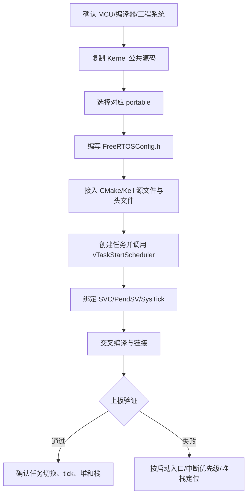

> 来源：Deep-In-Embedded / [操作系统/FreeRTOS/freertos移植指南.md](https://github.com/shuai-yemao/Deep-In-Embedded/blob/5fcab575fc20cf681f3e79e163337211097c898a/%E6%93%8D%E4%BD%9C%E7%B3%BB%E7%BB%9F/FreeRTOS/freertos%E7%A7%BB%E6%A4%8D%E6%8C%87%E5%8D%97.md)

# STM32F411CEU6 FreeRTOS 移植指南

> [!success] 本次工程状态
> FreeRTOS-Kernel 11.1.0 已放入工程 `Middlewares/FreeRTOS`，CMake 已接入，ARM GCC Debug 构建已通过并生成 ELF。基于 `PC13` 的 FreeRTOS LED 任务已经通过 J-Link 下载并运行验证。


## 1. 移植目标与工程事实

本工程是 STM32CubeMX 生成的 CMake + GCC 工程，目标 MCU 为 STM32F411CEU6，内核为 Cortex-M4F，系统时钟配置为 100 MHz。FreeRTOS 源码来自：

`D:\zhuomian\FreeRTOS\FreeRTOS-Kernel-11.1.0`

本次采用原生 FreeRTOS Kernel，不引入 CMSIS-RTOS 包装层。工程中的最小验证任务只用于确认调度器和 tick 正常接入；后续业务代码建议再增加项目自己的 OS abstraction 层。

## 2. 通用移植链路



通用原则是：Kernel 公共代码决定调度、队列和同步机制；`portable` 决定 CPU/编译器相关的上下文切换；`FreeRTOSConfig.h` 决定目标板的时钟、tick、优先级、堆和诊断策略；工程构建系统必须同时纳入这些源码和头文件。

## 3. 第一步：准备源码目录

本工程新增目录：

```text
Middlewares/FreeRTOS/
├─ Config/FreeRTOSConfig.h
└─ Source/
   ├─ include/
   ├─ portable/GCC/ARM_CM4F/port.c
   ├─ portable/GCC/ARM_CM4F/portmacro.h
   ├─ portable/MemMang/heap_4.c
   └─ *.c
```

选择 `GCC/ARM_CM4F` 是因为工程使用 `arm-none-eabi-gcc`，目标是 Cortex-M4F；不能把 `ARM_CM3`、`ARM_CM4_MPU` 或其他编译器的 port 混入同一个构建目标。`heap_4.c` 提供可合并空闲块的动态内存分配，适合本次最小动态任务创建示例。

## 4. 第二步：配置 FreeRTOS

关键配置位于 `Middlewares/FreeRTOS/Config/FreeRTOSConfig.h`：

```c
#define configCPU_CLOCK_HZ                    ( SystemCoreClock )
#define configTICK_RATE_HZ                    ( 100U )
#define configUSE_PREEMPTION                  1
#define configMAX_PRIORITIES                  5
#define configTOTAL_HEAP_SIZE                 ( 12U * 1024U )
#define configSUPPORT_DYNAMIC_ALLOCATION      1
#define configCHECK_FOR_STACK_OVERFLOW        2
#define configMAX_SYSCALL_INTERRUPT_PRIORITY  \
    ( configLIBRARY_MAX_SYSCALL_INTERRUPT_PRIORITY << \
      ( 8U - configPRIO_BITS ) )
```

本工程 NVIC 使用 4 bit priority，允许调用 FreeRTOS API 的中断优先级设为 5 及以下的逻辑优先级；优先级数值越小，硬件优先级越高。ISR 中调用 `FromISR` API 时必须继续遵守这个边界。

## 5. 第三步：接入 CMake

位置：`cmake/stm32cubemx/CMakeLists.txt`。

接入了三组头文件目录：

```cmake
Middlewares/FreeRTOS/Config
Middlewares/FreeRTOS/Source/include
Middlewares/FreeRTOS/Source/portable/GCC/ARM_CM4F
```

并将以下源码加入 `FreeRTOS` OBJECT library：`croutine.c`、`event_groups.c`、`list.c`、`queue.c`、`stream_buffer.c`、`tasks.c`、`timers.c`、`port.c` 和 `heap_4.c`。当前配置关闭软件定时器和协程，未使用的对象会由链接器垃圾回收；保留源码列表便于后续打开对应配置。

## 6. 第四步：创建任务和启动调度器

位置：`Core/Src/freertos_app.c`，入口声明在 `Core/Inc/freertos_app.h`，由 `Core/Src/main.c` 在 HAL、时钟和外设初始化后调用。

```c
result = xTaskCreate(freertos_led_task,
                     "led",
                     256U,
                     NULL,
                     tskIDLE_PRIORITY + 1U,
                     NULL);
configASSERT(result == pdPASS);
vTaskStartScheduler();
```

验证任务每 1000 ms 执行一次、递增 `g_freertos_heartbeat` 并翻转 `PC13`。常见 STM32F411 Black Pill 板载 LED 为低电平点亮；若你的板卡 LED 接线不同，需要按原理图调整引脚。

## 7. 第五步：绑定 Cortex-M 中断入口

位置：`Core/Src/stm32f4xx_it.c`。

```c
void SVC_Handler(void)       { vPortSVCHandler(); }
void PendSV_Handler(void)    { xPortPendSVHandler(); }
void SysTick_Handler(void)
{
    HAL_IncTick();
    xPortSysTickHandler();
}
```

SVC 用于启动第一个任务，PendSV 用于上下文切换，SysTick 用于产生 RTOS tick。本工程保留 `HAL_IncTick()`，使 HAL 的超时基准也继续工作。FreeRTOS 启动后不要再由其他定时器重复驱动同一套 tick。

## 8. 第六步：兼容 GCC 版本并构建

工程的 GCC preset 是 `CMakePresets.json` 中的 `Debug`，实际命令：

```powershell
cmake --preset Debug
cmake --build --preset Debug --parallel 4
```

本机使用 `F:\ARM GNU\10 2021.10\bin\arm-none-eabi-gcc.exe`。CubeMX 生成的 `STM32F411XX_FLASH.ld` 使用了 GCC 11 才支持的 `READONLY` 输出段语法，本次已移除该关键字，使 GCC 10.3.1 可以链接。


## 9. 验证清单

| 层级 | 验证项 | 本次结果 |
|---|---|---|
| 源码 | Kernel、CM4F port、heap_4 已存在 | 通过 |
| 构建 | ARM GCC 编译所有 FreeRTOS 与工程源码 | 通过 |
| 链接 | 生成 `stm32f411ceu6_freertos_transplant.elf` | 通过 |
| 资源 | RAM 14,248 B / 128 KB；Flash 16,220 B / 512 KB | 通过 |
| 调度 | `vTaskStartScheduler()` 已接入 | 软件已接入 |
| 上板 | heartbeat 递增、任务切换、PC13 LED 闪烁 | 通过 |

## 10. 常见问题

### 编译器报 `cpsid i` 不支持

通常是误用了主机 GCC。使用 `cmake --preset Debug`，不要直接使用没有 toolchain file 的 `cmake -S . -B build`。

### `stm32f4xx.h` 提示未选择芯片

FreeRTOS OBJECT library 也必须获得 `STM32F411xE` 编译宏；本工程在 `cmake/stm32cubemx/CMakeLists.txt` 中显式设置了它。

### 链接报 `vApplicationStackOverflowHook` 未定义

当 `configCHECK_FOR_STACK_OVERFLOW` 大于 0 时必须提供 hook。本工程实现位于 `Core/Src/freertos_app.c`，出现栈溢出后关闭中断并停在死循环，便于调试器定位。

### 任务创建成功但程序不运行

优先检查启动文件是否指向 `SVC_Handler`、`PendSV_Handler` 和 `SysTick_Handler`，再检查 `SysTick_Handler` 是否调用 `xPortSysTickHandler()`，最后检查 `configMAX_SYSCALL_INTERRUPT_PRIORITY` 与 NVIC 优先级分组。

## 11. 可复用移植模板

迁移到其他 Cortex-M 工程时按下面顺序执行：

1. 记录 MCU 内核、FPU、编译器、系统时钟和 NVIC priority bits。
2. 复制 Kernel 公共源码、目标 compiler/CPU 的 `portable` 和一个 `heap_x.c`。
3. 创建唯一的 `FreeRTOSConfig.h`，先只打开任务、tick、动态内存和断言。
4. 将 Kernel 源码和 port 加入构建系统，确认配置头文件可被所有 Kernel `.c` 找到。
5. 在应用初始化完成后创建一个最小任务，再调用 `vTaskStartScheduler()`。
6. 将 SVC、PendSV、SysTick 绑定到对应 port 函数；确认 HAL tick 是否需要保留。
7. 先完成 ARM 交叉编译和链接，再做上板验证。
8. 上板观察任务心跳、tick 计数、栈余量和 malloc failed hook；确认后再增加队列、信号量、软件定时器等功能。

## 12. J-Link 下载与上板验证记录

本次尝试使用 SEGGER J-Link Commander V9.28，目标参数为：

```text
device: STM32F411CEU6
interface: SWD
speed: 4000 kHz
firmware: build/Debug/stm32f411ceu6_freertos_transplant.elf
```

下载前先执行了探针连接检查。主机没有枚举到 SEGGER/J-Link USB 设备，Commander 返回：

```text
Connecting to J-Link via USB...FAILED: Cannot connect to the probe/programmer.
```

第一次尝试因主机未枚举 J-Link 而未执行下载；随后探针恢复枚举并完成验证：J-Link CE（SN `69701612`）通过 SWD 连接 STM32F411CE，VTref 约 3.325 V；ELF 下载和 Program & Verify 均返回 `O.K.`。运行约 3.5 秒后读取到 `g_freertos_heartbeat = 0x11`，再次读取为 `0x1F`，`GPIOC->ODR = 0x00000000`，且 `CFSR = 0`。随后进行两个相隔约 1.1 秒的 ODR 采样，读到 `0x00002000` 和 `0x00000000`，证明 PC13 正在翻转；目标 CPU 保持 Thread 模式运行，PC13 任务正在持续调度。

第一次下载后的运行检查曾出现 HardFault。异常堆栈定位到 `xTaskResumeAll()`，根因是 SVC/PendSV 使用普通 C 包装函数，破坏了 FreeRTOS 异常返回栈。现已在 `Core/Src/stm32f4xx_it.c` 改为 `naked` 分支转发：

```c
void SVC_Handler(void) __attribute__((naked));
void PendSV_Handler(void) __attribute__((naked));

void SVC_Handler(void) { __asm volatile ("b vPortSVCHandler"); }
void PendSV_Handler(void) { __asm volatile ("b xPortPendSVHandler"); }
```

修复后重新构建、下载、运行，CFSR 清零且 heartbeat 持续递增。

## 总结

FreeRTOS 移植不是只复制几个 `.c` 文件，而是 Kernel、CPU port、配置、构建系统和三个异常入口的共同接入。本工程已经完成 STM32F411CEU6 + GCC + Cortex-M4F 的构建、J-Link 下载和运行闭环；PC13 LED 任务已验证持续调度。

## 参考资料

- [FreeRTOS-Kernel 11.1.0](https://github.com/FreeRTOS/FreeRTOS-Kernel) — 本次使用的内核源码版本。
- [[FreeRTOS入门手册_中文.pdf]]
- [[FreeRTOS开发指南_V1.10.pdf]]
- [[STM32FreeRTOSbug大全]]
