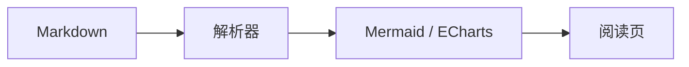

# Markdown 渲染能力测试

## Mermaid 图表



## ECharts 图表

```echarts
{"title":{"text":"每周学习时间"},"tooltip":{"trigger":"axis"},"xAxis":{"type":"category","data":["周一","周二","周三"]},"yAxis":{"type":"value","name":"小时"},"series":[{"name":"学习时间","type":"bar","data":[2,3,4]}],"ariaLabel":"周一到周三的学习时间依次为 2、3、4 小时"}
```

## LaTeX 公式

行内公式支持：$E = mc^2$，也支持使用 \(a^2 + b^2 = c^2\) 表示。

$$
\int_0^1 x^2\,dx = \frac{1}{3}
$$

## JSON 代码块

```json
{
  "name": "Power Notes",
  "features": ["Mermaid", "ECharts", "LaTeX"],
  "enabled": true,
  "version": 1
}
```

## C / C++ 代码块

```cpp
#include <cstdint>

int main() {
    const std::uint32_t answer = 42;
    return static_cast<int>(answer);
}
```

## 图片


